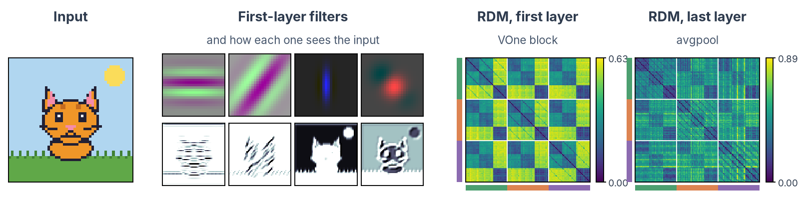

# Formatting toolkit

Each snippet is followed by what it produces on the wiki. (On GitHub you only see the raw text.)

!!! tip "Which one do I use?"
    | Your content | Use |
    |---|---|
    | A list of items, each with a paragraph or more of explanation, all relevant to every reader | `??? numlist` / `??? deflist` |
    | Steps done in order, each with an explanation | `???+ steps` |
    | Steps done in order, written as plain sentences or always visible (emergencies) | `<div class="steps-list" markdown>` around a numbered list |
    | Items with a one-line explanation | a plain bullet list — there is nothing worth hiding |
    | The reader needs exactly **one** of several alternatives (Windows/macOS, one of three procedures) | [content tabs](https://squidfunk.github.io/mkdocs-material/reference/content-tabs/) (`=== "Tab"`) |
    | A single aside, warning or tip interrupting the text | `!!! warning`, `!!! tip`, … |
    | Troubleshooting entries the reader consults only when something breaks | `??? failure "Symptom"` |
    | Points with no order, or steps short enough to need no line | a plain bullet or numbered list (styled automatically) |
    | The main places a reader can go from an index page | grid cards (`<div class="grid cards" markdown>`) |
    | One action: download a file, open an external site | a button (`{ .md-button }`) |
    | Code lines that need a short explanation | code notes (`# (1)!` and a numbered list under the code) |
    | An icon or small screenshot that should not open large | `{ .off-glb }` after the image |

    A run of three or more `!!!` boxes in a row is a sign that none of them is
    really an aside, and that the section wants one of the list forms above.

## Lists

### Bullets and numbered lists

Plain Markdown lists get the wiki style on their own. Each level down is a little lighter (darker in dark mode).

```markdown
- A point
    - A detail
        - A finer detail
```

- A point
    - A detail
        - A finer detail

```markdown
1. First
2. Second
    1. A sub-step
        1. A sub-sub-step
```

1. First
2. Second
    1. A sub-step
        1. A sub-sub-step

### Steps in order

The numbers get a connecting line.

```markdown
<div class="steps-list" markdown>

1. Book the room.
2. Prepare the participant.

</div>
```

<div class="steps-list" markdown>

1. Book the room.
2. Prepare the participant.

</div>

### Collapsible lists

Each term opens to show its explanation: `???` starts closed, `???+` starts open. Numbers restart at every heading. More in [Collapsible definition lists](#collapsible-definition-lists).

```markdown
??? deflist "Laptop (bullet, closed)"
    Bring your own, with MATLAB installed.

???+ deflist "Charger (bullet, open)"
    The lab has no spare one.
```

??? deflist "Laptop (bullet, closed)"
    Bring your own, with MATLAB installed.

???+ deflist "Charger (bullet, open)"
    The lab has no spare one.

```markdown
??? numlist "Ethics application (numbered, closed)"
    Submit it before recruiting.

???+ numlist "Data management plan (numbered, open)"
    Write it with the RDM team.
```

??? numlist "Ethics application (numbered, closed)"
    Submit it before recruiting.

???+ numlist "Data management plan (numbered, open)"
    Write it with the RDM team.

```markdown
???+ steps "Book the room (step, open)"
    Use the online calendar.

??? steps "Run the session (step, closed)"
    Follow the checklist.
```

???+ steps "Book the room (step, open)"
    Use the online calendar.

??? steps "Run the session (step, closed)"
    Follow the checklist.

### Checklists

```markdown
- [x] Consent form signed
- [ ] Data uploaded
```

- [x] Consent form signed
- [ ] Data uploaded

### Terms and definitions

```markdown
Sampling rate
:   How many samples per second the amplifier records.
```

Sampling rate
:   How many samples per second the amplifier records.

## Boxes

### Callouts

Types: `note`, `abstract`, `info`, `tip`, `success`, `question`, `warning`, `failure`, `danger`, `bug`, `example`, `quote`.

```markdown
!!! tip "Good to know"
    Shown in a box.

!!! warning
    Without a title, the box shows its type.
```

!!! tip "Good to know"
    Shown in a box.

!!! warning
    Without a title, the box shows its type.

### Collapsible callouts

`???` starts closed, `???+` starts open. Any type works.

```markdown
??? info "More details (closed)"
    Hidden until clicked.

???+ example "An example (open)"
    Shown, and can be closed.
```

??? info "More details (closed)"
    Hidden until clicked.

???+ example "An example (open)"
    Shown, and can be closed.

### Do and don't

```markdown
<div class="do-list" markdown>
<p class="do-list__heading">Do</p>

- Check the screening form.

</div>

<div class="dont-list" markdown>
<p class="do-list__heading">Don't</p>

- Start without a signed form.

</div>
```

<div class="do-list" markdown>
<p class="do-list__heading">Do</p>

- Check the screening form.

</div>

<div class="dont-list" markdown>
<p class="do-list__heading">Don't</p>

- Start without a signed form.

</div>

### Emergency card

One per page, for the number to call.

```markdown
<div class="care-card care-card--emergency" markdown>
<p class="care-card__heading">Emergency: call 112</p>
<div class="care-card__body" markdown>

Say what happened and where you are.

</div>
</div>
```

<div class="care-card care-card--emergency" markdown>
<p class="care-card__heading">Emergency: call 112</p>
<div class="care-card__body" markdown>

Say what happened and where you are.

</div>
</div>

## Layout

### Tabs

Tabs with the same names switch together across the page.

```markdown
=== "Windows"

    Steps for Windows.

=== "macOS"

    Steps for macOS.
```

=== "Windows"

    Steps for Windows.

=== "macOS"

    Steps for macOS.

### Cards

As many per row as fit, each about square.

```markdown
<div class="grid cards" markdown>

- :material-school:{ .lg .middle } __Learn the basics__

    ---

    One sentence on what the reader finds there.

    [Start here](#cards)

- :material-clipboard-text:{ .lg .middle } __Plan a study__

    ---

    One sentence on what the reader finds there.

    [Start here](#cards)

</div>
```

<div class="grid cards" markdown>

- :material-school:{ .lg .middle } __Learn the basics__

    ---

    One sentence on what the reader finds there.

    [Start here](#cards)

- :material-clipboard-text:{ .lg .middle } __Plan a study__

    ---

    One sentence on what the reader finds there.

    [Start here](#cards)

</div>

### Model and tool cards

A card per model, tool or dataset, in groups with a colour: `classic`, `brain`, `language` or `topo`. The part above the line shows when the card is closed; add `open` to `<details` to show it open.

```markdown
#### Brain-inspired models { .resource-group .resource-group--brain }

<details class="resource-card resource-card--brain" markdown>
<summary markdown="block">

#### VOneNet

[:material-file-document-outline: Paper](https://proceedings.neurips.cc/paper/2020/hash/98b17f068d5d9b7668e19fb8ae470841-Abstract.html) [:material-github: Code](https://github.com/dicarlolab/vonenet)
{ .resource-card__links }

**Pick it when** you want a model of primate V1 in front of a standard CNN.

</summary>

Architecture
:   Fixed V1 model + ResNet-50

Trained on
:   ImageNet

{ .resource-card__figure }
{ .resource-card__plate }

What the panels show, in one or two sentences.
{ .resource-card__caption }

</details>
```

#### Brain-inspired models { .resource-group .resource-group--brain }

<details class="resource-card resource-card--brain" markdown>
<summary markdown="block">

#### VOneNet

[:material-file-document-outline: Paper](https://proceedings.neurips.cc/paper/2020/hash/98b17f068d5d9b7668e19fb8ae470841-Abstract.html) [:material-github: Code](https://github.com/dicarlolab/vonenet)
{ .resource-card__links }

**Pick it when** you want a model of primate V1 in front of a standard CNN.

</summary>

Architecture
:   Fixed V1 model + ResNet-50

Trained on
:   ImageNet

{ .resource-card__figure }
{ .resource-card__plate }

What the panels show, in one or two sentences.
{ .resource-card__caption }

</details>

### Two columns

Side by side on wide screens, one under the other on phones.

```markdown
<div class="grid-2" markdown>

**Left**: text, a list or an image.

**Right**: the same.

</div>
```

<div class="grid-2" markdown>

**Left**: text, a list or an image.

**Right**: the same.

</div>

### Buttons

```markdown
[:material-download: Download the kit](#buttons){ .md-button }
[Open the form](#buttons){ .md-button .md-button--primary }
```

[:material-download: Download the kit](#buttons){ .md-button }
[Open the form](#buttons){ .md-button .md-button--primary }

### Tables

Striped rows, with the header kept in view.

```markdown
| Room | Equipment |
|---|---|
| PSI 00.57 | TMS |
| PSI 00.52 | EEG |
```

| Room | Equipment |
|---|---|
| PSI 00.57 | TMS |
| PSI 00.52 | EEG |

## Images

### Images

Every image opens large on click, with a zoom bar.

```markdown
                  <!-- opens large on click -->
{ .off-glb }        <!-- stays small: icons, buttons -->
{ .img-border }   <!-- thin border -->
```

### Figure with a caption

```markdown
<figure markdown="span">
  { width="420" }
  <figcaption>A caption under the image.</figcaption>
</figure>
```

<figure markdown="span">
  { width="420" }
  <figcaption>A caption under the image.</figcaption>
</figure>

## Text

### Inline formatting

```markdown
Press ++ctrl+c++ to copy. Mark ==important words==, ^^inserted text^^ and ~~removed text~~.
H~2~O and x^2^. A footnote[^1], an icon :material-brain:, and math: $E = mc^2$.

[^1]: The footnote text, shown at the bottom of the page.
```

Press ++ctrl+c++ to copy. Mark ==important words==, ^^inserted text^^ and ~~removed text~~.
H~2~O and x^2^. A footnote[^1], an icon :material-brain:, and math: $E = mc^2$.

[^1]: The footnote text, shown at the bottom of the page.

### Progress bar

```markdown
[=60% "60 %"]
```

[=60% "60 %"]

## Code

### Code blocks

Every code block gets a copy button. Add a title and highlight lines:

````markdown
```python title="analysis.py" hl_lines="2"
data = load("sub-01")
clean = filter(data)
```

Inline code with colour: `#!python print("hello")`.
````

```python title="analysis.py" hl_lines="2"
data = load("sub-01")
clean = filter(data)
```

Inline code with colour: `#!python print("hello")`.

### Code with numbered notes

````markdown
```python
data = load("sub-01")  # (1)!
```

1. A note that opens from the number in the code.
````

```python
data = load("sub-01")  # (1)!
```

1. A note that opens from the number in the code.

## Shared and hidden text

### The same text on several pages

Write it once in `includes/` and pull it into each page with one line:

```markdown
;--8<-- "includes/tms-exclusions.md"
```

### Open tasks on a page

Hidden notes that open a GitHub issue for the page: see [Adding tags](../contribute.md#adding-todo-note-and-placeholder-tags).

### Your name under each page

Every page lists the people who wrote it. If yours shows a GitHub handle, or twice, add a line to `.mailmap`:

```text
Full Name <id+login@users.noreply.github.com> <e-mail used in your commits>
```

## Collapsible definition lists

When a section is a **list of things that each need a short explanation** — the
documents an application must contain, the tools on a machine, the fields in a
form — use `??? numlist` (numbered) or `??? deflist` (bulleted) instead of a run
of `!!!` boxes. The term stays visible so the whole list can be scanned at a
glance, and the explanation opens on click:

```markdown
??? numlist "Accompanying letter signed by the PI"
    You can find the guidelines [here](https://example.org).

???+ numlist "Research protocol, including a summary in Dutch"
    Best to follow the CTC template, which already covers safety procedures.
```

- `???` starts closed, `???+` starts open.
- Indent the body by **four spaces**, exactly like an admonition.
- Numbering is automatic and **restarts at every heading**, so you can reorder or
  insert entries without renumbering anything by hand.
- Each entry gets its own anchor from its term, so you can link straight to it:
  `[the ICF requirements](MEC.md#informed-consent-forms-icfs)`. Opening such a
  link expands that entry. If the term is the same as a heading or another entry
  on the page, `-2`, `-3`, … is appended to keep the anchor unique. Everything also
  expands automatically when the page is printed or saved as PDF.

Which renders as:

??? numlist "Accompanying letter signed by the PI"
    You can find the guidelines [here](https://squidfunk.github.io/mkdocs-material/reference/).

???+ numlist "Research protocol, including a summary in Dutch"
    Best to follow the CTC template, which already covers safety procedures.

??? numlist "Informed consent forms, in English and in Dutch"
    The templates already carry the legal basis for data processing. Three parts:

    - essential information to decide on participation
    - the consent form
    - any appendices

For **steps that follow each other in order** (a procedure, the path to a first session), use `??? steps`. It looks
exactly like `??? numlist`, and a vertical line joins the numbers so the steps read as one sequence. Write `???+ steps`
to show every step open:

```markdown
???+ steps "Get ethical approval"
    Submit the study to the ethics committee.

???+ steps "Book the room"
    Book it in Calira once approval is in.
```

The line runs only between consecutive `steps` entries, so a paragraph or heading between two entries ends the
sequence. Numbering restarts at every heading, as for `numlist`.

For a procedure whose steps are plain sentences, or one that must stay visible without clicking (an emergency), wrap an ordinary numbered list in a
`steps-list` block. It draws the same circles and line:

```markdown
<div class="steps-list" markdown>

1. Stop stimulating.
2. Help the participant lie down.

</div>
```

## Safety guidance: care cards and do / don't lists

For safety and emergency information, two blocks follow the NHS design system
([care cards](https://service-manual.nhs.uk/design-system/components/care-cards),
[do and don't lists](https://service-manual.nhs.uk/design-system/components/do-and-dont-lists)).
Use them sparingly: one emergency card per page, for the number to call. For other warnings, use the usual `!!! danger` or `!!! warning` boxes.

```markdown
<div class="care-card care-card--emergency" markdown>
<p class="care-card__heading">Emergency: call +32 16 32 22 22</p>
<div class="care-card__body" markdown>

What to say and where you are.

</div>
</div>

<div class="dont-list" markdown>
<p class="do-list__heading">Don't</p>

- Never get the TMS coil wet.

</div>
```

`do-list` gives green ticks, `dont-list` red crosses.
