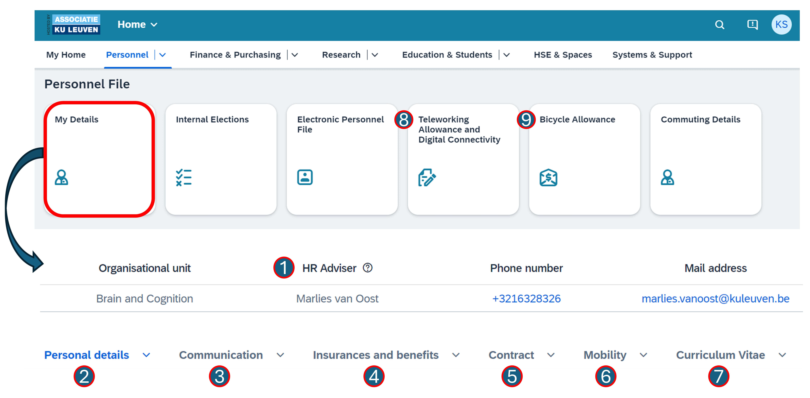
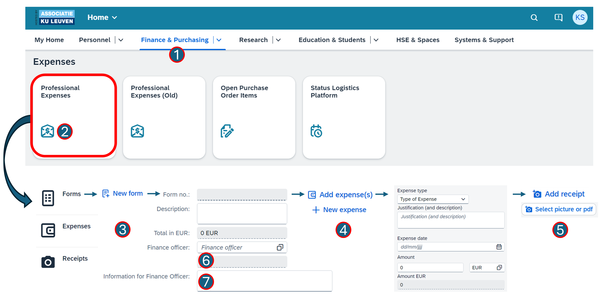
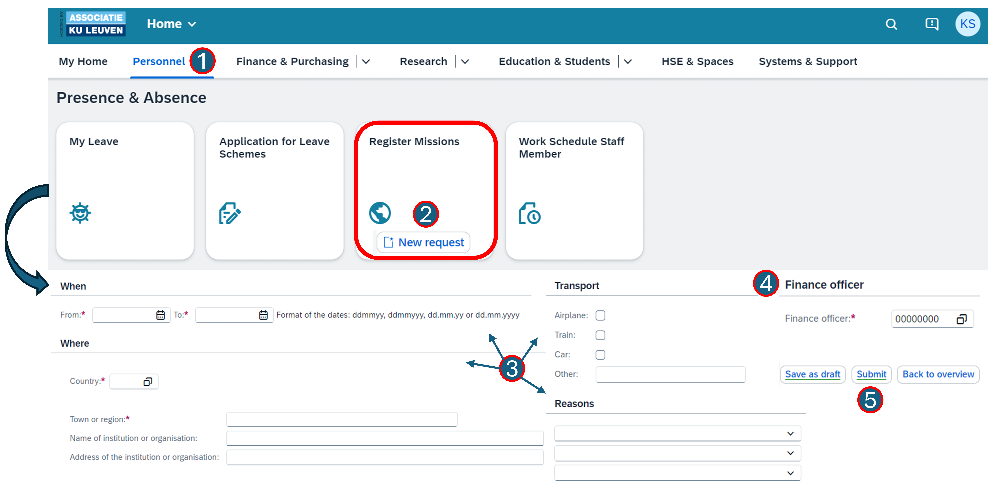

# Admin 101

On this page, we will specify the procedures for the most common administrative procedures you might need to follow. If something is missing, please contact us so we can add it and keep this page up to date (and your lives easier).

**KU Loket** is the university portal through which many administrative things are done. You can access it [here](https://webwsp.aps.kuleuven.be/irj/portal).

## Consult your personnel file

Log in to KU Loket and go to "Personnel", then click on "My details" (shown in red below):

At the very top of this page, you can find the name of your **HR advisor** (1). Your HR advisor offers you a listening ear, provides clarifying advice on HR-related matters and supports you with the administrative obligations that come along with employment at KU Leuven.

Below, you can **edit your personal details** (2), such as adding a new private address, updating your family situation, adding emergency contacts or adding a new bank account number by clicking on the pencil in the top right corner of the corresponding section.

Browse through the **other tabs** to find out and/or change information on communication means (3), [insurances](https://admin.kuleuven.be/sab/vz/intranet/en/insurance-office) and [other financial advantages](https://admin.kuleuven.be/mykuleuven/en/theme/hr-wellbeing/salary-benefits-insurances/index) you are entitled to (4), your contract details (5), mobility (e.g., to order a [KU Leuven bike](https://admin.kuleuven.be/td/intranet/en/mobility/2WD/2wd), get a refund for [public transportation commuting costs](https://admin.kuleuven.be/personeel/english/intranet/salary-benefits-insurances/commuting/recovery-commuting-expenses), or to [register your personal vehicle for work use](https://admin.kuleuven.be/personeel/intranet/verloning-personeelsvoordelen/verplaatsingen_dienstverband/verplaatsing_dienstverband#section-2)) (6) and your curriculum at KU Leuven (7).

Through your personnel file, you can also apply for [teleworking allowances](https://admin.kuleuven.be/personeel/english/intranet/workinghours-teleworking/hybrid-working/allowances-and-registration/index) (for KU Leuven staff only) (8) and/or apply for a [bicycle allowance](https://admin.kuleuven.be/personeel/english/intranet/salary-benefits-insurances/commuting/bicycle-allowance) if you bike (part of) your home-work journey (9). If you are financed by FWO, check out [this page](https://admin.kuleuven.be/mykuleuven/en/channel/mk108/index). If you are looking for information on the parking policy of KU Leuven, go [here](https://admin.kuleuven.be/td/en/mobility/parking-policy).

## Reimbursement for professional expenses

1. Log in to KU Loket and go to "**Finance & Purchasing**"
2. Click on "**Professional expenses**" (shown in red below)
3. Click on "**Forms**", create a "**+ New form**" and give it an informative name (e.g., congres X)
4. Add all your expenses to the form (e.g., train tickets, dinner expenses, the registration fee)
5. Link a digital proof to each expense
6. Couple the appropriate financial antenna to your form ([An Van Kets](https://www.kuleuven.be/wieiswie/nl/person/00057838), u0057838)
7. Add information on which fund your expenses should be paid from (ask  your PI)

For more information, check out the available [demo videos](https://icts.kuleuven.be/docs/at/lofi/aankoop/k/beroepskosten/BK/Begunstigde/demo) and/or read the [FAQ](https://icts.kuleuven.be/docs/at/lofi/aankoop/k/beroepskosten/BK/FAQ). If you have specific questions concerning this procedure, contact An (*<an.vankets@kuleuven.be>*) or go find her in office 02.80.

## Register personal leave

There are a couple of things we usually do in the lab when we take a holiday:

1. **Notify Hans** by sending an email with the subject "Holiday", to keep an official trace of your holiday request (that also helps him keep track of who’s on leave).
2. Mark the days you’re off in the Hoplab **Google calendar**, so everyone is aware of your absence.
3. **Notify your employer**, which can be different depending on your contract (the procedure below is for KU Leuven employees, for instance).

### Procedure for KU Leuven employees

The procedure for KU Leuven employees is as follows (If you are financed by FWO, check out [this page](https://admin.kuleuven.be/mykuleuven/en/channel/mk108/index)). When you plan your holiday, you have to register this in KU Loket and get it approved. To do this, follow these steps:

1. Log in to KU Loket and go to "**Personnel**"
2. Navigate to "**My Leave**" and click on "**Requesting leave**"
3. Click on a day and fill in the appropriate start and end date of your holiday period
4. Click on the arrow, choose how many hours of each type of leave you are entitled to you want to use
5. Submit your request to your approver

To register **other kinds of personal leave** (e.g., [short-term or social leave](https://admin.kuleuven.be/personeel/english/intranet/holiday-absence/short-leave) or [sick leave](https://admin.kuleuven.be/personeel/english/intranet/holiday-absence/illness-accident/incapacity-to-work-illness)), check out the corresponding links. For further questions on this topic, browse to [this page](https://admin.kuleuven.be/mykuleuven/en/theme/hr-wellbeing/holidays-leaves-of-absence).

## Register professional leave

This has to be done (in advance) for absence in the context of **any work-related event** (national and international), such as a conference or the annual LBP retreat. This registration is needed in order to claim professional expenses made during this trip, to make sure you are correctly insured and to allow the KU Leuven to monitor the safety level of the trip.

Proceed as follows:

1. Log in to KU Loket and Go to "**Personnel**"
2. Navigate to "**Register missions**" and click on "**New request**"
3. Fill out the required information on (amongst others):

    - *When* you will be absent
    - *Where* you will be
    - *How* you will get there
    - *Why* you are going

4. Add the correct financial antenna to the form ([An Van Kets](https://www.kuleuven.be/wieiswie/nl/person/00057838), u0057838)
5. Submit the form

For more information, check out [this page](https://admin.kuleuven.be/personeel/english/intranet/holiday-absence/absences_university_business). If you are using your own vehicle for the trip, please make sure it is registered for insurance reasons. To do so, follow the steps on [this page](https://admin.kuleuven.be/personeel/english/intranet/salary-benefits-insurances/workrelated-trips/reimbursement_workrelated_trip#section-2).

## Reserve a room for a meeting

In order to book a room, contact [Ying](https://www.kuleuven.be/wieiswie/en/person/00098752). You can check which rooms are available yourself through KU Loket:

1. Go to KU Loket, navigate to the tab "**HSE & Spaces**" and click on "**Classroom reservations**" (Dutch only)
2. Click "**Zoek op naam**" and enter `PSI` to find all the rooms in the building.
3. Select the rooms that fit your needs
4. Click "**toon reservaties**"
5. Browse to the date & time when you need the room
6. Look for an available room and send this info to [Ying](https://www.kuleuven.be/wieiswie/en/person/00098752)

## Reserve equipment or a room for testing

The standard booking tool for testing rooms and equipment (testing booths, EEG caps, etc.) in our faculty is [**Clustermarket**](https://clustermarket.com/).

- To access Clustermarket you need to make a user account using an invitation link. This link decides to which infrastructure you have access to and is different for every research unit/group. For our group (B&C Human), you can get the link by sending an email to [Christophe Bossens](https://www.kuleuven.be/wieiswie/en/person/00072088) (<christophe.bossens@kuleuven.be>).
- When you have access, choose the option to log in via your organization, so you can access it through the KU Leuven login tool.
- Make sure to use Clustermarket to book your testing time slots when you use common rooms or material. Request access to the items you don’t have permission to in case you need it. You can find more information on how to use Clustermarket in [this presentation](https://ppw.kuleuven.be/intranet/research/files/infoclustermarket).
- The faculty also has their own MS Teams `GHUM PPW - Research rooms and equipment` where you can find more detailed information on the available research infrastructure as well as a manual on how to book infrastructure with Clustermarket (for more info, check out [this page](https://ppw.kuleuven.be/intranet/research/research-infrastructure-ppw)).

## Order stuff

Please contact [Ying](https://www.kuleuven.be/wieiswie/en/person/00098752) for assistance with arranging and/or ordering and/or paying for the following things:

- Hotel reservations
- Flight bookings
- Online purchases
- Computer equipment
- Physical mail and packages (post)

**General orders** (e.g., milk, coffee, office material) are also handled by [Ying](https://www.kuleuven.be/wieiswie/en/person/00098752). In case of bigger purchases, make sure to include the financial antenna ([An Van Kets](https://www.kuleuven.be/wieiswie/nl/person/00057838)) in the process.

The IT department handles orders related to **computer supplies** (*<ppw.dict@kuleuven.be>*). All [computer equipment](https://admin.kuleuven.be/sab/ic/intranet/en/operatingcosts/operating-costs-details/computer-accessories) needs to be bought through the [official university providers](https://admin.kuleuven.be/td/aankoop/intranet/english/discounts/ICT/computeraccessories) by the financial antenna [An Van Kets](https://www.kuleuven.be/wieiswie/nl/person/00057838)). Therefore, when computer supplies need to be bought, make sure to contact them both. It can also be useful to include [Ying](https://www.kuleuven.be/wieiswie/en/person/00098752) in CC in that case.

If you need **technical assistance** for your order (e.g., you want to order an EEG-cap), you can contact [Klara](https://www.kuleuven.be/wieiswie/nl/person/00116743) or send an email to *<neurospace@kuleuven.be>* (general mailing address to reach the support staff of the Methusalem project).

## Arrange a parking spot for a visitor

- If you need to arrange parking for a visitor in the **city center**, you can do so by requesting a day code for the visitor to operate the barriers of the KU Leuven personnel parkings. For more information, check out [this page](https://admin.kuleuven.be/td/intranet/en/fd/bws/parking-policy#section-8). It is worth noting that the car park underneath the Herman Servotte Residence located on the Social Sciences campus (Parkstraat 39-53, 3000 Leuven) can be accessed outside of working hours (18h-24h) and during holidays with your staff card.
- Parking spots at the **university hospital** (UZ Leuven campus Gasthuisberg) can be refunded in the form of a parking ticket that visitors can use to pay their parking fee. We can buy these tickets (in batches) in advance, so make sure to check beforehand with [Klara](https://www.kuleuven.be/wieiswie/nl/person/00116743) (from December 2024 on, if you need them beforehand, ask [Andrea](https://www.kuleuven.be/wieiswie/nl/person/00152046)/[Joan](https://www.kuleuven.be/wieiswie/nl/person/00159576)) if we have tickets left or not. New tickets can be ordered by [Ying](https://www.kuleuven.be/wieiswie/en/person/00098752).

## What to do when you leave

We are very sad to see you leave! But since you do, make sure to tick the following boxes.

1. Return the following items to [Ying](https://www.kuleuven.be/wieiswie/en/person/00098752):

    - Any pc material (laptop, mouse, keyboard, etc.)
    - Your external hard drive (and potential USB-key)
    - Your key(card)
    - Your Lync phone

2. Make sure your data is organized and backed up correctly. That mostly means having back-ups in different locations and different ways. If you need advice on this, refer to the person in charge of data storage (as of December 2024, that is [Klara](https://www.kuleuven.be/wieiswie/nl/person/00116743)).
3. For more information on what to do when you leave, check out [this link](https://ppw.kuleuven.be/ppw-dict/faq#autotoc-item-autotoc-63) for ICT-related info, [this link](https://admin.kuleuven.be/personeel/english/intranet/endofcontract-pension/practical-steps-leaving/practical-steps-leaving-employment) for HR-related info and [this link](https://www.kuleuven.be/english/life-at-ku-leuven/upon-leaving) if you are an international researcher leaving Belgium.
