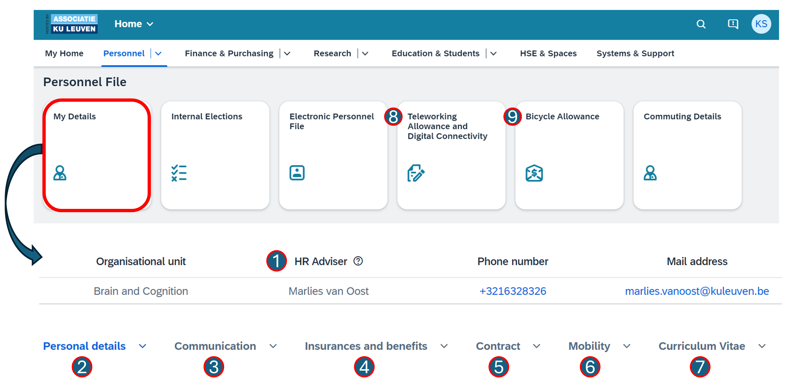
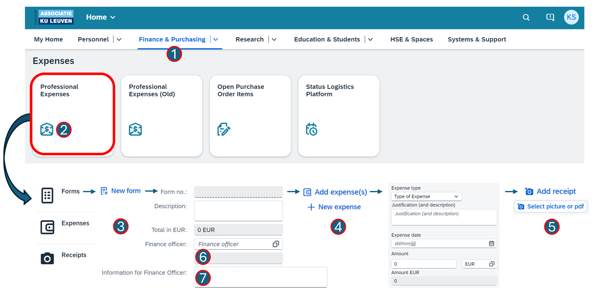
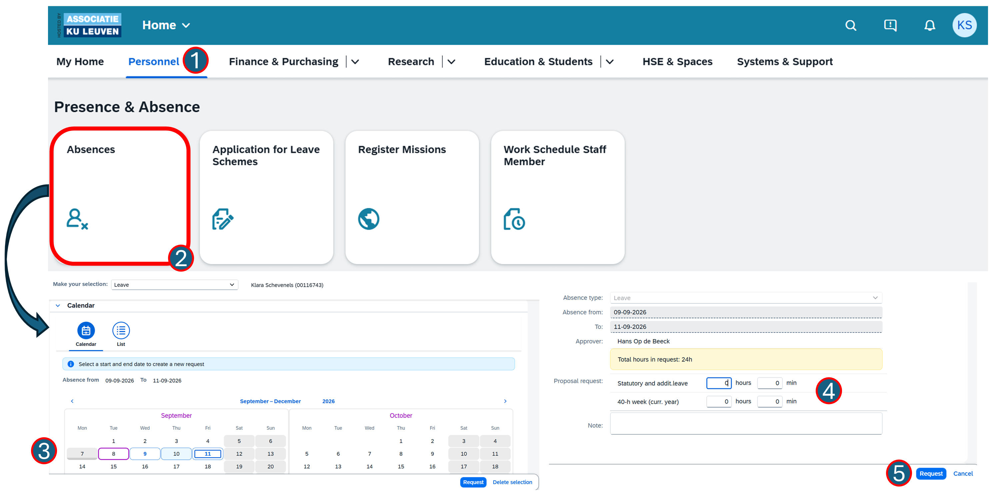
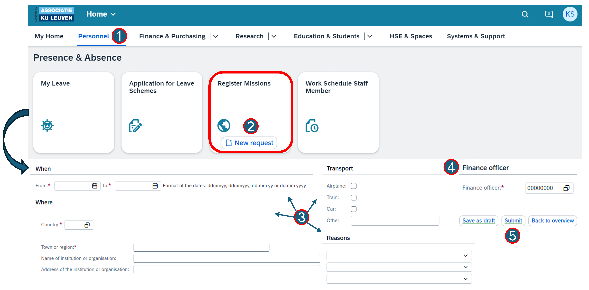
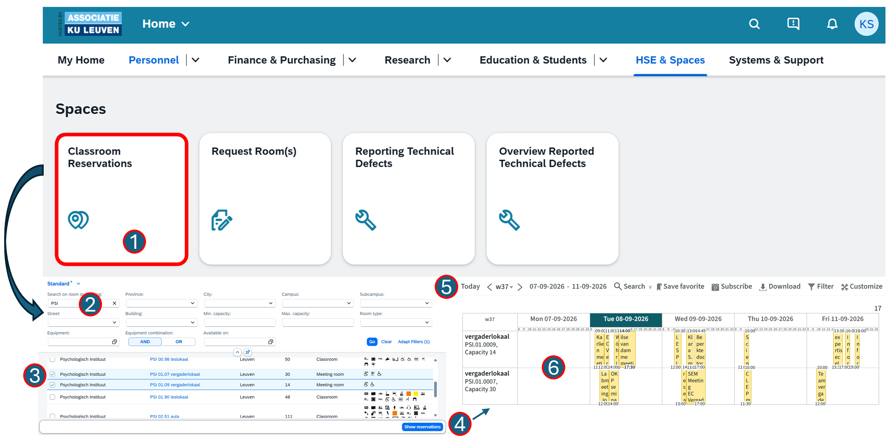

# Admin 101

On this page, we will specify the procedures for the most common administrative procedures you might need to follow. If something is missing, please contact us so we can add it and keep this page up to date (and your lives easier).

**KU Loket** is the university portal through which many administrative things are done. You can access it [here](https://www.kuleuven.be/sapredir/kuloket).

## Activate your KU Leuven account

After enrollment or hiring, you’ll receive an activation email with a link in your private mailbox.

The email includes an activation code to set your password via [this link](https://account.kuleuven.be/activate). If you’ve been affiliated with the KU Leuven Association before, your previous password may still be active, and you won’t receive a new activation email. Check your spam folder if you can't find the activation email.

## Consult your personnel file

Log in to KU Loket and go to "Personnel", then click on "My details" (shown in red below):

At the very top of this page, you can find the name of your **HR advisor** (1). Your HR advisor offers you a listening ear, provides clarifying advice on HR-related matters and supports you with the administrative obligations that come along with employment at KU Leuven.

Below, you can **edit your personal details** (2), such as adding a new private address, updating your family situation, adding emergency contacts or adding a new bank account number by clicking on the pencil in the top right corner of the corresponding section.

Browse through the **other tabs** to find out and/or change information on communication means (3), [insurances](https://admin.kuleuven.be/sab/vz/intranet/en/insurance-office) and [other financial advantages](https://admin.kuleuven.be/mykuleuven/en/theme/hr-wellbeing/salary-benefits-insurances/index) you are entitled to (4), your contract details (5), mobility (e.g., to order a [KU Leuven bike](https://admin.kuleuven.be/td/intranet/en/mobility/2WD/2wd), get a refund for [public transportation commuting costs](https://admin.kuleuven.be/personeel/english/intranet/salary-benefits-insurances/commuting/recovery-commuting-expenses), or to [register your personal vehicle for work use](https://admin.kuleuven.be/personeel/intranet/verloning-personeelsvoordelen/verplaatsingen_dienstverband/verplaatsing_dienstverband#section-2)) (6) and your curriculum at KU Leuven (7).

Through your personnel file, you can also apply for [teleworking allowances](https://admin.kuleuven.be/personeel/english/intranet/workinghours-teleworking/hybrid-working/allowances-and-registration/index) (for KU Leuven staff only) (8) and/or apply for a [bicycle allowance](https://admin.kuleuven.be/personeel/english/intranet/salary-benefits-insurances/commuting/bicycle-allowance) if you bike (part of) your home-work journey (9). 

If you are financed by **FWO**, check out [this page](https://admin.kuleuven.be/mykuleuven/en/channel/mk108/index). 

## Reimbursement for professional expenses

1. Log in to KU Loket and go to "**Finance & Purchasing**"
2. Click on "**Professional expenses**" (shown in red below)
3. Click on "**Forms**", create a "**+ New form**" and give it an informative name (e.g., congres X)
4. Add all your expenses to the form (e.g., train tickets, dinner expenses, the registration fee)
5. Link a digital proof to each expense
6. Couple the appropriate financial antenna to your form ([Agna Marien](https://www.kuleuven.be/wieiswie/en/person/00088446), u0088446)
7. Add information on which fund your expenses should be paid from (ask  your PI)

For more information, check out the available [demo videos](https://icts.kuleuven.be/docs/at/lofi/aankoop/k/beroepskosten/BK/Begunstigde/demo) and/or read the [FAQ](https://icts.kuleuven.be/docs/at/lofi/aankoop/k/beroepskosten/BK/FAQ). If you have specific questions concerning this procedure, contact Agna (*<agna.marien@kuleuven.be>*) or go find her in office 02.80.

## Register personal leave

### Holiday

There are a couple of things we usually do in the lab when we take a holiday:

- **Notify Hans** by sending an email with the subject "Holiday", to keep an official trace of your holiday request (that also helps him keep track of who’s on leave).
- Mark the days you’re off in the Hoplab **Google calendar**, so everyone is aware of your absence.
- **Notify your employer**, which can be different depending on your contract. The procedure for KU Leuven employees is as follows (If you are financed by FWO, check out [this page](https://admin.kuleuven.be/mykuleuven/en/channel/mk108/index)):

    <ol style="list-style-type: decimal;">
      <li>Log in to KU Loket and go to <strong>"Personnel"</strong></li>
      <li>Navigate to <strong>"Absences"</strong> and make sure <strong>"Leave"</strong> is selected in the selection pane (it should be the default)</li>
      <li>Select the start and end date of your holiday period on the displayed calendar and click <strong>"Request"</strong></li>
      <li>Choose how many hours of each type of leave you are entitled to you want to use for this request</li>
      <li>Submit the request to your approver, who will need to approve it</li>
    </ol>

!!! info "Youth holiday (*jeugdvakantie*)"
    Young employees who have not yet built up a full year of leave entitlement may be eligible for **youth holiday** (*jeugdvakantie*). This allows you to supplement your regular holiday days with additional paid leave days (funded by social security rather than the employer).

    **Eligibility**: You must be under 25 years old on December 31st of the year in which you completed your studies, and you must have worked at least one month as an employee during that year. The youth holiday days cover the gap between the (limited) regular leave you accrued and a full leave entitlement.

    For full details on eligibility and the application procedure, see the [KU Leuven youth holiday page](https://admin.kuleuven.be/personeel/intranet/verlof-afwezigheden/verlof/jeugdvakantie.html).

### Non-holiday

To register **other kinds of personal leave** (e.g., [short-term or social leave](https://admin.kuleuven.be/personeel/english/intranet/holiday-absence/short-leave) or [sick leave](https://admin.kuleuven.be/personeel/english/intranet/holiday-absence/illness-accident/incapacity-to-work-illness)), check out the corresponding links. For further questions on this topic, browse to [this page](https://admin.kuleuven.be/mykuleuven/en/theme/hr-wellbeing/holidays-leaves-of-absence).

!!! info "Pregnancy and parenthood"
    If you need any information related to pregnancy and parenthood, you can check out [this page](https://admin.kuleuven.be/mykuleuven/en/theme/hr-wellbeing/pregnancy-parenthood/index).

## Register professional leave

This has to be done (in advance) for absence in the context of **any work-related event** (national and international), such as a conference or the annual NeuroSPACE retreat. 

This registration is needed in order to claim professional expenses made during this trip, to make sure you are correctly insured and to allow the KU Leuven to monitor the safety level of the trip. For more information, check out [this page](https://admin.kuleuven.be/personeel/english/intranet/holiday-absence/absences_university_business). 

Proceed as follows:

1. Log in to KU Loket and Go to "**Personnel**"
2. Navigate to "**Register missions**" and click on "**New request**"
3. Fill out the required information on (amongst others):

    - *When* you will be absent
    - *Where* you will be
    - *How* you will get there
    - *Why* you are going

4. Add the correct financial antenna to the form ([Agna Marien](https://www.kuleuven.be/wieiswie/en/person/00088446), u0088446)
5. Submit the form

!!! warning
    If you are using your own vehicle for the trip, please make sure it is registered for insurance reasons. To do so, follow the steps on [this page](https://admin.kuleuven.be/personeel/english/intranet/salary-benefits-insurances/workrelated-trips/reimbursement_workrelated_trip#section-2). Your vehicle has to be registered in order to get a km-based refund for work-related trips! You can find the current rates [here](https://admin.kuleuven.be/sab/od/intranet/english/operatingcosts/operating-costs-details/own-vehicle-workrelated).

## Reserve a room for a meeting

In order to book a room, contact [Ying](https://www.kuleuven.be/wieiswie/en/person/00098752). You can check which rooms are available yourself through KU Loket:

1. Go to KU Loket, navigate to the tab "**HSE & Spaces**" and click on "**Classroom reservations**"
2. Click "**Search on room or building**" and enter `PSI` 
3. Select the rooms that fit your needs
4. Click "**Show reservations**"
5. Browse to the date & time when you need the room
6. Look for an available room and send this info to [Ying](https://www.kuleuven.be/wieiswie/en/person/00098752)

!!! info "In case of absence of Ying"
    Through the "**Request Room(s)**" tile, next to "Classroom reservations", you can reserve a room yourself.  

## Reserve equipment or a room for testing

The standard booking tool for testing rooms and equipment (testing cubicles, EEG room, TMS room, fMRI dummy scanner, VR room, etc.) in our faculty is [**Calira**](https://app.clustermarket.com/).

- To access Calira, you need to make a user account using an invitation link. This link decides to which infrastructure you have access to and is different for every research unit/group. For our group (B&C Human), you can get the link by sending an email to [Klara](https://www.kuleuven.be/wieiswie/nl/person/00116743) (<klara.schevenels@kuleuven.be>).
- When you have access, choose the option to log in via your organization, so you can access it through the KU Leuven login tool.
- Make sure to use Calira to book your testing time slots when you use common rooms or material. Request access to the items you don’t have permission to in case you need it. 

If you need a **larger PC room**, e.g., for a collective testing session, you can follow the steps [above](#reserve-a-room-for-a-meeting) to book one of the "ICTS PC-KLAS" rooms in VHI.

!!! info "Information on PPW's research infrastructure"
    You can find more information on how to use Calira on the faculty's own **MS Teams channel [`GHUM PPW - Research rooms and equipment`](https://teams.microsoft.com/l/team/19%3aBJuW14A19tGum82R9GflgN75j5-qzz4woMqq5crhRTo1%40thread.tacv2/conversations?groupId=72910d2a-8121-481d-a927-ab011cec6340&tenantId=3973589b-9e40-4eb5-800e-b0b6383d1621)**, which functions as the central information platform for all matters related to research infrastructure. Find more info [here](https://admin.kuleuven.be/mykuleuven/en/channel/50000339/research/research-infrastructure).

## Ordering stuff

!!! Info "Most recent information from the Finance Department"
    [Here](https://kuleuven.sharepoint.com/:p:/r/sites/T0005824-Hoplab/Shared%20Documents/Hoplab/General%20information/08102025%20finance%20@%20KULeuven.pptx?d=w617d174e07644c38b29b428cdd98cd4b&csf=1&web=1&e=GJycN1) you can find the presentation given by the finance department to LBP on 08/10/2025 (access required). Check it out for a complete overview.

Please contact [Ying](https://www.kuleuven.be/wieiswie/en/person/00098752) and/or the financial antenna [Agna](https://www.kuleuven.be/wieiswie/en/person/00088446) for assistance with arranging, ordering and/or paying for the following things (more info via the links below):

- [Office equipment and supplies](https://admin.kuleuven.be/sab/od/intranet/english/operatingcosts/operating-costs-details/office-equipment)
- [Software](https://admin.kuleuven.be/sab/od/intranet/english/operatingcosts/operating-costs-details/software)
- [Hotel reservations](https://admin.kuleuven.be/sab/od/intranet/english/operatingcosts/operating-costs-details/hotel)
- [Flight bookings](https://admin.kuleuven.be/td/aankoop/associatienet/en/contracts/travel/businesstraveldgi)

    Since 01/10/2025, the travel agency KU Leuven works with for booking flights has changed from Omnia Travel to **DGI** (previously Diversity Travel). You can book a flight via their [online booking tool](https://idp2.diversitytravel.com/serviceprovider/initiatesso/kuleuven). To confirm your booking, you will need an order number from the financial antenna [Agna](https://www.kuleuven.be/wieiswie/en/person/00088446), who will need the correct booking information to create one. Note that, if you are awarded an FWO travel grant, you have to book your trip through the FWO-approved travel agencies Omnia Travel or Uniglobe and **not** DGI.

- [Computer accessories](https://admin.kuleuven.be/sab/ic/intranet/en/operatingcosts/operating-costs-details/computer-accessories)

    In case you need a **new computer**, contact the IT helpdesk of our faculty (<ppw.dict@kuleuven.be>). They can also give you advice on orders related to computer supplies. Note that all [computer equipment](https://admin.kuleuven.be/sab/ic/intranet/en/operatingcosts/operating-costs-details/computer-accessories) needs to be bought through the [official university providers](https://admin.kuleuven.be/td/aankoop/intranet/english/discounts/ICT/computeraccessories).

- [Physical mail and shipping services](https://admin.kuleuven.be/td/intranet/en/logistics/send-and-receive/verzending)
- [Reimbursement of costs to third parties](https://admin.kuleuven.be/sab/od/intranet/english/operatingcosts/operating-costs-details/costs-third-parties) (e.g., a guest speaker's travel expenses)
- [Personal protective equipment and work clothing](https://admin.kuleuven.be/sab/od/intranet/english/operatingcosts/operating-costs-details/ppe) (e.g., a [lab coat](https://admin.kuleuven.be/td/intranet/veiligheid_bescherming/werkkledij/workwearrequest) for testing patients in the hospital)

More generally, on [this page](https://admin.kuleuven.be/td/aankoop/associatienet/en/index), you can check **all existing framework and discount agreements** with external suppliers, as well as the correct ordering method (KU Loket/purchase order).

!!! warning "Aanvraag uitzondering online aankoop"
    If you need to buy something via a webshop that doesn't accept purchase orders **and** is not available via one of the existing framework agreements (including [software](https://admin.kuleuven.be/sab/od/intranet/english/operatingcosts/operating-costs-details/software)), you can request an exception [via this form](https://admin.kuleuven.be/td/aankoop/associatienet/en/procedures/online-purchase) **prior to the online purchase**. This also applies to purchases with the corporate credit card (except for books, journals, membership/registration fees, and accomodation costs)! 

    Always ask for a purchase order for Fnac and Acco (avoid bol.com). 

If you want to order **specific testing equipment or consumables** (e.g., a new EEG cap), you can contact [Klara](https://www.kuleuven.be/wieiswie/nl/person/00116743) or send an email to <neurospace@kuleuven.be> (general mailing address to reach the NeuroSPACE support staff). 

!!! warning "Goods receipt and credit card expenses"
    Let [Ying](https://www.kuleuven.be/wieiswie/en/person/00098752) and/or [Agna](https://www.kuleuven.be/wieiswie/en/person/00088446) know when you receive your ordered item. They need this confirmation to settle the invoice (i.e., if you forget, the invoice will not be paid). 

    Likewise, if you payed something with the corporate credit card, immediately inform [Ying](https://www.kuleuven.be/wieiswie/en/person/00098752) and/or [Agna](https://www.kuleuven.be/wieiswie/en/person/00088446) of this and provide them with the digital receipt and justification (work-related character) for the expense.  

## Arrange a parking spot for a visitor

If you need to arrange parking for a visitor in the **city center**, you can do so by requesting a day code for the visitor to operate the barriers of the KU Leuven personnel parkings. For more information, check out [this page](https://admin.kuleuven.be/td/intranet/en/fd/bws/parking-policy#section-8).

!!! info "Parking policy"
    You can find more info on KU Leuven's **parking policy** [here](https://admin.kuleuven.be/td/en/mobility/parking-policy). It is worth noting that the car park underneath the Herman Servotte Residence located on the Social Sciences campus (Parkstraat 39-53) can be accessed outside of working hours (18h-24h) and during holidays with your staff card. 

Parking spots at the **university hospital** (UZ Leuven campus Gasthuisberg) can be refunded in the form of a parking ticket that visitors can use to pay their parking fee. 

- We can buy these tickets (in batches) in advance, so make sure to check beforehand with your fellow fMRI-colleagues currently or previously testing if we have tickets left or not. 
- New tickets can be ordered by [Ying](https://www.kuleuven.be/wieiswie/en/person/00098752) and/or [Agna](https://www.kuleuven.be/wieiswie/en/person/00088446), by sending a purchase order to <toegangsbeheer@uzleuven.be>. You will need to pick up the tickets in UZ Leuven (dienst toegangsbeheer).

<!--
__TODO__: [Klara] Add a new section on PhD defense planning. Include: timeline, required forms, committee composition rules, the PhD book procedure, and the checklist adapted by Filippo for this faculty. Link to relevant KU Leuven doctoral school pages.
-->
