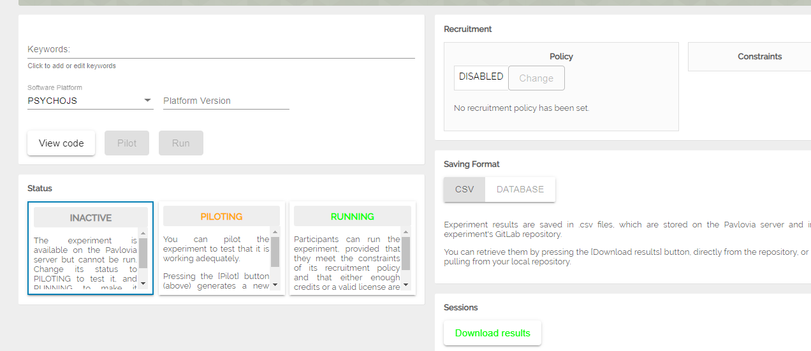
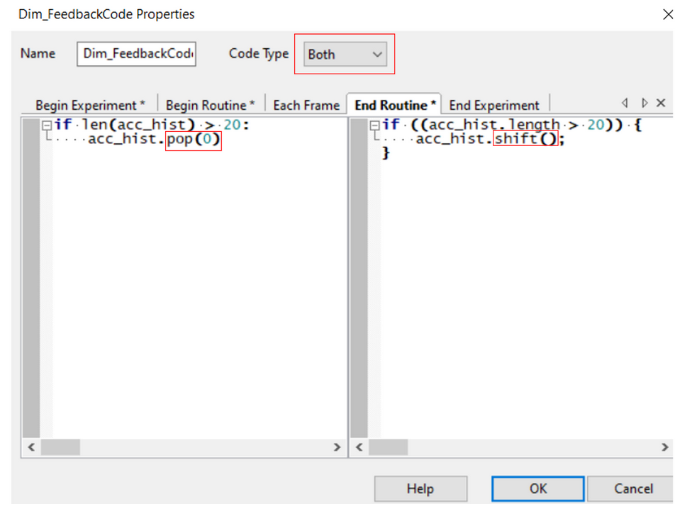
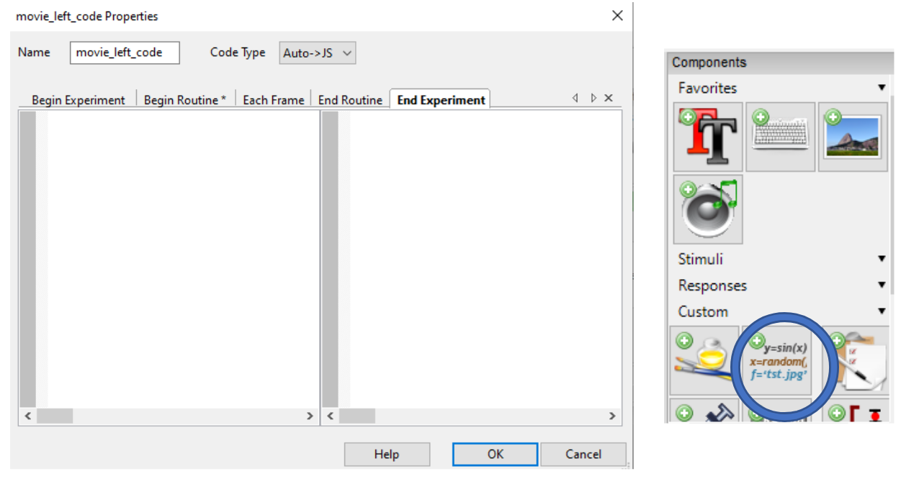
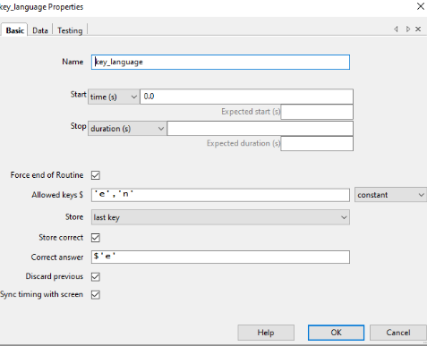
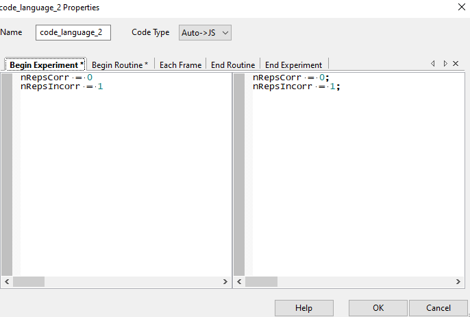
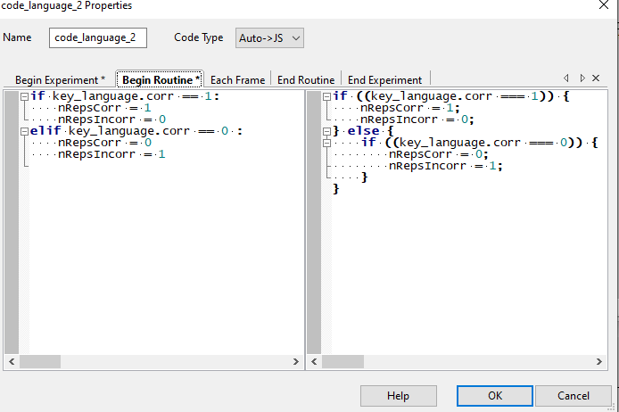

# Online experiments with PsychoPy

This page covers the full workflow for creating and running online experiments on [Pavlovia](https://pavlovia.org/) using the **PsychoPy Builder**: from installation and uploading, through setting up stimuli and informed consent, to common pitfalls and advanced features.

!!! tip "PsychoPy Builder documentation and workshop"
    Check the [PsychoPy Builder](https://www.psychopy.org/builder/) website for a full explanation of the Builder GUI and all available components. Christophe Bossens also organizes a [Workshop on PsychoPy Builder](https://ppw.kuleuven.be/agenda/2026/psychopy) once a year.

---

## Installing PsychoPy Builder

To design a [PsychoPy](https://www.psychopy.org/) task in the PsychoPy Builder the first step will be to install the (free) PsychoPy Desktop application. Installation instructions can be found [here](https://www.psychopy.org/download.html).
After installation you will automatically have three PsychoPy applications/interfaces: the [Builder](https://www.psychopy.org/builder/), the Coder and the Runner. Here we will mostly work in the Builder, however you can test the experiment offline using e.g. the Runner interface.

---

## Uploading to Pavlovia

Follow the steps below to successfully upload your experiment to Pavlovia.

1. Create the experiment in **PsychoPy Builder**.
2. Create a [**Pavlovia account**](https://gitlab.pavlovia.org/users/sign_in) and log in.
3. Link your account to the Builder via this button 
4. Place all files for the experiment in a **single directory**.
5. Click the **Syncing Globe**  in the Builder, enter a project name, and upload. The icon will turn green when the upload is complete.
6. Access your experiment on Pavlovia by navigating to **Dashboard > Experiments** in your account.
7. To test the project, change the status to **piloting** and click **pilot**.



!!! tip
    If the experiment doesn't run, click **view code**. If the repository is empty, retry the sync from the Builder.

!!! info "Running experiments with lab credits"
    To run experiments beyond piloting, you may need credits. We have a Hoplab account for this purpose. Ask Klara or Silke how to get access to it.

More information can be found on the PsychoPy website on [this page](https://www.psychopy.org/online/usingPavlovia.html) and [this page](https://www.psychopy.org/online/fromBuilder.html).

---

## Working with stimuli

### Images

Make sure all image files are in the **html > Resources** directory. Missing files will cause a resource error on Pavlovia.

To ensure consistent display sizes across different screens, follow these [image guidelines](https://discourse.psychopy.org/t/consistent-image-size-across-screens/12517).

### Movie stimuli

Pavlovia supports standard video formats, such as **.mp4**. If your videos are in a different format, convert them using free software like **Handbrake**.

- Set the video to play **every repeat** in the Builder. If videos need to repeat, Pavlovia will only display the last frame unless reset.
- To reset the video between trials, use a code snippet. For details, check the [PsychoPy community guide](https://discourse.psychopy.org/t/videos-are-not-played-multiple-times-in-pavlovia/11284/14) and [this link](https://discourse.psychopy.org/t/video-is-not-played-but-stays-static-in-pavlovia/13331).

!!! tip "Video troubleshooting"
    If your videos don't display, try adjusting the **Units** setting to `pix` or another compatible format.

### Text stimuli

- **WrapWidth**: If the text doesn't fit on the screen, increase the **WrapWidth** under the Advanced tab. WrapWidth defines the maximum width at which text wraps to a new line.
- **Centering text**: To center text, add the following JavaScript code snippet in a JS-only code chunk:

    ```javascript
    name_text.setAlignHoriz('center');
    ```
    This will center the text online; however, offline functionality may be impacted if the code isn't set to JS-only.

### Rest trials and breaks

To introduce rest trials or breaks, add a code snippet under **Each Frame**. For specific approaches, refer to [this guide](https://discourse.psychopy.org/t/pause-trial-does-not-work-online-pavlovia/13379/5) and [this page](https://discourse.psychopy.org/t/take-a-break-works-locally-but-not-online/11785/22).

---

## Informed consent

Online experiments require participants to give informed consent before starting. Since PsychoPy's **Form component does not work on Pavlovia**, you need an alternative approach. The two most common methods are:

### Option 1: Button-based consent screen (recommended)

Build a consent routine in the Builder using text and shape components:

1. Add a **Text** component displaying the consent information (study purpose, data handling, right to withdraw, etc.).
2. Add two **Polygon** components styled as buttons (e.g., green "I agree" and red "I do not agree"), each with a **Text** label on top.
3. Add a **Mouse** component and a **Code** component to detect clicks:

    ```python
    # Begin Routine
    consent_given = False

    # Each Frame
    if mouse.isPressedIn(agree_button):
        consent_given = True
        continueRoutine = False
    elif mouse.isPressedIn(disagree_button):
        consent_given = False
        continueRoutine = False
    ```

4. After the consent routine, use a **Code** component to end the experiment if consent was not given:

    ```python
    # Begin Routine (in the next routine)
    if not consent_given:
        thisExp.addData('consent', 'refused')
        psychoJS.quit()  # online
    else:
        thisExp.addData('consent', 'given')
    ```

!!! warning
    Make sure to define `consent_given = False` in the **Begin Experiment** tab to avoid undefined variable errors on Pavlovia.

### Option 2: Embedded HTML consent form

For more complex consent forms (e.g., with checkboxes for multiple clauses), you can embed an external HTML file using JavaScript. This approach loads a `.html` consent form in an iframe and captures the responses. Note that **this only works online** — it will not run locally.

For a working example, see [this community thread on embedded HTML consent forms](https://discourse.psychopy.org/t/embedded-html-consent-form/40927).

### Further reading

- [Best practices for consent forms in online experiments](https://discourse.psychopy.org/t/best-practice-for-consent-forms-information-sheets-in-online-experiments/8784)
- [Consent form in PsychoPy Builder](https://discourse.psychopy.org/t/consent-form-in-psychopy-builder/20216)
- [Adding consent to online tasks](https://discourse.psychopy.org/t/how-to-add-consent-forms-to-online-task-how-to-randomise-versions-of-tasks-online/12065)

---

## Common pitfalls

### Excel and CSV files

To ensure compatibility, follow these conventions:

- **No empty columns or rows**: Remove any extra spaces or blanks in your spreadsheet.
- **Unique column names**: Every column needs a unique name, and the top row should not have empty cells.
- **Avoid special characters** in the text fields.
- **Save as CSV**: Convert your Excel files to CSV format before using them in Pavlovia.

### Writing custom code

Add custom code through the **Components > Custom > Code** tab in the Builder, and **do not add code directly in Coder**.

For phase-specific code snippets, add them to the appropriate section in the Code Component (e.g., `Begin Experiment`, `Begin Routine`, `Each Frame`).

Ensure that **Python code** is entered in the box on the left and **JavaScript code** (or both) in the box on the right. Use the `Code Type` option to specify the language.

Consult the [PsychoPy Python-to-JavaScript crib sheet](https://discourse.psychopy.org/t/psychopy-python-to-javascript-crib-sheet/14601) for additional guidance.

### Python-to-JavaScript translation

Some Python code does not automatically translate to JavaScript. Generally, **automatic translation to JS works well if you configure everything in the Builder's GUI**. However, directly coding or modifying code snippets can sometimes lead to translation failures, particularly if you need to:

- Track variables over time, such as adapting later trials based on earlier ones.
- Introduce breaks after a specific number of trials.

For more on these issues, see [this thread on Pavlovia troubleshooting](https://discourse.psychopy.org/t/trials-progress-in-pavlovia-is-not-working-for-me/17694).

You may need to edit translations manually by setting the top-right `Code Type` box to **Both**.



This setting allows you to modify both the left (Python) and right (JavaScript) code boxes independently, without affecting the other.

### Tracking trials across languages

If you want to track a fixed number of trials, you can create a list and remove the oldest trial entry once the list length exceeds your desired count. For instance, to track responses for the last 20 trials, create a list of responses and use a different method in each language:

- **Python**: `.pop(0)`
- **JavaScript**: `.shift()`

To stop a loop, JavaScript does not recognize specific loop names. For instance, if stopping a loop named `preparation`, this will translate as `preparation.finished` in JavaScript. Change this in the right box to `trials.finished`.

- **Stopping Nested Loops**: `trials.finished` only stops the inner loop. To stop an outer loop (e.g., `PreparationBlock`), you may need a different solution, as stopping nested loops is limited in Pavlovia.



??? example "Common JS definitions to add at experiment start"
    For Python commands that do not exist in JavaScript, define them at the beginning of the experiment in a JS-only code chunk to simplify translation. Note that some of these commands may still need manual translation per code chunk.

    ```javascript
    // The experiment identifier
    thisExp=psychoJS.experiment;

    // Psychopy window
    win=psychoJS.window;

    // Event manager of Psychopy
    event=psychoJS.eventManager;

    // Shuffle command
    shuffle = util.shuffle;

    // Sorting array elements and returning a sorted list
    sort = function(array) {
        return array.sort();
    };

    // Appending elements to a list
    Array.prototype.append = [].push;

    // Getting the index of an element in a list
    Array.prototype.index = [].indexOf;

    // Summing elements in a list
    sum = function(arr) {
        return arr.reduce((a, b) => a + b);
    };

    // Counting occurrences of a value in a list
    Array.prototype.count = function(value) {
        let count = 0;
        this.forEach(item => {
            if (item === value) count++;
        });
        return count;
    };
    ```

---

## Advanced topics

### Language selection and conditional loops

1. Place the **code component** in a separate routine from the key press defining the selection.
2. To create conditional loops based on key press selection, refer to [this guide](https://discourse.psychopy.org/t/conditional-loop-not-working-in-pavlovia/11749/6).

**Example for language selection** (e.g., 'e' for English, 'n' for Dutch):

- Store the chosen key in a variable.
- Add a code component, set `nReps` to a variable based on the selection, and configure the loop accordingly.





### Mobile device detection

To prevent participants from accessing the experiment on mobile devices, use this **JS-only** code snippet at the start of the experiment:

```javascript
if (/Android|webOS|iPhone|iPad|iPod|BlackBerry|IEMobile|Opera Mini/i.test(navigator.userAgent)) {
    quitPsychoJS('Mobile device detected. Goodbye!', false);
}
```

<!--
__TODO__: [Klara] Upload Christophe Bossens' workshop materials on online experimentation to the Hoplab Teams folder and add a link in the "Learning resources" or introductory section of this page.
-->
