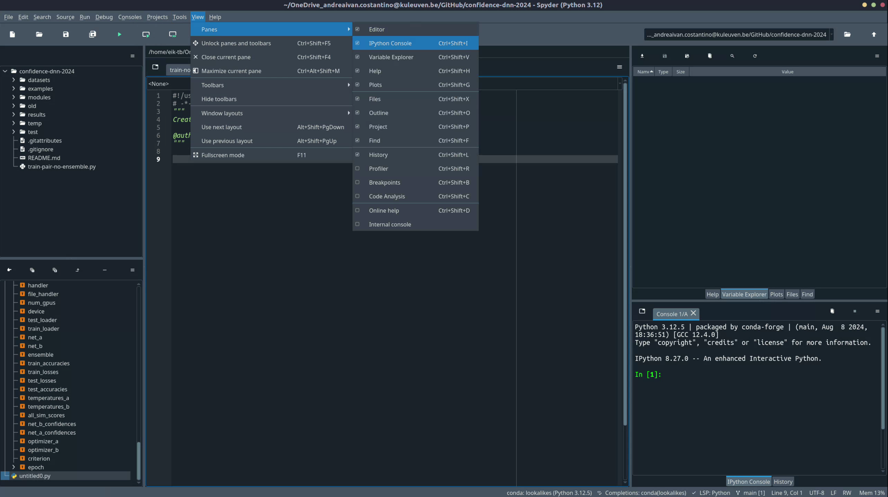
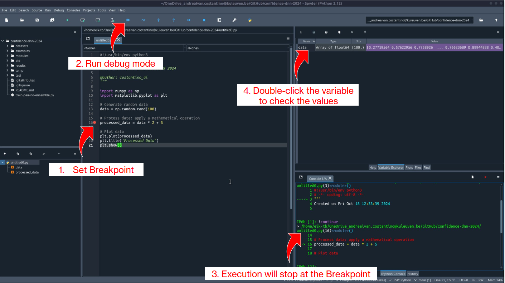
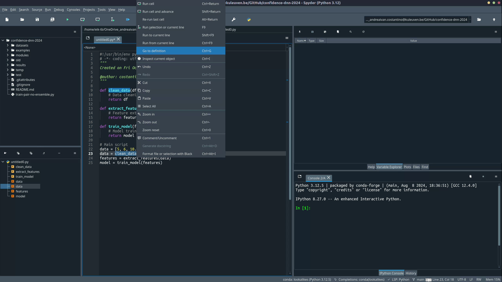

# Coding Practices

Welcome to the Coding Practices section! Here, you'll find essential guidance for setting up your coding environment, managing projects, collaborating using GitHub, and following best practices to write clean, maintainable code.

<div class="grid cards" markdown="1">
- :material-wrench-clock: **[Good coding practices](#best-practices-for-organizing-code-and-projects)**  
  In the lab, we aim to build tools that are reproducible, reusable, and efficient. Learn more about our general approach to building and managing projects.

- :octicons-desktop-download-24: **[Setting Up Your Project](#setting-up-a-conda-environment)**  
  Every new project starts with the right environment setup. Find out how to create a proper environment for your coding projects.

- :material-bug: **[Understanding Your Code](#understanding-your-code)**  
  Encountering inexplicable errors? Want to know what data are you plotting? Don't know how to use a misterious function? Learn how to effectively debug your code using Spyder’s powerful tools.

- :material-source-branch: **[Using Version Control](#version-control-with-git-and-github)**  
  Discover how to integrate Git and GitHub into your workflow to keep track of changes and collaborate with ease.

</div>

## Why Coding Practices Matter

When you code for your research project, remember that you're not just coding for yourself today—you’re coding for:

- **Your future self**: Six months from now, you might not remember the specifics of your current project.
- **Other scientists**: Your code might be used or reviewed by researchers with varying coding skills and backgrounds. Writing clean and well-documented code ensures that your work can be understood and built upon by others.

Keeping your code tidy, easy to understand, and maintainable is crucial for effective research collaboration and aligns with the principles of **Open Science**.

## Recommended Resources

Make sure to explore our suggested [Coding Tutorials](../../get-started/student-starter-pack.md#coding-tutorials). We especially recommend **[The Good Research Code Handbook](https://goodresearch.dev/)**, which provides valuable insights into writing robust research code. Key sections include [Writing Decoupled Code](https://goodresearch.dev/decoupled) and [Keeping Things Tidy](https://goodresearch.dev/tidy).

By following these practices, you'll not only improve the quality of your research code but also make it easier to share your work with others, enhancing transparency and reproducibility. Invest time in reading and practicing. Developing good coding habits will pay off in the long run by making your work more efficient, easier to understand, and more valuable to the research community. Happy coding!

!!! tip
    If you're new to coding and many of the terms on this page seem unfamiliar, start by exploring some of the essential tools you’ll use. Check out tutorials on Python, Git, and the Unix Shell on the [Student Starter Pack](../../get-started/student-starter-pack.md) page.

!!! question "What if I code in MATLAB?"
    While the information in this page focuses on Python, the principles of writing clean, maintainable code are universal. Debugging, structuring code, and organizing projects apply just as much to MATLAB as they do to Python. Be sure to apply these practices regardless of the language you're using!

## Special Note for fMRI Projects

If you're working on fMRI projects, you’ll find specific information on setting up your environment in the [Set-up your Environment](../fmri/analysis/fmri-setup-env.md) page of the fMRI section. This guide includes additional tips for managing data and code in neuroimaging research.

---

## Best Practices for Organizing Code and Projects

A well-structured project helps in maintaining readability and collaboration. Here are some recommendations:

### 1. Folder Structure

Use a logical structure for your project files:

 ```bash
 my_project/
 ├── data/              # Raw data files
 ├── modules/           # Scripts to store your classes and functions
 ├── results/           # Output results and figures
 ├── environment.yml    # Conda environment file
 └── README.md          # Project overview
 ```

### 2. Naming Conventions

- **Files**: Use lowercase letters with underscores (e.g., `data_processing.py`).
- **Folders**: Use meaningful names that reflect their contents.
- **Variables**: Use descriptive names (e.g., `participant_id` instead of `id`).

### 3. General Coding Tips

!!! tip
    Write modular code by breaking down tasks into functions and classes. This approach enhances reusability and readability.

- **Avoid "[Spaghetti Code](https://goodresearch.dev/decoupled.html?highlight=spaghetti#code-smells-and-spaghetti-code)"**: Keep functions short and focused.
- **Use Docstrings** to document functions and classes:

    ```python
    def load_data(file_path):
        """
        Loads data from a specified file path.
        
        Args:
            file_path (str): The path to the data file.
        
        Returns:
            pandas.DataFrame: Loaded data as a DataFrame.
        """
    ```

- **Follow PEP 8**: Use tools like `black` to ensure code style compliance.

### 4. Saving Results

Organizing your results properly is crucial for reproducibility, collaboration, and long-term maintainability of your research code. This section covers how to structure your results folders, save scripts and logs, and use utility functions to streamline these processes.

To keep your project organized, we’ve provided a **set of utility functions** that automate common tasks like setting random seeds, creating unique output directories, saving scripts, and configuring logging. These functions should be defined in a separate file called `utils.py` located in the `modules/` directory of your project.

??? example "Utility Functions in modules/utils.py"

    The following functions are defined in `modules/utils.py` (see the box below for the definitions):

    - **`set_random_seeds(seed=42)`**: Sets random seeds for reproducibility.
    - **`create_run_id()`**: Generates a unique identifier based on the current date and time.
    - **`create_output_directory(directory_path)`**: Creates a directory for saving results.
    - **`save_script_to_file(output_directory)`**: Saves the executing script to the output directory.
    - **`setup_logger(log_file_path, level=logging.INFO)`**: Configures logging to log both to the console and a file.

    ``` py title="modules/utils.py"  linenums="1"
    # ./modules/utils.py
    import logging
    import os
    import shutil
    import random
    import torch
    import numpy as np
    import inspect
    from datetime import datetime

    def set_random_seeds(seed=42):
        """
        Set the random seed for reproducibility in PyTorch, NumPy, and Python's random module.
        
        This function sets the seed for random number generation in PyTorch, NumPy, and Python's built-in random module.
        It also configures PyTorch to use deterministic algorithms and disables the benchmark mode for convolutional layers
        when CUDA is available, to ensure reproducibility.
        
        :param seed: The random seed. Defaults to 42.
        :type seed: int
        """
        torch.manual_seed(seed)
        np.random.seed(seed)
        random.seed(seed)
        torch.set_default_dtype(torch.float32)
        if torch.cuda.is_available():
            torch.cuda.manual_seed_all(seed)
            torch.backends.cudnn.deterministic = True
            torch.backends.cudnn.benchmark = False

    def create_run_id():
        """
        Generate a unique run identifier based on the current date and time.
        
        This function creates a string representing the current date and time in the format 'YYYYMMDD-HHMMSS'.
        It can be used to create unique identifiers for different runs or experiments.
        
        :returns: A string representing the current date and time.
        :rtype: str
        """
        now = datetime.now()
        return now.strftime("%Y%m%d-%H%M%S")

    def create_output_directory(directory_path):
        """
        Creates an output directory at the specified path.
        
        This function attempts to create a directory at the given path.
        It logs the process, indicating whether the directory creation was successful or if any error occurred.
        If the directory already exists, it will not be created again, and this will also be logged.
        
        :param directory_path: The path where the output directory will be created.
        :type directory_path: str
        """
        try:
            logging.info(f"Attempting to create output directory at: {directory_path}")
            if not os.path.exists(directory_path):
                os.makedirs(directory_path)
                logging.info("Output directory created successfully.")
            else:
                logging.info("Output directory already exists.")
        except Exception as e:
            logging.error(f"An error occurred while creating the output directory: {e}", exc_info=True)

    def save_script_to_file(output_directory):
        """
        Saves the script file that is calling this function to the specified output directory.
        
        This function automatically detects the script file that is executing this function
        and creates a copy of it in the output directory.
        It logs the process, indicating whether the saving was successful or if any error occurred.
        
        :param output_directory: The directory where the script file will be saved.
        :type output_directory: str
        """
        try:
            # Get the frame of the caller to this function
            caller_frame = inspect.stack()[1]
            # Get the file name of the script that called this function
            script_file = caller_frame.filename

            # Construct the output file paths
            script_file_out = os.path.join(output_directory, os.path.basename(script_file))

            logging.info(f"Attempting to save the script file to: {script_file_out}")

            # Copy the script and additional files to the output directory
            shutil.copy(script_file, script_file_out)

            logging.info("Script files saved successfully.")
        except Exception as e:
            logging.error(f"An error occurred while saving the script file: {e}", exc_info=True)

    def setup_logger(log_file_path=None, level=logging.INFO):
        """
        Set up a logger with both console and file handlers.
        
        :param log_file_path: The path for the log file. If None, only console logging is enabled.
        :type log_file_path: str, optional
        :param level: Logging level (e.g., logging.INFO, logging.DEBUG).
        :type level: int
        :return: Configured logger.
        :rtype: logging.Logger
        """
        # Create a logger
        logger = logging.getLogger(__name__)
        logger.setLevel(level)

        # Create a formatter for logs
        formatter = logging.Formatter("%(asctime)s - %(levelname)s - %(message)s")

        # Create a stream handler (for console output)
        stream_handler = logging.StreamHandler()
        stream_handler.setFormatter(formatter)
        logger.addHandler(stream_handler)

        # If a log file path is provided, add a file handler
        if log_file_path:
            file_handler = logging.FileHandler(log_file_path)
            file_handler.setFormatter(formatter)
            logger.addHandler(file_handler)

        # Prevent adding duplicate handlers
        logger.propagate = False

        return logger
    ```
    
??? example "Using the utility functions in a script"
    To use the functions defined in `utils.py`, import them in your script and follow the example below. This will ensure reproducibility and proper organization of your experimental results.

    ``` py title="main.py"  linenums="1"
    import os
    from modules.utils import (
        set_random_seeds,
        create_run_id,
        create_output_directory,
        save_script_to_file,
        setup_logger
    )

    # Set random seeds for reproducibility
    set_random_seeds(42)

    # Define parameters for the run
    results_dir = "./results"
    dataset_dir = "./datasets"
    epochs = 20
    learning_rate = 1e-5
    batch_size = 64 * (2**3)

    prob_a = 0.2
    prob_b = 0.2
    prob_test = 0.6
    temperature_model_a = 0.1
    temperature_model_b = 5

    # Create a unique run ID and results directory
    run_id = f"{create_run_id()}_train-pair-temp-ws-softmax_proba-{prob_a}_probb-{prob_b}_probtest-{prob_test}_tempa-{temperature_model_a}_tempb-{temperature_model_b}_lr-{learning_rate}"
    results_dir = os.path.join(results_dir, run_id)
    create_output_directory(results_dir)

    # Save the current script to the results directory for reproducibility
    save_script_to_file(results_dir)

    # Set up logging to log both to the console and a file
    log_file_path = os.path.join(results_dir, "log_output.txt")
    logger = setup_logger(log_file_path)
    logger.info(f"Results will be saved in: {results_dir}")
    logger.info("Run ID: %s", run_id)
    logger.info(f"Starting the experiment with the following parameters:")
    logger.info(f"Learning Rate: {learning_rate}, Epochs: {epochs}, Batch Size: {batch_size}")

    # ... Your training or analysis code here ...
    ```
!!! example "Example Results Folder Structure"
    After running the script, your results might be structured as follows:

    ```
    results/
    ├── 20241018-153045_train-pair-temp-ws-softmax_proba-0.2_probb-0.2_probtest-0.6_tempa-0.1_tempb-5_lr-1e-5/
    │   ├── log_output.txt        # Logs of the run
    │   ├── main_script.py        # Copy of the script that generated the results
    │   ├── output_data.csv       # Output data generated by the run
    │   └── model_weights.pth     # Saved model weights
    ```
!!! question "Why Create a `results` Folder for Each Run?"
    - **Reproducibility**: Ensures that each set of results corresponds to a specific code version and parameters.
    - **Comparison**: Makes it easier to compare results between different runs with varying parameters.
    - **Organization**: Keeps your project clean by preventing files from different experiments from mixing together.

With these functions, you can ensure a well-organized, reproducible workflow, making it easier to manage long-term research projects and collaborate with others.

---

## Setting Up a Conda Environment

Using isolated `conda` environments ensures that each project has the specific dependencies it needs without conflicts. Follow the steps below to create and manage your environments.

### 1. Install Anaconda/Miniconda

Download and install [Miniconda](https://docs.conda.io/en/latest/miniconda.html) or [Anaconda](https://www.anaconda.com/products/distribution).

??? info "What's the difference?"
    - **Miniconda** is a minimal version that includes only `conda` and Python, allowing you to install only the packages you need.
    - **Anaconda** comes with a full suite of pre-installed packages like `numpy`, `pandas`, `scipy`, and many others, and with a GUI to manage packages and environments.

=== "Windows"
    - **Download** the installer from the [Anaconda website](https://www.anaconda.com/products/distribution#windows).
    - **Run the Installer**: Double-click the `.exe` file and follow the installation wizard.
    - **Add Conda to PATH**: During installation, check the box that says "Add Anaconda to my PATH environment variable" if you plan to use `conda` directly from the command prompt.

    !!! warning
        Adding Anaconda to PATH can sometimes cause conflicts with other software. Only do this if you are familiar with PATH management.

=== "Mac"
    - **Download** the installer from the [Anaconda website](https://www.anaconda.com/products/distribution#macos).
    - **Run the Installer**: Open the downloaded `.pkg` file and follow the installation instructions.
    - **Verify Installation**:
        ```bash
        conda --version
        ```

    !!! tip
        If you encounter issues with permissions, run the installer with `sudo`:
        ```bash
        sudo bash Anaconda3-<version>-MacOSX-x86_64.sh
        ```

=== "Ubuntu"
    - **Download** the installer script from the terminal:
        ```bash
        wget https://repo.anaconda.com/archive/Anaconda3-<version>-Linux-x86_64.sh
        ```

    - **Run the Installer**:
        ```bash
        bash Anaconda3-<version>-Linux-x86_64.sh
        ```

    - **Follow the prompts**: Accept the license terms, specify an installation path, and allow the installer to initialize `conda`.

    - **Activate changes**:
        ```bash
        source ~/.bashrc
        ```

    !!! info
        Make sure to replace `<version>` with the correct version number of the Anaconda installer.

### 2. Create and Manage a Conda Environment

=== "CLI"
    1. **Create a new environment**:
       Use the following command to create a new environment. Replace `myenv` with the name of your environment:
       ```bash
       conda create --name myenv python=3.9
       ```

    2. **Activate the environment**:
       ```bash
       conda activate myenv
       ```

    3. **Install packages**:
       Install necessary packages, e.g., `numpy`, `pandas`, and `matplotlib`:
       ```bash
       conda install numpy pandas matplotlib
       ```

    4. **Export environment for reproducibility**:
       Save your environment to a file:
       ```bash
       conda env export > environment.yml
       ```
       This allows others to recreate your environment with:
       ```bash
       conda env create -f environment.yml
       ```

=== "GUI (Anaconda Navigator)"
    1. **Open Anaconda Navigator**: Launch the Anaconda Navigator from your start menu.

    2. **Create a new environment**:
        - Go to the "Environments" tab.
        - Click on "Create" and give your environment a name (e.g., `myenv`).
        - Select the desired Python version.

    3. **Install packages**:
        - With your environment selected, click on "Not installed" to view available packages.
        - Search for the packages (e.g., `numpy`, `pandas`) and install them by checking the boxes and clicking "Apply".

---

## Setting Up Spyder for Python Projects

Spyder is a powerful IDE for scientific programming in Python. Here’s how to set it up:

### 1. Install Spyder

=== "Using Conda (Recommended)"
    ```bash
    conda install spyder
    ```

=== "Using Anaconda Navigator"
    - Open Anaconda Navigator.
    - Find Spyder in the "Home" tab and click "Install".

### 2. Create a Project in Spyder

??? question "Why use Spyder projects?"
    Using a project allows Spyder to set the root folder for your scripts. This means that all imports and file paths are relative to this root, simplifying package management and file organization.

1. **Create a New Project**:
    - Go to `File > New Project` in Spyder.
    - Select a directory to store your project files.
    - Spyder will set this folder as the root for relative imports.

2. **Organize Your Project**:
    - Use a structure like this:

     ```bash
     my_project/
     ├── data/              # Raw data files
     ├── modules/           # Scripts to store your classes and functions
     ├── results/           # Output results and figures
     ├── environment.yml    # Conda environment file
     └── README.md          # Project overview
     ```

3. **Activate Your Environment in Spyder**:
    - Go to `Preferences > Python Interpreter`.
    - Select the interpreter from your `conda` environment.

---

## Understanding your code

Spyder offers powerful tools for debugging, understanding, and navigating your code. Here’s an in-depth guide on how to leverage these features, with examples to make each step clear and actionable.

---

### Viewing All Panes in Spyder

Before diving into debugging and navigation, it's important to set up your Spyder workspace for maximum efficiency. Spyder's default layout includes several panes that provide valuable insights into your code's execution and structure.

1. **Accessing the View Menu**:
    - Go to `View > Panes` to see a list of available panes.
    - The most useful panes include:
        - **Editor**: This is where you write your code.
        - **IPython Console**: Allows you to run commands interactively.
        - **Variable Explorer**: Displays all variables in your current environment.
        - **Documentation**: Shows documentation for selected functions and objects.
        - **File Explorer**: Browse files and folders in your working directory.
        - **Breakpoints**: Manage and navigate all breakpoints in your code.

2. **Enable Recommended Panes**:
    - Ensure that the **Variable Explorer**, **IPython Console**, **Breakpoints**, and **Documentation** panes are enabled.
    - This setup will help you keep track of variables, navigate breakpoints, and access function documentation easily.



---

### Understanding the Code by Debugging

Using breakpoints and Spyder's debugging tools allows you to:

- **Pause code execution** and inspect variables at critical points.
- **Step through code line-by-line** to understand how each operation transforms the data.
- **Use the Variable Explorer** for a visual overview of complex data structures.
- **Run quick checks** in the IPython console for on-the-fly validation.

These tools are crucial for identifying and fixing bugs in your scripts, whether you're working with simple calculations or more complex data processing tasks. By mastering them, you'll save time and gain deeper insights into your code's behavior.

!!! tip "Best Practices for Debugging"
    - **Use Breakpoints Strategically**: Place breakpoints at critical points in your code to verify data at those stages.
    - **Step Through Loops**: Use "Step Over" and "Step Into" to see how data changes inside loops.
    - **Log Important Values**: If you’re debugging a specific issue, add print statements to log values at various points.

!!! example "Example Scenario: Debugging a Simple Calculation Script"

    Let’s say you have a script that generates some random numbers, processes them by applying a mathematical operation, and then plots the result. You want to ensure that the numbers are correctly generated and processed before they are plotted. Here’s how you can use breakpoints to achieve this:

    ```python
    import numpy as np
    import matplotlib.pyplot as plt

    # Generate random data
    data = np.random.rand(100)

    # Process data: apply a mathematical operation
    processed_data = data * 2 + 5

    # Plot data
    plt.plot(processed_data)
    plt.title('Processed Data')
    plt.show()
    ```

    ### 1. Adding a Breakpoint

    - **Set a breakpoint** on the line where `processed_data` is calculated by clicking in the left margin next to the line or using:
        - **Windows/Linux**: `Ctrl + B`
        - **Mac**: `Cmd + B`

    The line will be highlighted in red, indicating that the breakpoint is active.

    **Why use this?**: This breakpoint allows you to pause before `processed_data` is calculated, so you can inspect the `data` values and verify that the generated numbers look as expected before the transformation is applied.

    ---

    ### 2. Running Code in Debug Mode

    **Start debugging** by clicking the "Debug" button (bug icon) in the Spyder toolbar or pressing `F5`.
    - The execution will pause when it reaches the breakpoint on `processed_data = data * 2 + 5`.

    - Once paused, you can:
        - **Step into a function** (`Ctrl + F11`): This allows you to step inside any function calls to see how they operate internally.
        - **Step over** (`Ctrl + F10`): This moves to the next line without diving into the details of function calls—ideal for quickly advancing through simpler lines.
        - **Continue** (`Ctrl + F12`): Resumes execution until the next breakpoint or the end of the script.

    **Why use this?**: Step-by-step execution helps you isolate logical errors or verify how variables change through different stages, especially when debugging a transformation or complex calculation.

    ---

    ### 3. Inspecting Variables During Debugging

    - With the code paused at the breakpoint, use the **Variable Explorer** to examine the contents of `data`:
        - Look at the array of generated numbers to ensure they are within the expected range (0 to 1 since `np.random.rand()` generates random floats).
        - After confirming the raw `data`, proceed with the next step to see how `processed_data` changes.

    - **Double-click** on `data` in the Variable Explorer to open a detailed view, allowing you to see the entire array and verify its values.

    **Why use this?**: It allows you to visually inspect the contents of arrays, lists, or other data structures without needing to add print statements. This can be especially useful for quickly understanding the state of your data at different points.

    

    ---

    ### 4. Using the Console for Interactive Debugging

    - While debugging, you can interact with variables directly in the **IPython console** to verify specific values or perform calculations without modifying the script.

    - **Example**: To see the first few values of `data`, type:
        ```python
        print(data[:10])
        ```
        This will print the first 10 values of the `data` array in the console, allowing you to confirm that the random numbers are as expected.

    - **Another Example**: Check the shape of `data` to ensure it has the correct number of elements:
        ```python
        data.shape
        ```

    **Why use this?**: This feature allows you to perform ad-hoc checks on variables or run quick tests without altering your script, which is useful for exploring potential issues during debugging.

---

### Understanding by Looking at Definitions

Spyder makes it easy to navigate large codebases and understand how functions, classes, and variables are connected. Using features like "Go to Definition," "Find References," object inspection, and the Documentation Viewer, you can explore and manage complex projects more efficiently.

!!! tip "Pro Tips for Code Navigation"
    - **Use "Go to Definition" to trace complex functions**: This helps you see the original implementation without scrolling through files.
    - **Use the Variable Explorer for quick checks**: It’s a faster way to spot-check variables rather than adding numerous print statements.

**Overview**:

The **Go to Definition** feature allows you to quickly jump to where a function, class, or variable is defined. This is especially useful when working with large scripts or when using functions imported from other files or libraries. Instead of scrolling through the code to find a definition, you can directly jump to it.

- **How to Use**: Right-click on the function or class name and select "Go to Definition" or use the shortcut:
  - **Windows/Linux**: `Ctrl + G`
  - **Mac**: `Cmd + G`

- **Why use this?**: This feature saves time and makes it easier to understand how a function or class is implemented without losing context in your main script.

!!! example "Example Scenario: Navigating a Machine Learning Pipeline"
    Suppose you have a script with multiple functions for data cleaning, feature extraction, model training, and evaluation. Using "Go to Definition," you can quickly jump between functions to understand the flow of your code.

    ```python
    def clean_data(df):
        # Data cleaning logic
        return df

    def extract_features(df):
        # Feature extraction logic
        return features

    def train_model(features):
        # Model training logic
        return model

    # Main script
    data = clean_data(data)
    features = extract_features(data)
    model = train_model(features)
    ```

    - **Scenario**: You want to see the logic inside `clean_data` while working on the main script.
        - Right-click on `clean_data` and select "Go to Definition."
        - Spyder will take you directly to where `clean_data` is defined, allowing you to review the function without scrolling.
    
    

---

### Understanding by Inspecting

**Overview**:
Spyder’s object inspection feature allows you to explore the attributes and methods of objects directly within the editor. This is particularly useful when working with unfamiliar libraries or custom classes, as it enables you to see what functions or properties are available and how to use them. This feature can be a lifesaver when you encounter a function with unclear parameters or complex behavior.

- **How to Use**: Select an object or function in the editor and press:
  - **Windows/Linux**: `Ctrl + I`
  - **Mac**: `Cmd + I`

- **Why use this?**: This feature provides a quick way to understand the capabilities and usage of an object or method without needing to look up documentation online. It can save time when learning new libraries or debugging issues with complex data structures.

!!! example "Example Scenario: Inspecting a NumPy Function"
    Suppose you want to generate a set of random integers using the `np.random.randint` function, but you’re not sure about its input arguments and what it returns. You can use Spyder’s object inspection to quickly get this information without leaving the IDE.

    ```python
    import numpy as np

    # Generate random integers between 0 and 10
    random_numbers = np.random.randint(0, 10, size=100)
    ```

    - **Scenario**: You want to know what arguments `np.random.randint` accepts and how to use it properly (e.g., what is `size`, and can you generate a 2D array?).
    
    - **Step 1: Select the Function**: Highlight `np.random.randint` in the editor.
    
    - **Step 2: Press the Shortcut**: Use `Ctrl + I` (Windows/Linux) or `Cmd + I` (Mac) to bring up the documentation in the **Help pane**.
    
    - **What You See**: The documentation for `np.random.randint` appears, showing:
        - **Input Arguments**: The range of integers (`low` and `high`), `size` for specifying the shape of the output array, and other optional parameters.
        - **Description**: An explanation of what the function does—generating random integers within a specified range.
        - **Returns**: Information on what the function outputs (an array of integers).
        - **Examples**: If available, code snippets showing how to use the function.

    - **Why use this?**: This allows you to quickly understand how to use `np.random.randint` without having to search online. You can verify if the function supports multi-dimensional arrays by checking the `size` parameter.

---

## Version Control with Git and GitHub

Version control is crucial for collaborative coding and tracking changes in your projects. Here’s how to set up and use Git and GitHub, including practical tips for effective collaboration.

For a beginner-friendly guide, with explanation on main steps and terminology see [this page](https://github.blog/developer-skills/github/beginners-guide-to-github-adding-code-to-your-repository/).

### 1. Install Git

=== "Windows"
    - Download the installer from the [Git website](https://git-scm.com/download/win).
    - Follow the installation wizard, using default options.

=== "Mac"
    - Install via Homebrew:
        ```
        brew install git
        ```
    - Alternatively, download the [Git installer](https://git-scm.com/download/mac).

=== "Ubuntu"
    ```
    sudo apt-get update
    sudo apt-get install git
    ```

### 2. Configure Git

Set up your Git identity using the following commands:

```bash
git config --global user.name "Your Name"
git config --global user.email "youremail@example.com"
```

### 3. Using GitHub

=== "GitHub Desktop (GUI)"
    1. **Download** [GitHub Desktop](https://desktop.github.com/).
    2. **Sign in** with your GitHub account.
    3. **Clone a Repository**:
        - Go to `File > Clone Repository` and enter the repository URL.
    4. **Commit Changes**:
        - Make changes to files, then click `Commit` to save a snapshot of your changes.
    5. **Push to GitHub**:
        - After committing, click `Push` to sync changes with GitHub.

=== "Command Line (CLI)"
    1. **Clone a Repository**:
       ```
       git clone https://github.com/your-username/repo-name.git
       cd repo-name
       ```
    2. **Stage and Commit Changes**:
       ```
       git add .
       git commit -m "Initial commit"
       ```
    3. **Push Changes**:
       ```
       git push origin main
       ```

### 4. Workflow Tips for Effective Collaboration

1. **Always Pull Before Making Changes**:
    - Before starting any work, ensure your local repository is up-to-date with the latest changes:

       ```bash
       git pull origin main
       ```

    - This prevents merge conflicts and keeps your local version in sync with the remote repository.

2. **Typical Workflow**:
    - **Fetch Updates**:

       ```bash
       git fetch
       ```

    - **Pull Latest Changes**:

       ```bash
       git pull origin main
       ```

    - **Make Edits**: Modify files as needed.
    - **Stage Changes**:

       ```bash
       git add .
       ```

    - **Commit Changes** with a clear message:

       ```bash
       git commit -m "Describe the changes made"
       ```

    - **Push to Remote**:

       ```bash
       git push origin main
       ```

3. **Commit Often, but Meaningfully**:
    - Frequent commits help track your progress, but ensure each commit is meaningful and descriptive.

#### Common Git Issues

??? failure "Merge Conflict"
    **Issue**: This occurs when changes are made in the same part of a file in both the local and remote versions.

    **Solution**:     
    - Resolve the conflict manually in the affected file.
    - Stage the resolved file:
       ```
       git add <file>
       ```
    - Commit the resolution:
       ```
       git commit -m "Resolved merge conflict in <file>"
       ```

??? failure "Detached HEAD"
    **Issue**: Happens when you are not on a branch but on a specific commit.

    **Solution**: 
    - Switch back to your branch:
       ```
       git checkout main
       ```

??? failure "Push Rejected"
    **Issue**: Your push was rejected because the remote has changes that you don't have locally.

    **Solution**: 
    - Pull the latest changes, resolve any conflicts, and try pushing again:
       ```
       git pull origin main
       git push origin main
       ```

??? failure "Failed to Push Some Refs"
    **Issue**: Occurs when there are changes on the remote that need to be merged before pushing.

    **Solution**:
    - Run:
       ```
       git pull --rebase origin main
       ```
    - This replays your changes on top of the pulled changes and then allows you to push again.

??? failure "Changes Not Staged for Commit"
    **Issue**: Files were modified but not added to the staging area.

    **Solution**: 
    - Add the changes to the staging area:
       ```
       git add <file>
       ```
    - Or add all changes:
       ```
       git add .
       ```

??? failure "File Deleted Locally, But Not in Remote"
    **Issue**: A file was deleted locally but still exists in the remote repository.

    **Solution**: 
    - To stage the deletion:
       ```
       git rm <file>
       ```
    - Commit and push the change:
       ```
       git commit -m "Deleted <file>"
       git push origin main
       ```

??? failure "Authentication Failed"
    **Issue**: This happens if your credentials are incorrect or have expired.

    **Solution**: 
    - Update your Git credentials:
       ```
       git config --global credential.helper store
       ```
    - Re-run the `git push` command, and enter your credentials when prompted.

??? failure "Branch Not Found"
    **Issue**: Occurs when you try to checkout a branch that doesn’t exist locally or remotely.

    **Solution**: 
    - Create the branch:
       ```
       git checkout -b branch-name
       ```
    - Or fetch all remote branches:
       ```
       git fetch --all
       ```

??? failure "Untracked Files"
    **Issue**: New files are created locally but not yet added to Git.

    **Solution**: 
    - Stage the files:
       ```
       git add <file>
       ```
    - To ignore certain files, add them to `.gitignore`.
    
??? failure "File Size Too Large"
    **Issue**: Git prevents files larger than 100MB from being pushed.

    **Solution**: 
    - Use [Git Large File Storage (LFS)](https://git-lfs.github.com/) to manage large files:
       ```
       git lfs install
       git lfs track "<file-pattern>"
       git add <large-file>
       git commit -m "Add large file using Git LFS"
       git push origin main
       ```
    - Alternatively, remove the large file and add it to `.gitignore`:
       ```
       git rm --cached <large-file>
       echo "<large-file>" >> .gitignore
       git commit -m "Remove large file and update .gitignore"
       git push origin main
       ```

??? failure "Repository Size Exceeds Limit"
    **Issue**: GitHub imposes a repository size limit, typically 1GB for free accounts.

    **Solution**: 
    - Clean up your repository by removing large files from history using `git filter-branch` or tools like [BFG Repo-Cleaner](https://rtyley.github.io/bfg-repo-cleaner/):
       ```
       bfg --delete-files <large-file>
       git reflog expire --expire=now --all && git gc --prune=now --aggressive
       git push --force
       ```
    - If large files are essential, consider hosting them elsewhere (e.g., cloud storage) and linking to them.

??? failure "Packfile Too Large"
    **Issue**: This error can occur when trying to push a repository with a large packfile.

    **Solution**: 
    - Reduce the size of the packfile:
       ```
       git gc --aggressive --prune=now
       ```
    - If the repository is still too large, consider splitting it into smaller repositories.

??? failure "History Contains Large Files"
    **Issue**: Even if a large file has been deleted, it may still be present in the repository history.

    **Solution**: 
    - Remove the file from history with:
       ```
       git filter-branch --tree-filter 'rm -f <large-file>' HEAD
       git push origin --force
       ```
    - Note: Use `git filter-branch` carefully as it rewrites history.
    
By following these practices, you can ensure smoother collaboration and minimize common issues when working with Git and GitHub.

---

We hope this guide helps you establish a solid coding practice. Follow these steps to ensure your code is well-organized, collaborative, and reproducible!
