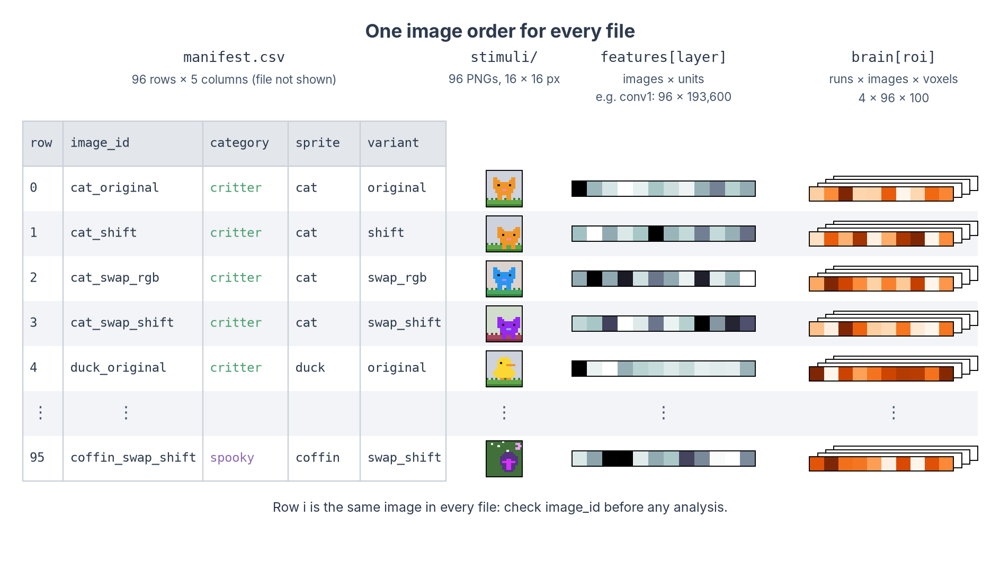
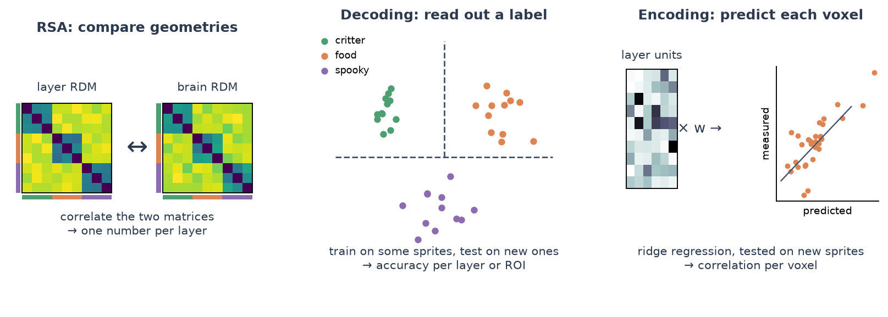
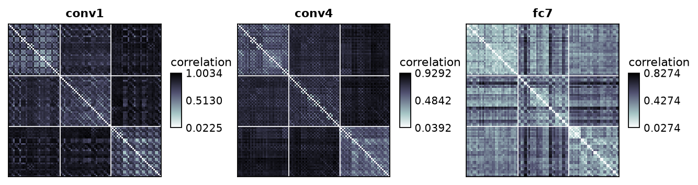
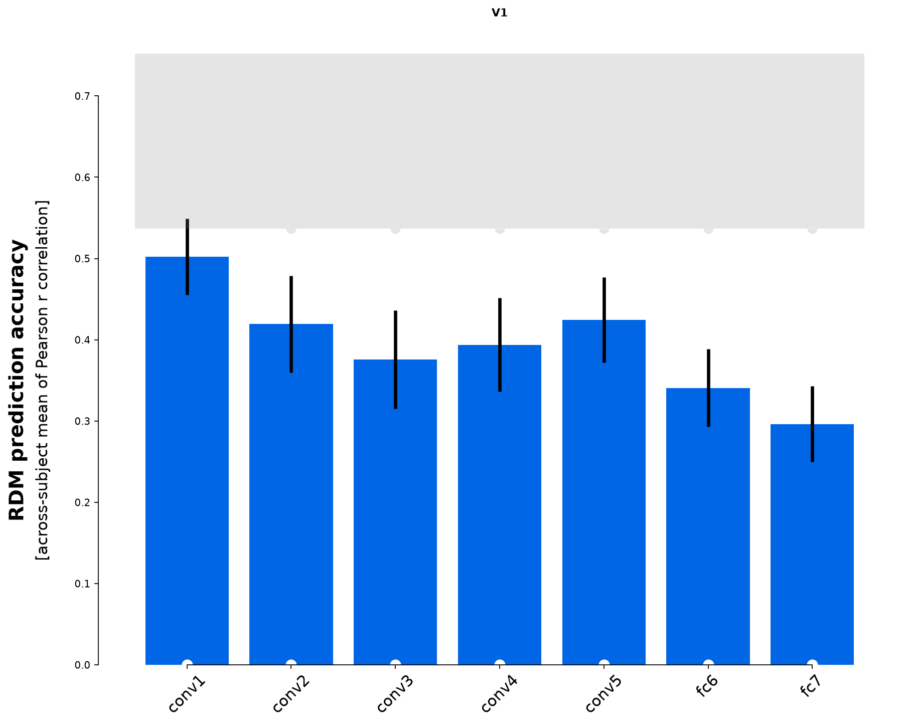
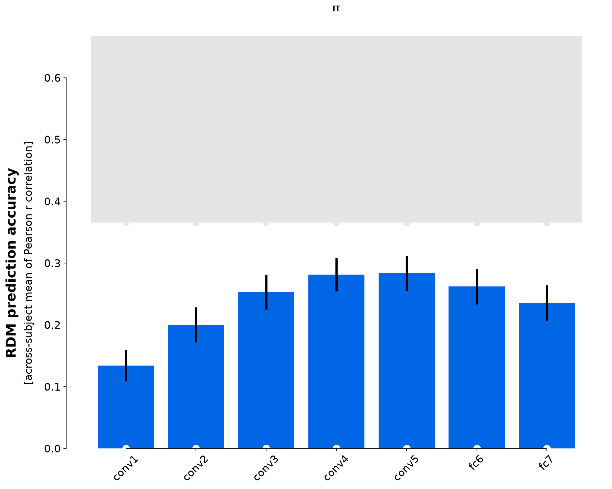
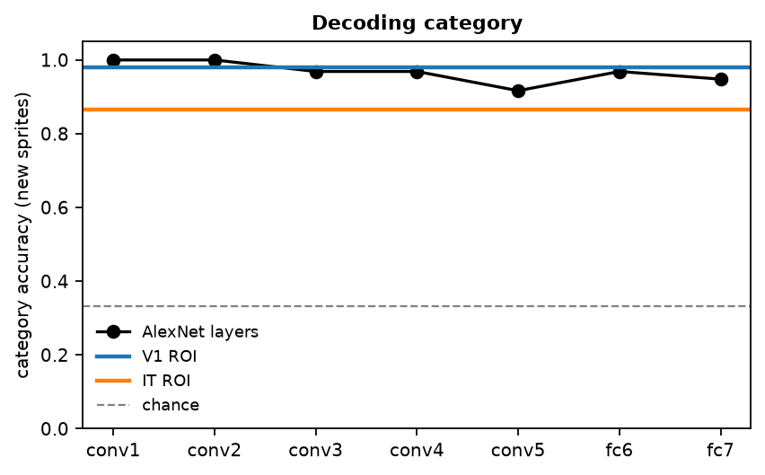
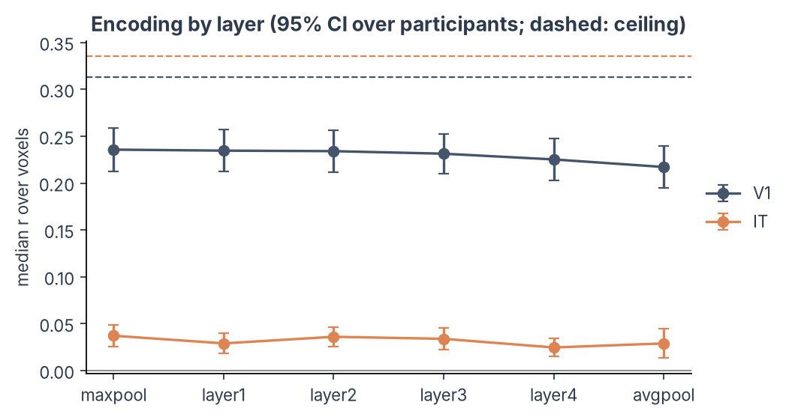

# Compare with human data

!!! abstract "On this page"
    - **You need:** network activations saved with their image order ([Extract activations](dnn-extract.md)) and human data for the same images: brain patterns or behaviour.
    - **You get:** three ways to ask which layers resemble which brain regions or behaviours: RSA with [rsatoolbox](https://rsatoolbox.readthedocs.io/), decoding with [scikit-learn](https://scikit-learn.org/), and encoding models with [himalaya](https://gallantlab.org/himalaya/), each read against a noise ceiling or chance level.

!!! warning "The human side comes first"
    These analyses start from human data that are already estimated: one response pattern per image (and per run, if you have several). Any measure recorded for the same images works:

    - **fMRI:** the GLM betas of the voxels in each ROI, for example from the [fMRI analysis workflow](../fmri/analysis/index.md) ([Bracci et al., 2019](https://doi.org/10.1523/JNEUROSCI.1714-18.2019); [Ritchie et al., 2021](https://doi.org/10.1523/JNEUROSCI.2628-20.2021)).
    - **EEG or MEG:** the pattern across sensors at each time point after the image appears, which gives one RDM per time point ([Cichy et al., 2016](https://doi.org/10.1038/srep27755)).
    - **Intracranial recordings:** the firing rate or high-gamma power at each electrode.
    - **Behaviour:** an RDM straight from similarity judgements or arrangements ([Kubilius et al., 2016](https://doi.org/10.1371/journal.pcbi.1004896)), or the network's choices next to people's, such as which categories they confuse ([Maniquet et al., 2025](https://doi.org/10.1038/s41598-025-20245-w)).

    The code on this page uses ROI patterns; for other data, the voxels become sensors, electrodes or the cells of a behavioural RDM. In the toy kit these patterns are synthetic. The `V1` ROI was built from the brightness, colours and edges in small patches of each image, the `IT` ROI from category and sprite identity (see [Set up and pick a model](dnn-setup.md#2-get-the-toy-kit)), so we know the right answer in advance.

---

## Load and line up the data

The activations from [Extract activations](dnn-extract.md) and the brain data from the toy kit list the images in the same order as the manifest:



```python
from pathlib import Path

import matplotlib.pyplot as plt
import numpy as np
import pandas as pd

KIT = Path("dnn-toy-kit")
manifest = pd.read_csv(KIT / "manifest.csv")  # the image order
# One array per ROI: runs x images x voxels
brain = np.load(KIT / "brain" / "roi_betas.npz")
# one array per layer: images x features (from Extract activations)
dnn = np.load("alexnet_features.npz")

assert (brain["image_id"] == manifest["image_id"]).all()  # (1)!
assert (dnn["image_id"] == manifest["image_id"]).all()

layers = ["conv1", "conv2", "conv3", "conv4", "conv5", "fc6", "fc7"]
rois = ["V1", "IT"]
print({roi: brain[roi].shape for roi in rois})  # runs x images x voxels
```

1. Stop here if the rows of the network and human data are not the same images in the same order. A silent mismatch gives results that look plausible and mean nothing.

??? tip "Load your own brain data from an SPM GLM"
    With real data, rsatoolbox reads the betas straight from an SPM first-level folder into the same layout. Install its imaging extras first (`pip install "rsatoolbox[imaging]"`). The code assumes the standard case: one GLM per participant, one regressor per image named after its `image_id`, and every image in every run.

    <!-- doctest: skip -->
    ```python
    from rsatoolbox.io.spm import SpmGlm
    
    glm = SpmGlm("derivatives/spm/sub-01")  # (1)!
    glm.get_info_from_spm_mat()
    betas, resms, info = glm.get_betas("rois/sub-01_IT.nii")  # (2)!
    keep = ~np.isnan(betas).any(axis=0)  # (3)!
    betas = betas[:, keep] / np.sqrt(resms[keep])  # (4)!
    
    names = np.char.replace(info["reg_name"].astype(str), "*bf(1)", "")  # (5)!
    run_of_row = info["run_number"]  # the run each beta comes from
    # For every run, take the beta of each image in manifest order
    it_betas = np.stack([
        np.stack([betas[(names == image) & (run_of_row == run)][0] for image in manifest["image_id"]])
        for run in np.unique(run_of_row)
    ])  # runs x images x voxels, in manifest order
    ```

    1. The participant's first-level folder, with `SPM.mat` and the `beta_*.nii` images.
    2. An ROI mask on the same grid as the betas. You get one row per regressor of interest and one column per voxel, the residual variance of each voxel (`resms`), and the name and run of each regressor.
    3. Voxels outside SPM's analysis mask have no betas; drop them.
    4. Dividing each voxel's betas by its residual standard deviation (univariate noise normalisation, as in rsatoolbox's SPM demo) gives noisy voxels less weight.
    5. SPM names a regressor `Sn(1) cat_original*bf(1)`. The reader keeps `cat_original*bf(1)`; this removes the basis-function suffix so the names match `image_id`.

    Repeat for each ROI to build the `brain` dictionary used on this page.

---

## Which method answers which question?



| Method | Question | Output |
|---|---|---|
| **RSA** | Does the layer treat the same images as similar and different as the ROI does? | Correlation between two dissimilarity matrices |
| **Decoding** | Is a property of the images (here: category) linearly readable from the layer, and from the ROI? | Cross-validated accuracy |
| **Encoding model** | Can a weighted sum of layer units predict each voxel's response to new images? | Correlation between predicted and measured responses |

=== "RSA"

    Representational similarity analysis compares *geometries*. For each layer and each ROI we compute a representational dissimilarity matrix (RDM): how different the patterns of every pair of images are. Then we compare the RDMs. The standard choice, used here, is Pearson at both steps: 1 − Pearson r between patterns as the dissimilarity, and Pearson r between RDMs as the comparison.

    In rsatoolbox, every set of patterns is a `Dataset`, and `calc_rdm` turns a list of them into one `RDMs` object:

    ```python
    import rsatoolbox
    from rsatoolbox.data import Dataset
    from rsatoolbox.rdm import calc_rdm
    
    # Labels for every image; rsatoolbox keeps them with the patterns and the RDMs
    image_info = {"category": manifest["category"].to_numpy(), "sprite": manifest["sprite"].to_numpy()}
    # One RDM per layer: how different the layer's patterns are for every pair of images
    layer_rdms = calc_rdm(
        [Dataset(dnn[layer], descriptors={"layer": layer}, obs_descriptors=image_info) for layer in layers],
        method="correlation",  # (1)!
    )
    
    n_runs, n_images = brain["IT"].shape[:2]  # the same for every ROI; voxel counts differ
    roi_data = {
        roi: Dataset(
            brain[roi].reshape(n_runs * n_images, -1),  # (2)!
            obs_descriptors={
                # 0, 1, ..., 95, 0, 1, ... (image of each row)
                "image": np.tile(np.arange(n_images), n_runs),
                # 0, 0, ..., 1, 1, ... (run of each row)
                "run": np.repeat(np.arange(n_runs), n_images),
                "sprite": np.tile(image_info["sprite"], n_runs),
            },
        )
        for roi in rois
    }
    brain_rdms = {roi: calc_rdm(data.split_obs("run"), method="correlation") for roi, data in roi_data.items()}  # (3)!
    print(layer_rdms.n_rdm, "layer RDMs over", layer_rdms.n_cond, "images")
    ```

    1. `"correlation"` is 1 − Pearson r. The rows stay in manifest order because we give one pattern per image and no `descriptor` to average over; with a `descriptor`, rsatoolbox sorts the images by its values.
    2. One `Dataset` per ROI holds every run, one row per image and run. The descriptors say which image and run each row is; the crossnobis box below uses the same object.
    3. One RDM per run. rsatoolbox treats them as repeated measurements: their spread gives the noise ceiling below. With several participants, use one RDM per participant instead.

    Each layer becomes a fixed model, and rsatoolbox evaluates all of them against the brain RDMs. `eval_bootstrap_pattern` resamples the sprites, so its error bars tell you how much the result depends on the particular objects you chose:

    ```python
    # Each layer's RDM becomes a "fixed model": a prediction with nothing to fit
    models = [rsatoolbox.model.ModelFixed(layer, layer_rdms.subset("layer", layer)) for layer in layers]
    
    # The bootstrap draws random samples; a fixed seed gives the same numbers on every run
    np.random.seed(0)
    results = {}
    for roi in rois:
        results[roi] = rsatoolbox.inference.eval_bootstrap_pattern(
            models, brain_rdms[roi], method="corr", pattern_descriptor="sprite"  # (1)!
        )
        print(roi)
        print(results[roi])  # mean correlation per layer, its standard error and the tests
    ```

    1. `method="corr"` is the Pearson correlation between RDMs. `pattern_descriptor="sprite"` resamples whole sprites with all four of their versions, because versions of one sprite are not independent images. The result holds the score of every model in every bootstrap sample, the noise ceiling, and tests against zero, against the ceiling and between models.

    ??? example "Plot the RDMs and the model comparison"

        ```python
        with plt.rc_context():  # (1)!
            rsatoolbox.vis.show_rdm(
                layer_rdms.subset("layer", ["conv1", "conv4", "fc7"]),
                rdm_descriptor="layer",
                gridlines=[32, 64],  # (2)!
                n_row=1,
                figsize=(10, 3.4),
                show_colorbar="panel",
            )
            plt.show()
        
            for roi in rois:
                rsatoolbox.vis.plot_model_comparison(results[roi], sort=False, test_pair_comparisons=False)  # (3)!
                plt.title(roi)
                plt.show()
        ```

        1. rsatoolbox changes some global plot settings; `rc_context` restores them afterwards.
        2. The images are sorted by category, 32 per category, so these lines mark the critter, food and spooky blocks.
        3. Bars are the mean correlation with the brain RDMs and error bars the bootstrap standard error. The grey band is the noise ceiling: its lower edge is how well the average RDM of the other runs predicts each run, its upper edge how well the average of all runs does. A layer inside the band is as good as the data allow. Set `test_pair_comparisons=True` to draw which layers differ significantly; the tests themselves are in the printed results.

    

    { width="49%" } { width="49%" }

    The V1-like ROI is matched best by the early layers (conv1, r = 0.483; conv2, 0.468) and less by the later ones (fc7, 0.296). The IT-like ROI, which ignores where the sprite sits and its colours, shows the opposite profile: it is matched poorly by conv1 (0.134) and best by the deeper layers (conv5, 0.284). conv1 is not significantly below the noise ceiling of the V1-like ROI; every other layer falls below the ceiling of both ROIs. With crossnobis distances (box below), the IT profile has the same shape, highest at conv5.

    ??? info "Other dissimilarities and comparisons, and when to use them"
        **Dissimilarity between two patterns** (`method` of `calc_rdm`):

        | Measure | Use it when |
        |---|---|
        | **1 − Pearson r** (`"correlation"`, used above) | Comparing very different systems, such as layers and voxels. It ignores the mean and the scale of each pattern. |
        | **Euclidean** (`"euclidean"`) | The overall response level carries information you want to keep. |
        | **Mahalanobis** (`"mahalanobis"`) | Brain data with correlated, unequally noisy voxels: Euclidean distance after whitening with the noise covariance. |
        | **Crossnobis** (`"crossnobis"`) | Brain data with several runs. Mahalanobis distance cross-validated across runs, so noise does not inflate it: its expected value is 0 when two images evoke the same pattern. Recommended for fMRI ([Walther et al., 2016](https://doi.org/10.1016/j.neuroimage.2015.12.012)) and MEG ([Guggenmos et al., 2018](https://doi.org/10.1016/j.neuroimage.2018.02.044)); see the box below. |

        **Comparison between two RDMs** (`method` of `compare` and of the `eval_*` functions):

        | Measure | Use it when |
        |---|---|
        | **Pearson r** (`"corr"`, used above) | Dissimilarities of the two RDMs can be expected to relate linearly. |
        | **Spearman ρ** (`"spearman"`) | Only the rank order is trusted, for example model and brain distances on very different scales. |
        | **ρ<sub>A</sub> or Kendall τ<sub>A</sub>** (`"rho-a"`, `"tau-a"`) | One RDM has many ties, such as a categorical model ("same vs different category"). Kendall's τ<sub>A</sub> does not reward a model for predicting ties ([Nili et al., 2014](https://doi.org/10.1371/journal.pcbi.1003553)); ρ<sub>A</sub> has the same property, is faster, and is what the [rsatoolbox documentation](https://rsatoolbox.readthedocs.io/en/latest/comparing.html) now recommends. |
        | **Cosine and whitened cosine** (`"cosine"`, `"cosine_cov"`) | Crossnobis RDMs, where 0 means "no difference". The whitened version accounts for the dependencies between RDM entries and is the most sensitive choice there ([Diedrichsen et al., 2021](https://doi.org/10.51628/001c.27664)). |

    !!! tip "Recommended for real data: crossnobis distances"
        Correlation distances computed from noisy patterns are biased: noise makes every pair of images look more different than it is, and more so in noisier ROIs or participants. Crossnobis removes this bias by computing each distance from two independent runs, and whitens the voxels with the noise covariance. It needs at least two runs (the toy kit has four):

        ```python
        from rsatoolbox.data.noise import prec_from_measurements
        
        it_data = roi_data["IT"]  # all runs of the IT ROI, from the RSA code above
        noise_precision = prec_from_measurements(it_data, obs_desc="image", method="shrinkage_diag")  # (1)!
        it_crossnobis = calc_rdm(
            it_data, method="crossnobis", descriptor="image", cv_descriptor="run", noise=noise_precision  # (2)!
        )
        crossnobis_fit = rsatoolbox.rdm.compare(layer_rdms, it_crossnobis, method="cosine_cov")  # (3)!
        # One similarity per layer
        print(pd.Series(crossnobis_fit.ravel(), index=layers).round(2))
        ```

        1. The noise covariance between voxels, estimated from how each image's pattern varies from run to run, and shrunk towards its diagonal for stability. With real data you can estimate it from the GLM residuals instead, with `prec_from_residuals(residuals, dof=glm.eff_df)`. The SPM reader above computes the residuals with `glm.get_residuals(mask)`, but only if the preprocessed time series the GLM was fitted on are still on disk, in a `func` folder next to the GLM folder.
        2. rsatoolbox averages and sorts the patterns by `descriptor`. The image descriptor holds integer positions, so the sorted order is the manifest order and the RDM lines up with the layer RDMs.
        3. The whitened cosine similarity. Plain cosine gives every layer a high score here, because all distances are positive; the whitened version separates the layers much better.

=== "Decoding"

    Decoding asks whether a property of the images can be read out with a linear classifier, and compares where it can be read in the network and in the brain. We train on some sprites and test on others, so the classifier must generalise to new objects.

    ```python
    from sklearn.model_selection import StratifiedGroupKFold, cross_val_score
    from sklearn.pipeline import make_pipeline
    from sklearn.preprocessing import StandardScaler
    from sklearn.svm import SVC
    
    y = manifest["category"]  # what we decode: critter, food or spooky
    sprites = manifest["sprite"].to_numpy()  # (1)!
    # Four folds: every sprite is tested once, with all its versions
    cv = StratifiedGroupKFold(n_splits=4, shuffle=True, random_state=0)
    classifier = make_pipeline(StandardScaler(), SVC(kernel="linear"))  # (2)!
    # Or shrinkage LDA (see the note below):
    # from sklearn.decomposition import PCA
    # from sklearn.discriminant_analysis import LinearDiscriminantAnalysis
    # classifier = make_pipeline(StandardScaler(), PCA(n_components=50),
    #                            LinearDiscriminantAnalysis(solver="lsqr", shrinkage="auto"))
    
    
    def decode(X):
        """Mean accuracy over the four folds, always tested on sprites the classifier has not seen."""
        return cross_val_score(classifier, X, y, groups=sprites, cv=cv).mean()
    
    
    # One accuracy per layer
    decoding = pd.Series({layer: decode(dnn[layer]) for layer in layers})
    # Average over runs first
    brain_decoding = pd.Series({roi: decode(brain[roi].mean(axis=0)) for roi in rois})
    print(decoding.round(2))
    print(brain_decoding.round(2))
    ```

    1. All variants of a sprite stay in the same fold. Otherwise the classifier could recognise the shifted cat from the training set instead of learning what a critter is.
    2. A linear support vector machine, a common choice in MVPA. The scaler is part of the pipeline, so it is fitted on the training folds only: scaling all data before cross-validation leaks information from the test set. Shrinkage LDA, the commented alternative, is often preferred for brain data: it has no setting to tune (the shrinkage is estimated from the data, while the SVM's `C` is a choice), it takes the noise correlations between voxels into account, and it is fast, which helps when you repeat the decoding many times for a permutation test. It estimates a features × features covariance, so with thousands of network units reduce them first, as the PCA step does, inside the pipeline so that it is fitted on the training folds only.

    ??? example "Plot decoding by layer"

        ```python
        fig, ax = plt.subplots(figsize=(6, 3.5))
        ax.plot(layers, decoding, "o-", color="k", label="AlexNet layers")
        for roi, color in zip(rois, ["tab:blue", "tab:orange"]):
            ax.axhline(brain_decoding[roi], color=color, lw=2, label=f"{roi} ROI")
        ax.axhline(1 / 3, color="grey", ls="--", lw=1, label="chance")
        ax.set(ylim=(0, 1.05), ylabel="category accuracy (new sprites)", title="Decoding category")
        ax.legend(frameon=False, fontsize=8)
        plt.show()
        ```

    

    Category is readable almost everywhere: from every AlexNet layer (92 to 100% correct on new sprites, chance 33%), from the V1-like ROI (98%) and from the IT-like ROI (86%). The reason is the scenes: grass, plates and night skies make the categories visible in the pixels themselves, so even the first layer and V1 can read them. Decoding tells you that the information is there, not what kind of feature carries it. To ask whether a layer represents the objects rather than their backgrounds, you would test on images that change the background, or compare the profiles with RSA and encoding.

    ??? tip "Testing against chance"
        Chance is 1/3 here, and the plot marks it. To claim that an accuracy is *above* chance, though, you need a test: with few test images, a classifier that learned nothing still scatters widely around 33% ([Combrisson & Jerbi, 2015](https://doi.org/10.1016/j.jneumeth.2015.01.010)), and a binomial test does not apply because the four versions of a sprite are not independent. Use a permutation test: give the sprites random categories (all versions of a sprite the same one), rerun the same folds many times, and compare the real accuracy with that distribution. scikit-learn's `permutation_test_score` does not do this when you pass the sprite groups, because it then shuffles the labels only within each sprite. With the toy kit every accuracy is far above chance, so the test only matters for real data.

=== "Encoding model"

    An encoding model predicts each voxel's response from the layer's units with ridge regression. [himalaya](https://gallantlab.org/himalaya/) fits one model per voxel, each with its own regularisation, and runs on CPU or GPU. With more features than images, its `KernelRidgeCV` is the fast choice.

    ```python
    from himalaya.backend import set_backend
    from himalaya.kernel_ridge import KernelRidgeCV
    from himalaya.scoring import correlation_score
    from sklearn.model_selection import GroupKFold
    
    backend = set_backend("torch_cuda", on_error="warn")  # (1)!
    dtype = "float32" if backend.name == "torch_cuda" else "float64"
    alphas = np.logspace(1, 20, 20)  # regularisation strengths to try, from 10 to 10^20
    
    
    def encoding_score(X, Y):
        """Correlation between predicted and measured responses of each voxel, for held-out sprites."""
        X, Y = X.astype(dtype), Y.astype(dtype)
        fold_scores = []
        for train, test in cv.split(X, y, groups=sprites):  # (2)!
            inner_cv = list(GroupKFold(n_splits=3).split(X[train], groups=sprites[train]))  # (3)!
            model = make_pipeline(
                # Centre each feature on the training sprites
                StandardScaler(with_std=False),
                # One ridge model per voxel
                KernelRidgeCV(alphas=alphas, cv=inner_cv, fit_intercept=True),
            )
            model.fit(X[train], Y[train])  # learn the weights on the training sprites only
            fold_scores.append(backend.to_numpy(correlation_score(Y[test], model.predict(X[test]))))  # (4)!
        return np.mean(fold_scores, axis=0)
    
    
    # Mean score over voxels, per layer and ROI (responses averaged over runs)
    encoding = pd.DataFrame(
        {roi: [encoding_score(dnn[layer], brain[roi].mean(axis=0)).mean() for layer in layers] for roi in rois},
        index=layers,
    )
    print(encoding.round(2))
    ```

    1. himalaya runs on the GPU when PyTorch finds one and falls back to NumPy otherwise, with a warning, as in the [voxelwise tutorials](https://github.com/gallantlab/voxelwise_tutorials). The GPU wants 32-bit numbers; on the CPU we keep 64-bit ones, which change the scores less.
    2. The same folds as for decoding, so both analyses are tested on the same held-out sprites.
    3. The regularisation strength of each voxel is chosen on the training sprites only, with the same grouping. himalaya cannot take the groups itself, so we give it the inner splits as a list.
    4. Score each test fold on its own and average. Pooling the predictions of all folds before correlating can produce spurious negative scores for voxels the model cannot predict.

    The ceiling for an encoding model comes from the share of each voxel's variance that repeats across runs, the *explainable variance* ([voxelwise tutorials](https://github.com/gallantlab/voxelwise_tutorials)). For a single run, its square root approximates the highest correlation a perfect model could reach. We predict the mean over runs, which is less noisy than one run, so its ceiling is higher:

    ```python
    def explainable_variance(runs):
        """Share of each voxel's variance that repeats across runs (runs x images x voxels).
    
        Same computation as explainable_variance in the voxelwise tutorials (voxelwise_tutorials.utils).
        """
        # Z-score each run
        runs = (runs - runs.mean(axis=1, keepdims=True)) / runs.std(axis=1, keepdims=True)
        n_runs = runs.shape[0]
        ev = runs.mean(axis=0).var(axis=0, ddof=1) / runs.var(axis=1, ddof=1).mean(axis=0)
        return ev - (1 - ev) / (n_runs - 1)  # (1)!
    
    
    def noise_ceiling(runs):
        """Best correlation a perfect model could reach with each voxel's mean over runs."""
        ev = explainable_variance(runs).clip(0)  # share of one run's variance that repeats
        n_runs = runs.shape[0]
        return np.sqrt(n_runs * ev / (1 + (n_runs - 1) * ev))  # (2)!
    
    
    encoding_ceiling = {roi: noise_ceiling(brain[roi]).mean() for roi in rois}
    print({roi: round(c, 2) for roi, c in encoding_ceiling.items()})
    ```

    1. A correction for the small number of runs; without it, noise alone would look partly explainable.
    2. The Spearman-Brown formula: how reliable the mean of several runs is, given how reliable one run is. Its square root is the highest correlation a perfect model can reach with that mean.

    ??? example "Plot the encoding performance by layer"

        ```python
        fig, ax = plt.subplots(figsize=(6, 3.5))
        for roi, color in zip(rois, ["tab:blue", "tab:orange"]):
            ax.plot(layers, encoding[roi], "o-", color=color, label=f"{roi}")
            ax.axhline(encoding_ceiling[roi], color=color, ls="--", lw=1)
        ax.axhline(0, color="grey", lw=0.8)
        ax.set(ylabel="r (predicted vs measured)", title="Encoding model by layer (dashed: noise ceiling)")
        ax.legend(frameon=False)
        plt.show()
        ```

    

    conv1 predicts the V1-like voxels best (r = 0.61, against a ceiling of 0.73), and later layers less well (fc7, 0.50). Every layer predicts the IT-like voxels only weakly (r = 0.11 to 0.12, against a ceiling of 0.69). That is by design: the category part of the IT signal is predictable, because every layer sees the scenes, but most of the IT signal in the kit is a random pattern for each sprite, which no model can predict for a sprite it has not seen. RSA still finds IT structure in the deeper layers because it also compares the four variants of each sprite with one another, and those share the sprite's pattern.

---

## Which layer to compare

A network has many layers, and which one you compare with a brain region changes the result. The references give the evidence behind each heuristic.

**Record a spread of layers, and name them.** Take the output of whole modules at five to eight depths (for a ResNet, the output of each block, not the steps inside it), and always include the last layer before the classifier ([Schrimpf et al., 2018](https://doi.org/10.1101/407007)). That last layer is the usual choice for abstract or high-level questions, but results can differ for earlier layers ([Muttenthaler & Hebart, 2021](https://doi.org/10.3389/fninf.2021.679838)). Whether to take a layer before or after its ReLU, or, in a vision transformer, the class token or the average over tokens, has no settled answer: pick one, say which in your methods, and treat it like any other layer choice.

**Expect a profile across layers, and report all of it.** Early layers tend to match early visual cortex and later layers higher ventral areas, in fMRI, MEG and single neurons ([Yamins et al., 2014](https://doi.org/10.1073/pnas.1403112111); [Khaligh-Razavi & Kriegeskorte, 2014](https://doi.org/10.1371/journal.pcbi.1003915); [Güçlü & van Gerven, 2015](https://doi.org/10.1523/JNEUROSCI.5023-14.2015); [Cichy et al., 2016](https://doi.org/10.1038/srep27755); [Eickenberg et al., 2017](https://doi.org/10.1016/j.neuroimage.2016.10.001); [Zeman et al., 2020](https://doi.org/10.1038/s41598-020-59175-0); [Ritchie et al., 2021](https://doi.org/10.1523/JNEUROSCI.2628-20.2021)). The profile can reach beyond the ventral stream: in [Bracci et al. (2023)](https://doi.org/10.1371/journal.pcbi.1011086), the ventral temporal cortex matched mid-level layers best, while the final layers also captured the object-scene associations found in frontoparietal cortex. The match is not strictly ordered: in Khaligh-Razavi & Kriegeskorte (2014), early visual cortex was matched best by AlexNet's second and third layers, not its first, and recordings from human lateral occipital cortex matched intermediate layers of VGG-19 and ResNet-50 best ([Bougou et al., 2024](https://doi.org/10.1038/s41467-024-49078-3)). The toy kit's synthetic ROIs are built to show the textbook pattern.

**Choose a single best layer only on independent data.** Picking the best of seven layers and reporting its score on the same data inflates that score: it is double dipping ([Kriegeskorte et al., 2009](https://doi.org/10.1038/nn.2303)). Either report every layer, fix the layer in advance, or choose it on separate images, runs or participants, for example with nested cross-validation, and test it on the rest. [Conwell et al. (2024)](https://doi.org/10.1038/s41467-024-53147-y) choose each model's layer on 500 images and report its score on 500 others. When you compare models, compare each at its cross-validated best layer, and always next to the noise ceiling ([Nili et al., 2014](https://doi.org/10.1371/journal.pcbi.1003553)).

=== "RSA"

    Report the plain RSA of each layer first, as on this page: every unit counts the same. Reweighting the units, or combining layers with fitted weights, often fits the brain much better ([Khaligh-Razavi et al., 2017](https://doi.org/10.1016/j.jmp.2016.10.007); [Storrs et al., 2021](https://doi.org/10.1162/jocn_a_01755); [Kaniuth & Hebart, 2022](https://doi.org/10.1016/j.neuroimage.2022.119294)), but it is a fitted model: fit the weights on some images and participants and test on others. Reweighting can change which model comes out best (Kaniuth & Hebart, 2022), and reweighted fits can even exceed the usual noise ceiling, which then needs to be computed differently (Kaniuth & Hebart, 2022). [Conwell et al. (2024)](https://doi.org/10.1038/s41467-024-53147-y) report both kinds of RSA and caution that standard mapping methods "may be too flexible". Treat the plain and the reweighted analysis as two separate questions.

=== "Decoding"

    Categories become easier to read out linearly the deeper you go in a trained network ([Alain & Bengio, 2016](https://arxiv.org/abs/1610.01644)), as along the ventral stream ([DiCarlo et al., 2012](https://doi.org/10.1016/j.neuron.2012.01.010)). Near-perfect decoding from the last layers is therefore expected and says little on its own. Decoding shows that the information is there in a readable form, not that the brain, or the network, uses it ([Hebart & Baker, 2018](https://doi.org/10.1016/j.neuroimage.2017.08.005); [Kriegeskorte & Douglas, 2019](https://doi.org/10.1016/j.conb.2019.04.002)). Decode from every layer and compare the shape of that profile with the brain's. [Mattioni et al. (2025)](https://doi.org/10.1038/s41467-025-65468-7) did this for people treated for dense bilateral cataracts at birth, repeating their fMRI category decoding on AlexNets trained or tested on blurred images.

=== "Encoding"

    Layers differ enormously in size: the first layer of VGG16 has about 3.2 million numbers per image. More features give the ridge regression more freedom, so equalise the layers before you compare them. (A separate effect, whatever the number of units: layers whose representations have a higher effective dimensionality tend to predict held-out responses better; [Elmoznino & Bonner, 2024](https://doi.org/10.1371/journal.pcbi.1011792).) Pool the feature maps (as the extract page does), project every layer onto the same number of dimensions with a random projection ([Conwell et al., 2024](https://doi.org/10.1038/s41467-024-53147-y)), or reduce it with a PCA fitted on separate images ([Schrimpf et al., 2018](https://doi.org/10.1101/407007)). To combine layers in one model, give each its own regularisation with banded ridge regression (`BandedRidgeCV` in himalaya; [Nunez-Elizalde et al., 2019](https://doi.org/10.1016/j.neuroimage.2019.04.012); [Dupré la Tour et al., 2022](https://doi.org/10.1016/j.neuroimage.2022.119728)) and split the explained variance between layers: it can be largely shared, so the layer that predicts best may add little of its own ([Lescroart et al., 2015](https://doi.org/10.3389/fncom.2015.00135)).

**A recipe.**

1. Record five to eight layers spread over the network, including the last one before the classifier, and name the modules in your methods.
2. Report every layer, with the noise ceiling.
3. If you need one layer, choose it on independent data or fix it in advance.
4. For encoding, equalise the number of features across layers; to combine layers, use banded ridge.
5. Read high decoding from late layers as expected, and compare profiles rather than single numbers.

---

## Good practice

??? tip "Statistics across participants and images"
    The toy kit has one "participant", so the runs stood in for repeated measurements. In a real study, compute one RDM (or one encoding score) per participant. rsatoolbox's `eval_fixed` then generalises over participants, `eval_bootstrap_pattern` over images, and `eval_dual_bootstrap` over both; the [inference documentation](https://rsatoolbox.readthedocs.io/en/latest/inference.html) explains when to use which.

??? tip "Choosing a layer"
    If you pick the best layer on the same data you report, its score is inflated. Report the full layer profile, or choose the layer on independent data; see [Which layer to compare](#which-layer-to-compare).

??? info "Does training on the sprites change the picture?"
    The pretrained AlexNet never learned our three categories; its layers separate them only through the scenes. Run [Extract activations](dnn-extract.md) on the AlexNet you [trained on the sprites](dnn-train.md#2-fine-tune-alexnet-on-them), then rerun this page with its features. Use only sprites that were held out during training, or the comparison is circular: the IT-like ROI was built from the same category labels the network was trained on.

---

## Further reading

- The [rsatoolbox](https://rsatoolbox.readthedocs.io/), [himalaya](https://gallantlab.org/himalaya/) and [thingsvision](https://vicco-group.github.io/thingsvision/) documentation, and the [voxelwise encoding tutorials](https://github.com/gallantlab/voxelwise_tutorials).
- Kriegeskorte, Mur & Bandettini (2008). [Representational similarity analysis: connecting the branches of systems neuroscience](https://doi.org/10.3389/neuro.06.004.2008). *Frontiers in Systems Neuroscience*.
- Naselaris, Kay, Nishimoto & Gallant (2011). [Encoding and decoding in fMRI](https://doi.org/10.1016/j.neuroimage.2010.07.073). *NeuroImage*.
- The [Brain-Score](http://brain-score.org) benchmarks compare many models with neural and behavioural data.
- Our [fMRI MVPA page](../fmri/analysis/fmri-mvpa.md) shows decoding and RSA on brain data with CoSMoMVPA in MATLAB.
