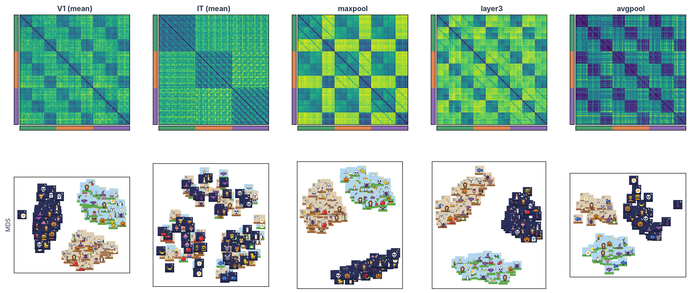
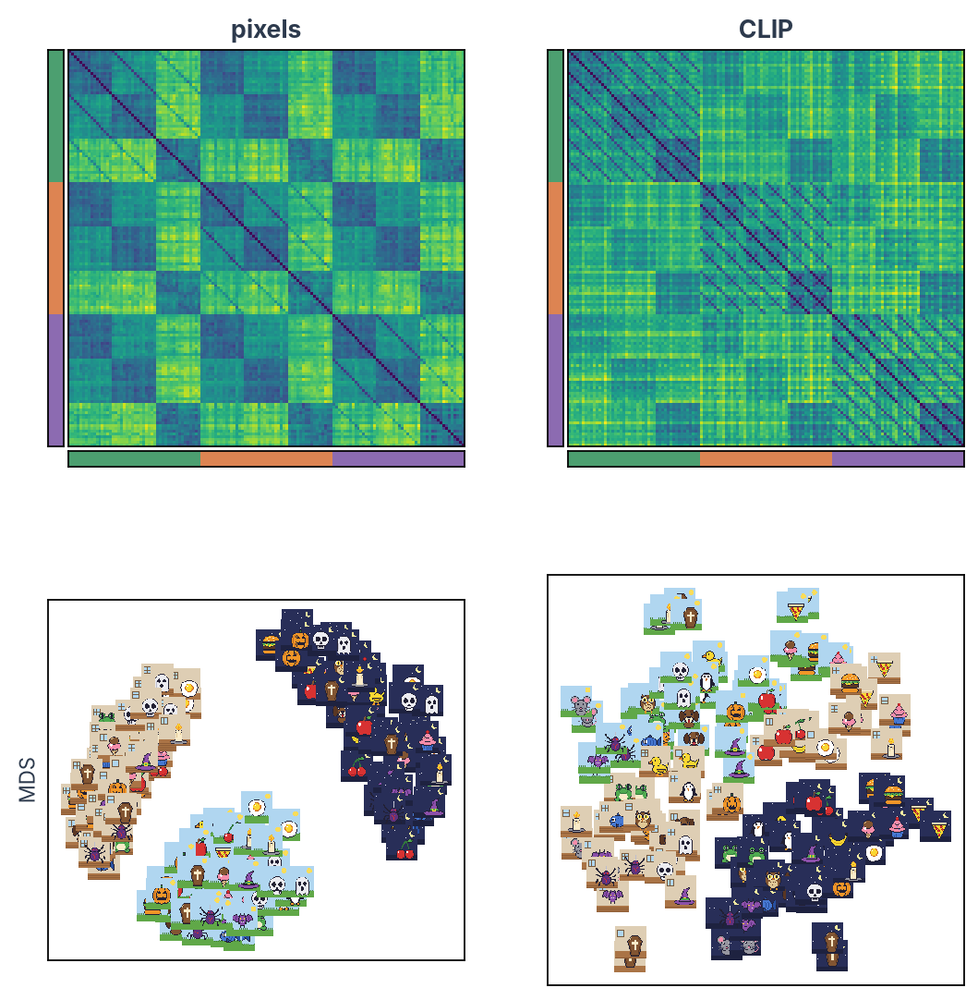

# Compare with human data

!!! abstract "On this page"
    - **You need:** network activations saved with their image order ([Extract activations](dnn-extract.md)) and human data for the same images (brain patterns or behaviour), from several participants.
    - **You get:** three ways to ask which layers resemble which brain regions or behaviours: RSA with [rsatoolbox](https://rsatoolbox.readthedocs.io/), decoding with [scikit-learn](https://scikit-learn.org/), and encoding models with [himalaya](https://gallantlab.org/himalaya/), each with statistics over participants and read against a noise ceiling or chance level.

!!! warning "The human side comes first"
    These analyses start from human data that are already estimated, with one response pattern per image (and per run, if you have several). Any measure recorded for the same images will do.

    - **fMRI:** the GLM betas of the voxels in each ROI, for example from the [fMRI analysis workflow](../fmri/analysis/index.md) ([Bracci et al., 2019](https://doi.org/10.1523/JNEUROSCI.1714-18.2019); [Ritchie et al., 2021](https://doi.org/10.1523/JNEUROSCI.2628-20.2021)).
    - **EEG or MEG:** the pattern across sensors at each time point after the image appears, which gives one RDM per time point ([Cichy et al., 2016](https://doi.org/10.1038/srep27755)).
    - **Intracranial recordings:** the firing rate or high-gamma power at each electrode.
    - **Behaviour:** an RDM taken directly from similarity judgements or arrangements ([Kubilius et al., 2016](https://doi.org/10.1371/journal.pcbi.1004896)), or a comparison of the network's choices with people's, such as the categories they confuse ([Maniquet et al., 2025](https://doi.org/10.1038/s41598-025-20245-w)).

    The code on this page uses ROI patterns. With other data, the voxels become sensors, electrodes or the cells of a behavioural RDM. In the toy kit, the patterns are simulated for ten participants with six runs each (see [Set up and pick a model](dnn-setup.md#2-get-the-toy-kit)).

---

## Load and line up the data

The activations from [Extract activations](dnn-extract.md) and each participant's brain data list the images in the same order as the manifest:


```python
from pathlib import Path

import matplotlib.pyplot as plt
import numpy as np
import pandas as pd

KIT = Path("dnn-toy-kit")
manifest = pd.read_csv(KIT / "manifest.csv")  # the image order
# One array per layer: images x features (from Extract activations)
dnn = np.load("resnet50_features.npz")
assert (dnn["image_id"] == manifest["image_id"]).all()  # (1)!

layers = ["maxpool", "layer1", "layer2", "layer3", "layer4", "avgpool"]
rois = ["V1", "IT"]
sprites = manifest["sprite"].to_numpy()

# One file per participant, with one array per ROI: runs x images x voxels
brain = {}
for path in sorted((KIT / "brain").glob("sub-*.npz")):
    data = np.load(path)
    assert (data["image_id"] == manifest["image_id"]).all()
    brain[path.stem] = {roi: data[roi].astype(float) for roi in rois}  # (2)!
participants = list(brain)
print(len(participants), "participants:", {roi: brain["sub-01"][roi].shape for roi in rois})
```

1. Stop here if the rows of the network and human data are not the same images in the same order. A silent mismatch gives results that look plausible and mean nothing.
2. The kit stores the patterns as 32-bit numbers to keep the download small. We convert them to 64-bit numbers for the analyses.

??? example "Output"

    ```text
    10 participants: {'V1': (6, 144, 300), 'IT': (6, 144, 180)}
    ```

??? tip "Load your own brain data from an SPM GLM"
    With real data, rsatoolbox reads the betas straight from an SPM first-level folder into the same layout. Install its imaging extras first (`pip install "rsatoolbox[imaging]"`). The code assumes the standard case of one GLM per participant, one regressor per image named after its `image_id`, and every image in every run.

    <!-- doctest: skip -->
    ```python
    from rsatoolbox.io.spm import SpmGlm
    
    glm = SpmGlm("derivatives/spm/sub-01")  # (1)!
    glm.get_info_from_spm_mat()
    betas, resms, info = glm.get_betas("rois/sub-01_IT.nii")  # (2)!
    keep = ~np.isnan(betas).any(axis=0)  # (3)!
    betas = betas[:, keep] / np.sqrt(resms[keep])  # (4)!
    
    names = np.char.replace(info["reg_name"].astype(str), "*bf(1)", "")  # (5)!
    run_of_row = info["run_number"]  # the run each beta comes from
    # For every run, take the beta of each image in manifest order
    it_betas = np.stack([
        np.stack([betas[(names == image) & (run_of_row == run)][0] for image in manifest["image_id"]])
        for run in np.unique(run_of_row)
    ])  # runs x images x voxels, in manifest order
    ```

    1. The participant's first-level folder, with `SPM.mat` and the `beta_*.nii` images.
    2. An ROI mask on the same grid as the betas. You get one row per regressor of interest and one column per voxel, the residual variance of each voxel (`resms`), and the name and run of each regressor.
    3. Voxels outside SPM's analysis mask have no betas, so this line drops them.
    4. Dividing each voxel's betas by its residual standard deviation (univariate noise normalisation, as in rsatoolbox's SPM demo) gives noisy voxels less weight.
    5. SPM names a regressor `Sn(1) cat_meadow_centre*bf(1)`. The reader keeps `cat_meadow_centre*bf(1)`, and this line removes the basis-function suffix so the names match `image_id`.

    Repeat for each ROI and participant to build the `brain` dictionary used on this page.

---

## What do you want to generalise to?

Before choosing a test, decide what the result should hold for. In a typical study, and in the kit:

| Unit | In the kit | Treated as | Because |
|---|---|---|---|
| Participants | 10 | random | the result should hold for other people |
| Sprites (items) | 24 | random | the result should hold for other sprites of the same categories |
| Categories | 3 | fixed | the categories are the question |
| Runs | 6 per participant | repeated measurements | they are used for cross-validation inside a participant, never counted as independent samples |

Each analysis on this page is computed per participant first, and the statistics then run over participants, over sprites, or over both:

| Generalise to | RSA (rsatoolbox) | Decoding and encoding |
|---|---|---|
| New participants | `eval_bootstrap_rdm` over participants | a test of the participants' scores |
| New sprites | `eval_bootstrap_pattern` over sprites | a permutation test that relabels whole sprites |
| Both at once | `eval_dual_bootstrap` ([Schütt et al., 2023](https://doi.org/10.7554/eLife.82566)) | not covered here |

Every participant saw the same 24 sprites. A test over participants alone treats those sprites as fixed, so its p-value says "for these sprites". A small link between the network and the brain that comes from the particular sprites repeats in every participant, and with enough participants it becomes significant. Report effect sizes with their confidence intervals, and use the dual bootstrap for RSA, which resamples participants and sprites together. With 10 participants and 24 sprites the dual bootstrap has few degrees of freedom. Schütt et al. (2023) recommend at least 20 participants and 40 conditions.

---

## Which method answers which question?


| Method | Question | Output |
|---|---|---|
| **RSA** | Does the layer treat the same images as similar and different as the ROI does? | Correlation between two dissimilarity matrices |
| **Decoding** | Is a property of the images (here: category or scene) linearly readable from the ROI, for new sprites? | Cross-validated accuracy |
| **Encoding model** | Can a weighted sum of layer units predict each voxel's response to new sprites? | Correlation between predicted and measured responses |

=== "RSA"

    Representational similarity analysis compares *geometries*. For each layer and each participant's ROI we compute a representational dissimilarity matrix (RDM), which holds how different the patterns of every pair of images are. Then we compare the RDMs.

    For the brain we use crossnobis distances ([Walther et al., 2016](https://doi.org/10.1016/j.neuroimage.2015.12.012)). A distance between two noisy patterns is inflated by the noise, and more so in noisier ROIs and participants. Crossnobis computes each distance from two independent runs, so the noise cancels and the distance is 0 on average when two images evoke the same pattern. It also weights the voxels by the noise covariance between them. For the network, which has no noise, 1 − Pearson r between patterns is the usual choice.

    ```python
    import rsatoolbox
    from rsatoolbox.data import Dataset
    from rsatoolbox.data.noise import prec_from_measurements
    from rsatoolbox.rdm import calc_rdm

    def crossnobis_rdm(runs, participant):
        """Crossnobis RDM of one participant's ROI (runs x images x voxels), in manifest order."""
        n_runs, n_images, n_voxels = runs.shape
        data = Dataset(
            runs.reshape(n_runs * n_images, n_voxels),  # one row per image and run
            descriptors={"participant": participant},
            obs_descriptors={
                "image": np.tile(manifest["image_id"].to_numpy(), n_runs),
                "run": np.repeat(np.arange(n_runs), n_images),
            },
        )
        noise = prec_from_measurements(data, obs_desc="image", dof=n_images * (n_runs - 1), method="shrinkage_diag")  # (1)!
        rdm = calc_rdm(data, method="crossnobis", descriptor="image", cv_descriptor="run", noise=noise)
        rdm.sort_by(image=list(manifest["image_id"]))  # (2)!
        assert list(rdm.pattern_descriptors["image"]) == list(manifest["image_id"])
        rdm.pattern_descriptors["sprite"] = sprites
        return rdm


    # One RDM per participant and ROI
    brain_rdms = {
        roi: rsatoolbox.rdm.concat([crossnobis_rdm(brain[p][roi], p) for p in participants])
        for roi in rois
    }
    # One RDM per layer: 1 - Pearson r between the patterns of every pair of images
    layer_rdms = calc_rdm([Dataset(dnn[layer], descriptors={"layer": layer}) for layer in layers], method="correlation")
    layer_rdms.pattern_descriptors["sprite"] = sprites
    print({roi: rdms.n_rdm for roi, rdms in brain_rdms.items()}, "RDMs over", layer_rdms.n_cond, "images")
    ```

    1. The noise covariance between voxels, estimated from how each image's pattern varies from run to run, and shrunk towards its diagonal for stability. Give the degrees of freedom: images × (runs − 1). With real data you can estimate it from the GLM residuals instead, with `prec_from_residuals(residuals, dof=glm.eff_df)`. The SPM reader above computes the residuals with `glm.get_residuals(mask)`, but only if the preprocessed time series the GLM was fitted on are still on disk, in a `func` folder next to the GLM folder.
    2. `calc_rdm` averages the patterns by `descriptor` and returns the images sorted by its values, here alphabetically by name. `sort_by` puts them back in manifest order, and the `assert` checks it. Without this line, the brain and layer RDMs pair up the wrong images, with no error.

    ??? example "Output"

        ```text
        {'V1': 10, 'IT': 10} RDMs over 144 images
        ```

    Each layer's RDM becomes a fixed model, and rsatoolbox evaluates all of them against the participants' RDMs. `eval_dual_bootstrap` resamples participants and sprites together, so its confidence intervals tell you how the result would change with new participants *and* new sprites:

    ```python
    # Each layer's RDM becomes a "fixed model": a prediction with nothing to fit
    models = [rsatoolbox.model.ModelFixed(layer, layer_rdms.subset("layer", layer)) for layer in layers]

    np.random.seed(0)  # (1)!
    results = {}
    for roi in rois:
        results[roi] = rsatoolbox.inference.eval_dual_bootstrap(
            models, brain_rdms[roi], method="corr",  # (2)!
            rdm_descriptor="participant", pattern_descriptor="sprite", N=100,  # (3)!
        )
        print(roi)
        print(results[roi])  # mean correlation per layer, its standard error and the tests
    ```

    1. The bootstrap draws random samples. A fixed seed gives the same numbers on every run. 100 samples keep this example to a few minutes. Use 1,000 or more for a final analysis, so that the standard errors and p-values are stable.
    2. The Pearson correlation between RDMs. With crossnobis RDMs, avoid the plain cosine (`"cosine"`) for a test against zero: every distance is positive, so any two RDMs have a large cosine, and every layer comes out significant. The whitened versions (`"cosine_cov"`, `"corr_cov"`, [Diedrichsen et al., 2021](https://doi.org/10.51628/001c.27664)) are built for crossnobis RDMs, but in rsatoolbox 0.3.2 they stop with an error on RDMs with missing pairs, which every bootstrap sample has.
    3. `participant` names the RDMs of one person and `sprite` the six versions of one sprite, which are drawn together. The result holds the score of every layer in every bootstrap sample, the noise ceiling, and tests against zero, against the ceiling and between layers.

    ??? example "Output"

        ```text
        V1
        Results for running dual_bootstrap evaluation for corr on 6 models:
        Model   |   Eval ± SEM   | p (against 0) | p (against NC) |
        -----------------------------------------------------------
        maxpool |  0.509 ± 0.023 |      < 0.001  |         0.942  |
        layer1  |  0.491 ± 0.024 |      < 0.001  |         0.402  |
        layer2  |  0.475 ± 0.025 |      < 0.001  |         0.159  |
        layer3  |  0.480 ± 0.023 |      < 0.001  |         0.236  |
        layer4  |  0.476 ± 0.022 |      < 0.001  |         0.161  |
        avgpool |  0.467 ± 0.022 |      < 0.001  |         0.127  |
        p-values are based on uncorrected t-tests
        IT
        Results for running dual_bootstrap evaluation for corr on 6 models:
        Model   |   Eval ± SEM   | p (against 0) | p (against NC) |
        -----------------------------------------------------------
        maxpool |  0.033 ± 0.009 |        0.003  |       < 0.001  |
        layer1  |  0.060 ± 0.015 |        0.001  |       < 0.001  |
        layer2  |  0.056 ± 0.013 |      < 0.001  |       < 0.001  |
        layer3  |  0.037 ± 0.012 |        0.007  |       < 0.001  |
        layer4  |  0.051 ± 0.020 |        0.016  |       < 0.001  |
        avgpool |  0.074 ± 0.029 |        0.017  |       < 0.001  |
        p-values are based on uncorrected t-tests
                      accuracy  ci_low  ci_high       t      p
        roi property
        ```

    ??? example "Plot the model comparison"

        ```python
        with plt.rc_context():  # (1)!
            for roi in rois:
                rsatoolbox.vis.plot_model_comparison(results[roi], sort=False, test_pair_comparisons=False)  # (2)!
                plt.title(roi)
                plt.show()
        ```

        1. rsatoolbox changes some global plot settings, and `rc_context` restores them afterwards.
        2. Bars are the mean correlation with the participants' RDMs and error bars the bootstrap standard error. The grey band is the noise ceiling. Its lower edge is how well the average RDM of the other participants predicts each participant, and its upper edge how well the average of all participants does. Set `test_pair_comparisons=True` to draw which layers differ significantly. The tests themselves are in the printed results. The RDMs themselves are plotted in [Look at your RDMs](#look-at-your-rdms).

    { width="49%" } { width="49%" }

    Every layer matches V1 closely, best maxpool (r = 0.509) and the others between 0.467 and 0.491, and none is significantly below the noise ceiling. Region and network both follow the scene. IT is matched only weakly, from 0.033 to 0.074. Every layer is above zero but far below the noise ceiling, so the ImageNet features of ResNet-50 miss most of what IT does with these sprites.

    ??? info "Other dissimilarities and comparisons, and when to use them"
        **Dissimilarity between two patterns** (`method` of `calc_rdm`):

        | Measure | Use it when |
        |---|---|
        | **Crossnobis** (`"crossnobis"`, used above for the brain) | Brain data with several runs. Mahalanobis distance cross-validated across runs, so noise does not inflate it: its expected value is 0 when two images evoke the same pattern. Recommended for fMRI ([Walther et al., 2016](https://doi.org/10.1016/j.neuroimage.2015.12.012)) and MEG ([Guggenmos et al., 2018](https://doi.org/10.1016/j.neuroimage.2018.02.044)). |
        | **1 − Pearson r** (`"correlation"`, used above for the layers) | Patterns without noise, such as network layers, or data with a single measurement per image. It ignores the mean and the scale of each pattern. |
        | **Euclidean** (`"euclidean"`) | The overall response level carries information you want to keep. |
        | **Mahalanobis** (`"mahalanobis"`) | Correlated, unequally noisy voxels, but only one run: Euclidean distance after whitening with the noise covariance. |

        **Comparison between two RDMs** (`method` of `compare` and of the `eval_*` functions):

        | Measure | Use it when |
        |---|---|
        | **Pearson r** (`"corr"`, used above) | Dissimilarities of the two RDMs can be expected to relate linearly. |
        | **Spearman ρ** (`"spearman"`) | Only the rank order is trusted, for example model and brain distances on very different scales. |
        | **ρ<sub>A</sub> or Kendall τ<sub>A</sub>** (`"rho-a"`, `"tau-a"`) | One RDM has many ties, such as a categorical model ("same vs different category"). Kendall's τ<sub>A</sub> does not reward a model for predicting ties ([Nili et al., 2014](https://doi.org/10.1371/journal.pcbi.1003553)); ρ<sub>A</sub> has the same property, is faster, and is what the [rsatoolbox documentation](https://rsatoolbox.readthedocs.io/en/latest/comparing.html) now recommends. |
        | **Whitened cosine or correlation** (`"cosine_cov"`, `"corr_cov"`) | Crossnobis RDMs. They account for the dependencies between RDM entries ([Diedrichsen et al., 2021](https://doi.org/10.51628/001c.27664)), but see the note above about missing pairs. |

=== "Decoding"

    Decoding asks whether a property of the images can be read out of a participant's ROI with a linear classifier, for sprites and runs the classifier has not seen. We train on five runs and some sprites, test on the sixth run and the other sprites, and repeat until every run and every sprite has been tested.

    ```python
    from scipy import stats
    from sklearn.model_selection import StratifiedGroupKFold
    from sklearn.pipeline import make_pipeline
    from sklearn.preprocessing import StandardScaler
    from sklearn.svm import LinearSVC

    classifier = make_pipeline(StandardScaler(), LinearSVC())  # (1)!
    # Or shrinkage LDA, also common for brain data (see the note below):
    # from sklearn.discriminant_analysis import LinearDiscriminantAnalysis
    # classifier = make_pipeline(StandardScaler(), LinearDiscriminantAnalysis(solver="lsqr", shrinkage="auto"))


    def sprite_folds(labels):
        """Fold number of every image: four folds of sprites, balanced over the labels, all versions together."""
        folds = np.empty(len(manifest), int)
        splitter = StratifiedGroupKFold(n_splits=4, shuffle=True, random_state=0)
        for fold, (_, test) in enumerate(splitter.split(manifest, labels, groups=sprites)):
            folds[test] = fold
        return folds


    def decode(runs, labels):
        """Accuracy on new sprites in a new run (runs x images x voxels), averaged over every split."""
        folds = sprite_folds(labels)
        n_runs, _, n_voxels = runs.shape
        scores = []
        for test_run in range(n_runs):  # (2)!
            train_runs = [run for run in range(n_runs) if run != test_run]
            for fold in range(4):
                train, test = folds != fold, folds == fold
                classifier.fit(runs[train_runs][:, train].reshape(-1, n_voxels), np.tile(labels[train], n_runs - 1))
                scores.append(classifier.score(runs[test_run][test], labels[test]))
        return np.mean(scores)  # (3)!


    rows = []
    for roi in rois:
        for prop in ["category", "scene"]:
            labels = manifest[prop].to_numpy()
            accuracy = [decode(brain[p][roi], labels) for p in participants]  # one score per participant
            test = stats.ttest_1samp(accuracy, 1 / 3, alternative="greater")  # (4)!
            low, high = stats.ttest_1samp(accuracy, 1 / 3).confidence_interval(0.95)
            rows.append({"roi": roi, "property": prop, "accuracy": np.mean(accuracy), "ci_low": low, "ci_high": high,
                         "t": test.statistic, "p": test.pvalue, "scores": accuracy})
    brain_decoding = pd.DataFrame(rows).set_index(["roi", "property"])
    print(brain_decoding.drop(columns="scores").round(3))
    ```

    1. A linear support vector machine, the most common classifier in MVPA. Shrinkage LDA, the commented alternative, also learns how the noise of neighbouring voxels goes up and down together, and discounts those shared fluctuations instead of mistaking them for signal. To do that it estimates a voxels × voxels covariance, shrunk towards a simpler version so that it stays stable with few runs. This often helps with fMRI, has no setting to tune, but becomes slow with large ROIs. The scaler is part of the pipeline, so it is fitted on the training data only. Scaling all data before cross-validation leaks information from the test set.
    2. Six test runs × four folds of sprites: the classifier never sees the test run, nor any version of a test sprite. Holding out runs alone is not enough. The classifier would then recognise a sprite it trained on in the other runs, and category accuracy would be inflated by memory of single sprites.
    3. The 24 splits share most of their training data, so their spread is not an error bar ([Varoquaux, 2018](https://doi.org/10.1016/j.neuroimage.2017.06.061)). The unit for statistics is the participant.
    4. A one-sided t-test of the participants' accuracies against chance (1/3 for both properties), with a 95% confidence interval of the mean accuracy.

    ??? example "Output"

        ```text
                      accuracy  ci_low  ci_high       t      p
        roi property
        V1  category     0.334   0.318    0.349   0.067  0.474
            scene        0.842   0.801    0.884  27.797  0.000
        IT  category     0.716   0.668    0.763  18.219  0.000
            scene        0.321   0.307    0.335  -1.989  0.961
        ```

    ??? example "Plot decoding per participant"

        ```python
        fig, ax = plt.subplots(figsize=(6, 3.6))
        for i, ((roi, prop), row) in enumerate(brain_decoding.iterrows()):
            ax.scatter(np.full(len(row["scores"]), i), row["scores"], color="#8A97A8", s=18, zorder=2)  # participants
            ax.errorbar(i, row["accuracy"], yerr=[[row["accuracy"] - row["ci_low"]], [row["ci_high"] - row["accuracy"]]],
                        fmt="o", color="#44546A", capsize=4, zorder=3)  # mean and 95% CI
        ax.axhline(1 / 3, color="grey", ls=":", lw=1)
        ax.set_xticks(range(len(brain_decoding)), [f"{roi}\n{prop}" for roi, prop in brain_decoding.index])
        ax.set(ylim=(0, 1.05), ylabel="accuracy (new sprites, new run)", title="Decoding in each region (dotted: chance)")
        ax.spines[["top", "right"]].set_visible(False)
        plt.show()
        ```

    

    Category can be read out of IT for new sprites in a new run, 71.6% correct on average (95% CI 66.8% to 76.3%), and the scene out of V1 (84.2%, 80.1% to 88.4%). The other two combinations stay at chance (V1 category 33.4%, IT scene 32.1%).

    ??? tip "What the test across participants tells you"
        Accuracy can sit above chance but never truly below it. A t-test of accuracies against chance therefore tests the hypothesis that *no* participant carries the information, and rejecting it shows that some participants do, not that the effect is typical of the population ([Allefeld et al., 2016](https://doi.org/10.1016/j.neuroimage.2016.07.040)). Report it as "the information is present", and use prevalence inference, which the same paper describes, to claim that most people carry it. The same holds for encoding correlations.

    ??? tip "A permutation test for one participant"
        To test one participant's accuracy against chance, relabel whole sprites at random, rerun the same decoding many times, and compare the real accuracy with that distribution. A binomial test does not apply, because the six versions of a sprite are not independent, and scikit-learn's `permutation_test_score` with the sprite groups shuffles labels only within each sprite, which changes nothing here.

        ```python
        rng = np.random.default_rng(0)
        category_of = manifest.groupby("sprite")["category"].first()  # one category per sprite
        runs, labels = brain["sub-01"]["IT"], manifest["category"].to_numpy()
        observed = decode(runs, labels)
        null = []
        for _ in range(100):  # (1)!
            relabel = dict(zip(category_of.index, rng.permutation(category_of.to_numpy())))  # 8 sprites per category
            null.append(decode(runs, np.array([relabel[s] for s in sprites])))  # (2)!
        p_value = (1 + np.sum(np.array(null) >= observed)) / (1 + len(null))
        print(f"sub-01 IT category: accuracy {observed:.3f}, permutation p = {p_value:.3f}")
        ```

        1. 100 permutations take a few minutes and give p-values down to 1/101. Use 1,000 or more for a final analysis.
        2. `decode` builds the folds from the labels it gets, so every shuffled run splits the sprites in the same, balanced way as the real one.

        ??? example "Output"

            ```text
            sub-01 IT category: accuracy 0.715, permutation p = 0.010
            ```

=== "Encoding model"

    An encoding model predicts each voxel's response from the layer's units with ridge regression. [himalaya](https://gallantlab.org/himalaya/) fits one model per voxel, each with its own regularisation, and runs on CPU or GPU. With more features than images, its `KernelRidgeCV` is the fast choice. We fit one model per participant, ROI and layer, and test it on sprites it has not seen.

    ```python
    from himalaya.backend import set_backend
    from himalaya.kernel_ridge import KernelRidgeCV
    from himalaya.scoring import correlation_score

    backend = set_backend("torch_cuda", on_error="warn")  # (1)!
    dtype = "float32" if backend.name == "torch_cuda" else "float64"
    alphas = np.logspace(1, 20, 20)  # regularisation strengths to try, from 10 to 10^20
    folds = sprite_folds(manifest["category"])  # the same sprite folds as for decoding


    def explainable_variance(runs):
        """Share of each voxel's variance that repeats across runs (runs x images x voxels).

        Same computation as explainable_variance in the voxelwise tutorials (voxelwise_tutorials.utils).
        """
        # Z-score each run
        runs = (runs - runs.mean(axis=1, keepdims=True)) / runs.std(axis=1, keepdims=True)
        n_runs = runs.shape[0]
        ev = runs.mean(axis=0).var(axis=0, ddof=1) / runs.var(axis=1, ddof=1).mean(axis=0)
        return ev - (1 - ev) / (n_runs - 1)  # (2)!


    def noise_ceiling(runs):
        """Best correlation a perfect model could reach with each voxel's mean over runs."""
        ev = explainable_variance(runs).clip(0)  # share of one run's variance that repeats
        n_runs = runs.shape[0]
        return np.sqrt(n_runs * ev / (1 + (n_runs - 1) * ev))  # (3)!


    def encoding_score(X, runs):
        """Median over voxels of the correlation between predicted and measured responses to held-out sprites,
        and the median noise ceiling on the same images."""
        Y = runs.mean(axis=0)  # the response to each image, averaged over runs
        X, Y = X.astype(dtype), Y.astype(dtype)
        scores, ceilings = [], []
        for fold in range(4):
            train, test = np.flatnonzero(folds != fold), np.flatnonzero(folds == fold)
            inner = StratifiedGroupKFold(n_splits=3, shuffle=True, random_state=0)
            inner_cv = list(inner.split(train, manifest["category"].iloc[train], groups=sprites[train]))  # (4)!
            model = make_pipeline(
                StandardScaler(with_std=False),  # centre each feature on the training sprites
                KernelRidgeCV(alphas=alphas, cv=inner_cv, fit_intercept=True),  # one ridge model per voxel
            )
            model.fit(X[train], Y[train])  # learn the weights on the training sprites only
            scores.append(backend.to_numpy(correlation_score(Y[test], model.predict(X[test]))))  # (5)!
            ceilings.append(noise_ceiling(runs[:, test]))
        return np.median(np.mean(scores, axis=0)), np.median(np.mean(ceilings, axis=0))  # (6)!


    encoding, encoding_ceiling = {}, {}
    for roi in rois:
        per_participant = [[encoding_score(dnn[layer], brain[p][roi]) for layer in layers] for p in participants]
        encoding[roi] = pd.DataFrame([[r for r, _ in row] for row in per_participant], index=participants, columns=layers)
        encoding_ceiling[roi] = np.mean([[c for _, c in row] for row in per_participant])
    summary = pd.DataFrame({
        (roi, stat): values
        for roi in rois
        for stat, values in zip(["mean r", "CI low", "CI high"],
                                [encoding[roi].mean(), *stats.ttest_1samp(encoding[roi], 0).confidence_interval(0.95)])
    })
    print(summary.round(3))
    print("noise ceiling:", {roi: round(c, 3) for roi, c in encoding_ceiling.items()})
    ```

    1. himalaya runs on the GPU when PyTorch finds one and falls back to NumPy otherwise, with a warning, as in the [voxelwise tutorials](https://github.com/gallantlab/voxelwise_tutorials). The GPU wants 32-bit numbers. On the CPU we keep 64-bit ones, which change the scores less.
    2. A correction for the small number of runs. Without it, noise alone would look partly explainable.
    3. The Spearman-Brown formula predicts how reliable the mean of several runs is, given how reliable one run is. Its square root is the highest correlation a perfect model can reach with that mean.
    4. The regularisation strength of each voxel is chosen on the training sprites only, with the same grouping. himalaya cannot take the groups itself, so we give it the inner splits as a list. Its default, `cv=5`, would split the images without keeping the versions of a sprite together.
    5. Score each test fold on its own and average. Pooling the predictions of all folds before correlating produces negative scores for voxels the model cannot predict, because each fold's predictions carry the mean of its own training sprites.
    6. One number per participant: the median over all voxels of the ROI. No voxel is selected, so nothing here is chosen on the data we score.

    ??? example "Output"

        ```text
                    V1                    IT
                mean r CI low CI high mean r CI low CI high
        maxpool  0.236  0.213   0.259  0.037  0.026   0.049
        layer1   0.235  0.212   0.257  0.029  0.018   0.040
        layer2   0.234  0.212   0.256  0.036  0.026   0.046
        layer3   0.231  0.210   0.253  0.034  0.023   0.045
        layer4   0.225  0.203   0.248  0.025  0.015   0.034
        avgpool  0.217  0.195   0.239  0.029  0.013   0.045
        noise ceiling: {'V1': 0.313, 'IT': 0.335}
        ```

    ??? example "Plot the encoding performance by layer"

        ```python
        colours = {"V1": "#44546A", "IT": "#DD8452"}
        fig, ax = plt.subplots(figsize=(6.5, 3.6))
        for roi in rois:
            low, high = summary[(roi, "CI low")], summary[(roi, "CI high")]
            mean = summary[(roi, "mean r")]
            ax.errorbar(layers, mean, yerr=[mean - low, high - mean], marker="o", capsize=3, color=colours[roi], label=roi)
            ax.axhline(encoding_ceiling[roi], color=colours[roi], ls="--", lw=1)  # the ROI's noise ceiling
        ax.axhline(0, color="grey", lw=0.8)
        ax.set(ylabel="median r over voxels", title="Encoding by layer (95% CI over participants; dashed: ceiling)")
        ax.spines[["top", "right"]].set_visible(False)
        ax.legend(frameon=False, loc="center left", bbox_to_anchor=(1, 0.5))
        plt.show()
        ```

    

    Every layer predicts the V1 voxels about equally well (median r from 0.217 to 0.236, against a noise ceiling of 0.313), with maxpool and layer1 slightly ahead. The IT voxels are predicted barely above zero (0.025 to 0.037, against a ceiling of 0.335). The layers carry the scene and position information that drives V1, and little of what drives IT.

---

## Look at your RDMs

A correlation between two RDMs is a single number. The RDMs themselves show how the geometry changes from one layer to the next, and structure that none of your models describes. Plot them before you trust any number, and look at them closely.

An RDM is easier to read next to a picture of the same geometry. Multidimensional scaling (MDS) places every image as a point in two dimensions, so that the distances between the points follow the distances in the RDM as closely as possible. Two images with a small distance in the RDM (a dark cell) end up close together, and a block of dark cells, a group of images that are all similar to each other, becomes a cluster of points.

```python
from matplotlib.offsetbox import AnnotationBbox, OffsetImage
from PIL import Image
from sklearn.manifold import MDS

thumbnails = [np.asarray(Image.open(KIT / file).convert("RGB")) for file in manifest["file"]]

from matplotlib.colors import ListedColormap
from mpl_toolkits.axes_grid1 import make_axes_locatable

category_colours = {"critter": "#4C9F70", "food": "#DD8452", "spooky": "#8C6BB1"}

def show_rdm(ax, matrix, title):
    """An RDM with a bar of category colours along its left and bottom edges, to show the image order."""
    ax.imshow(matrix, cmap="viridis", vmin=0, interpolation="nearest")  # 0 = identical patterns
    ax.set(title=title, xticks=[], yticks=[])
    codes = pd.factorize(manifest["category"])[0]  # 0, 1, 2 in manifest order
    colours = ListedColormap([category_colours[c] for c in pd.unique(manifest["category"])])
    divider = make_axes_locatable(ax)
    for side, bar in (("left", codes[:, None]), ("bottom", codes[None, :])):
        edge = divider.append_axes(side, size="4%", pad=0.03)
        edge.imshow(bar, cmap=colours, aspect="auto", interpolation="nearest")
        edge.set(xticks=[], yticks=[])


def plot_rdms_and_mds(rdms):
    """Each RDM on top, and below it the MDS of the same RDM, with every image drawn at its point."""
    fig, axes = plt.subplots(2, len(rdms), figsize=(4 * len(rdms), 8.4))
    for (name, rdm), top, bottom in zip(rdms.items(), axes[0], axes[1]):
        matrix = rdm.get_matrices()[0]
        show_rdm(top, matrix, name)  # (1)!

        xy = MDS(n_components=2, dissimilarity="precomputed", random_state=0, n_init=4).fit_transform(
            matrix.clip(min=0)  # (2)!
        )
        for image, point in zip(thumbnails, xy):
            bottom.add_artist(AnnotationBbox(OffsetImage(image, zoom=0.32, interpolation="nearest"), point, frameon=False))
        low, high = xy.min(axis=0), xy.max(axis=0)
        margin = 0.08 * (high - low)
        bottom.set(xlim=(low[0] - margin[0], high[0] + margin[0]), ylim=(low[1] - margin[1], high[1] + margin[1]),
                   xticks=[], yticks=[], aspect="equal")
    axes[1, 0].set_ylabel("MDS")
    plt.show()


# The mean RDM over participants of each region, and three layers
show = {f"{roi} (mean)": brain_rdms[roi].mean() for roi in rois}
show.update({layer: layer_rdms.subset("layer", layer) for layer in ["maxpool", "layer3", "avgpool"]})
plot_rdms_and_mds(show)
```

1. The images are in manifest order: three blocks of 48 for the categories (the coloured bars), and in each block the meadow, the room and the night, 16 images each.
2. Crossnobis distances can fall slightly below 0 when two images evoke the same pattern, because of noise. MDS needs distances of at least 0, so we set those to 0 for this picture only. MDS places the 144 points so that their distances match the RDM as closely as two dimensions allow.



Read each column from top to bottom. In V1, maxpool and layer3, the RDM has dark blocks that repeat in a regular pattern: inside each category, images of the same scene are similar to each other. The MDS shows the same thing as three clusters, one per scene, and the night images sit furthest from the other two. In IT, the dark blocks are the three categories instead, and the MDS has three clusters of critters, food and spooky sprites, each mixing all scenes. In avgpool the scene blocks fade, and in its MDS the scene clusters start to mix.

MDS squeezes 144 images into two dimensions, so some distances are bent to fit. Use it to build an intuition for the geometry and to spot structure, and keep the statistics on the RDMs.

**What would explain the structure you see?** Each guess becomes a new model RDM. We try two and compare each with the regions and the layers:

- **pixels:** 1 − Pearson r between the raw images;
- **CLIP:** the image embedding of CLIP ([Radford et al., 2021](https://proceedings.mlr.press/v139/radford21a.html)), a network trained to match images with their captions, so its embedding is shaped by what images show as people describe it.

```python
import clip
import torch
from PIL import Image
from rsatoolbox.rdm import compare

images = np.stack([np.asarray(Image.open(KIT / file), dtype=float) / 255 for file in manifest["file"]])

# Pixels: 1 - Pearson r between the raw images
pixel_rdm = calc_rdm(Dataset(images.reshape(len(manifest), -1)), method="correlation")

# CLIP: 1 - Pearson r between the image embeddings
clip_model, clip_preprocess = clip.load("ViT-B/32", device="cpu")  # (1)!
with torch.no_grad():
    embedding = clip_model.encode_image(
        torch.stack([clip_preprocess(Image.open(KIT / file).convert("RGB")) for file in manifest["file"]])
    ).float().numpy()  # one vector of 512 numbers per image
clip_rdm = calc_rdm(Dataset(embedding), method="correlation")

candidates = {"pixels": pixel_rdm, "CLIP": clip_rdm}

targets = {roi: brain_rdms[roi] for roi in rois}  # one RDM per participant
targets.update({layer: layer_rdms.subset("layer", layer) for layer in ["maxpool", "layer3", "avgpool"]})
fits = pd.DataFrame({
    name: [compare(model_rdm, rdm, method="corr").mean() for model_rdm in candidates.values()]  # (2)!
    for name, rdm in targets.items()
}, index=list(candidates))
print(fits.round(2))
plot_rdms_and_mds(candidates)  # the candidates, drawn like the data above
```

1. The CLIP package from `environment.yml`, with its own preprocessing. The first call downloads the model (about 340 MB).
2. The Pearson correlation of each candidate with each RDM. For the regions, `brain_rdms[roi]` holds one RDM per participant and we average the correlations. This table is for exploring. To test a new model, add it to the RSA above and evaluate it with the same dual bootstrap.

??? example "Output"

    ```text
              V1    IT  maxpool  layer3  avgpool
    pixels  0.48  0.03     0.90    0.64     0.68
    CLIP    0.26  0.23     0.43    0.53     0.48
    ```



The pixel model holds the scene structure and little else. Its MDS has three clusters, one per scene, with the categories mixed inside each. It fits maxpool closely (0.90), layer3 and avgpool less (0.64 and 0.68), V1 well (0.48) and IT not at all (0.03). Most of what we saw in V1 and the early layers is in the raw pixels already.

CLIP's RDM has some of both. Faint category blocks run along the diagonal, and thin dark stripes mark the six versions of the same sprite, which CLIP treats as similar whatever the scene or position. In its MDS the night images still form a group of their own, while food sprites gather on one side and spooky sprites on the other. CLIP is the only candidate that fits IT (0.23, against 0.03 for the pixels), and it fits V1 less well than the pixels (0.26). Neither candidate describes everything. A picture like this tells you which new model is worth adding to the RSA, where the dual bootstrap tests it properly.

---

## Which layer to compare

A network has many layers, and which one you compare with a brain region changes the result. The references give the evidence behind each heuristic.

**Record a spread of layers, and name them.** Take the output of whole modules at five to eight depths (for a ResNet, the output of each block, not the steps inside it), and always include the last layer before the classifier ([Schrimpf et al., 2018](https://doi.org/10.1101/407007)). That last layer is the usual choice for abstract or high-level questions, but results can differ for earlier layers ([Muttenthaler & Hebart, 2021](https://doi.org/10.3389/fninf.2021.679838)). Whether to take a layer before or after its ReLU, or, in a vision transformer, the class token or the average over tokens, has no settled answer: pick one, say which in your methods, and treat it like any other layer choice.

**Expect a profile across layers, and report all of it.** Early layers tend to match early visual cortex and later layers higher ventral areas, in fMRI, MEG and single neurons ([Yamins et al., 2014](https://doi.org/10.1073/pnas.1403112111); [Khaligh-Razavi & Kriegeskorte, 2014](https://doi.org/10.1371/journal.pcbi.1003915); [Güçlü & van Gerven, 2015](https://doi.org/10.1523/JNEUROSCI.5023-14.2015); [Cichy et al., 2016](https://doi.org/10.1038/srep27755); [Eickenberg et al., 2017](https://doi.org/10.1016/j.neuroimage.2016.10.001); [Zeman et al., 2020](https://doi.org/10.1038/s41598-020-59175-0); [Ritchie et al., 2021](https://doi.org/10.1523/JNEUROSCI.2628-20.2021)). The last layers can also match regions beyond the ventral stream, such as frontoparietal cortex ([Bracci et al., 2023](https://doi.org/10.1371/journal.pcbi.1011086)). The match is not strictly ordered. In Khaligh-Razavi & Kriegeskorte (2014), early visual cortex was matched best by AlexNet's second and third layers rather than its first, and lateral occipital cortex can be matched best by intermediate layers ([Bougou et al., 2024](https://doi.org/10.1038/s41467-024-49078-3)).

**Choose a single best layer only on independent data.** Picking the best of seven layers and reporting its score on the same data inflates that score: it is double dipping ([Kriegeskorte et al., 2009](https://doi.org/10.1038/nn.2303)). Either report every layer, fix the layer in advance, or choose it on separate images, runs or participants, for example with nested cross-validation, and test it on the rest. [Conwell et al. (2024)](https://doi.org/10.1038/s41467-024-53147-y) choose each model's layer on 500 images and report its score on 500 others. When you compare models, compare each at its cross-validated best layer, and always next to the noise ceiling ([Nili et al., 2014](https://doi.org/10.1371/journal.pcbi.1003553)).

rsatoolbox does this for RSA with a selection model. It picks the best layer on part of the participants and sprites, and scores that choice on the rest, inside the same dual bootstrap:

```python
best_layer = rsatoolbox.model.ModelSelect("best layer", layer_rdms)  # (1)!
np.random.seed(0)
selected = {
    roi: rsatoolbox.inference.eval_dual_bootstrap(
        best_layer, brain_rdms[roi], method="corr", k_pattern=2, k_rdm=2,  # (2)!
        rdm_descriptor="participant", pattern_descriptor="sprite", N=100,
    )
    for roi in rois
}
for roi in rois:
    print(roi, selected[roi])
```

1. A model that holds all seven layer RDMs and, when it is fitted, keeps the one that matches the training data best.
2. Two folds of participants and two of sprites: the layer is chosen on one half of each and scored on the other half. The score is therefore what you can expect from "the best layer" on new participants and new sprites, without the inflation of picking the maximum.

??? example "Output"

    ```text
    V1 Results for running dual_bootstrap evaluation for corr on 1 models:
    Model      |   Eval ± SEM   | p (against 0) | p (against NC) |
    --------------------------------------------------------------
    best layer |  0.493 ± 0.020 |      < 0.001  |         0.381  |
    p-values are based on uncorrected t-tests
    IT Results for running dual_bootstrap evaluation for corr on 1 models:
    Model      |   Eval ± SEM   | p (against 0) | p (against NC) |
    --------------------------------------------------------------
    best layer |  0.096 ± 0.016 |      < 0.001  |       < 0.001  |
    p-values are based on uncorrected t-tests
    ```

Chosen on half of the participants and sprites and tested on the other half, the best layer reaches r = 0.493 for V1, not significantly below the noise ceiling, and 0.096 for IT, far below it. These are the numbers to report for "the best layer".

=== "RSA"

    Report the plain RSA of each layer first, as on this page, where every unit counts the same. Reweighting the units, or combining layers with fitted weights, often fits the brain much better ([Khaligh-Razavi et al., 2017](https://doi.org/10.1016/j.jmp.2016.10.007); [Storrs et al., 2021](https://doi.org/10.1162/jocn_a_01755); [Kaniuth & Hebart, 2022](https://doi.org/10.1016/j.neuroimage.2022.119294)). It is a fitted model, though, so fit the weights on some images and participants and test on others. Reweighting can change which model comes out best (Kaniuth & Hebart, 2022), and reweighted fits can even exceed the usual noise ceiling, which then needs to be computed differently (Kaniuth & Hebart, 2022). [Conwell et al. (2024)](https://doi.org/10.1038/s41467-024-53147-y) report both kinds of RSA and caution that standard mapping methods "may be too flexible". Treat the plain and the reweighted analysis as two separate questions.

=== "Decoding"

    Categories become easier to read out linearly the deeper you go in a trained network ([Alain & Bengio, 2016](https://arxiv.org/abs/1610.01644)), as along the ventral stream ([DiCarlo et al., 2012](https://doi.org/10.1016/j.neuron.2012.01.010)). Near-perfect decoding from the last layers is therefore expected and says little on its own. Decoding shows that the information is there in a readable form, not that the brain, or the network, uses it ([Hebart & Baker, 2018](https://doi.org/10.1016/j.neuroimage.2017.08.005); [Kriegeskorte & Douglas, 2019](https://doi.org/10.1016/j.conb.2019.04.002)). Decode from every layer and compare the shape of that profile with the brain's ([Mattioni et al., 2025](https://doi.org/10.1038/s41467-025-65468-7)).

=== "Encoding"

    Layers differ enormously in size. In ResNet-50, layer1 has 802,816 numbers per image and avgpool has 2,048, yet on these pages every layer keeps all its units. Kernel ridge regression handles this well. With more features than images, himalaya fits the model through the images × images kernel, which has the same size for every layer, and the regularisation chosen on the training sprites keeps a large layer from memorising them. Compare layers by how well they predict held-out sprites. Independently of the number of units, layers whose representations have a higher effective dimensionality tend to predict held-out responses better ([Elmoznino & Bonner, 2024](https://doi.org/10.1371/journal.pcbi.1011792)). If a layer does not fit in memory, or you want every layer to have the same number of features, project each layer onto the same number of dimensions with a seeded random projection ([Conwell et al., 2024](https://doi.org/10.1038/s41467-024-53147-y)). Alternatively, reduce it with a PCA fitted once on separate images and then kept fixed ([Schrimpf et al., 2018](https://doi.org/10.1101/407007)). Never fit that PCA on the images you test on, because the test images would then shape the features. To combine layers in one model, give each its own regularisation with banded ridge regression (`BandedRidgeCV` in himalaya; [Nunez-Elizalde et al., 2019](https://doi.org/10.1016/j.neuroimage.2019.04.012); [Dupré la Tour et al., 2022](https://doi.org/10.1016/j.neuroimage.2022.119728)) and split the explained variance between layers. That variance can be largely shared, so the layer that predicts best may add little of its own ([Lescroart et al., 2015](https://doi.org/10.3389/fncom.2015.00135)).

**A recipe.**

1. Record five to eight layers spread over the network, including the last one before the classifier, and name the modules in your methods.
2. Report every layer, with the noise ceiling.
3. If you need one layer, choose it on independent data or fix it in advance.
4. For encoding, keep every unit and use kernel ridge. Reduce a layer only with a random projection or with a PCA fitted on separate images, and combine layers with banded ridge.
5. Read high decoding from late layers as expected, and compare profiles rather than single numbers.

---

## Good practice

??? tip "What to report"
    - The number of participants, runs and images, and the number of voxels (or sensors) in each ROI.
    - For RSA: the distance (crossnobis, with how the noise was estimated), the comparison (`corr`), the inference function with its number of bootstrap samples, and the noise ceiling.
    - For decoding and encoding: the classifier or model, the cross-validation scheme (which units are held out together), how hyperparameters were chosen, the unit of the statistics (participants), and the test.
    - Effect sizes with 95% confidence intervals, not only p-values, and every layer, not only the best one.
    - How a single layer was chosen, if you report one.
    - The versions of the packages (the check on [Set up and pick a model](dnn-setup.md#1-create-the-environment) prints them) and the random seeds.

??? warning "A model above zero is not the best model"
    A layer that correlates with the brain significantly above zero can still be worse than another layer, and far below the noise ceiling. Compare layers with each other (`result.test_pairwise()`), and each with the ceiling (`result.test_noise()`), before you claim that one of them explains a region.

??? tip "Choosing a layer"
    If you pick the best layer on the same data you report, its score is inflated. Report the full layer profile, or choose the layer on independent data (see [Which layer to compare](#which-layer-to-compare)).

??? info "Does training on the sprites change the picture?"
    The pretrained ResNet-50 never learned our three categories. Run [Extract activations](dnn-extract.md) on the ResNet-50 you [trained on the sprites](dnn-train.md#2-fine-tune-resnet-50-on-them), then rerun this page with its features. Use only the sprites that were held out during training. Otherwise the comparison is circular, because the network learned the same category labels you would then find in the brain.

---

## Further reading

- The [rsatoolbox](https://rsatoolbox.readthedocs.io/), [himalaya](https://gallantlab.org/himalaya/) and [thingsvision](https://vicco-group.github.io/thingsvision/) documentation, and the [voxelwise encoding tutorials](https://github.com/gallantlab/voxelwise_tutorials).
- Kriegeskorte, Mur & Bandettini (2008). [Representational similarity analysis: connecting the branches of systems neuroscience](https://doi.org/10.3389/neuro.06.004.2008). *Frontiers in Systems Neuroscience*.
- Naselaris, Kay, Nishimoto & Gallant (2011). [Encoding and decoding in fMRI](https://doi.org/10.1016/j.neuroimage.2010.07.073). *NeuroImage*.
- The [Brain-Score](http://brain-score.org) benchmarks compare many models with neural and behavioural data.
- Our [fMRI MVPA page](../fmri/analysis/fmri-mvpa.md) shows decoding and RSA on brain data with CoSMoMVPA in MATLAB.
