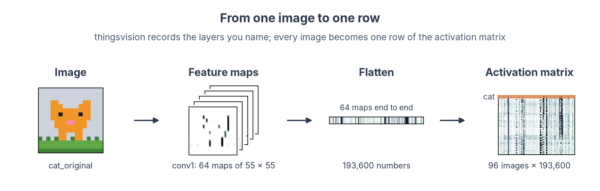
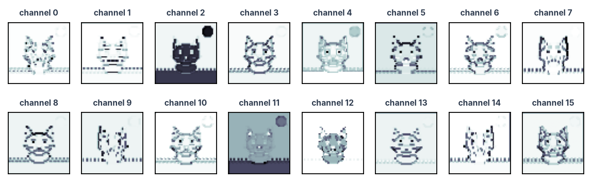

# Extract activations

!!! abstract "On this page"
    - **You need:** a model (pretrained or your own) and your images listed in a manifest, as in [Set up and pick a model](dnn-setup.md).
    - **You get:** one file with the activation of every chosen layer for every image, in manifest order, ready to [compare with human data](dnn-compare.md).

---

## What is an activation?

When an image goes through a network, every layer turns the output of the previous layer into a new set of numbers. A convolutional layer produces a stack of feature maps (channels × height × width), and a fully connected layer produces a vector. These numbers, for one image, are that layer's *activation pattern*, the network's equivalent of a voxel pattern in an ROI.

We record them with [thingsvision](https://vicco-group.github.io/thingsvision/) ([Muttenthaler & Hebart, 2021](https://doi.org/10.3389/fninf.2021.679838)). It loads models from torchvision, timm, CORnet, CLIP and more through one interface, runs your images through them, and returns the activations of the layers you ask for.



---

## 1. Load the model and find its layers

```python
from pathlib import Path

import numpy as np
import pandas as pd
import torch
from thingsvision import get_extractor
from thingsvision.utils.data import DataLoader, ImageDataset
from torchvision import transforms

KIT = Path("dnn-toy-kit")
manifest = pd.read_csv(KIT / "manifest.csv")  # the image order every array will follow
device = "cuda" if torch.cuda.is_available() else "cpu"  # use the GPU when there is one

# Load AlexNet with its ImageNet weights; the extractor can record any of its layers
extractor = get_extractor(
    model_name="alexnet",
    source="torchvision",  # (1)!
    device=device,
    # Trained weights; False gives the same network with random weights
    pretrained=True,
    model_parameters={"weights": "IMAGENET1K_V1"},  # name the weights you report
)
print(extractor.show_model())  # (2)!
```

1. Other sources work the same way, for example `source="timm"` with any timm model name, or `source="custom"` with `model_name="cornet-s"`, `"Alexnet_ecoset"`, `"clip"` and others. The [model list](https://vicco-group.github.io/thingsvision/AvailableModels.html) has them all.
2. `show_model()` returns the network, so `print` shows every layer with its name. `extractor.get_module_names()` gives the names as a list.

??? example "Output"

    ```text
    AlexNet(
      (features): Sequential(
        (0): Conv2d(3, 64, kernel_size=(11, 11), stride=(4, 4), padding=(2, 2))
        (1): ReLU(inplace=True)
        (2): MaxPool2d(kernel_size=3, stride=2, padding=0, dilation=1, ceil_mode=False)
        (3): Conv2d(64, 192, kernel_size=(5, 5), stride=(1, 1), padding=(2, 2))
        (4): ReLU(inplace=True)
        (5): MaxPool2d(kernel_size=3, stride=2, padding=0, dilation=1, ceil_mode=False)
        (6): Conv2d(192, 384, kernel_size=(3, 3), stride=(1, 1), padding=(1, 1))
        (7): ReLU(inplace=True)
        (8): Conv2d(384, 256, kernel_size=(3, 3), stride=(1, 1), padding=(1, 1))
        (9): ReLU(inplace=True)
        (10): Conv2d(256, 256, kernel_size=(3, 3), stride=(1, 1), padding=(1, 1))
        (11): ReLU(inplace=True)
        (12): MaxPool2d(kernel_size=3, stride=2, padding=0, dilation=1, ceil_mode=False)
      )
      (avgpool): AdaptiveAvgPool2d(output_size=(6, 6))
      (classifier): Sequential(
        (0): Dropout(p=0.5, inplace=False)
        (1): Linear(in_features=9216, out_features=4096, bias=True)
        (2): ReLU(inplace=True)
        (3): Dropout(p=0.5, inplace=False)
        (4): Linear(in_features=4096, out_features=4096, bias=True)
        (5): ReLU(inplace=True)
        (6): Linear(in_features=4096, out_features=1000, bias=True)
      )
    )
    ```

We take the output of the ReLU after each layer (see *Which modules to record* below). In AlexNet these are `features.1`, `features.4`, `features.7`, `features.9` and `features.11` for the five convolutional layers, and `classifier.2` and `classifier.5` for the two fully connected layers.

---

## 2. Point it at your images

```python
# Turn each sprite into the input AlexNet expects: 224 x 224 pixels, scaled like the
# ImageNet photos
preprocess = transforms.Compose([
    transforms.Resize(224, interpolation=transforms.InterpolationMode.NEAREST),  # (1)!
    transforms.ToTensor(),  # image -> tensor with values from 0 to 1
    # ImageNet mean and spread
    transforms.Normalize(mean=[0.485, 0.456, 0.406], std=[0.229, 0.224, 0.225]),
])

# e.g. "cat_original.png", in manifest order
file_names = [Path(f).name for f in manifest["file"]]
dataset = ImageDataset(
    root=str(KIT / "stimuli"),
    out_path="features",  # (2)!
    backend=extractor.get_backend(),
    file_names=file_names,  # (3)!
    transforms=preprocess,
)
# Stop if the order differs
assert Path("features/file_names.txt").read_text().split() == file_names
# 32 images per pass
batches = DataLoader(dataset, batch_size=32, backend=extractor.get_backend())
```

1. For photographs, use the model's own preprocessing with `transforms=extractor.get_transformations()`. Here we upsample the 16-pixel sprites 14 times with nearest-neighbour interpolation so they stay sharp.
2. thingsvision writes the order in which it will read the images to `features/file_names.txt`. The `assert` checks it against the manifest.
3. Listing the files explicitly makes thingsvision read them in manifest order. Without `file_names` it sorts them alphabetically. Give the names relative to `root`, and keep `root` a folder without subfolders.

---

## 3. Extract the layers

```python
# Module names in the network (left) and the short names we use for them (right)
layers = {
    "features.1": "conv1", "features.4": "conv2", "features.7": "conv3",
    "features.9": "conv4", "features.11": "conv5",
    "classifier.2": "fc6", "classifier.5": "fc7",
}
activations = extractor.extract_features(
    batches=batches,
    module_names=list(layers),  # (1)!
    # Keep the maps as channels x height x width, to plot them further down
    flatten_acts=False,
)

# One row per image: every value of every map, laid end to end
features = {name: activations[module].reshape(len(activations[module]), -1) for module, name in layers.items()}  # (2)!
for name, x in features.items():
    print(f"{name:>5}: {x.shape}")  # images x features
```

1. All layers come out of one pass through the network, as a dictionary from layer name to array.
2. Each layer becomes one row per image, with the values of all its maps laid end to end. The first layer of AlexNet gives 64 × 55 × 55 = 193,600 numbers per image. RSA, decoding and encoding on the next pages use these full vectors, as [Conwell et al. (2024)](https://doi.org/10.1038/s41467-024-53147-y) did for their RSA. Averaging each map down first, say to 6 × 6, would discard most of the spatial detail of the early layers, whose maps are 55 × 55. With thousands of images the full maps no longer fit in memory, and thingsvision can then write the features to disk as it extracts them (`output_dir`, see its [low-memory options](https://vicco-group.github.io/thingsvision/LowMemOptions.html)).

The output gives one matrix per layer, images × features:

```text
conv1: (96, 193600)
conv2: (96, 139968)
conv3: (96, 64896)
conv4: (96, 43264)
conv5: (96, 43264)
  fc6: (96, 4096)
  fc7: (96, 4096)
```

### Which modules to record

`show_model()` lists every module of the network, and most of them are steps inside what you would call a layer. In AlexNet, a convolutional layer is a convolution followed by a ReLU, and three of them end with max pooling. In a ResNet, convolutions, batch normalisation and ReLUs alternate inside residual blocks. What each kind of module gives you once the network is trained:

| Module | What it does when you run the model | Record it? |
|---|---|---|
| Convolution (`Conv2d`) | Filters its input; responses can be negative | Usually take the ReLU after it: that is what the next layer receives |
| ReLU | Sets negative responses to zero | Yes, the usual output of a layer. On these pages we take the ReLU after every AlexNet layer |
| Max pooling (`MaxPool2d`) | Keeps the strongest response in each small patch | Fine as the end of a stage: [Brain-Score](https://github.com/brain-score/vision) records AlexNet after conv1, conv2 and conv5 at the pooling |
| Batch normalisation (`BatchNorm2d`) | Rescales and shifts each channel by fixed amounts, set during training | Rarely: it is the convolution, rescaled channel by channel. Take the ReLU after it, or the block output |
| Dropout | Passes its input through unchanged | Never: it is identical to the module before it |
| Linear (fully connected) | A weighted sum of all its inputs | Take the ReLU after it (fc6, fc7). The last linear layer gives one score per training class: use it only if those classes are your question |
| Residual block (`layer1.0`, `layer2`, ...) | Several of the steps above, plus the shortcut that adds the block's input | The output of the whole block or stage, not the steps inside it ([Schrimpf et al., 2018](https://doi.org/10.1101/407007)) |
| Global average pooling (`avgpool`) | Averages each feature map over space | The usual last representation of a ResNet, just before the classifier |
| Transformer block | Attention and a small network, added to each token | The output of each block. Take the class token or the average over tokens, and say which (see *Other kinds of models* below) |

Whether to record a layer before or after its ReLU has not been settled by direct comparisons. [Conwell et al. (2024)](https://doi.org/10.1038/s41467-024-53147-y) treat a convolution and the ReLU after it as two candidate layers and choose between them on independent data. Whatever you pick, use the same kind of module throughout, and name the modules in your methods. Which of the recorded layers to compare with a brain region is covered in [Which layer to compare](dnn-compare.md#which-layer-to-compare).

---

## 4. Save them with the image order

```python
# Compressed: most values are zeros after the ReLU, so the file shrinks about sixfold
np.savez_compressed(
    "alexnet_features.npz",
    image_id=manifest["image_id"].to_numpy(dtype=str),  # (1)!
    **features,
)
```

1. Saving the image names with the activations lets every later script check that rows line up with the human data, instead of trusting that the order never changed.

The file holds one array per layer, images × units, plus the image order:

| Key | Shape | Dimensions |
|---|---|---|
| `image_id` | `(96,)` | images, the same order as `manifest.csv` |
| `conv1` | `(96, 193600)` | images × units (64 channels × 55 × 55) |
| `conv2` | `(96, 139968)` | images × units (192 channels × 27 × 27) |
| `conv3` | `(96, 64896)` | images × units (384 channels × 13 × 13) |
| `conv4` | `(96, 43264)` | images × units (256 channels × 13 × 13) |
| `conv5` | `(96, 43264)` | images × units (256 channels × 13 × 13) |
| `fc6` | `(96, 4096)` | images × units |
| `fc7` | `(96, 4096)` | images × units |

??? example "Plot the feature maps of one image"

    The maps keep their shape in `activations`, so plotting the maps of the first layer for the cat takes a few lines:

    ```python
    import matplotlib.pyplot as plt
    
    cat = manifest.index[manifest["image_id"] == "cat_original"][0]  # the row of the cat
    fig, axes = plt.subplots(2, 8, figsize=(9, 2.6))  # the first 16 of the 64 channels
    for channel, ax in enumerate(axes.flat):
        # white = 0, dark = strong response
        ax.imshow(activations["features.1"][cat, channel], cmap="bone_r")
        ax.set_title(f"channel {channel}", fontsize=7)
        ax.set(xticks=[], yticks=[])
    plt.show()
    ```

    

??? tip "Your own trained model"
    A network you trained yourself (for example the AlexNet saved at the end of [Train or fine-tune](dnn-train.md#3-save-the-network)) goes through the same steps. Rebuild the architecture, load the weights, and wrap it with `get_extractor_from_model`:

    ```python
    from thingsvision import get_extractor_from_model
    from torch import nn
    from torchvision import models
    
    model = models.alexnet()  # the architecture, with random weights for now
    model.classifier[6] = nn.Linear(4096, 3)  # same head as in training: 3 categories
    model.load_state_dict(torch.load("sprite_alexnet.pt", weights_only=True))  # (1)!
    extractor = get_extractor_from_model(model=model, device=device, backend="pt")
    ```

    1. Copies the trained weights into the network. `weights_only=True` loads only the numbers, so a file from someone else cannot run code on your computer.

    From here, sections 2 to 4 run unchanged.

??? info "Other kinds of models"
    - **Recurrent models (CORnet-RT, CORnet-S):** a layer runs several times per image. Check in the thingsvision documentation which time step a module name refers to, and report it.
    - **Vision transformers:** layers output tokens (images × tokens × features). thingsvision can return the class token or the token average (`model_parameters={"token_extraction": "cls_token"}` or `"avg_pool"`). Say which in your methods.
    - **Models thingsvision does not ship** (VOneNet, TDANN, TopoNets): load them with their own package, then wrap them with `get_extractor_from_model` as above.

---

## Where next?

<div class="grid cards" markdown>

- :material-shape-outline:{ .lg .middle } __[Compare with a model](dnn-model.md)__

    ---

    Test which layers follow a visual property and which follow category, with model RDMs and decoding.

- :material-brain:{ .lg .middle } __[Compare with human data](dnn-compare.md)__

    ---

    Use `alexnet_features.npz` and the ROI patterns for RSA, decoding and encoding models.

</div>
