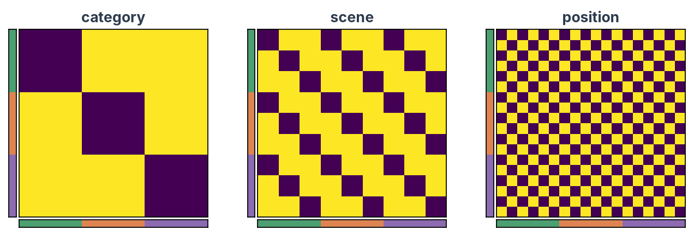
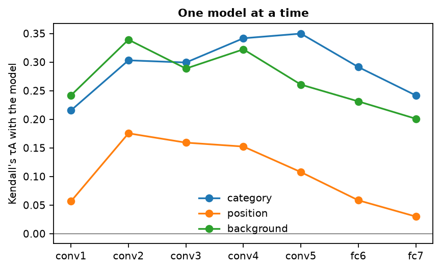
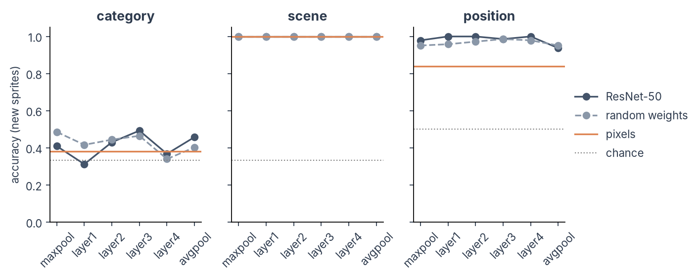

# Compare with a model

!!! abstract "On this page"
    - **You need:** the toy kit and the ResNet-50 features from [Extract activations](dnn-extract.md) (`resnet50_features.npz`).
    - **You get:** which layers follow the scene, the position and the category of the images, with RSA and with decoding, tested on sprites the analysis has not seen.
    - **No human data needed.** To compare the layers with brain or behavioural data, go to [Compare with human data](dnn-compare.md).

---

## What is a model RDM?

A model RDM writes a hypothesis down as distances between images. Two images with the same value of a property are similar (distance 0), and two images with different values are not (distance 1). We test three such models:

- **category:** critter, food or spooky, which is about what the image shows;
- **scene:** meadow, room or night, which is about how the whole image looks;
- **position:** centred or shifted, which is about where the sprite sits.

Comparing a layer's RDM with each model asks whether the layer follows what the image shows, how it looks, or where things are. The kit crosses the three properties: every sprite appears on every scene in both positions. The three models are therefore unrelated, and a layer's match with one of them says nothing about the others. With your own stimuli, properties often go together (animals photographed outdoors, tools indoors), so check this first, as section 1 does.

---

## 1. Load the features and build the models

```python
from pathlib import Path

import matplotlib.pyplot as plt
import numpy as np
import pandas as pd
from rsatoolbox.data import Dataset
from rsatoolbox.rdm import calc_rdm, get_categorical_rdm

KIT = Path("dnn-toy-kit")
manifest = pd.read_csv(KIT / "manifest.csv")  # the image order
# One array per layer: images x features (from Extract activations)
dnn = np.load("resnet50_features.npz")
assert (dnn["image_id"] == manifest["image_id"]).all()  # (1)!
layers = ["maxpool", "layer1", "layer2", "layer3", "layer4", "avgpool"]
properties = ["category", "scene", "position"]
sprites = manifest["sprite"].to_numpy()

# A model RDM per property: 0 for two images with the same value, 1 for different values
model_rdms = {}
for name in properties:
    model_rdms[name] = get_categorical_rdm(pd.factorize(manifest[name])[0], category_name=name)  # (2)!
    model_rdms[name].pattern_descriptors["sprite"] = sprites  # (3)!

# One RDM per layer: 1 - Pearson r between the patterns of every pair of images
layer_rdms = calc_rdm(
    [Dataset(dnn[layer], descriptors={"layer": layer}) for layer in layers], method="correlation"
)
layer_rdms.pattern_descriptors["sprite"] = sprites

# Do the models make different predictions? Correlations between the model RDMs
design = pd.DataFrame({name: rdm.dissimilarities[0] for name, rdm in model_rdms.items()})
print(design.corr().round(2))
```

1. Stop here if the rows of the features are not the images of the manifest, in its order.
2. `pd.factorize` turns the labels into numbers, and rsatoolbox builds the RDM from them.
3. Which sprite each image shows. rsatoolbox needs it in section 2, to resample whole sprites.

??? example "Output"

    ```text
              category  scene  position
    category      1.00  -0.01     -0.01
    scene        -0.01   1.00     -0.01
    position     -0.01  -0.01      1.00
    ```

The three models are uncorrelated. Knowing whether two images share a scene tells you nothing about whether they share a category or a position. Each model's match with a layer is therefore its own contribution.

??? example "Plot the model RDMs"

    ```python
    from matplotlib.colors import ListedColormap
    from mpl_toolkits.axes_grid1 import make_axes_locatable

    category_colours = {"critter": "#4C9F70", "food": "#DD8452", "spooky": "#8C6BB1"}


    def show_rdm(ax, matrix, title):
        """An RDM with a bar of category colours along its left and bottom edges, to show the image order."""
        ax.imshow(matrix, cmap="viridis", vmin=0, interpolation="nearest")  # 0 = identical patterns
        ax.set(title=title, xticks=[], yticks=[])
        codes = pd.factorize(manifest["category"])[0]  # 0, 1, 2 in manifest order
        colours = ListedColormap([category_colours[c] for c in pd.unique(manifest["category"])])
        divider = make_axes_locatable(ax)
        for side, bar in (("left", codes[:, None]), ("bottom", codes[None, :])):
            edge = divider.append_axes(side, size="4%", pad=0.03)
            edge.imshow(bar, cmap=colours, aspect="auto", interpolation="nearest")
            edge.set(xticks=[], yticks=[])


    fig, axes = plt.subplots(1, 3, figsize=(10, 3.6))
    for ax, (name, rdm) in zip(axes, model_rdms.items()):
        show_rdm(ax, rdm.get_matrices()[0], name)  # (1)!
    plt.show()
    ```

    1. The images are in manifest order: by category, then scene, then position. The coloured bars on the left and bottom mark the critter, food and spooky images.



---

## 2. One model at a time

We compare each model RDM with each layer RDM, and resample the sprites to see how much the result depends on the particular sprites in the kit:

```python
from rsatoolbox.inference import eval_bootstrap_pattern
from rsatoolbox.model import ModelFixed

models = [ModelFixed(name, rdm) for name, rdm in model_rdms.items()]
np.random.seed(0)  # (1)!
rsa, ci_low, ci_high = {}, {}, {}
for layer in layers:
    result = eval_bootstrap_pattern(
        models, layer_rdms.subset("layer", layer), method="corr", pattern_descriptor="sprite", N=100  # (2)!
    )
    rsa[layer] = result.get_means()
    ci_low[layer], ci_high[layer] = result.get_ci(0.95)  # (3)!
rsa, ci_low, ci_high = (pd.DataFrame(d, index=properties).T for d in (rsa, ci_low, ci_high))
print(rsa.round(2))
```

1. The bootstrap draws random samples of sprites. A fixed seed gives the same numbers on every run. 100 samples keep this example fast. Use 1,000 or more for a final analysis, so that the confidence intervals are stable.
2. `method="corr"` is the Pearson correlation between the model and the layer RDM. `pattern_descriptor="sprite"` draws whole sprites with all six of their versions, so the confidence interval tells you how the result would change with other sprites. The network gives the same answer every time it sees an image, so the sprites are the only thing to resample here.
3. The 95% confidence interval. `get_ci` takes the level as a proportion (0.95), not as a percentage.

??? example "Output"

    ```text
             category  scene  position
    maxpool      0.03   0.76      0.09
    layer1       0.07   0.85      0.16
    layer2       0.07   0.84      0.23
    layer3       0.03   0.88      0.21
    layer4       0.03   0.85      0.10
    avgpool      0.06   0.78     -0.00
    ```

??? example "Plot the profiles"

    ```python
    colours = {"category": "#DD8452", "scene": "#44546A", "position": "#8C6BB1"}
    fig, ax = plt.subplots(figsize=(6.5, 3.6))
    for name in properties:
        error = [rsa[name] - ci_low[name], ci_high[name] - rsa[name]]  # distances to the interval ends
        ax.errorbar(layers, rsa[name], yerr=error, marker="o", capsize=3, color=colours[name], label=name)
    ax.axhline(0, color="grey", lw=0.8)
    ax.set(ylabel="Pearson r with the model", title="One model at a time (95% CI over sprites)")
    ax.spines[["top", "right"]].set_visible(False)
    ax.legend(frameon=False, loc="center left", bbox_to_anchor=(1, 0.5))
    plt.show()
    ```



Every layer follows the scene far more than anything else, from 0.76 at maxpool to 0.88 at layer3 and 0.78 at avgpool. Position rises to 0.23 at layer2 and falls to 0.00 at avgpool, which averages every map over space and so discards where things are. Category stays near zero in every layer (0.03 to 0.07): the ImageNet features of ResNet-50 do not group our cartoon sprites by category.

??? example "Several models at once"
    When your models correlate, a layer that follows one of them also matches the other. A weighted model asks how much each one contributes once the others are taken into account. rsatoolbox fits its weights to the layer RDM by regression, and the fit has to be judged on sprites it was not fitted on:

    ```python
    from functools import partial

    from rsatoolbox.inference import crossval, sets_k_fold
    from rsatoolbox.model import ModelWeighted
    from rsatoolbox.model.fitter import fit_regress
    from rsatoolbox.rdm import concat

    combined = ModelWeighted("all three", concat(list(model_rdms.values())))  # (1)!
    combined.default_fitter = partial(fit_regress, ridge_weight=0.1)  # (2)!

    # The weight of each model in each layer, fitted on all images
    weights = pd.DataFrame(
        [combined.fit(layer_rdms.subset("layer", layer), method="corr") for layer in layers],
        index=layers,
        columns=properties,
    )
    print(weights.round(2))

    # How well each model predicts held-out sprites: fit on three quarters of the sprites, test on the rest
    held_out = {}
    for layer in layers:
        rdm = layer_rdms.subset("layer", layer)
        train, test, _ = sets_k_fold(rdm, k_rdm=1, k_pattern=4, pattern_descriptor="sprite", random=False)  # (3)!
        result = crossval(models + [combined], rdm, train, test, method="corr", pattern_descriptor="sprite",
                          calc_noise_ceil=False)
        held_out[layer] = np.nanmean(result.evaluations, axis=(0, 2))  # mean over the four folds
    held_out = pd.DataFrame(held_out, index=properties + ["all three"]).T
    print(held_out.round(2))
    ```

    1. One model whose prediction is a weighted sum of the three model RDMs.
    2. `fit_regress` estimates the weights by regression, and `ridge_weight` shrinks them towards zero, which keeps them stable when the models are strongly correlated or many. With `method="corr"`, the mean of every RDM is removed first, so the weights describe the pattern of distances rather than their overall level. The weights are scaled to length 1 within each layer, so compare them only within a layer.
    3. Four folds of sprites, with all six versions of a sprite on the same side. The fixed models need no fitting. The weighted one is refitted on every training fold and scored on the held-out sprites.

    ??? example "Output"

        ```text
                 category  scene  position
        maxpool      0.04   0.99      0.11
        layer1       0.06   0.99      0.15
        layer2       0.06   0.97      0.23
        layer3       0.04   0.98      0.22
        layer4       0.04   0.99      0.12
        avgpool      0.07   1.00      0.02

                 category  scene  position  all three
        maxpool      0.05   0.72      0.10       0.73
        layer1       0.12   0.75      0.20       0.79
        layer2       0.11   0.75      0.26       0.81
        layer3       0.05   0.85      0.21       0.88
        layer4       0.04   0.84      0.08       0.85
        avgpool      0.04   0.77     -0.03       0.78
        ```

    The three models are unrelated in this design, so the weights follow the single-model results. The scene carries almost all the weight in every layer (0.97 to 1.00), and the combined model predicts held-out sprites barely better than the scene model alone (0.88 against 0.85 in layer3, for example). With correlated models, the weights would show which of them carries the effect.

---

## 3. Decoding: which layers let you read out each property

Decoding asks the question in another way, by testing whether a linear classifier can read the property out of the layer for sprites it has not seen. Two baselines tell you what to expect without a trained network: the pixels themselves, and AlexNet with random weights.

```python
import torch
from PIL import Image
from sklearn.model_selection import StratifiedGroupKFold, cross_val_score
from sklearn.pipeline import make_pipeline
from sklearn.preprocessing import StandardScaler
from sklearn.random_projection import SparseRandomProjection
from sklearn.svm import LinearSVC
from thingsvision import get_extractor
from thingsvision.utils.data import DataLoader, ImageDataset
from torchvision import transforms

# Baseline 1: the pixels of every image, as one long vector
pixels = np.stack([np.asarray(Image.open(KIT / file), dtype=float).ravel() for file in manifest["file"]])

# Baseline 2: ResNet-50 with random weights, run exactly as on Extract activations
torch.manual_seed(0)  # (1)!
untrained = get_extractor(model_name="resnet50", source="torchvision", device="cpu", pretrained=False)
preprocess = transforms.Compose([
    transforms.Resize(224, interpolation=transforms.InterpolationMode.NEAREST),
    transforms.ToTensor(),
    transforms.Normalize(mean=[0.485, 0.456, 0.406], std=[0.229, 0.224, 0.225]),
])
images = ImageDataset(root=str(KIT / "stimuli"), out_path="features_untrained", backend=untrained.get_backend(),
                      file_names=[Path(f).name for f in manifest["file"]], transforms=preprocess)
random_weights = untrained.extract_features(
    batches=DataLoader(images, batch_size=32, backend=untrained.get_backend()),
    module_names=layers, flatten_acts=True,
)

# The same number of features for everything we decode from
inputs = {"pixels": pixels}
inputs.update({layer: dnn[layer] for layer in layers})
inputs.update({f"random {layer}": random_weights[layer] for layer in layers})
inputs = {name: SparseRandomProjection(n_components=1000, random_state=0).fit_transform(X)  # (2)!
          for name, X in inputs.items()}

classifier = make_pipeline(StandardScaler(), LinearSVC())  # (3)!


def decode(X, labels):
    """Mean accuracy over four folds of held-out sprites, each with all six versions."""
    folds = StratifiedGroupKFold(n_splits=4, shuffle=True, random_state=0).split(X, labels, groups=sprites)  # (4)!
    return cross_val_score(classifier, X, labels, cv=list(folds)).mean()


decoding = pd.DataFrame(
    {name: [decode(X, manifest[name].to_numpy()) for X in inputs.values()] for name in properties},
    index=list(inputs),
)
print(decoding.round(2))
```

1. Fixes the random starting weights, so the baseline is the same network on every run.
2. Layers differ enormously in size (802,816 numbers per image in layer1, 2,048 in avgpool, 6,912 pixels), and a classifier has an easier time with more features. A random projection maps every input onto the same 1,000 dimensions. It is chosen without looking at the data or the labels (only the seed and the number of features matter), so projecting all images at once leaks nothing.
3. A linear support vector machine, the same classifier as on [Compare with human data](dnn-compare.md), where a note explains when to use shrinkage LDA instead. The scaler is part of the pipeline, so it is fitted on the training sprites only.
4. Each fold tests six sprites, two per category, that the classifier has not seen, with all six of their versions.

??? example "Output"

    ```text
                    category  scene  position
    pixels              0.38    1.0      0.84
    maxpool             0.41    1.0      0.98
    layer1              0.31    1.0      1.00
    layer2              0.43    1.0      1.00
    layer3              0.49    1.0      0.99
    layer4              0.37    1.0      1.00
    avgpool             0.46    1.0      0.94
    random maxpool      0.49    1.0      0.95
    random layer1       0.42    1.0      0.96
    random layer2       0.44    1.0      0.97
    random layer3       0.47    1.0      0.99
    random layer4       0.34    1.0      0.98
    random avgpool      0.40    1.0      0.95
    ```

Chance is 33% for category and scene and 50% for position. To claim that an accuracy is above chance, compare it with a permutation test that keeps the structure of the design. Give the sprites random categories (all versions of a sprite the same one, 8 sprites per category), build the folds again from those labels, and decode again.

```python
N_PERM = 100
rng = np.random.default_rng(0)
category_of = manifest.groupby("sprite")["category"].first()  # one category per sprite


def shuffled_categories():
    """The categories handed out to the sprites at random, eight sprites each."""
    relabel = dict(zip(category_of.index, rng.permutation(category_of.to_numpy())))
    return np.array([relabel[s] for s in sprites])


tested = ["pixels"] + layers  # the trained network and the pixels
null = {name: [] for name in tested}
for _ in range(N_PERM):  # (1)!
    labels = shuffled_categories()
    for name in tested:
        null[name].append(decode(inputs[name], labels))  # (2)!
p_category = pd.Series(
    {name: (1 + np.sum(np.array(null[name]) >= decoding.loc[name, "category"])) / (1 + N_PERM) for name in tested}
)
print(p_category.round(3))
```

1. Each permutation repeats the whole decoding for every input tested. More permutations give finer p-values. The smallest possible p-value is 1 / (1 + the number of permutations).
2. `decode` builds the folds from the labels it gets, so every shuffled run splits the sprites in the same, balanced way as the real one. Reusing the folds of the real labels would leave some test folds with two or three sprites of one shuffled category and give a null distribution that sits below chance.

??? example "Output"

    ```text
    pixels     0.248
    maxpool    0.218
    layer1     0.554
    layer2     0.129
    layer3     0.050
    layer4     0.356
    avgpool    0.139
    dtype: float64
    ```

??? example "Plot decoding by layer"

    ```python
    fig, axes = plt.subplots(1, 3, figsize=(8.4, 3.2), sharey=True)
    for ax, name in zip(axes, properties):
        ax.plot(layers, decoding.loc[layers, name], "o-", color="#44546A", label="ResNet-50")
        ax.plot(layers, decoding.loc[[f"random {layer}" for layer in layers], name], "o--", color="#8A97A8",
                label="random weights")
        ax.axhline(decoding.loc["pixels", name], color="#DD8452", lw=1.5, label="pixels")
        ax.axhline(1 / manifest[name].nunique(), color="grey", ls=":", lw=1, label="chance")
        ax.set(title=name, ylim=(0, 1.05))
        ax.tick_params(axis="x", rotation=45)
        ax.spines[["top", "right"]].set_visible(False)
    axes[0].set_ylabel("accuracy (new sprites)")
    axes[-1].legend(frameon=False, loc="center left", bbox_to_anchor=(1, 0.5))
    plt.show()
    ```



The scene is decoded perfectly from every input, the pixels included, and position nearly so from the layers (94% to 100%, against 84% from the pixels). Category is a different story. On new sprites, the pretrained layers reach 31% to 49% (chance 33%), no better than the same network with random weights (34% to 49%) or the pixels (38%), and only layer3 comes close to significance (p = 0.050 with 100 permutations). For these cartoon categories, the ImageNet training of ResNet-50 adds nothing that a random network or the pixels do not already give. The [training page](dnn-train.md) tells the same story: even a network trained on the sprites recognises the category of new ones only 50% to 63% of the time.

---

## Look at the RDMs

The numbers above summarise each layer's RDM in one value per model. The RDMs themselves can show structure that none of the three models describes. [Compare with human data](dnn-compare.md#look-at-your-rdms) plots them for the layers and the brain regions, with an MDS under each, and tests two more models, the pixels and CLIP's image embedding, for what the plots reveal.

---

## Good practice

??? tip "Look for confounds between your models"
    Two models can make similar predictions. Build a model RDM for every property that could explain the result (colour, size, background, brightness, ...) and check how much they correlate over the pairs you analyse, as in section 1, before you interpret one of them. When they correlate, fit them together (box "Several models at once") or change the stimuli so that the properties are crossed.

??? warning "Decodable is not the same as represented"
    A classifier finds any direction in the layer that separates the groups, however small. RSA asks whether the property shapes the layer's overall geometry. A property can be decodable and still play a minor part in how the layer organises the images, so read the two together.

??? info "One network is one instance"
    Networks with the same architecture and training data, but different random starting weights, end up with different representations, and their RDMs differ ([Mehrer et al., 2020](https://doi.org/10.1038/s41467-020-19632-w)). The pretrained AlexNet is one such instance. A claim about an architecture or a training regime needs several instances trained with different seeds.

---

## Where next?

<div class="grid cards" markdown>

- :material-brain:{ .lg .middle } __[Compare with human data](dnn-compare.md)__

    ---

    The same layers against brain or behavioural data, through RSA, decoding and encoding models, with statistics over participants and sprites.

</div>
