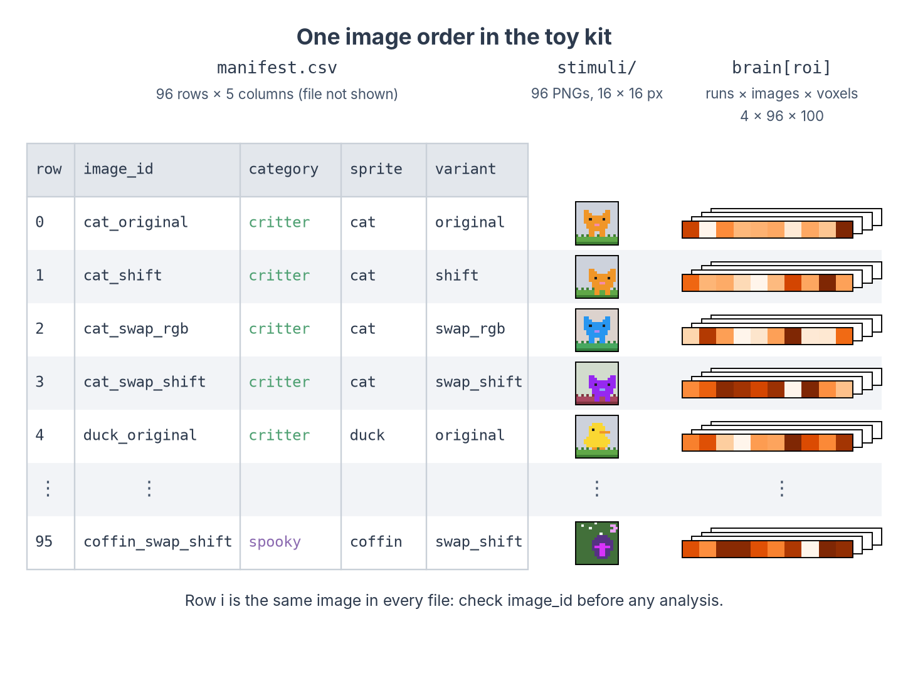
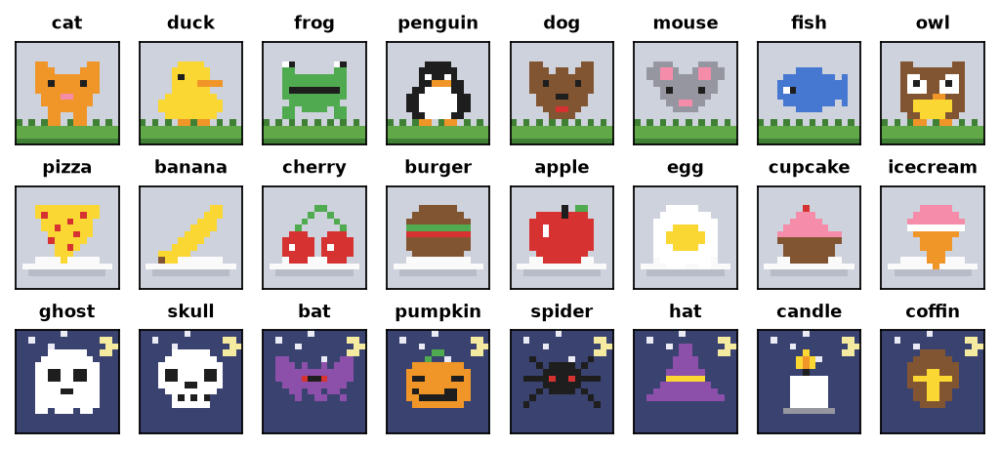
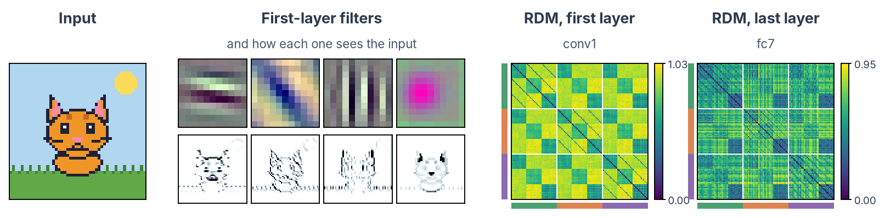
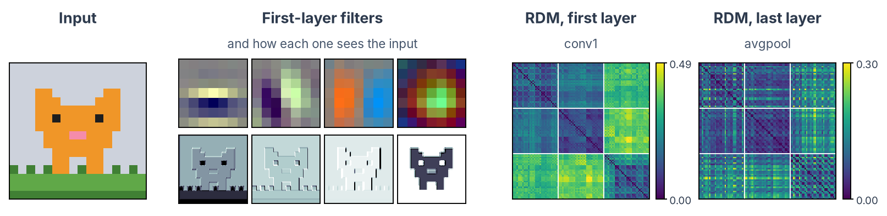
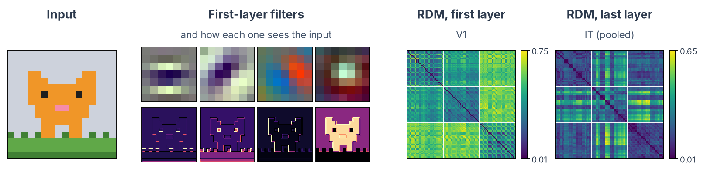
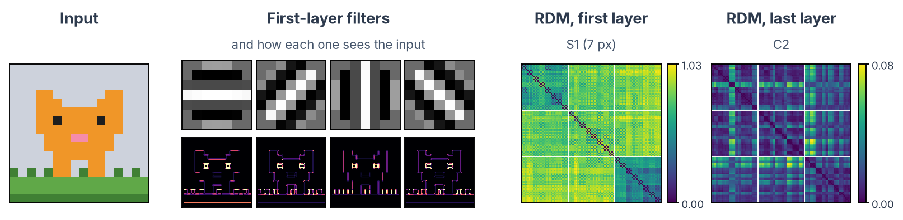
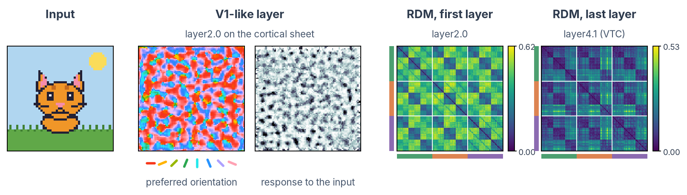
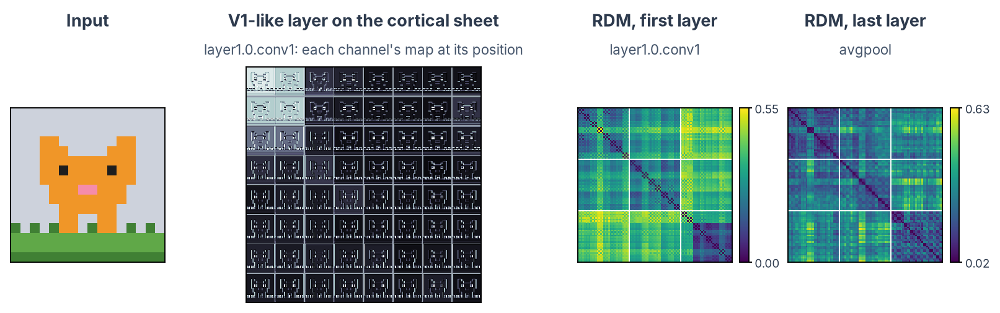
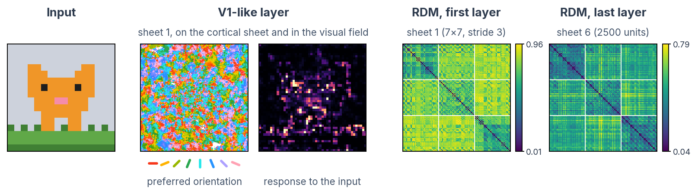

# Set up and pick a model

!!! abstract "On this page"
    - **You need:** conda ([Miniforge](https://github.com/conda-forge/miniforge) or Anaconda) and about 7 GB of free disk space. A GPU helps but is not required for the toy examples.
    - **You get:** a working Python environment, the pixel-art toy kit, and a pretrained network that runs on it.
    - **Next:** [train or fine-tune](dnn-train.md) if the model needs to learn your images, or go straight to [extract activations](dnn-extract.md).

---

## 1. Create the environment

We work in Python with [PyTorch](https://pytorch.org/), plus three packages built for this kind of analysis: [thingsvision](https://vicco-group.github.io/thingsvision/) to extract activations, [rsatoolbox](https://rsatoolbox.readthedocs.io/) for RSA and [himalaya](https://gallantlab.org/himalaya/) for encoding models. Keep one conda environment per project. Save this file as `environment.yml` in your project folder:

```yaml title="environment.yml"
name: dnn
channels:
  - conda-forge
dependencies:
  - python=3.11
  - pip
  - pip:
      - thingsvision  # (1)!
      - git+https://github.com/openai/CLIP.git  # (2)!
      - rsatoolbox[imaging]  # (3)!
      - himalaya
```

1. thingsvision brings PyTorch, torchvision, scikit-learn, pandas and matplotlib with it. It pins PyTorch 2.0.1 and also installs TensorFlow, so the environment takes about 7 GB.
2. Needed by thingsvision for all its `source="custom"` models, such as CORnet and CLIP, as its installation instructions say.
3. The `imaging` extra adds the readers for SPM and NIfTI files, used to [load your own betas from an SPM GLM](dnn-compare.md#load-and-line-up-the-data).

Then create and activate it:

```bash
conda env create -f environment.yml
conda activate dnn
```

The first install downloads everything and takes a while.

=== "Laptop (CPU)"

    Nothing else to do. Everything in this section runs on a CPU.

=== "Machine with an NVIDIA GPU"

    PyTorch uses the GPU when it finds one; the check below tells you whether it does. If the environment gives you trouble on your machine, for example PyTorch does not find the GPU, keep training apart: use this environment for extraction and analysis, and a second one with the latest PyTorch for the [training page](dnn-train.md), whose code runs there unchanged:

    ```bash
    conda create -n dnn-train python=3.11
    conda activate dnn-train
    pip install torch torchvision pandas scikit-learn matplotlib
    ```

=== "VSC cluster"

    For large models or datasets, run on the GPU nodes of the VSC cluster. The [HPC page](../fmri/analysis/fmri-hpc.md) explains how to log in, where to store data and how to submit jobs with Slurm. Install the same environment there; if it does not work with the cluster's GPUs, split it as in the previous tab.

Check that everything imports and whether PyTorch sees a GPU:

```python
from importlib.metadata import version

import torch

# The installed version of each package (include these in your methods section)
for package in ["thingsvision", "rsatoolbox", "himalaya", "torch"]:
    print(f"{package:>12} {version(package)}")
# False is fine: everything here also runs on a CPU
print("GPU available:", torch.cuda.is_available())
```

??? tip "Keep the environment clean"
    - Install packages in the project environment only, never with `pip install --user`. Packages in `~/.local` can silently override the ones in your environment. Setting `export PYTHONNOUSERSITE=1` in your shell makes Python ignore them.
    - Once the analysis works, save the exact versions with `conda env export > environment.lock.yml` and commit that file with your code.
    - Importing thingsvision also loads TensorFlow, which prints a few lines of warnings. `export TF_CPP_MIN_LOG_LEVEL=3` silences them.
    - See [Coding practices](../coding/index.md) for editors, Git and general Python set-up.

---

## 2. Get the toy kit

All pages in this section use the same small dataset: 24 pixel-art sprites in three categories (critters, food and spooky things), each shown in four variants: the original, the sprite shifted two pixels to the side and down, and both of these with the colours swapped. That makes 96 images. Each category has its own scene, so a network has something visual to learn: critters stand on grass, food sits on a plate, and spooky things are out at night.

[:material-download: Download the toy kit](../../assets/dnn/dnn-toy-kit.zip){ .md-button }

Unzip it next to your scripts. You get this layout:

```text
dnn-toy-kit/
├── manifest.csv          # one row per image
├── stimuli/              # 96 PNG files, 16 x 16 pixels
└── brain/
    └── roi_betas.npz     # "brain activations" for two ROIs
```

!!! warning "The brain data in the kit are synthetic"
    These pages start *after* the brain analysis, with one activity pattern per image from each region of interest (see the [fMRI analysis workflow](../fmri/analysis/index.md); [Compare with brain data](dnn-compare.md#load-and-line-up-the-data) shows how to read them from an SPM GLM). The kit fakes that result for a `V1`-like ROI, which responds to brightness, colour and edges at each position, and an `IT`-like ROI, which responds to category and sprite identity but not to position or colour.

Every file lists the images in the same order, the order of `manifest.csv`. Your own data should follow the same structure, so that the code on these pages works on it unchanged:



Two columns of the manifest matter later: `category` is the label we decode or train on, and `sprite` names the object, so that all four versions of a sprite stay together when you split the images into a training and a test set. In `roi_betas.npz`, the arrays are called `V1` and `IT`, and `image_id` stores the image order. Your own ROIs can have any number of runs and voxels; only the image axis must follow the manifest.

Load the manifest:

```python
from pathlib import Path

import pandas as pd

KIT = Path("dnn-toy-kit")  # the folder you unzipped, next to this script
# One row per image, in the order every array uses
manifest = pd.read_csv(KIT / "manifest.csv")
print(manifest.head())
print(manifest.groupby("category")["sprite"].nunique())  # 8 sprites per category
```

??? example "Plot the sprites"

    ```python
    import matplotlib.pyplot as plt
    from PIL import Image

    originals = manifest[manifest["variant"] == "original"]  # one version of each sprite
    fig, axes = plt.subplots(3, 8, figsize=(8, 3.4))  # one row per category
    for ax, (_, row) in zip(axes.flat, originals.iterrows()):
        ax.imshow(Image.open(KIT / row["file"]), interpolation="nearest")  # (1)!
        ax.set_title(row["sprite"], fontsize=8)
        ax.set(xticks=[], yticks=[])  # no ticks, but keep the thin frame around each image
    plt.show()
    ```

    1. `interpolation="nearest"` draws each pixel as a sharp square. The default smooths the 16 × 16 image into a blur.

    { width="600" }

---

## 3. Pick a model

You rarely need to train a network yourself. Many trained models are public, and studies often compare several of them with the brain. Each card below says when a model is a good choice and shows what it does with our cat sprite: its first layer (four filters and their responses, or a view of the whole layer for models without shared filters) and the RDMs of its first and last layers over all 96 sprites, with the critter, food and spooky blocks marked.

!!! tip "Pick by your question, not by accuracy"
    A model is a hypothesis about the brain. Choose models that differ in the way your question asks about (architecture, training data, objective, topography), and compare several rather than one.

The models at a glance; each name links to its card:

| Model | Kind | Pick it when | Loads with |
|---|---|---|---|
| [AlexNet](#alexnet) | <span class="resource-swatch resource-swatch--classic"></span> classic | you want the shared reference model | thingsvision |
| [ResNet-50](#resnet-50) | <span class="resource-swatch resource-swatch--classic"></span> classic | you want a deep, strong ImageNet baseline | thingsvision |
| [CORnet-S](#cornet-s) | <span class="resource-swatch resource-swatch--brain"></span> brain-inspired | layers should map onto V1, V2, V4 and IT | thingsvision |
| [VOneNet](#vonenet) | <span class="resource-swatch resource-swatch--brain"></span> brain-inspired | you want a fixed model of V1 at the front | its own package |
| [HMAX](#hmax) | <span class="resource-swatch resource-swatch--brain"></span> brain-inspired | you want a model without trained weights | its own repository |
| [CLIP](#clip) | <span class="resource-swatch resource-swatch--language"></span> language | your question is about meaning | thingsvision |
| [TDANN](#tdann) | <span class="resource-swatch resource-swatch--topo"></span> topographic | your question is about cortical maps | its own repository |
| [TopoNets](#toponets) | <span class="resource-swatch resource-swatch--topo"></span> topographic | you want topography in a standard network | its own package |
| [All-TNN](#all-tnn) | <span class="resource-swatch resource-swatch--topo"></span> topographic | you want topography without convolutions | its own repository (TensorFlow) |

### Classic image classifiers { .resource-group .resource-group--classic }

<details class="resource-card resource-card--classic" markdown open>
<summary markdown="block">

#### AlexNet

[:material-file-document-outline: Krizhevsky et al., 2012](https://papers.nips.cc/paper/2012/hash/c399862d3b9d6b76c8436e924a68c45b-Abstract.html) [:material-book-open-variant: Docs](https://pytorch.org/vision/stable/models/generated/torchvision.models.alexnet.html)
{ .resource-card__links }

**Pick it when** you want the shared reference point: five convolutional and three fully connected layers, reported in many DNN-brain studies. Small and fast.

</summary>

Architecture
:   CNN, 8 layers: 5 convolutional, 3 fully connected

Trained on
:   ImageNet, 1000 labels

In thingsvision
:   `alexnet`, source `torchvision`

License
:   BSD-3 code; weights under ImageNet terms

{ .resource-card__figure }
{ .resource-card__plate }

??? example "Load it"

    ```python
    from thingsvision import get_extractor
    
    extractor = get_extractor(
        model_name="alexnet",
        source="torchvision",  # the model comes from torchvision's model zoo
        device="cpu",
        pretrained=True,
        model_parameters={"weights": "IMAGENET1K_V1"},  # (1)!
    )
    ```

    1. Name the weights explicitly and report them: torchvision may change its default weights in a later release.

</details>

<details class="resource-card resource-card--classic" markdown>
<summary markdown="block">

#### ResNet-50

[:material-file-document-outline: He et al., 2016](https://doi.org/10.1109/CVPR.2016.90) [:material-book-open-variant: Docs](https://pytorch.org/vision/stable/models/generated/torchvision.models.resnet50.html)
{ .resource-card__links }

**Pick it when** you want a deep, strong ImageNet baseline. Skip connections are what make a network this deep trainable, and many brain-inspired models (VOneNet, CLIP's RN50, TopoNets) are built on ResNets, so it is the natural control for them.

</summary>

Architecture
:   CNN, 50 layers with skip connections

Trained on
:   ImageNet, 1000 labels

In thingsvision
:   `resnet50`, source `torchvision`

License
:   BSD-3 code; weights under ImageNet terms

{ .resource-card__figure }
{ .resource-card__plate }

??? example "Load it"

    <!-- doctest: skip -->
    ```python
    from thingsvision import get_extractor
    
    extractor = get_extractor(
        model_name="resnet50",
        source="torchvision",
        device="cpu",
        pretrained=True,
        model_parameters={"weights": "IMAGENET1K_V2"},  # (1)!
    )
    ```

    1. torchvision has two sets of ResNet-50 weights: `IMAGENET1K_V1` (the original training recipe) and `IMAGENET1K_V2` (a newer recipe, more accurate). They are different models; report which one you used.

</details>

### Brain-inspired models { .resource-group .resource-group--brain }

<details class="resource-card resource-card--brain" markdown>
<summary markdown="block">

#### CORnet-S

[:material-file-document-outline: Kubilius et al., 2019](https://papers.nips.cc/paper/2019/hash/7813d1590d28a7dd372ad54b5d29d033-Abstract.html) [:material-github: Code](https://github.com/dicarlolab/CORnet)
{ .resource-card__links }

**Pick it when** you want layers that map onto brain areas by design: four areas named V1, V2, V4 and IT, with recurrence inside V2, V4 and IT (V1 is feed-forward). Its architecture was chosen for how well it predicts ventral-stream data (Brain-Score), not only for accuracy.

</summary>

Architecture
:   Recurrent CNN with areas V1, V2, V4 and IT

Trained on
:   ImageNet, 1000 labels

In thingsvision
:   `cornet-s`, source `custom`

License
:   GPL-3.0

{ .resource-card__figure }
{ .resource-card__plate }

??? example "Load it"

    <!-- doctest: skip -->
    ```python
    from thingsvision import get_extractor
    
    extractor = get_extractor(
        model_name="cornet-s",
        source="custom",  # (1)!
        device="cpu",
        pretrained=True,
    )
    ```

    1. thingsvision ships CORnet itself, so no extra package is needed. The first download is 408 MB. Areas such as `IT.output` run several times per image (the recurrent time steps); report which step you used.

</details>

<details class="resource-card resource-card--brain" markdown>
<summary markdown="block">

#### VOneNet

[:material-file-document-outline: Dapello et al., 2020](https://proceedings.neurips.cc/paper/2020/hash/98b17f068d5d9b7668e19fb8ae470841-Abstract.html) [:material-github: Code](https://github.com/dicarlolab/vonenet)
{ .resource-card__links }

**Pick it when** you want a model of primate V1 in front of a standard CNN: a fixed bank of Gabor filters with simple and complex cells and neuronal noise, followed by a trained ResNet-50. It was introduced to study robustness to image perturbations.

</summary>

Architecture
:   Fixed model of V1, then a ResNet-50

Trained on
:   ImageNet, 1000 labels (the ResNet part)

In thingsvision
:   wrap it with `get_extractor_from_model`

License
:   GPL-3.0

{ .resource-card__figure }
{ .resource-card__plate }

??? example "Load it"

    <!-- doctest: skip -->
    ```python
    # pip install git+https://github.com/dicarlolab/vonenet.git
    import torch
    import vonenet
    from thingsvision import get_extractor_from_model
    from torchvision import transforms
    
    model = vonenet.get_model(model_arch="resnet50", pretrained=True, map_location="cpu").module  # (1)!
    preprocess = transforms.Compose([
        transforms.Resize(224, interpolation=transforms.InterpolationMode.NEAREST),
        transforms.ToTensor(),
        # VOneNet's own normalisation
        transforms.Normalize(mean=[0.5, 0.5, 0.5], std=[0.5, 0.5, 0.5]),
    ])
    extractor = get_extractor_from_model(model=model, device="cpu", backend="pt", preprocess=preprocess)
    torch.manual_seed(0)  # (2)!
    ```

    1. `get_model` returns the network wrapped for multiple GPUs; `.module` unwraps it, so layer names do not start with `module.`.
    2. VOneNet adds random noise to its V1 responses on every pass, so two runs give slightly different activations. Fix the seed before extracting.

</details>

<details class="resource-card resource-card--brain" markdown>
<summary markdown="block">

#### HMAX

[:material-file-document-outline: Riesenhuber & Poggio, 1999](https://doi.org/10.1038/14819) [:material-file-document-outline: Serre et al., 2007](https://doi.org/10.1109/TPAMI.2007.56) [:material-github: Code](https://github.com/wmvanvliet/pytorch_hmax)
{ .resource-card__links }

**Pick it when** you want a classic model of the ventral stream with no weights trained by gradient descent: fixed Gabor filters and a stored set of patches, in alternating simple (S) and complex (C) layers, with a MAX operation that makes responses tolerant to position and size. A useful baseline against trained networks.

</summary>

Architecture
:   Simple and complex cell layers, S1 to C2

Trained on
:   nothing: fixed Gabor filters and stored patches

In thingsvision
:   no; call the model directly

License
:   no license file

{ .resource-card__figure }
{ .resource-card__plate }

??? example "Load it"

    <!-- doctest: skip -->
    ```python
    # git clone https://github.com/wmvanvliet/pytorch_hmax  (not on PyPI)
    import sys
    
    sys.path.append("pytorch_hmax")  # the folder you cloned
    import hmax
    
    model = hmax.HMAX("pytorch_hmax/universal_patch_set.mat")  # (1)!
    ```

    1. The patch file ships with the repository. HMAX takes grayscale images with values from 0 to 255, and its output is the top (C2) layer: 8 scales × 400 patches per image. It is not a thingsvision model, so call it directly; the repository's example shows how.

</details>

### Trained with language { .resource-group .resource-group--language }

<details class="resource-card resource-card--language" markdown>
<summary markdown="block">

#### CLIP

[:material-file-document-outline: Radford et al., 2021](https://proceedings.mlr.press/v139/radford21a.html) [:material-github: Code](https://github.com/openai/CLIP)
{ .resource-card__links }

**Pick it when** your question is about meaning: CLIP learned image features by matching images to their captions, not to a fixed list of ImageNet labels. Compare it with an ImageNet model of the same architecture to see what language supervision adds.

</summary>

Architecture
:   Image encoder: ViT-B/32 or ResNet-50

Trained on
:   400 million image-text pairs

In thingsvision
:   `clip`, source `custom`

License
:   MIT; research use only, per the model card

{ .resource-card__figure }
{ .resource-card__plate }

CLIP's 768 patch filters look noisy one by one, so the strip shows four principal components of them, as the ViT paper does ([Dosovitskiy et al., 2021](https://arxiv.org/abs/2010.11929), Fig. 7). Each map shows how strongly each of the 49 patches of the cat loads on that component.
{ .resource-card__caption }

??? example "Load it"

    <!-- doctest: skip -->
    ```python
    from thingsvision import get_extractor
    
    extractor = get_extractor(
        model_name="clip",
        source="custom",  # needs the CLIP package from environment.yml
        device="cpu",
        pretrained=True,
        model_parameters={"variant": "ViT-B/32"},  # (1)!
    )
    ```

    1. `"RN50"` gives the ResNet-50 version. The ViT version cuts each image into 32 × 32 patches, so its "first layer" is a 7 × 7 grid of patch responses rather than a feature map.

</details>

### Topographic models { .resource-group .resource-group--topo }

<details class="resource-card resource-card--topo" markdown>
<summary markdown="block">

#### TDANN

[:material-file-document-outline: Margalit et al., 2024](https://doi.org/10.1016/j.neuron.2024.04.018) [:material-github: Code](https://github.com/neuroailab/TDANN)
{ .resource-card__links }

**Pick it when** your question is about cortical maps: every unit has a position on a simulated cortical sheet, and the training balances a self-supervised task with spatial smoothness. It reproduces V1-like maps and category-selective patches in ventral temporal cortex.

</summary>

Architecture
:   ResNet-18 whose units have positions on a cortical sheet

Trained on
:   self-supervised task (SimCLR) plus a spatial loss

In thingsvision
:   wrap it with `get_extractor_from_model`

License
:   no license file

{ .resource-card__figure }
{ .resource-card__plate }

On the left, each unit's preferred orientation, measured with TDANN's own grating images and tuning fits and smoothed over 1.5 mm as in the paper: neighbouring units prefer similar orientations, and the colours meet at pinwheel-like points. On the right, each unit's response to the cat at its position on the sheet, as in the TDANN demo.
{ .resource-card__caption }

??? example "Load it"

    <!-- doctest: skip -->
    ```python
    # git clone https://github.com/neuroailab/TDANN ; weights from https://osf.io/64qv3/
    import sys
    
    import torch
    from thingsvision import get_extractor_from_model
    
    # The repository's demo loader needs only torch and torchvision
    sys.path.append("TDANN/demo")
    from src.model import load_model_from_checkpoint
    
    model = load_model_from_checkpoint("model_final_checkpoint_phase199.torch")  # (1)!
    extractor = get_extractor_from_model(model=model, device="cpu", backend="pt")
    ```

    1. The SimCLR checkpoint from OSF (88 MB). On a computer without a GPU, the loader's `torch.load(path)` fails with "Attempting to deserialize object on a CUDA device"; change it to `torch.load(path, map_location="cpu", weights_only=True)` in `TDANN/demo/src/model.py` (`weights_only=True` also stops the file from running code when it loads). For maps you also need each unit's position, from the same OSF project.

</details>

<details class="resource-card resource-card--topo" markdown>
<summary markdown="block">

#### TopoNets

[:material-file-document-outline: Deb et al., 2025](https://doi.org/10.48550/arXiv.2501.16396) [:material-github: Code](https://github.com/toponets/toponets)
{ .resource-card__links }

**Pick it when** you want topography in a standard, high-performing network: a topographic loss makes neighbouring units respond alike without much loss in accuracy. It loads as an ordinary PyTorch model.

</summary>

Architecture
:   ResNet-18/50 or ViT-B/32 with a topographic loss

Trained on
:   ImageNet, 1000 labels

In thingsvision
:   wrap it with `get_extractor_from_model`

License
:   no license file

{ .resource-card__figure }
{ .resource-card__plate }

The paper's vision maps show category selectivity (Fig. 5A). This view of the first topographic layer is ours: each channel's response to the cat, placed on the 8 × 8 grid that TopoLoss uses for this layer. Neighbouring tiles tend to look alike.
{ .resource-card__caption }

??? example "Load it"

    <!-- doctest: skip -->
    ```python
    # pip install git+https://github.com/toponets/toponets.git
    import toponets  # (1)!
    from thingsvision import get_extractor_from_model
    
    model = toponets.resnet18(tau=10.0, checkpoint_path="resnet18_tau_10.0.pt")  # (2)!
    extractor = get_extractor_from_model(model=model, device="cpu", backend="pt")
    ```

    1. With the PyTorch 2.0.1 of our environment, add `torch.amp.GradScaler = torch.cuda.amp.GradScaler` (after `import torch`) before this import; newer PyTorch versions do not need it.
    2. `tau` sets the strength of the topographic loss. The checkpoint (45 MB) is downloaded from Hugging Face to `checkpoint_path` the first time, with `wget`.

</details>

<details class="resource-card resource-card--topo" markdown>
<summary markdown="block">

#### All-TNN

[:material-file-document-outline: Lu et al., 2025](https://doi.org/10.1038/s41562-025-02220-7) [:material-github: Code](https://github.com/KietzmannLab/All-TNN) [:material-database-outline: Weights](https://osf.io/6m3g4/)
{ .resource-card__links }

**Pick it when** you want topography without convolutions: every unit on a simulated cortical sheet has its own filter, and smooth orientation and category maps emerge during training. All-TNNs also matched human spatial biases in object recognition better than control models.

</summary>

Architecture
:   Locally connected layers on a 2-D sheet, no weight sharing

Trained on
:   ecoset, 565 categories

In thingsvision
:   no; TensorFlow 2.12, load it with the repository's helpers

License
:   MIT

{ .resource-card__figure }
{ .resource-card__plate }

On the left, each unit's preferred orientation, measured with gratings as in the repository's `get_tuning_curves`: neighbouring units prefer similar orientations, as in V1. White dots are units that respond to no grating (0.7%). On the right, the summed response of the 64 units at each position in the visual field, which traces the cat and the edge of the grass.
{ .resource-card__caption }

??? example "Load it"

    <!-- doctest: skip -->
    ```python
    # git clone https://github.com/KietzmannLab/All-TNN
    # In a separate environment: pip install tensorflow==2.12.0 "numpy<=1.23.5" "h5py<=3.8.0" scipy scikit-learn pyyaml
    # From https://osf.io/6m3g4/ download one model folder from shared_weights/ (862 MB)
    import sys

    sys.path.insert(0, "All-TNN")  # (1)!
    from all_tnn.analysis.util.analysis_help_funcs import load_and_override_hparams
    from all_tnn.analysis.util.setup_model_and_data import load_models

    MODEL = "shared_weights/tnn_ecoset_l2_no_flip_seed1_drop0.0_learnable_False_1e-05_alpha10.0_constant_20_0.1Factors_adam0.05_L21e-06_ecoset_square256_proper_chunks/"
    hparams = load_and_override_hparams(MODEL, batch_size=1)  # (2)!
    activities_model, model = load_models(300, hparams, MODEL, pre_relu=False, post_norm=False, n_classes_override=565)
    ```

    1. `pip install -e .` fails in the current repository (a missing `_version.py`), so put the clone on the path instead. The network is built from the code saved inside the model folder, which is why you need the whole folder, not only the checkpoint.
    2. The input layer has a fixed batch size, so set it before the model is built. Images go in as 150 × 150 RGB, scaled to the range −1 to 1; `activities_model` returns the response of each of the six sheets.

</details>

---

## 4. Run the model on the sprites

Before any analysis, check that the model runs on your images and that the preprocessing matches what it was trained on. What does AlexNet see in our sprites?

```python
from pathlib import Path

import torch
from PIL import Image
from torchvision import models, transforms

KIT = Path("dnn-toy-kit")
weights = models.AlexNet_Weights.IMAGENET1K_V1  # (1)!
model = models.alexnet(weights=weights).eval()  # (2)!

preprocess = transforms.Compose([
    transforms.Resize(224, interpolation=transforms.InterpolationMode.NEAREST),  # (3)!
    transforms.ToTensor(),
    transforms.Normalize(mean=[0.485, 0.456, 0.406], std=[0.229, 0.224, 0.225]),  # (4)!
])

for sprite in ["cat", "banana", "ghost", "pizza"]:
    img = Image.open(KIT / f"stimuli/{sprite}_original.png").convert("RGB")
    with torch.no_grad():  # (5)!
        # unsqueeze(0): a batch of one image; softmax: the 1000 outputs as probabilities
        probs = model(preprocess(img).unsqueeze(0)).softmax(dim=1)
    p, idx = probs.max(dim=1)  # the most likely ImageNet class and its probability
    print(f"{sprite:>7} -> {weights.meta['categories'][idx.item()]} ({p.item():.0%})")
```

1. For this quick check we use torchvision directly. The weights object knows the preprocessing the model was trained with (`weights.transforms()`) and the names of the 1000 ImageNet classes (`weights.meta["categories"]`).
2. `.eval()` switches off dropout and freezes batch-norm statistics. Always use it when you only run images through a model.
3. ImageNet models expect 224 × 224 pixels. Nearest-neighbour upsampling keeps the pixel art sharp; for photographs use `weights.transforms()`.
4. The mean and standard deviation of the ImageNet images. Every model has its own; check the documentation of the weights you use.
5. No gradients are needed to run a model, and skipping them saves memory and time.

The output is:

```text
    cat -> jigsaw puzzle (44%)
 banana -> envelope (17%)
  ghost -> traffic light (51%)
  pizza -> envelope (34%)
```

??? question "Why does AlexNet get these wrong?"
    AlexNet learned from photographs. Tiny cartoons of 16 by 16 pixels are far from anything it has seen, so its 1000 ImageNet classes do not fit. This is common with experimental stimuli (line drawings, chess boards, scrambled images). You can still record its layers and compare them with the brain: the early layers respond to edges and colours whatever the image. If you need the network to *know* your categories, [train or fine-tune it](dnn-train.md).

---

## Where next?

<div class="grid cards" markdown>

- :material-school:{ .lg .middle } __[Train or fine-tune](dnn-train.md)__

    ---

    Teach AlexNet the sprites' categories, by fine-tuning or from scratch, and test it on sprites it has not seen.

- :material-layers-triple:{ .lg .middle } __[Extract activations](dnn-extract.md)__

    ---

    Record what every layer does with each image and save it for analysis.

</div>
