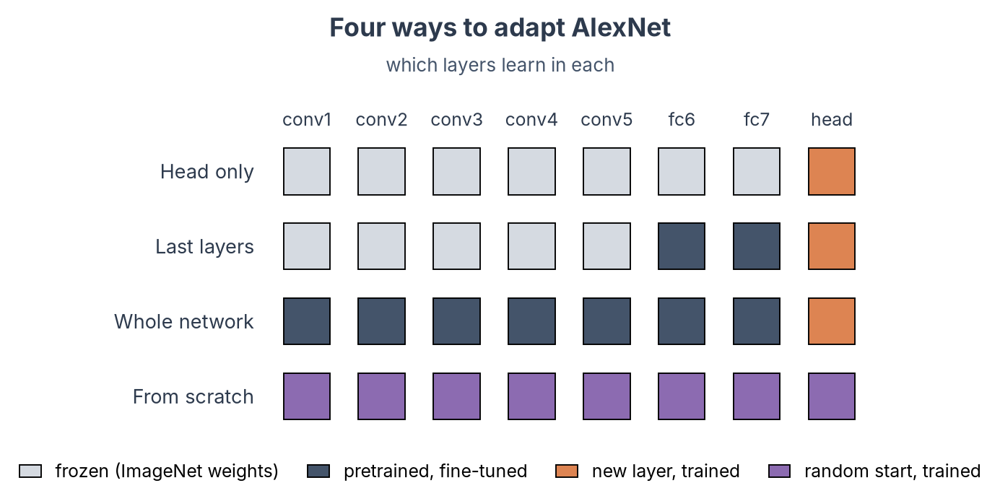
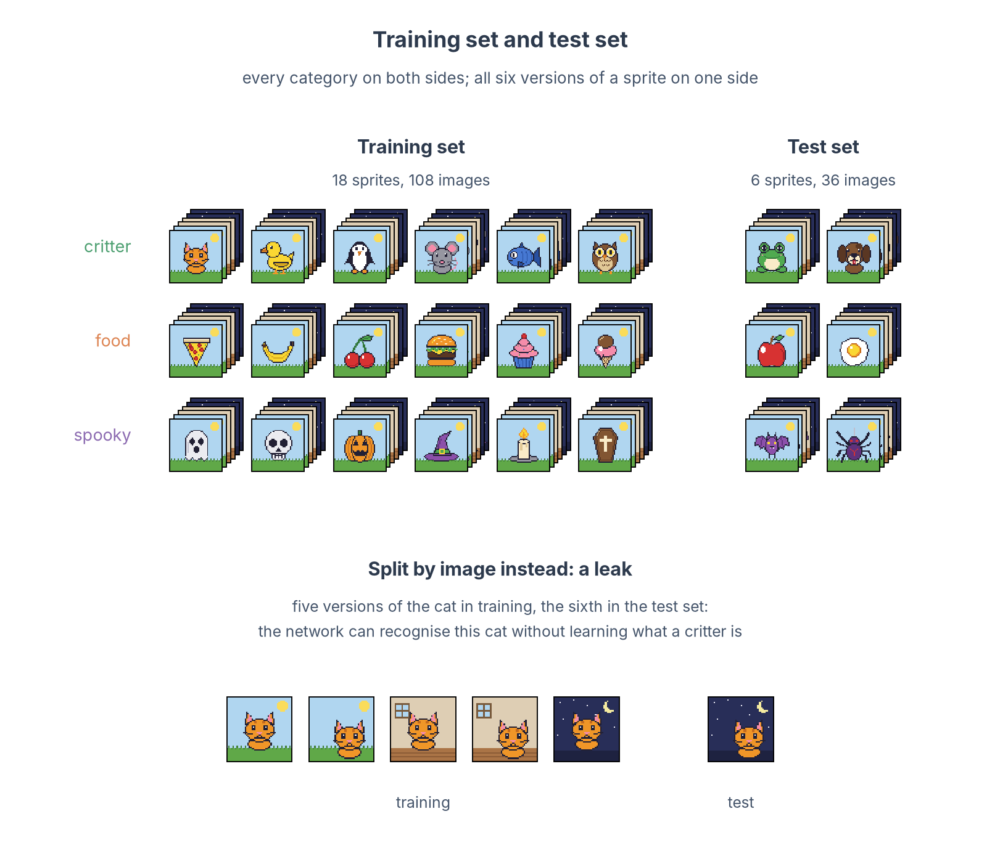
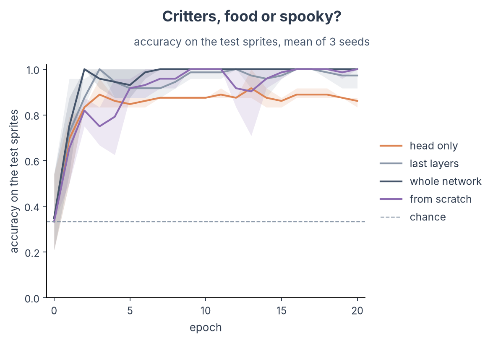

# Train or fine-tune a model

!!! abstract "On this page"
    - **You need:** the environment and toy kit from [Set up and pick a model](dnn-setup.md).
    - **You get:** AlexNet trained on the sprites, and a fair test of how well it learned.
    - **Skip this page** if a public model is good enough for your question: go to [Extract activations](dnn-extract.md).

---

## Do you need to train at all?

Training a network from nothing takes a large labelled dataset and days of GPU time. Most of the time you can avoid it.

| Situation | What to do |
|---|---|
| You want to know how a standard vision model represents your stimuli | **No training.** Use a pretrained model as it is. |
| The model does not know your images or task (pixel art, chess boards, a new set of categories), and you have hundreds to thousands of labelled images | **Fine-tune** a pretrained model. If your images are far from photographs, also try training from scratch. |
| The training itself is your question (what a network learns from a given diet of images), or no pretrained model fits your input | **Train from scratch**, usually on a large dataset and a GPU cluster. |

Fine-tuning starts from a network that already learned useful features on ImageNet and changes only part of it. The figure shows which layers are trained in the three common choices, next to training from scratch:



| Strategy | What is trained | Data needed | Representations in the frozen layers |
|---|---|---|---|
| **Head only** | A new output layer, on top of frozen features | Very little | Unchanged: identical to the pretrained model |
| **Last layers** | The fully connected layers and the new head | Little | Convolutional layers unchanged |
| **Whole network** | Everything, with a small learning rate | More | All layers can change, the early ones least |
| **From scratch** | Everything, from random weights | A lot | Nothing is kept from ImageNet |

!!! info "Fine-tuning changes what you compare with the brain"
    If you later compare layers with brain data, remember which layers you trained. With *head only* the network's features are exactly those of the public model; with *whole network* every layer may have moved towards your task.

---

## 1. Load the sprites and split them

Our sprites are far from photographs: AlexNet calls the cat a jigsaw puzzle and the ghost a traffic light (see [the previous page](dnn-setup.md#4-run-the-model-on-the-sprites)). Here we teach it our three categories, critters, food and spooky things, and test it on sprites it has never seen. Each category has its own scene, grass, a plate or a night sky, so there is something visual to learn.

```python
from pathlib import Path

import pandas as pd
import torch
from PIL import Image
from torch import nn
from torch.utils.data import DataLoader, Dataset
from torchvision import models, transforms

KIT = Path("dnn-toy-kit")
device = "cuda" if torch.cuda.is_available() else "cpu"  # use the GPU when there is one
torch.manual_seed(0)  # (1)!

# One row per image: file, category, sprite, variant
manifest = pd.read_csv(KIT / "manifest.csv")
classes = sorted(manifest["category"].unique())  # ['critter', 'food', 'spooky']
# Scale every image to the mean and spread of the ImageNet photos AlexNet was trained on
normalize = transforms.Normalize(mean=[0.485, 0.456, 0.406], std=[0.229, 0.224, 0.225])

# Training: a small random shift in every epoch, then enlarge to 224 x 224
train_transform = transforms.Compose([
    transforms.RandomCrop(16, padding=2, padding_mode="edge"),  # (2)!
    # Keep the pixels sharp
    transforms.Resize(224, interpolation=transforms.InterpolationMode.NEAREST),
    transforms.ToTensor(),  # image -> tensor with values from 0 to 1
    normalize,
])
# Testing: no randomness, only the enlargement
test_transform = transforms.Compose([
    transforms.Resize(224, interpolation=transforms.InterpolationMode.NEAREST),
    transforms.ToTensor(),
    normalize,
])


class SpriteDataset(Dataset):  # (3)!
    """Images and category labels for some rows of the manifest."""

    def __init__(self, rows, transform):
        self.rows = rows.reset_index(drop=True)
        self.transform = transform

    def __len__(self):
        return len(self.rows)

    def __getitem__(self, i):
        row = self.rows.iloc[i]
        image = Image.open(KIT / row["file"]).convert("RGB")
        # Image tensor, class number
        return self.transform(image), classes.index(row["category"])
```

1. Fixes the random parts (the new layer's starting weights, the shifts, the order of the images), so a rerun on the same computer gives similar numbers. GPUs add some randomness of their own.
2. Pads the 16 x 16 sprite by two pixels on each side, copying its edge pixels, and cuts a random 16 x 16 window out of it: a random shift of up to two pixels, in which the grass or the night sky continues. Every epoch is slightly different, which helps against overfitting on a small dataset. We do not mirror the sprites: many of them are symmetric, so a mirrored sprite is the same image.
3. A `Dataset` tells PyTorch how many images there are and how to load image number `i`. Ours reads the rows of the manifest it is given.

### Training set and test set

The network learns from a training set and is scored on a test set. Both contain all three categories, but no image is in both. Training runs in epochs: in each epoch the network sees every training image once and adjusts its weights after every batch, and at the end of the epoch we score it on the test set, which it never learns from. The test score shows whether the network has learned the categories well enough to recognise new examples, not whether it remembers its training images.

With our kit, a new example has to be a new sprite, not only a new image. The four versions of a sprite are the same object: if the shifted cat is in the training set and the original cat in the test set, the network can answer "critter" because it recognises that cat, without having learned anything general about critters. That is a leak: test accuracy goes up, but it measures memory of individual sprites. So all four versions of a sprite go to the same side.

We keep a quarter of the sprites for the test set: two from each category, six sprites and 24 images in all. The other 18 sprites (72 images) are the training set.



```python
# Two sprites from each category, with all four versions of each
test_sprites = ["cat", "penguin", "banana", "cherry", "pumpkin", "skull"]  # (1)!
is_test = manifest["sprite"].isin(test_sprites)
train_rows, test_rows = manifest[~is_test], manifest[is_test]
print(len(train_rows), "training images,", len(test_rows), "test images")
```

1. Selecting by sprite keeps the four versions together, and two sprites per category keep the categories balanced. With more stimuli, `StratifiedGroupKFold` from scikit-learn picks a split like this for you: `groups` keeps each object's images together, and it keeps the category proportions as close as it can. Check the counts on each side, since it does not guarantee them.

??? example "Output"

    ```text
    72 training images, 24 test images
    ```

Every choice you tune, such as the number of epochs or the learning rate, has to be made without looking at the test sprites. Score the final model on them once.

!!! tip "Your own stimuli: training on the images of an fMRI study"
    **Why train on them.** To give a network the categories or the task of your experiment, for example to test whether a network trained to tell your categories apart matches the brain better than an off-the-shelf one. A stimulus set has tens to a few hundred images, so fine-tune rather than train from scratch, unless your images are far from photographs.

    **How to split them.** The same two rules hold:

    - Put every category in both the training and the test set, in the same proportions, so that chance is known.
    - Keep together the images that show the same thing: the views, sizes, colours or crops of one object, the frames of one video, the photos of one scene. They all go to the same side, or the test measures memory of that object. `StratifiedGroupKFold` from scikit-learn makes such a split, with the object as the group; it keeps the category proportions as close as it can, so check the counts.

    **Comparing with the brain.** Training adjusts the network's features to the training images. Compare the network with the brain only on images it did not train on, the test images. Otherwise the comparison is circular, all the more if your brain measure was defined with the same category labels.

---

## 2. Fine-tune AlexNet on them

We fine-tune the whole network: every layer starts from its ImageNet weights and keeps learning, at a small learning rate. The commented lines give the other strategies from the table above.

```python
def build_model(n_classes, pretrained=True):
    """AlexNet with a new output layer, and an optimiser for the layers that learn."""
    # None: random starting weights
    weights = models.AlexNet_Weights.IMAGENET1K_V1 if pretrained else None
    model = models.alexnet(weights=weights)
    model.classifier[6] = nn.Linear(4096, n_classes)  # (1)!

    # All layers learn (fine-tune the whole network). To train only part of it,
    # uncomment one pair:
    # model.requires_grad_(False)               # head only: freeze everything ...
    # model.classifier[6].requires_grad_(True)  # ... except the new output layer
    # model.requires_grad_(False)               # last layers: freeze everything ...
    # model.classifier.requires_grad_(True)     # ... except fc6, fc7 and the head

    trainable = [p for p in model.parameters() if p.requires_grad]
    optimizer = torch.optim.Adam(trainable, lr=1e-4)  # (2)!
    return model.to(device), optimizer


@torch.no_grad()  # no learning while testing, so no gradients are needed
def accuracy(model, loader):
    """Share of images whose most likely class is the right one."""
    model.eval()  # (3)!
    correct = sum((model(x.to(device)).argmax(1).cpu() == y).sum().item() for x, y in loader)
    return correct / len(loader.dataset)


def train_and_test(model, optimizer, train_loader, test_loader, epochs):
    """Train for a number of epochs; return the test accuracy before training and after each epoch."""
    history = [accuracy(model, test_loader)]  # epoch 0: before any training
    for epoch in range(epochs):  # one epoch = one pass through all training images
        model.train()  # dropout on again for training
        for x, y in train_loader:  # one batch of images x with their labels y
            # How wrong the predictions are
            loss = nn.functional.cross_entropy(model(x.to(device)), y.to(device))
            optimizer.zero_grad()  # forget the gradients of the previous batch
            loss.backward()        # compute how each weight should change
            optimizer.step()       # change the weights a little
        history.append(accuracy(model, test_loader))  # (4)!
    return history


EPOCHS = 20  # (5)!
# A new random order of the training images in every epoch
train_loader = DataLoader(SpriteDataset(train_rows, train_transform), batch_size=16, shuffle=True)
test_loader = DataLoader(SpriteDataset(test_rows, test_transform), batch_size=64)
model, optimizer = build_model(n_classes=len(classes))
# Train from scratch instead:
# model, optimizer = build_model(n_classes=len(classes), pretrained=False)
history = train_and_test(model, optimizer, train_loader, test_loader, EPOCHS)
print(f"{history[-1]:.0%} correct on the test sprites after {EPOCHS} epochs")
```

1. The ImageNet head has 1000 outputs, one per ImageNet class. We replace it with a new, randomly initialised layer with one output per category.
2. A small learning rate keeps the pretrained features from being overwritten. If you train only the new head, use `lr=1e-3`: a new layer on its own can learn faster. A common refinement is to give the pretrained layers an even smaller rate than the head, with one parameter group per part in the optimiser.
3. `eval()` switches off dropout, so the network gives the same answer for the same image. `train()` switches it back on.
4. The test accuracy before training (epoch 0) and after every epoch gives the learning curve. Before training, even a pretrained network is near chance: its new output layer starts random. The score we report is the one after the last epoch.
5. Long enough for every strategy to fit the training sprites: in our runs, training from scratch, the slowest, got them all right after 11 epochs. We chose the number from that training accuracy, not from the test sprites.

??? example "Output"

    ```text
    100% correct on the test sprites after 20 epochs
    ```

??? example "Plot the learning curve"

    ```python
    import matplotlib.pyplot as plt
    
    fig, ax = plt.subplots(figsize=(6, 3.5))
    ax.plot(range(EPOCHS + 1), history, label="whole network")  # epochs 0 to 20
    # Three categories: 33% by guessing
    ax.axhline(1 / 3, color="grey", ls="--", lw=1, label="chance")
    ax.set(ylim=(0, 1.05), xlabel="epoch", ylabel="accuracy on the test sprites")
    ax.legend(frameon=False, fontsize=8)
    plt.show()
    ```

To compare the strategies, we ran this code with each of the alternatives switched on (and `lr=1e-3` for the head only), three times with different seeds:



Averaged over three seeds, every strategy learns the categories (chance is 33%). Before training, at epoch 0, all of them are near chance, because the output layer starts random. The fine-tuned whole network learns fastest: 75% correct on the test sprites after one epoch, 100% after two, and 100% again at the end. The last layers end at 97% and the head only at 86%: with its features frozen, the head can only reweigh what ImageNet taught the network. Training from scratch is at 65% after one epoch, passes 90% after five and ends at 100%. The scenes are easy to see, so a network that starts from nothing finds them too; the pretrained features get there faster.

On natural images, the advantage of fine-tuning is larger still, in training time and often in accuracy. A pretrained network has already learned features that extract meaning from images, and the statistics of natural images, so it starts close to a good solution for a visual task and only has to adjust. A network trained from scratch has to learn all of this from your images alone. In our runs on the ants and bees of the [PyTorch transfer-learning tutorial](https://pytorch.org/tutorials/beginner/transfer_learning_tutorial.html), photos close to ImageNet, fine-tuned AlexNet was about 90% correct after a single epoch, while the same network trained from scratch reached 70% after 15. On our sprites, the scenes are a cue so plain that training from scratch catches up within a few epochs.

!!! tip "Want to train on real photos?"
    The code above works on any image dataset; for photos, load the images with `ImageFolder` instead of the manifest.

    - [Imagenette](https://github.com/fastai/imagenette): ten easy ImageNet classes, 99 MB at 160 pixels (Apache-2.0). Small enough for a laptop.
    - [ecoset](https://huggingface.co/datasets/kietzmannlab/ecoset): 1.5 million images in 565 basic-level categories, chosen by how often people use their names and how concrete they are ([Mehrer et al., 2021](https://doi.org/10.1073/pnas.2011417118)). 155 GB, CC BY-NC-SA.
    - [THINGS](https://things-initiative.org/): 26,107 photos of 1,854 object concepts, with fMRI, MEG and EEG recorded on the same images. Academic use only; the THINGSplus-CC0 subset is free to publish.
    - [ImageNet](https://www.image-net.org/): the 1000 classes AlexNet and most models on these pages were trained on. Free registration for research.

    <!-- doctest: skip -->
    ```python
    from torchvision import datasets
    from torchvision.datasets.utils import download_and_extract_archive

    # Imagenette at 160 pixels (99 MB), unpacked to imagenette2-160/train and imagenette2-160/val
    download_and_extract_archive("https://s3.amazonaws.com/fast-ai-imageclas/imagenette2-160.tgz", download_root=".")
    photo_train = transforms.Compose([
        transforms.RandomResizedCrop(224),  # a random part of the photo, resized to 224 x 224
        transforms.RandomHorizontalFlip(),  # a mirrored dog is still a dog
        transforms.ToTensor(),
        normalize,
    ])
    photo_test = transforms.Compose([transforms.Resize(224), transforms.CenterCrop(224), transforms.ToTensor(), normalize])
    # One folder per class; the folder name is the label
    train_set = datasets.ImageFolder("imagenette2-160/train", photo_train)
    test_set = datasets.ImageFolder("imagenette2-160/val", photo_test)
    model, optimizer = build_model(n_classes=len(train_set.classes))
    history = train_and_test(model, optimizer, DataLoader(train_set, batch_size=64, shuffle=True),
                             DataLoader(test_set, batch_size=128), epochs=3)
    print(f"{history[-1]:.0%} correct on the test photos")
    ```

    In our run, the fine-tuned AlexNet was 92% correct on the 3,925 test photos after one epoch and 93% after three.

---

## 3. Save the network

The network trained above has seen only the training sprites. Save its weights for the next pages, together with the list of test images: when you compare the network with the brain, those are the images to use.

```python
torch.save(model.state_dict(), "sprite_alexnet.pt")  # (1)!
test_rows[["image_id", "sprite", "category"]].to_csv("sprite_alexnet_test_images.csv", index=False)
```

1. The file holds the weights, not the architecture. To load it, build the same network first, as in [Extract activations](dnn-extract.md#4-save-them-with-the-image-order) (box "Your own trained model").

---

## Good practice

??? tip "Evaluate on held-out *items*, not held-out images"
    Split by the thing you want to generalise over (sprite, object, participant, game), never by single images. `GroupKFold` and `StratifiedGroupKFold` from scikit-learn do this. You can score the test set as often as you like, for example after every epoch to draw a learning curve, but choose nothing from those scores. Fix the number of epochs, the learning rate and other settings in advance, or choose them on a validation split inside the training data.

??? tip "Very few images: cross-validate"
    With a small stimulus set, one test set gives a noisy score: it depends on which images happened to land in it. With our six test sprites, one image moves the score by 4%, and a different choice of test sprites gives a different score. Repeat the training with different test sets, so that every item is tested once, and average the scores. `StratifiedGroupKFold` from scikit-learn makes the splits, keeping the images of an item together and the category proportions as close as it can. The cost is one trained network per split.

??? tip "Seeds, repeats and what to report"
    Results from one training run vary with the random seed. Train a few seeds per condition and report the mean and spread. Save the seed, the configuration and the code version with every trained model, so you can tell later which checkpoint came from which settings.

??? warning "Batch normalisation in partly frozen networks"
    AlexNet has no batch-norm layers, but ResNets do. In `model.train()` mode these layers keep updating their running statistics even when their weights are frozen. When you freeze part of a ResNet, put the frozen part in `eval()` mode during training, or the "frozen" features still change.

??? info "Training from scratch on a large dataset"
    The loop above is the same at any scale; what changes is the infrastructure around it.

    - **Data:** use a `DataLoader` with several workers (`num_workers=8`) and images stored on a fast local disk.
    - **Configuration:** keep every setting (model, learning rate, epochs, seed, data split) in a config file, not in the code, and save a copy next to each checkpoint.
    - **Checkpoints:** save the model and optimiser state every epoch, so a crashed or time-limited job can resume.
    - **Speed:** mixed precision (`torch.autocast`) roughly halves memory use and time on recent GPUs.
    - **Smoke test:** before a long run, train for a few batches on a tiny subset to catch errors in minutes instead of hours.
    - **Compute:** long trainings belong on a GPU server or on the VSC cluster ([HPC page](../fmri/analysis/fmri-hpc.md)), submitted as a batch job.

---

## Where next?

<div class="grid cards" markdown>

- :material-layers-triple:{ .lg .middle } __[Extract activations](dnn-extract.md)__

    ---

    Record the layers of the pretrained (or your fine-tuned) network for every image.

- :material-brain:{ .lg .middle } __[Compare with brain data](dnn-compare.md)__

    ---

    RSA, decoding and encoding models between network layers and ROIs.

</div>
