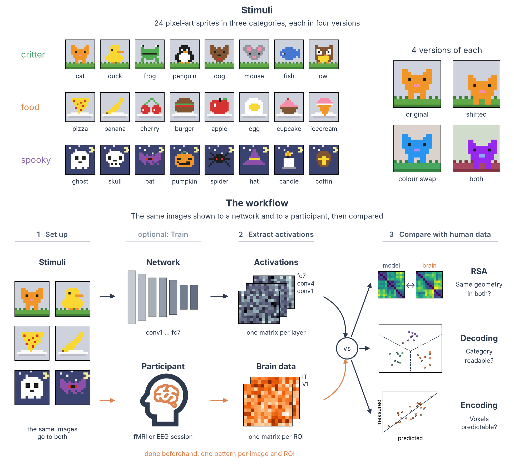

# Neural networks

Deep neural networks (DNNs) trained on images predict neural responses along the primate ventral visual stream better than earlier models ([Yamins et al., 2014](https://doi.org/10.1073/pnas.1403112111); the [Brain-Score](https://www.brain-score.org) benchmarks compare many of them). We show a network the same images as our participants, record what its layers do, and compare those activations with fMRI or EEG data. This section gets you started with that workflow in Python and [PyTorch](https://pytorch.org/), using a small set of pixel-art images that runs on any laptop.

!!! info "Before you start"
    You need basic Python and a conda installation. If either is new to you, start with [Coding practices](../coding/index.md).

All pages use the same small dataset, so you can run every code block as you read. It has 24 pixel-art sprites in three categories, each category with its own scene and each sprite in four variants, and synthetic "brain activations" for two regions of interest.

[:material-download: Download the toy kit](../../assets/dnn/dnn-toy-kit.zip){ .md-button } [What is inside](dnn-setup.md#2-get-the-toy-kit){ .md-button }

---

## What do you want to do?

Pick the path that matches your project. Every path starts with [Set up and pick a model](dnn-setup.md).

- :material-download-box:{ .lg .middle } __Use a pretrained model__

    ---

    The path most projects take: download a public network (AlexNet, ResNet, CORnet, ...), show it your stimuli and record its layers, without training anything.

    [Set up](dnn-setup.md) → [Extract](dnn-extract.md) → [Compare](dnn-compare.md)

- :material-school:{ .lg .middle } __Train or fine-tune a model__

    ---

    When public models do not know your images or task (chess boards, pixel art, new categories), adapt one first.

    [Set up](dnn-setup.md) → [Fine-tune](dnn-train.md) → [Extract](dnn-extract.md) → [Compare](dnn-compare.md)

- :material-shape-outline:{ .lg .middle } __Test a hypothesis about the layers__

    ---

    No brain data yet: ask which layers follow a visual property and which follow category, with model RDMs and decoding.

    [Set up](dnn-setup.md) → [Extract](dnn-extract.md) → [Compare with a model](dnn-model.md)

- :material-brain:{ .lg .middle } __Compare a model with brain data__

    ---

    You already have layer activations and brain patterns for the same images, and want RSA, decoding or an encoding model. The page also shows how to read betas from an SPM GLM.

    [Set up](dnn-setup.md) → [Compare](dnn-compare.md)

??? question "Do I need a GPU?"
    No. Everything in this section runs on a laptop CPU. For real projects with large models or many images, use a GPU machine or the VSC cluster (see [HPC](../fmri/analysis/fmri-hpc.md)). If the environment gives you trouble on a GPU machine, [Set up](dnn-setup.md#1-create-the-environment) shows how to keep training in a separate one.

??? question "I work in MATLAB. Can I still use this?"
    The network side needs Python: the models, their weights and the tools to read their layers are all Python packages. Once you have saved the activations (as on [Extract activations](dnn-extract.md)), you can also save them as a `.mat` file with `scipy.io.savemat` and run RSA or decoding in MATLAB with the tools you know, for example [CoSMoMVPA](../fmri/analysis/fmri-mvpa.md).
