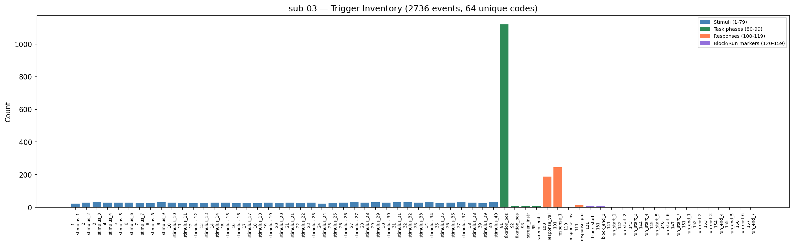
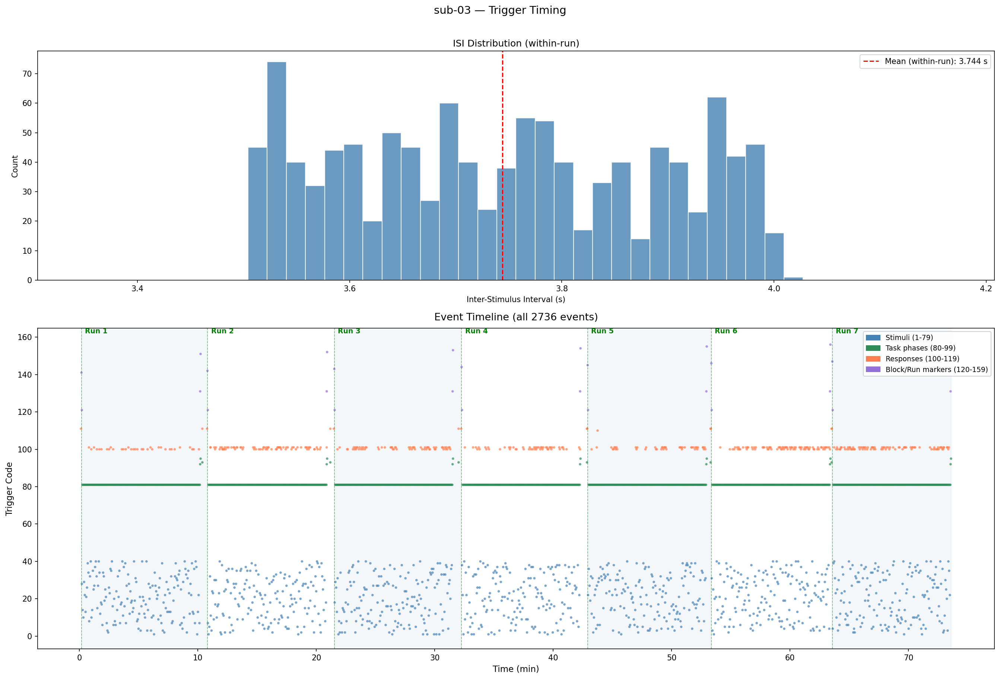
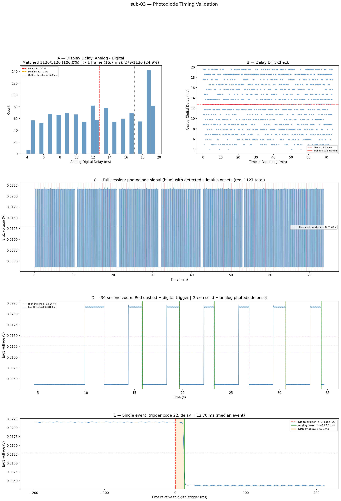
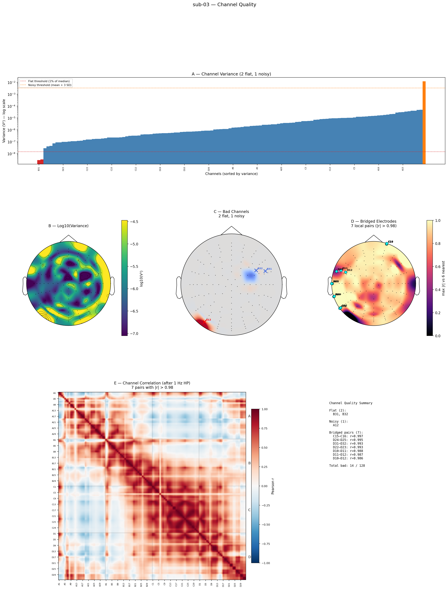
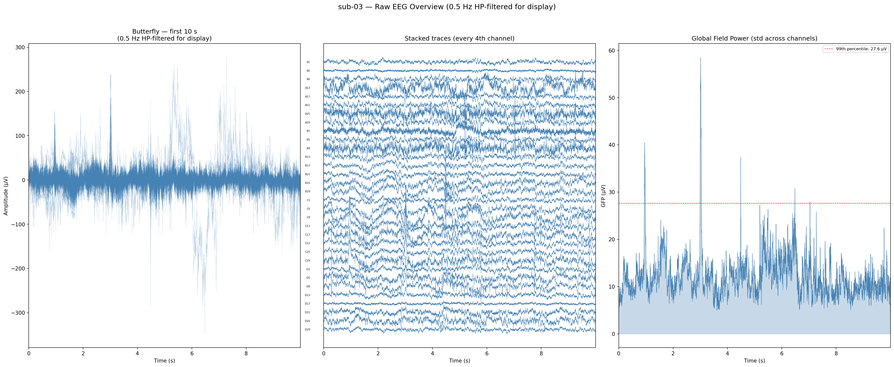
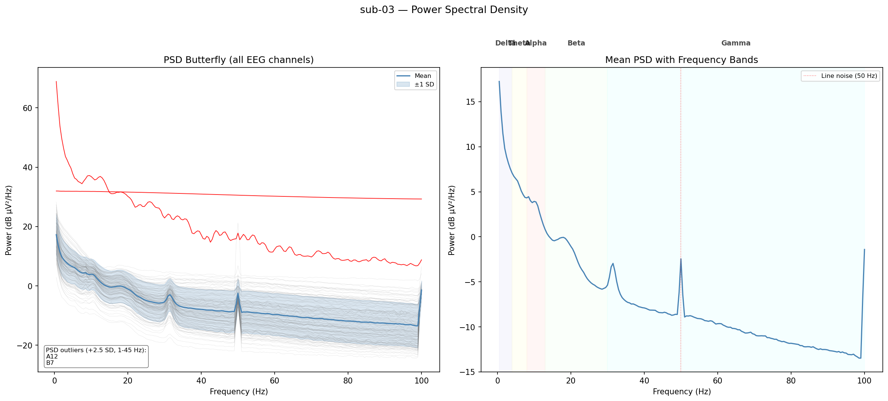
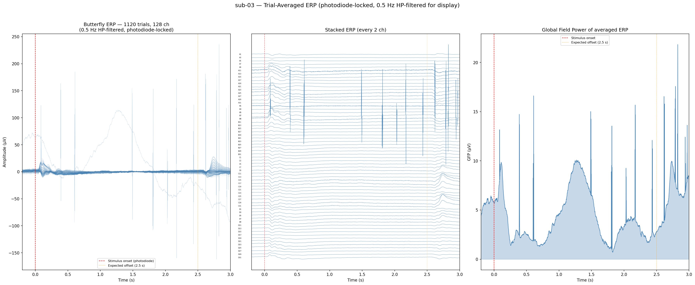
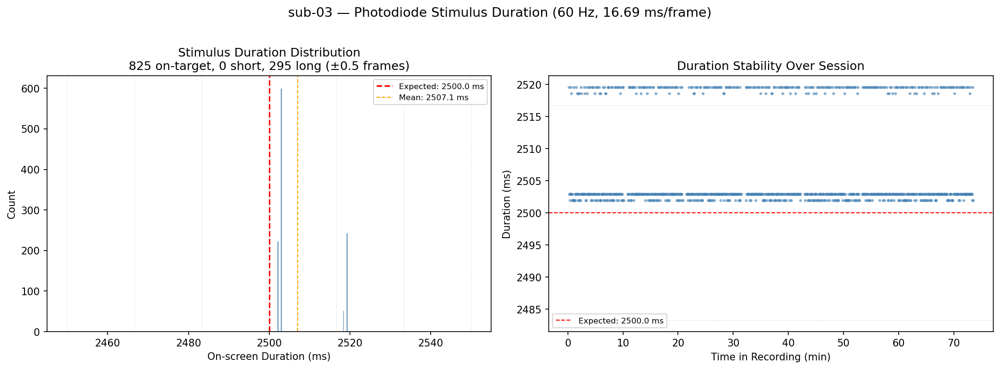
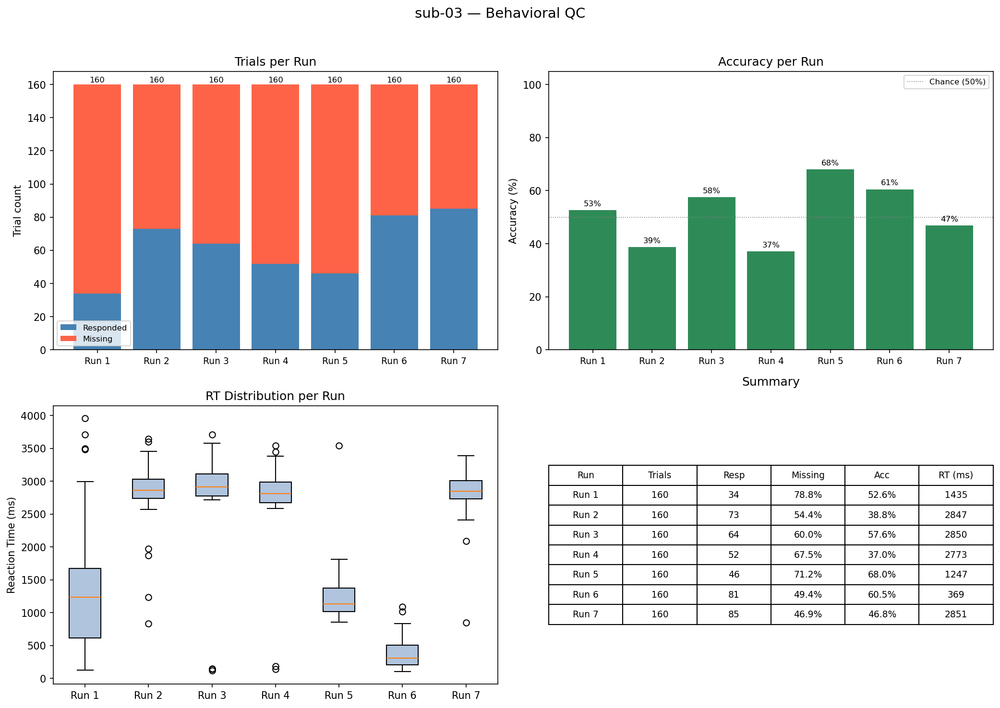
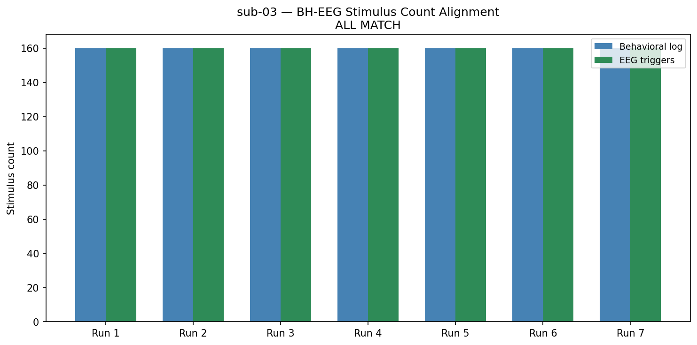

# Quality control

Before preprocessing, verify that your raw data is usable: triggers were sent and recorded correctly, stimulus timing is accurate, and electrodes were functioning properly. Catching problems at this stage saves you from preprocessing data that will need to be discarded.

This page walks through every check in detail — with full code — so you can understand and adapt it. The canonical implementation lives in `code/01_quality_control.py`.

---

## Run the canonical script

In our current lab setup, run QC in the Miniforge conda env `eeg`:

```bash
source ~/miniforge3/etc/profile.d/conda.sh
conda activate eeg

cd /data/projects/chess-eeg
python code/01_quality_control.py
```

Outputs are saved under:

```
code/results/YYYYMMDD_HHMMSS_01_quality_control/
```

Example outputs (from `sub-03`, copied into this wiki under `docs/assets/eeg-qc-chess-eeg/`):

```
code/results/YYYYMMDD_HHMMSS_01_quality_control/
├── 01_quality_control.py          # exact copy of the script that produced these results
├── 01_quality_control.log         # full log output
├── qc_summary.csv                 # per-check pass/warn/fail table
├── sub-03_trigger_inventory.csv   # trigger code × count table
├── sub-03_trigger_inventory.png   # trigger inventory bar plot
├── sub-03_trigger_timing.png       # ISI histogram + event timeline (2-panel)
├── sub-03_photodiode_delays.csv   # per-event analog-digital delay
├── sub-03_photodiode.png          # photodiode timing validation (5-panel)
├── sub-03_photodiode_duration.png # stimulus on-screen duration distribution
├── sub-03_channel_quality.png     # channel quality diagnostics (6-panel)
├── sub-03_raw_segment.png         # raw signal butterfly + GFP
├── sub-03_psd.png                 # power spectral density
├── sub-03_epoch_traces.png        # trial-averaged ERP (photodiode-locked)
├── sub-03_behavioral.png          # per-run behavioral summary
└── sub-03_bh_eeg_alignment.png    # behavioral ↔ EEG trigger count comparison
```

---

## Imports and configuration

The script starts with all imports and configuration constants. Adjust these to match your project (paths, channel names, thresholds).

```python
"""
01_quality_control.py — Pre-preprocessing quality control for raw BDF recordings.

This script runs a comprehensive battery of QC checks on the raw EEG data
BEFORE any preprocessing (filtering, re-referencing, ICA, etc.). The goal is
to catch hardware issues, recording problems, and data anomalies early so that
we can make informed decisions about which channels to interpolate, which
segments to reject, and whether any subjects need to be excluded entirely.

All outputs (plots, CSV, log) are saved to a timestamped results directory
for traceability and reproducibility.
"""

# =============================================================================
# PATH CONFIGURATION — all paths are absolute, derived from project root
# =============================================================================
import os

root_path = "/data/projects/chess-eeg"
sourcedata_path = os.path.join(root_path, "sourcedata")
bids_path = os.path.join(root_path, "BIDS")
code_path = os.path.join(root_path, "code")

# =============================================================================
# SUBJECT LIST — only sub-03 exists currently; add IDs as data comes in
# =============================================================================
SUBJECT_IDS = ["03"]

# =============================================================================
# EXPERIMENT PARAMETERS — expected recording characteristics
# =============================================================================
TASK_LABEL = "chess1back"
SFREQ_EXPECTED = 1024          # BioSemi sampling rate (Hz)
N_EEG_CHANNELS_EXPECTED = 128  # BioSemi 128-channel cap
POWER_LINE_FREQ = 50           # European mains frequency (Hz)
STIMULUS_DURATION_S = 2.5      # duration each chess stimulus is displayed

# BioSemi trigger mask: lower 8 bits carry the actual trigger code
TRIGGER_MASK = 0x00FF

# Trigger mapping file
TRIGGER_MAPPING_PATH = os.path.join(code_path, "data", "trigger_mapping.json")

# --- Channel quality thresholds ---
# A channel is "flat" if its variance is less than this fraction of the median
# variance across all EEG channels. Flat channels indicate loose electrodes
# or hardware faults — they contribute no neural signal.
FLAT_CHANNEL_THRESHOLD = 0.01  # < 1% of median variance

# A channel is "noisy" if its variance exceeds the mean by more than this many
# standard deviations. Noisy channels are dominated by artifact and will
# contaminate spatial filters (ICA, re-referencing).
NOISY_CHANNEL_SD_THRESHOLD = 3.0  # > 3 SD above mean

# Bridged channel detection: we high-pass filter the data first to remove
# shared DC offset from BioSemi's unreferenced recording. Without this,
# all channels appear highly correlated due to the common DC component.
# After filtering, only genuinely bridged pairs (sharing gel) will show
# near-perfect correlation.
BRIDGED_HIGHPASS_FREQ = 1.0   # Hz — HP filter before computing correlation
BRIDGED_CORRELATION_THRESHOLD = 0.98  # now meaningful after HP filtering

# --- Photodiode analysis parameters ---
# The photodiode on Erg1 measures actual screen brightness. In our setup:
#   - High voltage (~0.022 V) = bright screen (fixation cross with white patch)
#   - Low voltage (~0.003 V) = stimulus on screen (chess position)
# So STIMULUS ONSET = FALLING EDGE (high → low transition).
PHOTODIODE_MIN_EVENT_DISTANCE_S = 0.5
PHOTODIODE_MATCH_TOLERANCE_S = 0.200  # 200 ms
PHOTODIODE_OUTLIER_THRESHOLD_MS = 17.0

# --- BioSemi channel type overrides ---
# Must set these so that QC correctly identifies which channels are EEG (128)
# vs EOG/misc/stim.
CHANNEL_TYPE_OVERRIDES = {
    "EXG1": "eog", "EXG2": "eog", "EXG3": "eog", "EXG4": "eog",
    "EXG5": "misc", "EXG6": "misc", "EXG7": "misc", "EXG8": "misc",
    "Erg1": "misc",
    "Status": "stim",
}
AUX_CHANNELS_TO_DROP = ["GSR1", "GSR2", "Erg2", "Resp", "Plet", "Temp"]

# --- Plot parameters ---
SEGMENT_PLOT_DURATION_S = 10.0  # duration of the raw signal overview plot

# =============================================================================
# IMPORTS
# =============================================================================
import json
import logging
import shutil
from datetime import datetime
from collections import Counter
import re

import numpy as np
import pandas as pd
import matplotlib
matplotlib.use("Agg")  # non-interactive backend — we only save to file
import matplotlib.pyplot as plt
from matplotlib.patches import Patch
from matplotlib.collections import LineCollection
import mne
```

---

## Infrastructure: results directory and trigger helpers

Every run gets its own timestamped folder. A copy of the script is saved for exact reproducibility.

```python
def setup_results_dir(script_path: str) -> str:
    """Create a timestamped results directory and configure logging."""
    script_name = os.path.splitext(os.path.basename(script_path))[0]
    timestamp = datetime.now().strftime("%Y%m%d_%H%M%S")
    results_dir = os.path.join(code_path, "results", f"{timestamp}_{script_name}")
    os.makedirs(results_dir, exist_ok=True)

    # Copy the script itself into the results folder for reproducibility
    shutil.copy2(script_path, os.path.join(results_dir, os.path.basename(script_path)))

    # Configure logging to write to BOTH console and a file in results_dir.
    log_file = os.path.join(results_dir, f"{script_name}.log")
    root_logger = logging.getLogger()
    root_logger.setLevel(logging.DEBUG)
    root_logger.handlers.clear()

    console_handler = logging.StreamHandler()
    console_handler.setLevel(logging.INFO)
    console_handler.setFormatter(
        logging.Formatter("%(asctime)s [%(levelname)s] %(message)s", datefmt="%H:%M:%S")
    )
    root_logger.addHandler(console_handler)

    file_handler = logging.FileHandler(log_file)
    file_handler.setLevel(logging.DEBUG)
    file_handler.setFormatter(
        logging.Formatter("%(asctime)s [%(levelname)s] %(message)s",
                          datefmt="%Y-%m-%d %H:%M:%S")
    )
    root_logger.addHandler(file_handler)

    logging.info("Results directory: %s", results_dir)
    return results_dir


def load_trigger_mapping(path: str) -> dict:
    """Load the trigger mapping JSON and return it as a dict."""
    with open(path, "r") as f:
        mapping = json.load(f)
    logging.info("Loaded trigger mapping from %s (schema v%s)",
                 path, mapping.get("_schema_version", "unknown"))
    return mapping


def describe_trigger_code(code: int, trigger_map: dict) -> str:
    """
    Return a human-readable label for a trigger code using the mapping.

    Translates numeric codes like '141' into 'run_start_1' by checking:
    stimulus range (1-79), named triggers (single-value entries), and
    base+offset ranges (run_start, block_start, etc.).
    """
    # Check stimulus range (1-79)
    if 1 <= code <= 79:
        return f"stimulus_{code}"

    # Check named triggers (single-value entries like fixation_onset=80)
    for key, val in trigger_map.items():
        if key.startswith("_"):
            continue
        if isinstance(val, int) and val == code:
            return key

    # Check base+offset ranges (run_start, block_start, etc.)
    base_keys = {
        "run_start_base": "run_start",
        "run_end_base": "run_end",
        "block_start_base": "block_start",
        "block_end_base": "block_end",
        "response_valid_base": "response",
    }
    for base_key, label_prefix in base_keys.items():
        if base_key in trigger_map:
            base = trigger_map[base_key]
            offset = code - base
            if 1 <= offset <= 9:
                return f"{label_prefix}_{offset}"

    # Check special response codes
    if code == trigger_map.get("response_invalid", -1):
        return "response_invalid"
    if code == trigger_map.get("response_proceed", -1):
        return "response_proceed"
    if code == trigger_map.get("response_escape", -1):
        return "response_escape"

    return f"unknown_{code}"
```

---

## 1. Load and describe the recording

Verify basic recording parameters (sampling rate, channel count, duration) against expectations. If these don't match, something went wrong during recording and all downstream analyses would be invalid.

```python
def qc_recording_description(raw: mne.io.Raw, sub_id: str) -> dict:
    """
    QC Check 1: Verify basic recording parameters against expectations.

    Returns a dict with recording parameters and pass/fail status.
    """
    logging.info("--- QC 1: Recording Description ---")

    sfreq = raw.info["sfreq"]

    # Try to derive the screen refresh rate from the behavioural session log
    # so the '1 screen flip' threshold is not hardcoded.
    refresh_hz = None
    try:
        bh_dir = os.path.join(sourcedata_path, f'sub-{sub_id}', 'bh')
        if os.path.isdir(bh_dir):
            for fn in os.listdir(bh_dir):
                if fn.endswith('_session.log'):
                    p = os.path.join(bh_dir, fn)
                    with open(p, 'r', encoding='utf-8', errors='ignore') as f:
                        for line in f:
                            m = re.search(r'Refresh rate:\s*([0-9.]+)\s*Hz', line)
                            if m:
                                refresh_hz = float(m.group(1))
                                break
                    if refresh_hz is not None:
                        break
    except Exception:
        refresh_hz = None

    if refresh_hz is None or refresh_hz <= 0:
        refresh_hz = 60.0
    frame_ms = 1000.0 / refresh_hz
    n_channels = len(raw.ch_names)
    duration_s = raw.times[-1]
    duration_min = duration_s / 60.0

    # Count channel types
    ch_types = raw.get_channel_types()
    type_counts = Counter(ch_types)

    logging.info("  Sampling rate: %.0f Hz (expected: %d Hz)", sfreq, SFREQ_EXPECTED)
    logging.info("  Total channels: %d", n_channels)
    logging.info("  Channel types: %s", dict(type_counts))
    logging.info("  Duration: %.1f s (%.1f min)", duration_s, duration_min)

    # Pass/fail checks
    sfreq_ok = sfreq == SFREQ_EXPECTED
    n_eeg = type_counts.get("eeg", 0)
    eeg_ok = n_eeg == N_EEG_CHANNELS_EXPECTED

    if not sfreq_ok:
        logging.warning("  FAIL: Sampling rate mismatch (got %.0f, expected %d)",
                        sfreq, SFREQ_EXPECTED)
    if not eeg_ok:
        logging.warning("  FAIL: EEG channel count mismatch (got %d, expected %d)",
                        n_eeg, N_EEG_CHANNELS_EXPECTED)

    return {
        "sfreq_hz": sfreq,
        "sfreq_pass": sfreq_ok,
        "n_channels_total": n_channels,
        "n_eeg_channels": n_eeg,
        "eeg_count_pass": eeg_ok,
        "duration_s": duration_s,
        "duration_min": duration_min,
    }
```

In the main pipeline, load the BDF, set channel types, extract events, then call each check:

```python
# --- Load raw BDF ---
bdf_path = os.path.join(sourcedata_path, f"sub-{sub_id}", "eeg",
                        f"sub-{sub_id}_task-{TASK_LABEL}_eeg.bdf")
raw = mne.io.read_raw_bdf(bdf_path, preload=True, verbose="WARNING")

# --- Set channel types (same as BIDS conversion) ---
channels_present = set(raw.ch_names)
type_overrides = {ch: typ for ch, typ in CHANNEL_TYPE_OVERRIDES.items()
                  if ch in channels_present}
raw.set_channel_types(type_overrides)

# Drop auxiliary channels we don't need for QC
channels_to_drop = [ch for ch in AUX_CHANNELS_TO_DROP if ch in channels_present]
if channels_to_drop:
    raw.drop_channels(channels_to_drop)

# --- Extract events (masked to lower 8 bits) ---
events = mne.find_events(raw, stim_channel="Status", mask=TRIGGER_MASK,
                         mask_type="and", min_duration=0, verbose="WARNING")
sfreq = raw.info["sfreq"]

# --- Run QC 1 ---
rec_results = qc_recording_description(raw, sub_id)
```

---

## 2. Trigger inventory

Extract all trigger codes, cross-reference with the trigger mapping JSON, flag unexpected codes, and save a CSV + bar plot. Triggers are color-coded by category (stimuli, task phases, responses, block/run markers).

```python
def qc_trigger_inventory(events: np.ndarray, trigger_map: dict,
                          results_dir: str, sub_id: str) -> dict:
    """
    QC Check 2: Inventory all trigger codes and cross-reference with mapping.

    Ensures all expected trigger types are present and flags unexpected codes
    (which could indicate firmware bugs, Status channel corruption, or
    experiment software errors).
    """
    logging.info("--- QC 2: Trigger Inventory ---")

    codes = events[:, 2]
    code_counts = Counter(codes)

    # Build a summary table with human-readable labels
    rows = []
    for code in sorted(code_counts.keys()):
        label = describe_trigger_code(code, trigger_map)
        count = code_counts[code]
        rows.append({"trigger_code": code, "label": label, "count": count})
        logging.info("  Code %3d (%s): %d occurrences", code, label, count)

    trigger_df = pd.DataFrame(rows)
    trigger_csv = os.path.join(results_dir, f"sub-{sub_id}_trigger_inventory.csv")
    trigger_df.to_csv(trigger_csv, index=False)

    # Check for unexpected codes (not in any known range)
    unknown_codes = [code for code in code_counts
                     if "unknown" in describe_trigger_code(code, trigger_map)]
    if unknown_codes:
        logging.warning("  Found %d unexpected trigger codes: %s",
                        len(unknown_codes), unknown_codes)

    # --- Plot: trigger count bar chart ---
    fig, ax = plt.subplots(figsize=(16, 5))
    sorted_codes = sorted(code_counts.keys())
    counts = [code_counts[c] for c in sorted_codes]
    labels = [f"{c}\n{describe_trigger_code(c, trigger_map)[:12]}"
              for c in sorted_codes]

    # Color by trigger range category
    bar_colors = []
    for c in sorted_codes:
        if 1 <= c <= 79:
            bar_colors.append("steelblue")      # stimuli
        elif 80 <= c <= 99:
            bar_colors.append("seagreen")        # task phases / framework
        elif 100 <= c <= 119:
            bar_colors.append("coral")           # responses
        elif 120 <= c <= 159:
            bar_colors.append("mediumpurple")    # block/run markers
        else:
            bar_colors.append("grey")            # unknown

    ax.bar(range(len(sorted_codes)), counts, color=bar_colors, edgecolor="none")
    ax.set_xticks(range(len(sorted_codes)))
    ax.set_xticklabels(labels, rotation=90, fontsize=6)
    ax.set_ylabel("Count")
    ax.set_title(f"sub-{sub_id} — Trigger Inventory ({len(events)} events, "
                 f"{len(code_counts)} unique codes)")
    legend_patches = [
        Patch(color="steelblue", label="Stimuli (1-79)"),
        Patch(color="seagreen", label="Task phases (80-99)"),
        Patch(color="coral", label="Responses (100-119)"),
        Patch(color="mediumpurple", label="Block/Run markers (120-159)"),
    ]
    ax.legend(handles=legend_patches, fontsize=7, loc="upper right")
    fig.tight_layout()

    trigger_plot_path = os.path.join(results_dir,
                                     f"sub-{sub_id}_trigger_inventory.png")
    fig.savefig(trigger_plot_path, dpi=150, bbox_inches="tight")
    plt.close(fig)

    return {
        "n_unique_codes": len(code_counts),
        "n_total_events": len(events),
        "n_unknown_codes": len(unknown_codes),
        "trigger_inventory_path": trigger_csv,
    }


# --- Run QC 2 ---
trigger_map = load_trigger_mapping(TRIGGER_MAPPING_PATH)
trigger_results = qc_trigger_inventory(events, trigger_map, results_dir, sub_id)
```

**Outputs (script):**

- Figure: `sub-03_trigger_inventory.png` (`../../../assets/eeg-qc-chess-eeg/sub-03_trigger_inventory.png`)
- Table: `sub-03_trigger_inventory.csv` (`../../../assets/eeg-qc-chess-eeg/sub-03_trigger_inventory.csv`)

<figure markdown="span">
  
  <figcaption>Trigger inventory bar plot produced by the QC script.</figcaption>
</figure>

Example rows from `sub-03_trigger_inventory.csv`:

| trigger_code | label | count |
| --- | --- | --- |
| 1 | stimulus_1 | 23 |
| 2 | stimulus_2 | 29 |
| 3 | stimulus_3 | 32 |
| 4 | stimulus_4 | 29 |
| 5 | stimulus_5 | 29 |
| 6 | stimulus_6 | 29 |
| 7 | stimulus_7 | 27 |
| 8 | stimulus_8 | 24 |
| 9 | stimulus_9 | 30 |
| 10 | stimulus_10 | 28 |

---

## 3. Run detection

Runs are detected from `run_start_*` / `run_end_*` triggers (defined in `trigger_mapping.json`). We count stimulus triggers (codes `1-79`) per run, and flag missing run-end markers.

```python
def qc_run_detection(events: np.ndarray, trigger_map: dict,
                      sub_id: str) -> dict:
    """
    QC Check 3: Detect runs and count stimuli per run.

    Verifies that the experiment was executed as planned — correct number of
    runs, each with the expected number of stimulus presentations. Missing runs
    or uneven stimulus counts indicate recording gaps or experiment crashes.
    """
    logging.info("--- QC 3: Run Detection ---")

    run_start_base = trigger_map["run_start_base"]
    run_end_base = trigger_map["run_end_base"]
    codes = events[:, 2]

    # Find run_start triggers
    run_starts = [(i, codes[i] - run_start_base) for i in range(len(codes))
                  if run_start_base < codes[i] <= run_start_base + 9]
    n_runs = len(run_starts)
    logging.info("  Found %d run_start triggers", n_runs)

    # For each run, count stimulus events (codes 1-79) between run boundaries
    stim_per_run = {}
    for idx, (event_idx, run_num) in enumerate(run_starts):
        if idx + 1 < len(run_starts):
            next_run_event_idx = run_starts[idx + 1][0]
        else:
            next_run_event_idx = len(events)

        run_codes = codes[event_idx:next_run_event_idx]
        n_stim = np.sum((run_codes >= 1) & (run_codes <= 79))
        stim_per_run[run_num] = int(n_stim)
        logging.info("  Run %d: %d stimulus events", run_num, n_stim)

    # Also check for run_end triggers
    run_ends = [(i, codes[i] - run_end_base) for i in range(len(codes))
                if run_end_base < codes[i] <= run_end_base + 9]

    # Flag if any run_start lacks a matching run_end
    start_nums = {rn for _, rn in run_starts}
    end_nums = {rn for _, rn in run_ends}
    missing_ends = start_nums - end_nums
    if missing_ends:
        logging.warning("  Runs missing end triggers: %s", sorted(missing_ends))

    return {
        "n_runs": n_runs,
        "stim_per_run": stim_per_run,
        "runs_with_missing_end": sorted(missing_ends) if missing_ends else [],
    }


# --- Run QC 3 ---
run_results = qc_run_detection(events, trigger_map, sub_id)
```

---

## 4. Trigger timing (ISI + timeline)

The ISI histogram shows the distribution of inter-stimulus intervals *within* runs (between-run breaks are excluded so the histogram scale stays meaningful). ISI is measured **onset-to-onset**: the time between the digital trigger of one stimulus and the digital trigger of the next (= stimulus_duration + fixation_duration including jitter). The event timeline gives a bird's-eye view of the entire session structure.

```python
def qc_trigger_timing(events: np.ndarray, trigger_map: dict,
                       sfreq: float, results_dir: str, sub_id: str) -> dict:
    """
    QC Check 4: Analyse inter-stimulus intervals (ISI) and event timeline.

    The ISI histogram reveals timing regularity. For a well-behaved experiment,
    ISIs should cluster around STIMULUS_DURATION + jittered fixation. Wide
    spread or unexpected peaks indicate timing issues (dropped frames, OS
    interrupts, experiment software bugs).
    """
    logging.info("--- QC 4: Trigger Timing (ISI + Timeline) ---")

    # Select only stimulus events (codes 1-79) for ISI analysis
    stim_mask = (events[:, 2] >= 1) & (events[:, 2] <= 79)
    stim_events = events[stim_mask]

    if len(stim_events) < 2:
        logging.warning("  Not enough stimulus events for ISI analysis (%d)",
                        len(stim_events))
        return {"isi_n_events": len(stim_events)}

    # Compute ISIs in seconds.
    # ISI here is onset-to-onset: the time between the digital trigger of
    # one stimulus and the digital trigger of the next.  This equals
    # stimulus_duration + fixation_duration (including jitter).
    # It is NOT the gap between stimulus offset and next onset.
    isi_samples = np.diff(stim_events[:, 0])
    isi_seconds = isi_samples / sfreq

    logging.info("  ISI (n=%d): mean=%.3f s, std=%.3f s, min=%.3f s, max=%.3f s",
                 len(isi_seconds), np.mean(isi_seconds), np.std(isi_seconds),
                 np.min(isi_seconds), np.max(isi_seconds))

    # --- Compute within-run ISIs (exclude inter-run breaks) ---
    run_start_base = trigger_map["run_start_base"]
    run_start_samples = events[
        (events[:, 2] > run_start_base) & (events[:, 2] <= run_start_base + 9), 0
    ]
    run_start_samples = sorted(set(int(s) for s in run_start_samples))

    isi_within_runs = []
    if run_start_samples:
        boundaries = run_start_samples + [int(events[-1, 0]) + 1]
        for start, end in zip(boundaries[:-1], boundaries[1:]):
            run_stim = stim_events[
                (stim_events[:, 0] >= start) & (stim_events[:, 0] < end)
            ]
            if len(run_stim) >= 2:
                isi_within_runs.extend((np.diff(run_stim[:, 0]) / sfreq).tolist())

    isi_plot = np.array(isi_within_runs, dtype=float)
    if len(isi_plot) == 0:
        hi = float(np.percentile(isi_seconds, 99.5))
        isi_plot = isi_seconds[isi_seconds <= hi]

    # --- Combined figure: ISI histogram (top) + Event timeline (bottom) ---
    fig, axes = plt.subplots(2, 1, figsize=(18, 12),
                             gridspec_kw={"height_ratios": [1, 1.4]})

    # Panel 1: ISI histogram (within-run)
    ax = axes[0]
    if len(isi_plot) == 0:
        ax.text(0.5, 0.5, "No within-run ISIs available",
                transform=ax.transAxes, ha="center", fontsize=14)
    else:
        lo = max(0.0, float(np.percentile(isi_plot, 0.5)) - 0.2)
        hi = float(np.percentile(isi_plot, 99.5)) + 0.2
        if not (hi > lo):
            hi = lo + 1.0
        ax.hist(isi_plot, bins=50, range=(lo, hi), color="steelblue",
                edgecolor="white", alpha=0.8)
        ax.axvline(float(np.mean(isi_plot)), color="red", linestyle="--",
                   label=f"Mean (within-run): {np.mean(isi_plot):.3f} s")
        ax.set_xlim(lo, hi)
        ax.set_xlabel("Inter-Stimulus Interval (s)")
        ax.set_ylabel("Count")
        ax.set_title(f"ISI Distribution (within-run)")
        ax.legend()

    # Panel 2: Event timeline
    ax = axes[1]
    event_times_min = events[:, 0] / sfreq / 60.0
    event_codes = events[:, 2]
    colors = []
    for c in event_codes:
        if 1 <= c <= 79:
            colors.append("steelblue")
        elif 80 <= c <= 99:
            colors.append("seagreen")
        elif 100 <= c <= 119:
            colors.append("coral")
        elif 120 <= c <= 159:
            colors.append("mediumpurple")
        else:
            colors.append("grey")
    ax.scatter(event_times_min, event_codes, c=colors, s=10, alpha=0.7,
               edgecolors="none")

    run_end_base = trigger_map["run_end_base"]
    run_boundaries = []
    for i, code in enumerate(event_codes):
        if run_start_base < code <= run_start_base + 9:
            run_boundaries.append((event_times_min[i], code - run_start_base))
    for idx, (t_start, run_num) in enumerate(run_boundaries):
        if idx + 1 < len(run_boundaries):
            t_end = run_boundaries[idx + 1][0]
        else:
            t_end = event_times_min[-1]
        if idx % 2 == 0:
            ax.axvspan(t_start, t_end, alpha=0.06, color="steelblue", zorder=0)
        ax.axvline(t_start, color="green", linewidth=0.8, alpha=0.5,
                   linestyle="--")
        ax.text(t_start + 0.3, max(event_codes) + 5, f"Run {run_num}",
                fontsize=9, ha="left", color="green", fontweight="bold")

    ax.set_xlabel("Time (min)", fontsize=11)
    ax.set_ylabel("Trigger Code", fontsize=11)
    ax.set_title(f"Event Timeline (all {len(events)} events)",
                 fontsize=13, pad=10)
    legend_patches = [
        Patch(color="steelblue", label="Stimuli (1-79)"),
        Patch(color="seagreen", label="Task phases (80-99)"),
        Patch(color="coral", label="Responses (100-119)"),
        Patch(color="mediumpurple", label="Block/Run markers (120-159)"),
    ]
    ax.legend(handles=legend_patches, fontsize=9, loc="upper right",
              framealpha=0.9)

    fig.suptitle(f"sub-{sub_id} — Trigger Timing", fontsize=14, y=0.995)
    fig.tight_layout(rect=[0, 0, 1, 0.97])
    timing_path = os.path.join(results_dir, f"sub-{sub_id}_trigger_timing.png")
    fig.savefig(timing_path, dpi=150, bbox_inches="tight")
    plt.close(fig)

    return {
        "isi_n_events": len(stim_events),
        "isi_mean_s": float(np.mean(isi_seconds)),
        "isi_std_s": float(np.std(isi_seconds)),
        "isi_min_s": float(np.min(isi_seconds)),
        "isi_max_s": float(np.max(isi_seconds)),
    }


# --- Run QC 4 ---
isi_results = qc_trigger_timing(events, trigger_map, sfreq, results_dir, sub_id)
```

**Outputs (script):**

- Figure: `sub-03_trigger_timing.png` — ISI histogram (top) + event timeline (bottom)

<figure markdown="span">
  
  <figcaption>Trigger timing: ISI distribution (within-run, top) and full-session event timeline (bottom). Long ISI tails usually reflect breaks, not trial-to-trial jitter. The timeline color-codes events by category and marks run boundaries.</figcaption>
</figure>

---

## 5. Photodiode timing validation (analog vs digital)

This is the most important timing check. Two independent timing signals exist in the recording:

- **Digital** (BDF Status channel): PsychoPy sends a trigger byte via serial port at `win.flip()`. The timing depends on software/OS latency.
- **Analog** (Erg1 photodiode): A sensor on the monitor records actual screen brightness. This is the **ground truth** for when the display changed.

The delay (analog onset - digital trigger) is the true display latency. For a 60 Hz monitor (~16.7 ms frame), typical delays are 0-17 ms.

In our setup the photodiode signal is a step function: HIGH (~0.022 V) during fixation, LOW (~0.003 V) during stimulus. So **stimulus onset = falling edge**. Detection uses threshold crossing with hysteresis to avoid noise-triggered false transitions.

```python
def qc_photodiode_delay(raw: mne.io.Raw, events: np.ndarray,
                          trigger_map: dict, results_dir: str,
                          sub_id: str) -> dict:
    """
    QC Check 5: Measure stimulus display latency — analog vs digital.

    Detects falling edges (stimulus onsets) on the Erg1 photodiode channel,
    matches them to digital stimulus triggers, computes delay statistics,
    and produces diagnostic figures.

    Also detects rising edges (stimulus offsets / fixation onsets) for use
    by the downstream duration analysis check.
    """
    logging.info("--- QC 5: Photodiode Delay Analysis (Analog vs Digital) ---")

    if "Erg1" not in raw.ch_names:
        logging.warning("  Erg1 channel not found — skipping photodiode analysis")
        return {"photodiode_available": False}

    sfreq = raw.info["sfreq"]

    # Try to derive the screen refresh rate from the behavioural session log
    refresh_hz = None
    try:
        bh_dir = os.path.join(sourcedata_path, f'sub-{sub_id}', 'bh')
        if os.path.isdir(bh_dir):
            for fn in os.listdir(bh_dir):
                if fn.endswith('_session.log'):
                    p = os.path.join(bh_dir, fn)
                    with open(p, 'r', encoding='utf-8', errors='ignore') as f:
                        for line in f:
                            m = re.search(
                                r'Refresh rate:\s*([0-9.]+)\s*Hz', line)
                            if m:
                                refresh_hz = float(m.group(1))
                                break
                    if refresh_hz is not None:
                        break
    except Exception:
        refresh_hz = None
    if refresh_hz is None or refresh_hz <= 0:
        refresh_hz = 60.0
    frame_ms = 1000.0 / refresh_hz

    # Extract the photodiode signal
    erg1_data = raw.get_data(picks=["Erg1"]).flatten()

    # --- Characterize the photodiode signal ---
    erg1_min = erg1_data.min()
    erg1_max = erg1_data.max()
    erg1_range = erg1_max - erg1_min
    midpoint = (erg1_max + erg1_min) / 2.0

    # --- Detect falling edges (stimulus onsets) via threshold crossing ---
    # Use hysteresis thresholds to avoid noise-induced false transitions:
    #   - Signal crosses BELOW low_threshold → mark as LOW (stimulus)
    #   - Signal crosses ABOVE high_threshold → mark as HIGH (fixation)
    hysteresis = 0.1 * erg1_range  # 10% of signal range
    high_threshold = midpoint + hysteresis
    low_threshold = midpoint - hysteresis

    # Walk through the signal with hysteresis state machine
    binary = np.zeros(len(erg1_data), dtype=int)
    state = 1 if erg1_data[0] > midpoint else 0
    binary[0] = state
    for i in range(1, len(erg1_data)):
        if state == 1 and erg1_data[i] < low_threshold:
            state = 0  # transition to LOW (stimulus onset)
        elif state == 0 and erg1_data[i] > high_threshold:
            state = 1  # transition to HIGH (fixation onset)
        binary[i] = state

    # Find falling edges: binary goes from 1 (fixation) to 0 (stimulus)
    transitions = np.diff(binary)
    falling_edges = np.where(transitions == -1)[0] + 1

    # Enforce minimum distance between events (debounce)
    min_dist_samples = int(PHOTODIODE_MIN_EVENT_DISTANCE_S * sfreq)
    photodiode_onsets = []
    last_onset = -min_dist_samples
    for edge in falling_edges:
        if edge - last_onset >= min_dist_samples:
            photodiode_onsets.append(edge)
            last_onset = edge
    photodiode_onsets = np.array(photodiode_onsets)

    # Also detect rising edges for fixation onsets (needed for duration check)
    rising_edges = np.where(transitions == 1)[0] + 1
    photodiode_offsets = []
    last_offset = -min_dist_samples
    for edge in rising_edges:
        if edge - last_offset >= min_dist_samples:
            photodiode_offsets.append(edge)
            last_offset = edge
    photodiode_offsets = np.array(photodiode_offsets)

    if len(photodiode_onsets) == 0:
        logging.warning("  No photodiode onsets found — check Erg1 signal")
        return {"photodiode_available": True, "n_onsets": 0}

    # --- Match photodiode onsets to digital stimulus triggers ---
    stim_mask = (events[:, 2] >= 1) & (events[:, 2] <= 79)
    stim_events = events[stim_mask]
    stim_samples = stim_events[:, 0]

    match_tolerance_samples = int(PHOTODIODE_MATCH_TOLERANCE_S * sfreq)
    delays_ms = []
    matched_pairs = []  # (trigger_sample, onset_sample, delay_ms, code)

    # Greedy nearest-unused matching
    used_onsets = set()
    for i, trig_sample in enumerate(stim_samples):
        candidates = []
        for j, onset in enumerate(photodiode_onsets):
            if j in used_onsets:
                continue
            diff = onset - trig_sample
            if 0 <= diff <= match_tolerance_samples:
                candidates.append((j, onset, diff))
        if candidates:
            best = min(candidates, key=lambda x: x[2])
            j, closest_onset, diff_samples = best
            used_onsets.add(j)
            delay_ms = (diff_samples / sfreq) * 1000
            delays_ms.append(delay_ms)
            matched_pairs.append((trig_sample, closest_onset, delay_ms,
                                  int(stim_events[i, 2])))

    delays_ms = np.array(delays_ms)
    n_matched = len(delays_ms)
    n_stim = len(stim_samples)
    n_onsets = len(photodiode_onsets)
    match_rate = n_matched / n_stim * 100 if n_stim > 0 else 0

    if n_matched == 0:
        logging.warning("  No trigger-photodiode matches found")
        return {"photodiode_available": True, "n_onsets": n_onsets,
                "n_matched": 0, "match_rate_pct": 0}

    # Compute delay statistics
    delay_mean = float(np.mean(delays_ms))
    delay_std = float(np.std(delays_ms))
    delay_median = float(np.median(delays_ms))
    delay_min = float(np.min(delays_ms))
    delay_max = float(np.max(delays_ms))
    n_outliers = int(np.sum(delays_ms > PHOTODIODE_OUTLIER_THRESHOLD_MS))
    n_over_1_frame = int(np.sum(delays_ms > frame_ms))
    pct_over_1_frame = n_over_1_frame / n_matched * 100.0 if n_matched else 0.0

    # Save matched delays to CSV
    delay_df = pd.DataFrame(matched_pairs,
                            columns=["trigger_sample", "onset_sample",
                                     "delay_ms", "trigger_code"])
    delay_csv = os.path.join(results_dir,
                             f"sub-{sub_id}_photodiode_delays.csv")
    delay_df.to_csv(delay_csv, index=False)

    # --- Combined figure: 5-panel photodiode diagnostic ---
    # Row 0: delay histogram (left) + delay drift (right)
    # Row 1-3: full session, 30s zoom, single-event zoom (full width)
    from matplotlib.gridspec import GridSpec

    fig = plt.figure(figsize=(18, 24))
    gs = GridSpec(4, 2, figure=fig,
                  height_ratios=[1, 1, 1, 0.8],
                  hspace=0.35, wspace=0.25)

    # Panel A: Delay histogram
    ax_hist = fig.add_subplot(gs[0, 0])
    ax_hist.hist(delays_ms, bins=30, color="steelblue", edgecolor="white",
                 alpha=0.8)
    ax_hist.axvline(delay_mean, color="red", linestyle="--",
                    label=f"Mean: {delay_mean:.2f} ms")
    ax_hist.axvline(delay_median, color="orange", linestyle="--",
                    label=f"Median: {delay_median:.2f} ms")
    ax_hist.set_xlabel("Analog-Digital Delay (ms)")
    ax_hist.set_ylabel("Count")
    ax_hist.set_title(
        f"A — Display Delay: Analog - Digital\n"
        f"Matched {n_matched}/{n_stim} ({match_rate:.1f}%) | "
        f"> 1 frame ({frame_ms:.1f} ms): "
        f"{n_over_1_frame}/{n_matched} ({pct_over_1_frame:.1f}%)")
    ax_hist.legend(fontsize=7)

    # Panel B: Delay drift over time
    ax_drift = fig.add_subplot(gs[0, 1])
    trigger_times_min = np.array([p[0] for p in matched_pairs]) / sfreq / 60
    ax_drift.scatter(trigger_times_min, delays_ms, s=6, alpha=0.6,
                     color="steelblue")
    ax_drift.axhline(delay_mean, color="red", linestyle="--", alpha=0.5,
                     label=f"Mean: {delay_mean:.2f} ms")
    if len(trigger_times_min) > 2:
        z = np.polyfit(trigger_times_min, delays_ms, 1)
        p = np.poly1d(z)
        t_range = np.linspace(trigger_times_min.min(),
                              trigger_times_min.max(), 100)
        ax_drift.plot(t_range, p(t_range), "r-", alpha=0.5, linewidth=1.5,
                      label=f"Trend: {z[0]:.3f} ms/min")
    ax_drift.set_xlabel("Time in Recording (min)")
    ax_drift.set_ylabel("Analog-Digital Delay (ms)")
    ax_drift.set_title("B — Delay Drift Check")
    ax_drift.legend(fontsize=7)

    # Panel C: Full session overview
    ax_full = fig.add_subplot(gs[1, :])
    erg1_time_min = np.arange(len(erg1_data)) / sfreq / 60
    downsample = max(1, len(erg1_data) // 20000)
    ax_full.plot(erg1_time_min[::downsample], erg1_data[::downsample],
                 linewidth=0.3, color="steelblue", alpha=0.8)
    for onset in photodiode_onsets[::max(1, len(photodiode_onsets) // 100)]:
        ax_full.axvline(onset / sfreq / 60, color="red", linewidth=0.3,
                        alpha=0.3)
    ax_full.axhline(midpoint, color="gray", linestyle=":", linewidth=0.8,
                    label=f"Threshold midpoint: {midpoint:.4f} V")
    ax_full.set_xlabel("Time (min)")
    ax_full.set_ylabel("Erg1 voltage (V)")
    ax_full.set_title(
        f"C — Full session: photodiode signal with detected "
        f"stimulus onsets ({len(photodiode_onsets)} total)")
    ax_full.legend(fontsize=8)

    # Panel D: 30-second zoomed view
    ax_zoom = fig.add_subplot(gs[2, :])
    if len(matched_pairs) >= 3:
        center_sample = matched_pairs[2][0]
    else:
        center_sample = stim_samples[min(2, len(stim_samples) - 1)]
    half_window = int(15 * sfreq)
    seg_start = max(0, center_sample - half_window)
    seg_end = min(len(erg1_data), center_sample + half_window)
    seg_time_s = np.arange(seg_start, seg_end) / sfreq
    ax_zoom.plot(seg_time_s, erg1_data[seg_start:seg_end],
                 linewidth=0.5, color="steelblue")
    ax_zoom.axhline(midpoint, color="gray", linestyle=":", linewidth=0.8)
    ax_zoom.axhline(high_threshold, color="green", linestyle=":",
                    linewidth=0.5,
                    label=f"High threshold: {high_threshold:.4f} V")
    ax_zoom.axhline(low_threshold, color="orange", linestyle=":",
                    linewidth=0.5,
                    label=f"Low threshold: {low_threshold:.4f} V")
    for trig_sample in stim_samples:
        if seg_start <= trig_sample <= seg_end:
            ax_zoom.axvline(trig_sample / sfreq, color="red", linewidth=1.0,
                            alpha=0.6, linestyle="--")
    for onset in photodiode_onsets:
        if seg_start <= onset <= seg_end:
            ax_zoom.axvline(onset / sfreq, color="green", linewidth=1.0,
                            alpha=0.6)
    ax_zoom.set_xlabel("Time (s)")
    ax_zoom.set_ylabel("Erg1 voltage (V)")
    ax_zoom.set_title("D — 30-second zoom: Red dashed = digital trigger | "
                      "Green solid = analog photodiode onset")
    ax_zoom.legend(fontsize=7)

    # Panel E: Single-event zoom
    ax_single = fig.add_subplot(gs[3, :])
    if matched_pairs:
        delay_idx = np.argmin(np.abs(delays_ms - delay_median))
        trig_s, onset_s, delay, code = matched_pairs[delay_idx]
        zoom_start = max(0, trig_s - int(0.2 * sfreq))
        zoom_end = min(len(erg1_data), onset_s + int(0.2 * sfreq))
        zoom_time_ms = ((np.arange(zoom_start, zoom_end) - trig_s)
                        / sfreq * 1000)
        ax_single.plot(zoom_time_ms, erg1_data[zoom_start:zoom_end],
                       linewidth=1.0, color="steelblue")
        ax_single.axvline(0, color="red", linewidth=1.5, linestyle="--",
                          label=f"Digital trigger (t=0, code={code})")
        ax_single.axvline(delay, color="green", linewidth=1.5,
                          label=f"Analog onset (t=+{delay:.2f} ms)")
        ax_single.axhline(midpoint, color="gray", linestyle=":",
                          linewidth=0.8)
        ax_single.axvspan(0, delay, alpha=0.15, color="orange",
                          label=f"Display delay: {delay:.2f} ms")
        ax_single.set_xlabel("Time relative to digital trigger (ms)")
        ax_single.set_ylabel("Erg1 voltage (V)")
        ax_single.set_title(f"E — Single event: trigger code {code}, "
                            f"delay = {delay:.2f} ms (median event)")
        ax_single.legend(fontsize=8)

    fig.suptitle(f"sub-{sub_id} — Photodiode Timing Validation",
                 fontsize=14, y=0.995)
    fig.savefig(os.path.join(results_dir, f"sub-{sub_id}_photodiode.png"),
                dpi=150, bbox_inches="tight")
    plt.close(fig)

    return {
        "photodiode_available": True,
        "n_onsets_detected": int(n_onsets),
        "n_offsets_detected": int(len(photodiode_offsets)),
        "n_matched": n_matched,
        "n_stim_triggers": n_stim,
        "match_rate_pct": match_rate,
        "delay_mean_ms": delay_mean,
        "delay_std_ms": delay_std,
        "delay_median_ms": delay_median,
        "delay_min_ms": delay_min,
        "delay_max_ms": delay_max,
        "n_outliers": n_outliers,
        "refresh_rate_hz": float(refresh_hz),
        "frame_ms": float(frame_ms),
        "n_over_1_frame": int(n_over_1_frame),
        "pct_over_1_frame": float(pct_over_1_frame),
        # Raw arrays needed by downstream QC checks
        "matched_pairs": matched_pairs,
        "photodiode_onsets": photodiode_onsets,
        "photodiode_offsets": photodiode_offsets,
    }


# --- Run QC 5 ---
photodiode_results = qc_photodiode_delay(raw, events, trigger_map,
                                          results_dir, sub_id)
```

**Outputs (script):**

- Figure: `sub-03_photodiode.png` — 5-panel photodiode diagnostic (delay histogram, drift check, full session, 30s zoom, single-event zoom)
- Table: `sub-03_photodiode_delays.csv`

<figure markdown="span">
  
  <figcaption>Photodiode timing validation (5 panels). A: delay distribution with mean/median/outlier lines. B: delay drift over recording time (trend line reveals clock drift). C: full-session photodiode signal with detected onsets. D: 30-second zoom showing digital triggers (red dashed) vs analog onsets (green). E: single-event zoom showing the exact display delay.</figcaption>
</figure>

Example rows from `sub-03_photodiode_delays.csv`:

| trigger_sample | onset_sample | delay_ms | trigger_code |
| --- | --- | --- | --- |
| 12139 | 12148 | 8.7890625 | 28 |
| 16192 | 16210 | 17.578125 | 14 |
| 20125 | 20136 | 10.7421875 | 10 |
| 23819 | 23839 | 19.53125 | 29 |
| 27495 | 27508 | 12.6953125 | 22 |
| 31394 | 31399 | 4.8828125 | 13 |
| 35156 | 35171 | 14.6484375 | 21 |
| 38883 | 38892 | 8.7890625 | 26 |
| 42662 | 42680 | 17.578125 | 39 |
| 46305 | 46316 | 10.7421875 | 34 |

---

## 6. Channel quality (flat/noisy/bridged)

This check identifies three types of problematic channels:

- **Flat**: electrode lost contact, near-zero variance (< 1% of median)
- **Noisy**: excessive variance from movement artifact, loose gel, or EMG (> 3 SD above mean)
- **Bridged**: gel bridge between adjacent electrodes creating duplicate signals (|r| > 0.98 after HP filtering)

For bridging detection we **HP-filter at 1 Hz first**. BioSemi records without hardware reference, so all channels share a large DC offset that inflates correlations. After removing the DC component, only genuinely bridged pairs show near-perfect correlation.

The function produces four diagnostic figures: variance bar chart, scalp topography, correlation matrix, and bridged-pair scalp map.

```python
def qc_channel_quality(raw: mne.io.Raw, results_dir: str,
                        sub_id: str) -> dict:
    """
    QC Check 6: Identify problematic channels (flat, noisy, bridged).

    Produces four diagnostic figures:
    1. Channel variance bar chart (log scale)
    2. Channel variance + bad-channel scalp topography
    3. Channel correlation matrix (on HP-filtered data)
    4. Bridged pairs on scalp (heatmap + labeled overlays)
    """
    logging.info("--- QC 6: Channel Quality ---")

    eeg_picks = mne.pick_types(raw.info, eeg=True)
    eeg_data = raw.get_data(picks=eeg_picks)  # (n_channels, n_samples)
    eeg_ch_names = [raw.ch_names[i] for i in eeg_picks]
    n_channels = len(eeg_ch_names)

    # --- Flat channel detection ---
    variances = np.var(eeg_data, axis=1)
    median_var = np.median(variances)
    flat_threshold = FLAT_CHANNEL_THRESHOLD * median_var
    flat_mask = variances < flat_threshold
    flat_channels = [eeg_ch_names[i] for i in range(n_channels) if flat_mask[i]]

    # --- Noisy channel detection ---
    var_mean = np.mean(variances)
    var_std = np.std(variances)
    noisy_threshold = var_mean + NOISY_CHANNEL_SD_THRESHOLD * var_std
    noisy_mask = variances > noisy_threshold
    noisy_channels = [eeg_ch_names[i] for i in range(n_channels)
                      if noisy_mask[i]]

    # --- Bridged channel detection ---
    # HP-filter to remove shared DC component before correlations.
    logging.info("  HP-filtering at %.1f Hz for bridging detection...",
                 BRIDGED_HIGHPASS_FREQ)
    max_samples = int(60 * raw.info["sfreq"])  # use first 60 s for speed
    n_use = min(max_samples, eeg_data.shape[1])

    info_eeg = mne.create_info(eeg_ch_names, raw.info["sfreq"], ch_types="eeg")
    raw_temp = mne.io.RawArray(eeg_data[:, :n_use], info_eeg, verbose="WARNING")
    raw_temp.filter(l_freq=BRIDGED_HIGHPASS_FREQ, h_freq=None,
                    verbose="WARNING")
    filtered_data = raw_temp.get_data()

    corr_matrix = np.corrcoef(filtered_data)

    # Find pairs above threshold (upper triangle only)
    bridged_pairs = []
    for i in range(n_channels):
        for j in range(i + 1, n_channels):
            r = abs(corr_matrix[i, j])
            if r > BRIDGED_CORRELATION_THRESHOLD:
                bridged_pairs.append((eeg_ch_names[i], eeg_ch_names[j],
                                       float(corr_matrix[i, j])))
    bridged_pairs.sort(key=lambda x: -abs(x[2]))

    bad_channels = set(flat_channels) | set(noisy_channels)
    for ch1, ch2, _ in bridged_pairs:
        bad_channels.add(ch1)
        bad_channels.add(ch2)

    # --- Set montage for topographic plots ---
    montage = mne.channels.make_standard_montage("biosemi128")
    info_topo = mne.create_info(eeg_ch_names, raw.info["sfreq"],
                                ch_types="eeg")
    info_topo.set_montage(montage, on_missing="warn")

    pos = np.array([
        info_topo.get_montage().get_positions()["ch_pos"][ch][:2]
        for ch in eeg_ch_names
    ])

    # --- Combined figure: 6-panel channel quality diagnostic ---
    # Row 0: channel variance bar chart (full width)
    # Row 1: log-variance topo | bad-channel topo | bridged-pair topo
    # Row 2: correlation matrix (2/3 width) | text summary (1/3)
    from matplotlib.gridspec import GridSpec

    fig = plt.figure(figsize=(22, 26))
    gs = GridSpec(3, 3, figure=fig,
                  height_ratios=[0.6, 1, 1.3],
                  hspace=0.30, wspace=0.25)

    # Panel A: Channel variance bar chart
    ax_var = fig.add_subplot(gs[0, :])
    sort_idx = np.argsort(variances)
    sorted_names = [eeg_ch_names[i] for i in sort_idx]
    sorted_vars = variances[sort_idx]
    colors = []
    for i in sort_idx:
        if flat_mask[i]:
            colors.append("tab:red")
        elif noisy_mask[i]:
            colors.append("tab:orange")
        else:
            colors.append("steelblue")
    ax_var.bar(range(n_channels), sorted_vars, color=colors, width=1.0,
               edgecolor="none")
    ax_var.axhline(flat_threshold, color="tab:red", linestyle="--",
                   linewidth=0.8,
                   label=f"Flat threshold ({FLAT_CHANNEL_THRESHOLD:.0%} of median)")
    ax_var.axhline(noisy_threshold, color="tab:orange", linestyle="--",
                   linewidth=0.8,
                   label=f"Noisy threshold (mean + {NOISY_CHANNEL_SD_THRESHOLD:.0f} SD)")
    ax_var.set_xlabel("Channels (sorted by variance)")
    ax_var.set_ylabel("Variance (V²) — log scale")
    ax_var.set_yscale("log")
    ax_var.set_title(f"A — Channel Variance ({len(flat_channels)} flat, "
                     f"{len(noisy_channels)} noisy)")
    ax_var.legend(fontsize=8)
    tick_step = max(1, n_channels // 16)
    ax_var.set_xticks(range(0, n_channels, tick_step))
    ax_var.set_xticklabels(
        [sorted_names[i] for i in range(0, n_channels, tick_step)],
        rotation=90, fontsize=6)

    # Panel B: Log-variance topomap
    ax_topo_var = fig.add_subplot(gs[1, 0])
    log_var = np.log10(variances)
    im_b, _ = mne.viz.plot_topomap(
        log_var, info_topo, axes=ax_topo_var, show=False, cmap='viridis',
        vlim=(np.percentile(log_var, 5), np.percentile(log_var, 95)))
    ax_topo_var.set_title('B — Log10(Variance)', fontsize=11, pad=10)
    fig.colorbar(im_b, ax=ax_topo_var, shrink=0.8, label='log10(V²)',
                 pad=0.02)

    # Panel C: Bad channel categorical topomap
    ax_topo_bad = fig.add_subplot(gs[1, 1])
    ch_status = np.zeros(n_channels)
    for i in range(n_channels):
        if flat_mask[i]:
            ch_status[i] = -1
        elif noisy_mask[i]:
            ch_status[i] = 1
    im_c, _ = mne.viz.plot_topomap(
        ch_status, info_topo, axes=ax_topo_bad, show=False,
        cmap='coolwarm', vlim=(-1.5, 1.5), contours=0, sensors=True)
    ax_topo_bad.set_title(
        f"C — Bad Channels\n{len(flat_channels)} flat, "
        f"{len(noisy_channels)} noisy", fontsize=11, pad=10)
    for i, name in enumerate(eeg_ch_names):
        if flat_mask[i] or noisy_mask[i]:
            color = 'royalblue' if flat_mask[i] else 'red'
            ax_topo_bad.scatter(pos[i, 0], pos[i, 1], s=90, c=color,
                                marker='x', linewidths=2.0, zorder=10)
            ax_topo_bad.annotate(
                name, (pos[i, 0], pos[i, 1]), fontsize=7,
                fontweight='bold', color=color,
                textcoords='offset points', xytext=(4, 4), zorder=11)

    # Panel D: Bridged pairs topomap
    ax_topo_bridge = fig.add_subplot(gs[1, 2])
    corr_abs = np.abs(corr_matrix.copy())
    np.fill_diagonal(corr_abs, 0.0)
    dist = np.sqrt(((pos[:, None, :] - pos[None, :, :]) ** 2).sum(axis=2))
    np.fill_diagonal(dist, np.inf)
    k_neigh = min(6, n_channels - 1)
    neigh_idx = np.argsort(dist, axis=1)[:, :k_neigh]
    neigh_corr = np.take_along_axis(corr_abs, neigh_idx, axis=1)
    bridged_score = np.max(neigh_corr, axis=1)
    im_d, _ = mne.viz.plot_topomap(
        bridged_score, info_topo, axes=ax_topo_bridge, show=False,
        cmap='magma', vlim=(0.0, 1.0), contours=0, sensors=True)
    fig.colorbar(im_d, ax=ax_topo_bridge, shrink=0.8, pad=0.02,
                 label='max |r| vs 6 nearest')
    name_to_idx = {name: i for i, name in enumerate(eeg_ch_names)}
    bridged_pairs_to_plot = []
    if bridged_pairs:
        for ch1, ch2, corr in bridged_pairs:
            i1, i2 = name_to_idx[ch1], name_to_idx[ch2]
            if (i2 in neigh_idx[i1]) or (i1 in neigh_idx[i2]):
                bridged_pairs_to_plot.append((ch1, ch2, corr))
        if not bridged_pairs_to_plot:
            bridged_pairs_to_plot = bridged_pairs
    ax_topo_bridge.set_title(
        f"D — Bridged Electrodes\n{len(bridged_pairs_to_plot)} local pairs "
        f"(|r| > {BRIDGED_CORRELATION_THRESHOLD})", fontsize=11, pad=10)
    if bridged_pairs_to_plot:
        for ch1, ch2, corr in bridged_pairs_to_plot:
            i1, i2 = name_to_idx[ch1], name_to_idx[ch2]
            ax_topo_bridge.plot(
                [pos[i1, 0], pos[i2, 0]], [pos[i1, 1], pos[i2, 1]],
                color='white', linewidth=1.2, alpha=0.7, zorder=9)
        bridged_ch_set = set()
        for ch1, ch2, _ in bridged_pairs_to_plot:
            bridged_ch_set.add(ch1)
            bridged_ch_set.add(ch2)
        for name in sorted(bridged_ch_set)[:24]:
            idx = name_to_idx[name]
            ax_topo_bridge.scatter(pos[idx, 0], pos[idx, 1], s=60,
                                   c='cyan', edgecolors='black',
                                   linewidths=0.8, zorder=10)
            ax_topo_bridge.annotate(
                name, (pos[idx, 0], pos[idx, 1]), fontsize=7,
                fontweight='bold', color='black',
                textcoords='offset points', xytext=(4, 4), zorder=11)

    # Panel E: Correlation matrix
    ax_corr = fig.add_subplot(gs[2, :2])
    im_e = ax_corr.imshow(corr_matrix, cmap="RdBu_r", vmin=-1, vmax=1,
                          aspect="equal", interpolation="bilinear")
    fig.colorbar(im_e, ax=ax_corr, label="Pearson r", shrink=0.82,
                 pad=0.02)
    ax_corr.set_title(
        f"E — Channel Correlation (after {BRIDGED_HIGHPASS_FREQ:.0f} Hz HP)\n"
        f"{len(bridged_pairs)} pairs with |r| > "
        f"{BRIDGED_CORRELATION_THRESHOLD}", fontsize=11, pad=10)
    tick_step_corr = 4
    tick_positions = list(range(0, n_channels, tick_step_corr))
    ax_corr.set_xticks(tick_positions)
    ax_corr.set_xticklabels([eeg_ch_names[i] for i in tick_positions],
                            rotation=90, fontsize=6)
    ax_corr.set_yticks(tick_positions)
    ax_corr.set_yticklabels([eeg_ch_names[i] for i in tick_positions],
                            fontsize=6)
    for boundary in [32, 64, 96]:
        ax_corr.axhline(boundary - 0.5, color="black", linewidth=0.5,
                        alpha=0.4)
        ax_corr.axvline(boundary - 0.5, color="black", linewidth=0.5,
                        alpha=0.4)

    # Panel F: Text summary
    ax_text = fig.add_subplot(gs[2, 2])
    ax_text.axis("off")
    summary_lines = [f"Channel Quality Summary", ""]
    summary_lines.append(f"Flat ({len(flat_channels)}):")
    summary_lines.append(f"  {', '.join(flat_channels) if flat_channels else 'None'}")
    summary_lines.append(f"\nNoisy ({len(noisy_channels)}):")
    summary_lines.append(f"  {', '.join(noisy_channels) if noisy_channels else 'None'}")
    summary_lines.append(f"\nBridged pairs ({len(bridged_pairs)}):")
    if bridged_pairs:
        for ch1, ch2, r in bridged_pairs[:15]:
            summary_lines.append(f"  {ch1}–{ch2}: r={r:.3f}")
        if len(bridged_pairs) > 15:
            summary_lines.append(f"  ... +{len(bridged_pairs)-15} more")
    else:
        summary_lines.append("  None")
    summary_lines.append(f"\nTotal bad: {len(bad_channels)} / {n_channels}")
    ax_text.text(0.05, 0.95, "\n".join(summary_lines),
                 transform=ax_text.transAxes, fontsize=9,
                 fontfamily="monospace", verticalalignment="top")

    fig.suptitle(f"sub-{sub_id} — Channel Quality", fontsize=14, y=0.995)
    fig.savefig(os.path.join(results_dir,
                f"sub-{sub_id}_channel_quality.png"),
                dpi=150, bbox_inches="tight")
    plt.close(fig)

    return {
        "n_eeg_channels": n_channels,
        "flat_channels": flat_channels,
        "noisy_channels": noisy_channels,
        "bridged_pairs": [(ch1, ch2, r) for ch1, ch2, r in bridged_pairs],
        "n_flat": len(flat_channels),
        "n_noisy": len(noisy_channels),
        "n_bridged_pairs": len(bridged_pairs),
        "n_bad_total": len(bad_channels),
        "bad_channels": sorted(bad_channels),
    }


# --- Run QC 6 ---
channel_results = qc_channel_quality(raw, results_dir, sub_id)
```

**Outputs (script):**

- Figure: `sub-03_channel_quality.png` — 6-panel channel diagnostics (variance bar, 3 topomaps, correlation matrix, summary)

<figure markdown="span">
  
  <figcaption>Channel quality diagnostics (6 panels). A: channel variance bar chart (log scale) with flat/noisy thresholds. B: log-variance scalp topography. C: bad-channel categorical map with labeled markers. D: bridged-electrode heatmap (max |r| vs 6 nearest neighbors) with pair connections. E: full correlation matrix (after 1 Hz HP filter). F: text summary of flagged channels.</figcaption>
</figure>

---

## 7. Raw signal overview

A visual overview of the raw data is essential — automated checks can miss issues obvious to the human eye. We HP-filter at 0.5 Hz **for visualization only** to remove BioSemi's large DC offsets that would otherwise compress all traces into an unreadable blob. Three views: butterfly (all traces overlaid), stacked offset plot (channel subset), and GFP (Global Field Power — std across channels at each time point).

```python
def qc_raw_signal_plot(raw: mne.io.Raw, results_dir: str,
                        sub_id: str) -> None:
    """
    QC Check 7: Plot a short segment of the raw EEG signal.

    Three panels: butterfly, stacked offset, and GFP.
    HP-filtered at 0.5 Hz for VISUALIZATION ONLY.
    """
    logging.info("--- QC 7: Raw Signal Overview ---")

    eeg_picks = mne.pick_types(raw.info, eeg=True)
    eeg_ch_names = [raw.ch_names[i] for i in eeg_picks]
    n_samples = int(SEGMENT_PLOT_DURATION_S * raw.info["sfreq"])
    sfreq = raw.info["sfreq"]

    # Create a temporary raw for this segment and HP-filter for display
    data_seg = raw.get_data(picks=eeg_picks, start=0, stop=n_samples)
    info_seg = mne.create_info(eeg_ch_names, sfreq, ch_types="eeg")
    raw_seg = mne.io.RawArray(data_seg, info_seg, verbose="WARNING")
    raw_seg.filter(l_freq=0.5, h_freq=None, verbose="WARNING")

    data = raw_seg.get_data() * 1e6  # V → µV
    times = np.arange(n_samples) / sfreq

    fig, axes = plt.subplots(1, 3, figsize=(24, 10))

    # Panel 1: Butterfly plot (all channels overlaid)
    axes[0].plot(times, data.T, linewidth=0.2, alpha=0.4, color="steelblue")
    axes[0].set_xlabel("Time (s)")
    axes[0].set_ylabel("Amplitude (µV)")
    axes[0].set_title(f"Butterfly — first {SEGMENT_PLOT_DURATION_S:.0f} s\n"
                      f"(0.5 Hz HP-filtered for display)")
    axes[0].set_xlim(times[0], times[-1])

    # Panel 2: Stacked offset plot (subset of channels)
    step = max(1, len(eeg_ch_names) // 32)
    subset_idx = list(range(0, len(eeg_ch_names), step))
    data_range = np.percentile(np.abs(data), 95)
    offset_spacing = data_range * 1.5
    for i, ch_idx in enumerate(subset_idx):
        offset = -i * offset_spacing
        axes[1].plot(times, data[ch_idx] + offset, linewidth=0.4,
                     color="steelblue")
        axes[1].text(-0.05, offset, eeg_ch_names[ch_idx], fontsize=5,
                     ha="right", va="center",
                     transform=axes[1].get_yaxis_transform())
    axes[1].set_xlabel("Time (s)")
    axes[1].set_title(f"Stacked traces (every {step}th channel)")
    axes[1].set_xlim(times[0], times[-1])
    axes[1].set_yticks([])

    # Panel 3: Global Field Power (GFP)
    # GFP = std across channels at each time point. Peaks indicate
    # moments where channels diverge strongly (artifacts, ERPs).
    gfp = np.std(data, axis=0)
    axes[2].plot(times, gfp, linewidth=0.5, color="steelblue")
    axes[2].fill_between(times, gfp, alpha=0.3, color="steelblue")
    gfp_99 = np.percentile(gfp, 99)
    axes[2].axhline(gfp_99, color="red", linestyle="--", linewidth=0.8,
                    label=f"99th percentile: {gfp_99:.1f} µV")
    axes[2].set_xlabel("Time (s)")
    axes[2].set_ylabel("GFP (µV)")
    axes[2].set_title("Global Field Power (std across channels)")
    axes[2].set_xlim(times[0], times[-1])
    axes[2].legend(fontsize=8)

    fig.suptitle(f"sub-{sub_id} — Raw EEG Overview "
                 f"(0.5 Hz HP-filtered for display)",
                 fontsize=14, y=0.98)
    fig.tight_layout(rect=[0, 0, 1, 0.96])
    fig.savefig(os.path.join(results_dir, f"sub-{sub_id}_raw_segment.png"),
                dpi=150, bbox_inches="tight")
    plt.close(fig)


# --- Run QC 7 ---
qc_raw_signal_plot(raw, results_dir, sub_id)
```

**Outputs (script):**

- Figure: `sub-03_raw_segment.png` (`../../../assets/eeg-qc-chess-eeg/sub-03_raw_segment.png`)

<figure markdown="span">
  
  <figcaption>Raw signal overview plot saved by the QC script (short segment for visual inspection).</figcaption>
</figure>

---

## 8. PSD overview

The PSD butterfly plot reveals whether expected frequency content is present (1/f slope, alpha peak, 50 Hz line noise) and highlights channels whose 1-45 Hz mean power is above +2.5 SD in red.

```python
def qc_psd_plot(raw: mne.io.Raw, results_dir: str, sub_id: str) -> None:
    """
    QC Check 8: Power spectral density with annotated frequency bands.

    Two panels: butterfly PSD (outlier channels in red) and channel-averaged
    PSD with canonical frequency bands (delta, theta, alpha, beta, gamma).
    """
    logging.info("--- QC 8: PSD Butterfly Plot ---")

    eeg_picks = mne.pick_types(raw.info, eeg=True)
    eeg_ch_names = [raw.ch_names[i] for i in eeg_picks]

    # Compute PSD using Welch's method
    psd = raw.compute_psd(
        method="welch", fmin=0.5, fmax=100, picks=eeg_picks,
        n_fft=2048, verbose="WARNING",
    )
    freqs = psd.freqs
    psd_data = psd.get_data()  # (n_channels, n_freqs) in V²/Hz
    psd_db = 10 * np.log10(psd_data * 1e12)  # convert to dB µV²/Hz

    # Identify outlier channels based on mean power in 1-45 Hz band
    band_mask = (freqs >= 1.0) & (freqs <= 45.0)
    ch_band_power = np.mean(psd_db[:, band_mask], axis=1)
    ch_mu = float(np.mean(ch_band_power))
    ch_sd = float(np.std(ch_band_power))
    outlier_thr = ch_mu + 2.5 * ch_sd
    outlier_idx = np.where(ch_band_power > outlier_thr)[0]
    outlier_ch = [eeg_ch_names[i] for i in outlier_idx]

    fig, axes = plt.subplots(1, 2, figsize=(16, 7))

    # Panel 1: Butterfly PSD — outliers in red, others in grey
    ax = axes[0]
    outlier_set = set(outlier_idx.tolist())
    for i in range(len(eeg_ch_names)):
        if i in outlier_set:
            ax.plot(freqs, psd_db[i], linewidth=0.9, alpha=0.9, color='red')
        else:
            ax.plot(freqs, psd_db[i], linewidth=0.3, alpha=0.25, color='gray')

    if outlier_ch:
        ax.text(0.02, 0.02,
                'PSD outliers (+2.5 SD):\n' + '\n'.join(outlier_ch[:8]),
                transform=ax.transAxes, fontsize=8, va='bottom', ha='left',
                bbox=dict(boxstyle='round', facecolor='white', alpha=0.8))
    mean_psd = np.mean(psd_db, axis=0)
    std_psd = np.std(psd_db, axis=0)
    ax.plot(freqs, mean_psd, linewidth=1.5, color="steelblue", label="Mean")
    ax.fill_between(freqs, mean_psd - std_psd, mean_psd + std_psd,
                    alpha=0.2, color="steelblue", label="±1 SD")
    ax.set_xlabel("Frequency (Hz)")
    ax.set_ylabel("Power (dB µV²/Hz)")
    ax.set_title("PSD Butterfly (all EEG channels)")
    ax.legend(fontsize=8)

    # Panel 2: Mean PSD with annotated frequency bands
    ax = axes[1]
    ax.plot(freqs, mean_psd, linewidth=1.5, color="steelblue")
    bands = [
        ("Delta", 0.5, 4, "lavender"),
        ("Theta", 4, 8, "lightyellow"),
        ("Alpha", 8, 13, "mistyrose"),
        ("Beta", 13, 30, "honeydew"),
        ("Gamma", 30, 100, "lightcyan"),
    ]
    y_top = np.max(mean_psd) + 4
    for name, fmin, fmax, color in bands:
        ax.axvspan(fmin, fmax, alpha=0.3, color=color, zorder=0)
        ax.text((fmin + fmax) / 2, y_top, name, fontsize=9,
                ha="center", fontweight="bold", alpha=0.7)
    ax.axvline(POWER_LINE_FREQ, color="red", linestyle=":", linewidth=0.8,
               alpha=0.6, label=f"Line noise ({POWER_LINE_FREQ} Hz)")
    ax.set_xlabel("Frequency (Hz)")
    ax.set_ylabel("Power (dB µV²/Hz)")
    ax.set_title("Mean PSD with Frequency Bands")
    ax.legend(fontsize=8)

    fig.suptitle(f"sub-{sub_id} — Power Spectral Density",
                 fontsize=13, y=1.02)
    fig.tight_layout()
    fig.savefig(os.path.join(results_dir, f"sub-{sub_id}_psd.png"),
                dpi=150, bbox_inches="tight")
    plt.close(fig)


# --- Run QC 8 ---
qc_psd_plot(raw, results_dir, sub_id)
```

**Outputs (script):**

- Figure: `sub-03_psd.png` (`../../../assets/eeg-qc-chess-eeg/sub-03_psd.png`)

<figure markdown="span">
  
  <figcaption>Power spectral density (PSD): butterfly plot with +2.5 SD outlier channels highlighted in red and labeled, plus mean PSD with frequency bands.</figcaption>
</figure>

---

## 9. Epoch traces (photodiode-locked)

Epochs the raw EEG at **photodiode-adjusted event times** (the true moment the stimulus appeared on screen) and plots the trial-averaged waveform. This gives a quick visual of whether the data contain plausible neural responses and whether any channels are broken.

- **Epoch window**: -0.2 to 3.0 s (covers 2.5 s stimulus + baseline + buffer)
- **Event times**: photodiode onset samples (falling edges), not digital triggers
- **HP filter**: 0.5 Hz for display only (removes BioSemi DC offsets)
- **No baseline correction**: raw QC view — no data manipulation

```python
def qc_epoch_traces(raw: mne.io.Raw, events: np.ndarray,
                     photodiode_results: dict, results_dir: str,
                     sub_id: str) -> None:
    """
    QC Check 10: ERP-like epoch traces for every channel.

    Epochs at photodiode-adjusted event times (ground truth stimulus onset)
    and plots: butterfly ERP, stacked channels, and GFP.
    """
    logging.info("--- QC 10: Epoch Traces (photodiode-adjusted) ---")

    matched_pairs = photodiode_results.get("matched_pairs", [])
    if not matched_pairs:
        logging.warning("  No photodiode-matched pairs — skipping")
        return

    sfreq = raw.info["sfreq"]
    eeg_picks = mne.pick_types(raw.info, eeg=True)
    eeg_ch_names = [raw.ch_names[i] for i in eeg_picks]

    # Build MNE events array using PHOTODIODE onset samples (ground truth)
    corrected_events = np.array(
        [[pair[1], 0, pair[3]] for pair in matched_pairs],
        dtype=int,
    )

    # HP-filter a copy for visualization only
    raw_copy = raw.copy().pick(eeg_picks)
    raw_copy.filter(l_freq=0.5, h_freq=None, verbose="WARNING")

    tmin, tmax = -0.2, 3.0
    epochs = mne.Epochs(
        raw_copy, corrected_events,
        event_id=None,  # accept all stimulus codes
        tmin=tmin, tmax=tmax,
        baseline=None,  # no baseline correction for raw QC
        preload=True, verbose="WARNING", reject=None,
    )

    n_epochs = len(epochs)
    if n_epochs == 0:
        logging.warning("  No valid epochs — check event times")
        return

    # Compute trial-averaged ERP per channel (µV)
    evoked = epochs.average()
    evoked_data = evoked.data * 1e6  # V → µV
    times = evoked.times

    fig, axes = plt.subplots(1, 3, figsize=(24, 10))

    # Panel 1: Butterfly plot
    axes[0].plot(times, evoked_data.T, linewidth=0.3, alpha=0.4,
                 color="steelblue")
    axes[0].axvline(0, color="red", linewidth=1.0, linestyle="--",
                    label="Stimulus onset (photodiode)")
    axes[0].axvline(STIMULUS_DURATION_S, color="orange", linewidth=0.8,
                    linestyle=":", label=f"Expected offset ({STIMULUS_DURATION_S} s)")
    axes[0].axhline(0, color="gray", linewidth=0.5, alpha=0.5)
    axes[0].set_xlabel("Time (s)")
    axes[0].set_ylabel("Amplitude (µV)")
    axes[0].set_title(f"Butterfly ERP — {n_epochs} trials, "
                      f"{len(eeg_ch_names)} ch")
    axes[0].set_xlim(tmin, tmax)
    axes[0].legend(fontsize=8)

    # Panel 2: Stacked offset plot
    data_range = np.percentile(np.abs(evoked_data), 95)
    offset_spacing = data_range * 2.0
    step = max(1, len(eeg_ch_names) // 64)
    subset_idx = list(range(0, len(eeg_ch_names), step))
    for i, ch_idx in enumerate(subset_idx):
        offset = -i * offset_spacing
        axes[1].plot(times, evoked_data[ch_idx] + offset,
                     linewidth=0.4, color="steelblue")
        axes[1].text(-0.05, offset, eeg_ch_names[ch_idx], fontsize=4,
                     ha="right", va="center",
                     transform=axes[1].get_yaxis_transform())
    axes[1].axvline(0, color="red", linewidth=1.0, linestyle="--", alpha=0.5)
    axes[1].axvline(STIMULUS_DURATION_S, color="orange", linewidth=0.8,
                    linestyle=":", alpha=0.5)
    axes[1].set_xlabel("Time (s)")
    axes[1].set_title(f"Stacked ERP (every {step} ch)")
    axes[1].set_xlim(tmin, tmax)
    axes[1].set_yticks([])

    # Panel 3: GFP of the averaged ERP
    gfp = np.std(evoked_data, axis=0)
    axes[2].plot(times, gfp, linewidth=1.0, color="steelblue")
    axes[2].fill_between(times, gfp, alpha=0.3, color="steelblue")
    axes[2].axvline(0, color="red", linewidth=1.0, linestyle="--",
                    label="Stimulus onset")
    axes[2].axvline(STIMULUS_DURATION_S, color="orange", linewidth=0.8,
                    linestyle=":", label=f"Expected offset ({STIMULUS_DURATION_S} s)")
    axes[2].set_xlabel("Time (s)")
    axes[2].set_ylabel("GFP (µV)")
    axes[2].set_title("Global Field Power of averaged ERP")
    axes[2].set_xlim(tmin, tmax)
    axes[2].legend(fontsize=8)

    fig.suptitle(f"sub-{sub_id} — Trial-Averaged ERP "
                 f"(photodiode-locked, 0.5 Hz HP-filtered for display)",
                 fontsize=14, y=0.98)
    fig.tight_layout(rect=[0, 0, 1, 0.96])
    fig.savefig(os.path.join(results_dir, f"sub-{sub_id}_epoch_traces.png"),
                dpi=150, bbox_inches="tight")
    plt.close(fig)


# --- Run epoch traces (only if photodiode data available) ---
if photodiode_results.get("photodiode_available") and photodiode_results.get("n_matched", 0) > 0:
    qc_epoch_traces(raw, events, photodiode_results, results_dir, sub_id)
```

**Outputs (script):**

- Figure: `sub-03_epoch_traces.png`

<figure markdown="span">
  
  <figcaption>Trial-averaged ERP locked to photodiode onset: butterfly (left), stacked channels (center), and GFP (right). Red dashed line = stimulus onset; orange dotted = expected stimulus offset (2.5 s).</figcaption>
</figure>

**How to interpret:** The butterfly should show coherent deflections around stimulus onset. GFP peaks indicate moments of strong neural response. If a channel deviates wildly from the pack in the butterfly, it is likely a bad channel. Pre-stimulus activity should be relatively flat (any strong pre-stimulus pattern may indicate filter artifacts or baseline issues).

---

## 10. Photodiode stimulus duration

Each stimulus display begins with a falling edge (fixation → stimulus) and ends with a rising edge (stimulus → fixation). By pairing these edges we measure the **actual on-screen duration** of every stimulus. Deviations indicate dropped or extra frames (GPU issues, compositor, VSync). At 60 Hz, each frame = 16.67 ms.

```python
def qc_photodiode_duration(photodiode_results: dict, sfreq: float,
                            results_dir: str, sub_id: str) -> dict:
    """
    QC Check 13: Stimulus on-screen duration from photodiode.

    Pairs falling edges (stimulus onsets) with the next rising edge (stimulus
    offsets) to measure actual display duration. Reports frame-level analysis.
    """
    logging.info("--- QC 13: Photodiode Stimulus Duration ---")

    onsets = photodiode_results.get("photodiode_onsets", np.array([]))
    offsets = photodiode_results.get("photodiode_offsets", np.array([]))

    if len(onsets) == 0 or len(offsets) == 0:
        logging.warning("  Insufficient photodiode edges — skipping")
        return {"duration_available": False}

    refresh_hz = photodiode_results.get("refresh_rate_hz", 60.0)
    frame_ms = 1000.0 / refresh_hz

    # Pair each onset (falling edge) with the NEXT offset (rising edge)
    durations_ms = []
    paired_onsets = []
    offset_idx = 0
    for onset in onsets:
        while offset_idx < len(offsets) and offsets[offset_idx] <= onset:
            offset_idx += 1
        if offset_idx >= len(offsets):
            break
        dur_samples = offsets[offset_idx] - onset
        dur_ms = dur_samples / sfreq * 1000
        # Sanity: duration should be in a plausible range
        if 500 < dur_ms < 5000:
            durations_ms.append(dur_ms)
            paired_onsets.append(onset)

    durations_ms = np.array(durations_ms)
    paired_onsets = np.array(paired_onsets)
    expected_ms = STIMULUS_DURATION_S * 1000

    if len(durations_ms) == 0:
        logging.warning("  No valid stimulus durations computed")
        return {"duration_available": False}

    dur_mean = float(np.mean(durations_ms))
    dur_std = float(np.std(durations_ms))
    dur_median = float(np.median(durations_ms))
    dur_min = float(np.min(durations_ms))
    dur_max = float(np.max(durations_ms))

    # Frame analysis
    frames = durations_ms / frame_ms
    expected_frames = expected_ms / frame_ms
    n_short = int(np.sum(frames < expected_frames - 0.5))
    n_long = int(np.sum(frames > expected_frames + 0.5))
    n_exact = len(frames) - n_short - n_long

    # --- Figure: 2-panel duration analysis ---
    fig, axes = plt.subplots(1, 2, figsize=(14, 5))

    # Panel 1: Duration histogram with frame grid
    ax = axes[0]
    ax.hist(durations_ms, bins=40, color="steelblue", edgecolor="white",
            alpha=0.8)
    ax.axvline(expected_ms, color="red", linewidth=1.5, linestyle="--",
               label=f"Expected: {expected_ms:.1f} ms")
    ax.axvline(dur_mean, color="orange", linewidth=1.0, linestyle="--",
               label=f"Mean: {dur_mean:.1f} ms")
    for n_frames_off in range(-3, 4):
        frame_boundary = expected_ms + n_frames_off * frame_ms
        if frame_boundary > 0:
            ax.axvline(frame_boundary, color="gray", linewidth=0.4,
                       linestyle=":", alpha=0.5)
    ax.set_xlabel("On-screen Duration (ms)")
    ax.set_ylabel("Count")
    ax.set_title(f"Stimulus Duration Distribution\n"
                 f"{n_exact} on-target, {n_short} short, {n_long} long")
    ax.legend(fontsize=8)

    # Panel 2: Duration over time (stability check)
    ax = axes[1]
    onset_times_min = paired_onsets / sfreq / 60
    ax.scatter(onset_times_min, durations_ms, s=4, alpha=0.5,
               color="steelblue")
    ax.axhline(expected_ms, color="red", linewidth=1.0, linestyle="--",
               label=f"Expected: {expected_ms:.1f} ms")
    for n_off in [-1, 1]:
        ax.axhline(expected_ms + n_off * frame_ms, color="gray",
                   linewidth=0.5, linestyle=":", alpha=0.5)
    ax.set_xlabel("Time in Recording (min)")
    ax.set_ylabel("Duration (ms)")
    ax.set_title("Duration Stability Over Session")
    ax.legend(fontsize=8)

    fig.suptitle(f"sub-{sub_id} — Photodiode Stimulus Duration "
                 f"({refresh_hz:.0f} Hz, {frame_ms:.2f} ms/frame)",
                 fontsize=13, y=1.02)
    fig.tight_layout()
    fig.savefig(os.path.join(results_dir,
                f"sub-{sub_id}_photodiode_duration.png"),
                dpi=150, bbox_inches="tight")
    plt.close(fig)

    return {
        "duration_available": True,
        "n_stimuli": len(durations_ms),
        "dur_mean_ms": dur_mean,
        "dur_std_ms": dur_std,
        "dur_median_ms": dur_median,
        "dur_min_ms": dur_min,
        "dur_max_ms": dur_max,
        "expected_ms": expected_ms,
        "n_exact_frames": n_exact,
        "n_short_frames": n_short,
        "n_long_frames": n_long,
        "refresh_rate_hz": refresh_hz,
        "frame_ms": frame_ms,
    }


# --- Run QC 10 (only if photodiode data available) ---
if photodiode_results.get("photodiode_available") and photodiode_results.get("n_matched", 0) > 0:
    duration_results = qc_photodiode_duration(photodiode_results, sfreq,
                                               results_dir, sub_id)
else:
    duration_results = {"duration_available": False}
```

**Outputs (script):**

- Figure: `sub-03_photodiode_duration.png`

<figure markdown="span">
  
  <figcaption>Stimulus duration distribution (left) and stability over the session (right). Grey dotted lines mark frame boundaries. Clusters should land exactly on frame-boundary values.</figcaption>
</figure>

**How to interpret:** Duration values should cluster tightly around the expected duration (red dashed line), potentially split across two frame-boundary values (since timing quantizes to frames). "Short" events indicate dropped frames; "long" events indicate extra frames. A few extra-frame events are normal. A pattern of systematic drift or many dropped frames warrants investigation of GPU/VSync settings.

---

## 11. Behavioral data summary

Loads per-run `events.tsv` files from `sourcedata/` and computes: trial count, response count, accuracy, and reaction time distribution. This catches task crashes, button-box issues, or participants who stopped responding.

Accuracy is computed by matching each response to its stimulus via trial number, then comparing `response_category` against the `correct` column (which contains text labels like "better"/"worse", not booleans).

```python
def qc_behavioral(sub_id: str, results_dir: str) -> dict:
    """
    QC Check 11: Behavioral data summary per run.

    Loads per-run events.tsv files and computes trial count, accuracy,
    RT distribution, and missing-response rate.
    """
    logging.info("--- QC 11: Behavioral Data Summary ---")

    bh_dir = os.path.join(sourcedata_path, f"sub-{sub_id}", "bh")
    if not os.path.isdir(bh_dir):
        logging.warning("  Behavioral directory not found: %s", bh_dir)
        return {"bh_available": False}

    # Find per-run events files, sorted by run number
    event_files = sorted([
        f for f in os.listdir(bh_dir)
        if f.endswith("_events.tsv") and f"sub-{sub_id}" in f
    ])
    if not event_files:
        logging.warning("  No events.tsv files found in %s", bh_dir)
        return {"bh_available": False}

    run_stats = []

    for ef in event_files:
        m = re.search(r'run-(\d+)', ef)
        run_num = int(m.group(1)) if m else 0

        df = pd.read_csv(os.path.join(bh_dir, ef), sep="\t")

        # Stimulus and response rows
        stim_rows = df[df["trial_type"] == "stimulus"].copy()
        n_stim = len(stim_rows)
        resp_rows = df[df["trial_type"] == "response"].copy()
        n_responses = len(resp_rows)

        # Accuracy: match responses to stimuli by trial number, then
        # compare response_category to the 'correct' text label.
        n_graded = 0
        n_correct = 0
        if ("response_category" in df.columns and "correct" in df.columns
                and "trial" in df.columns):
            resp_with_cat = resp_rows[
                (resp_rows["response_category"].notna()) &
                (resp_rows["response_category"] != "n/a")
            ]
            for _, resp_row in resp_with_cat.iterrows():
                trial_n = resp_row.get("trial")
                matching = stim_rows[stim_rows["trial"] == trial_n]
                if len(matching) > 0:
                    correct_ans = str(matching.iloc[-1].get("correct", "nan"))
                    given_ans = str(resp_row["response_category"])
                    if correct_ans not in ("nan", "n/a", ""):
                        n_graded += 1
                        if given_ans == correct_ans:
                            n_correct += 1
        accuracy = n_correct / n_graded * 100 if n_graded > 0 else float("nan")

        # Response times — RT = response onset - stimulus onset.
        # IMPORTANT: In some runs, response onsets use experiment-cumulative
        # time while stimulus onsets are run-relative. Detect and correct.
        rts = []
        if ("onset" in resp_rows.columns and "onset" in stim_rows.columns
                and "trial" in resp_rows.columns
                and len(resp_rows) > 0 and len(stim_rows) > 0):
            stim_onsets = stim_rows["onset"].values
            resp_onset_vals = resp_rows["onset"].values
            stim_max = stim_onsets.max()

            # Detect clock mismatch and estimate offset via trial matching
            time_offset = 0.0
            if len(resp_onset_vals) > 0 and resp_onset_vals.min() > stim_max:
                diffs = []
                for _, resp_row in resp_rows.iterrows():
                    trial_n = resp_row.get("trial")
                    matching = stim_rows[stim_rows["trial"] == trial_n]
                    if len(matching) > 0:
                        diffs.append(resp_row["onset"] - matching.iloc[0]["onset"])
                if diffs:
                    time_offset = min(diffs)

            # Compute RTs using corrected onsets
            for _, resp_row in resp_rows.iterrows():
                resp_onset = resp_row["onset"] - time_offset
                preceding = stim_onsets[stim_onsets < resp_onset]
                if len(preceding) > 0:
                    rt = resp_onset - preceding[-1]
                    if 0.1 < rt < 10.0:
                        rts.append(rt)

        rts = np.array(rts) if rts else np.array([])
        n_missing = n_stim - n_responses

        stat = {
            "run": run_num,
            "n_stim": n_stim,
            "n_responses": n_responses,
            "n_missing": n_missing,
            "missing_rate_pct": n_missing / n_stim * 100 if n_stim > 0 else 0,
            "n_graded": n_graded,
            "n_correct": n_correct,
            "accuracy_pct": accuracy,
            "rt_mean_s": float(np.mean(rts)) if len(rts) > 0 else float("nan"),
            "rt_std_s": float(np.std(rts)) if len(rts) > 0 else float("nan"),
            "rt_median_s": float(np.median(rts)) if len(rts) > 0 else float("nan"),
            "rt_min_s": float(np.min(rts)) if len(rts) > 0 else float("nan"),
            "rt_max_s": float(np.max(rts)) if len(rts) > 0 else float("nan"),
            "n_rt_outliers": int(np.sum(rts > 3.0)) if len(rts) > 0 else 0,
            "rts": rts,
        }
        run_stats.append(stat)

    # --- Figure: 2×2 panel behavioral summary ---
    fig, axes = plt.subplots(2, 2, figsize=(14, 10))
    runs = [s["run"] for s in run_stats]
    x = np.arange(len(runs))

    # Panel 1: Trial counts (stacked bar: responses + missing)
    ax = axes[0, 0]
    n_resp_arr = [s["n_responses"] for s in run_stats]
    n_miss_arr = [s["n_missing"] for s in run_stats]
    ax.bar(x, n_resp_arr, label="Responded", color="steelblue")
    ax.bar(x, n_miss_arr, bottom=n_resp_arr, label="Missing", color="tomato")
    ax.set_xticks(x)
    ax.set_xticklabels([f"Run {r}" for r in runs], fontsize=9)
    ax.set_ylabel("Trial count")
    ax.set_title("Trials per Run")
    ax.legend(fontsize=8)
    for i, s in enumerate(run_stats):
        ax.text(i, s["n_stim"] + 0.5, str(s["n_stim"]),
                ha="center", va="bottom", fontsize=8)

    # Panel 2: Accuracy per run
    ax = axes[0, 1]
    accs = [s["accuracy_pct"] for s in run_stats]
    bars = ax.bar(x, accs, color="seagreen")
    ax.set_xticks(x)
    ax.set_xticklabels([f"Run {r}" for r in runs], fontsize=9)
    ax.set_ylabel("Accuracy (%)")
    ax.set_title("Accuracy per Run")
    ax.set_ylim(0, 105)
    ax.axhline(50, color="gray", linestyle=":", linewidth=0.8,
               label="Chance (50%)")
    ax.legend(fontsize=8)
    for bar, acc in zip(bars, accs):
        if not np.isnan(acc):
            ax.text(bar.get_x() + bar.get_width() / 2, bar.get_height() + 1,
                    f"{acc:.0f}%", ha="center", va="bottom", fontsize=8)

    # Panel 3: RT distribution (box plot per run)
    ax = axes[1, 0]
    rt_data = [s["rts"] * 1000 for s in run_stats if len(s["rts"]) > 0]
    rt_labels = [f"Run {s['run']}" for s in run_stats if len(s["rts"]) > 0]
    if rt_data:
        ax.boxplot(rt_data, tick_labels=rt_labels, patch_artist=True,
                   boxprops=dict(facecolor="lightsteelblue"))
        ax.set_ylabel("Reaction Time (ms)")
        ax.set_title("RT Distribution per Run")
    else:
        ax.text(0.5, 0.5, "No RT data", transform=ax.transAxes, ha="center")

    # Panel 4: Summary table
    ax = axes[1, 1]
    ax.axis("off")
    table_data = []
    for s in run_stats:
        table_data.append([
            f"Run {s['run']}", str(s["n_stim"]), str(s["n_responses"]),
            f"{s['missing_rate_pct']:.1f}%",
            f"{s['accuracy_pct']:.1f}%" if not np.isnan(s["accuracy_pct"]) else "N/A",
            f"{s['rt_mean_s']*1000:.0f}" if not np.isnan(s["rt_mean_s"]) else "N/A",
        ])
    table = ax.table(
        cellText=table_data,
        colLabels=["Run", "Trials", "Resp", "Missing", "Acc", "RT (ms)"],
        loc="center", cellLoc="center",
    )
    table.auto_set_font_size(False)
    table.set_fontsize(9)
    table.scale(1.0, 1.5)
    ax.set_title("Summary", fontsize=12, pad=20)

    fig.suptitle(f"sub-{sub_id} — Behavioral QC", fontsize=14, y=0.98)
    fig.tight_layout(rect=[0, 0, 1, 0.96])
    fig.savefig(os.path.join(results_dir, f"sub-{sub_id}_behavioral.png"),
                dpi=150, bbox_inches="tight")
    plt.close(fig)

    return {
        "bh_available": True,
        "n_runs": len(run_stats),
        "run_stats": run_stats,
        "total_stim": sum(s["n_stim"] for s in run_stats),
        "total_responses": sum(s["n_responses"] for s in run_stats),
        "overall_accuracy_pct": float(np.nanmean(accs)) if accs else float("nan"),
    }


# --- Run QC 11 ---
bh_results = qc_behavioral(sub_id, results_dir)
```

**Outputs (script):**

- Figure: `sub-03_behavioral.png`

<figure markdown="span">
  
  <figcaption>Behavioral QC: trial counts (top-left), accuracy per run (top-right), RT distribution (bottom-left), and summary table (bottom-right).</figcaption>
</figure>

**How to interpret:** Check that all runs have the expected trial count (160 for our 1-back task). A high "missing" rate is expected for 1-back designs where most trials do not require a response — but a sudden drop to zero responses mid-run signals a task crash or button-box failure. Accuracy should generally be above chance (50%). RT distributions should be unimodal with most responses in the 0.5-3 s range.

!!! note "Response onset clock offset"

    In some versions of our task code, response `onset` values in per-run event files use the cumulative experiment clock rather than the run-relative clock used by stimulus events. The QC script automatically detects and corrects this offset by matching responses to stimuli via trial number.

---

## 12. Behavioral-EEG alignment

For each run, compare the number of stimulus trials logged by PsychoPy (in `events.tsv`) with the number of stimulus triggers recorded in the EEG BDF file. A mismatch means triggers were lost (serial port issue) or the behavioral log is incomplete (crash/abort).

```python
def qc_bh_eeg_alignment(events: np.ndarray, trigger_map: dict,
                          sfreq: float, sub_id: str, bh_results: dict,
                          results_dir: str) -> dict:
    """
    QC Check 12: Cross-reference behavioral log trials with EEG triggers.

    Compares per-run stimulus counts between behavioral events.tsv and
    EEG BDF trigger channel. Mismatches indicate lost triggers or
    incomplete logs.
    """
    logging.info("--- QC 12: BH-EEG Alignment ---")

    if not bh_results.get("bh_available"):
        logging.warning("  Behavioral data not available — skipping")
        return {"alignment_available": False}

    # Count stimulus triggers (1-79) per run in the EEG data
    run_start_base = trigger_map.get("run_start_base", 140)
    codes = events[:, 2]
    samples = events[:, 0]

    # Find run_start events
    run_starts = []
    for i in range(len(codes)):
        if run_start_base < codes[i] <= run_start_base + 9:
            run_num = codes[i] - run_start_base
            run_starts.append((samples[i], run_num))
    run_starts.sort(key=lambda x: x[0])

    # Count stim triggers per run
    eeg_stim_per_run = {}
    for idx, (start_sample, run_num) in enumerate(run_starts):
        end_sample = (run_starts[idx + 1][0] if idx + 1 < len(run_starts)
                      else samples[-1] + 1)
        mask = ((samples >= start_sample) & (samples < end_sample)
                & (codes >= 1) & (codes <= 79))
        eeg_stim_per_run[run_num] = int(np.sum(mask))

    # Compare with behavioral data
    run_stats = bh_results.get("run_stats", [])
    alignment = []
    all_match = True
    for stat in run_stats:
        run_num = stat["run"]
        bh_count = stat["n_stim"]
        eeg_count = eeg_stim_per_run.get(run_num, 0)
        match = bh_count == eeg_count
        if not match:
            all_match = False
            logging.warning("  Run %d MISMATCH: BH=%d, EEG=%d",
                            run_num, bh_count, eeg_count)
        alignment.append({
            "run": run_num, "bh_stim": bh_count,
            "eeg_stim": eeg_count, "match": match,
        })

    # --- Figure: alignment bar chart ---
    fig, ax = plt.subplots(figsize=(10, 5))
    runs = [a["run"] for a in alignment]
    x = np.arange(len(runs))
    width = 0.35
    bh_counts = [a["bh_stim"] for a in alignment]
    eeg_counts = [a["eeg_stim"] for a in alignment]

    ax.bar(x - width / 2, bh_counts, width, label="Behavioral log",
           color="steelblue")
    ax.bar(x + width / 2, eeg_counts, width, label="EEG triggers",
           color="seagreen")

    for i, a in enumerate(alignment):
        if not a["match"]:
            ax.scatter(i, max(a["bh_stim"], a["eeg_stim"]) + 2,
                       marker="!", s=200, color="red", zorder=10)
            ax.text(i, max(a["bh_stim"], a["eeg_stim"]) + 4,
                    f"MISMATCH\n({a['eeg_stim'] - a['bh_stim']:+d})",
                    ha="center", fontsize=8, color="red", fontweight="bold")

    ax.set_xticks(x)
    ax.set_xticklabels([f"Run {r}" for r in runs])
    ax.set_ylabel("Stimulus count")
    ax.set_title(f"sub-{sub_id} — BH-EEG Stimulus Count Alignment\n"
                 f"{'ALL MATCH' if all_match else 'MISMATCHES DETECTED'}")
    ax.legend(fontsize=9)
    fig.tight_layout()
    fig.savefig(os.path.join(results_dir,
                f"sub-{sub_id}_bh_eeg_alignment.png"),
                dpi=150, bbox_inches="tight")
    plt.close(fig)

    return {
        "alignment_available": True,
        "all_match": all_match,
        "alignment": alignment,
    }


# --- Run QC 12 ---
alignment_results = qc_bh_eeg_alignment(events, trigger_map, sfreq, sub_id,
                                          bh_results, results_dir)
```

**Outputs (script):**

- Figure: `sub-03_bh_eeg_alignment.png`

<figure markdown="span">
  
  <figcaption>Behavioral ↔ EEG stimulus count alignment. Bars should be identical for each run. Red markers flag mismatches.</figcaption>
</figure>

**How to interpret:** All runs should show identical counts between behavioral log and EEG triggers. A mismatch in a specific run narrows down where to look for the problem (e.g., serial port dropped triggers during that run, or the task crashed partway through).

---

## 13. Per-participant summary

Aggregates all QC results into a single pass/warn/fail table. Each row is a metric with its value and status. The overall status is FAIL if any check failed, WARN if any warned, PASS otherwise.

```python
def build_summary_table(sub_id: str, rec_results: dict, trigger_results: dict,
                         run_results: dict, isi_results: dict,
                         photodiode_results: dict, channel_results: dict,
                         bh_results: dict, alignment_results: dict,
                         duration_results: dict,
                         results_dir: str) -> pd.DataFrame:
    """
    QC Check 13: Build a per-subject pass/fail summary table.

    Each row is a QC metric with its value and pass/fail/warn status.
    Saves to qc_summary.csv for batch processing across participants.
    """
    logging.info("--- QC 13: Per-Subject Summary ---")

    rows = []

    # Recording parameters
    rows.append({"subject": f"sub-{sub_id}", "check": "sampling_rate",
                 "value": rec_results.get("sfreq_hz", "N/A"),
                 "status": "PASS" if rec_results.get("sfreq_pass") else "FAIL"})
    rows.append({"subject": f"sub-{sub_id}", "check": "eeg_channel_count",
                 "value": rec_results.get("n_eeg_channels", "N/A"),
                 "status": "PASS" if rec_results.get("eeg_count_pass") else "FAIL"})
    rows.append({"subject": f"sub-{sub_id}", "check": "recording_duration_min",
                 "value": f"{rec_results.get('duration_min', 0):.1f}",
                 "status": "PASS"})

    # Triggers
    rows.append({"subject": f"sub-{sub_id}", "check": "unknown_trigger_codes",
                 "value": trigger_results.get("n_unknown_codes", "N/A"),
                 "status": "PASS" if trigger_results.get("n_unknown_codes", 0) == 0 else "WARN"})

    # Runs
    rows.append({"subject": f"sub-{sub_id}", "check": "n_runs_detected",
                 "value": run_results.get("n_runs", "N/A"),
                 "status": "PASS" if run_results.get("n_runs", 0) > 0 else "FAIL"})
    rows.append({"subject": f"sub-{sub_id}", "check": "missing_run_end_triggers",
                 "value": str(run_results.get("runs_with_missing_end", [])),
                 "status": "PASS" if len(run_results.get("runs_with_missing_end", [])) == 0 else "WARN"})

    # ISI
    if "isi_mean_s" in isi_results:
        rows.append({"subject": f"sub-{sub_id}", "check": "isi_mean_s",
                     "value": f"{isi_results['isi_mean_s']:.3f}",
                     "status": "PASS"})

    # Photodiode
    if photodiode_results.get("photodiode_available"):
        if photodiode_results.get("n_matched", 0) > 0:
            rows.append({"subject": f"sub-{sub_id}", "check": "photodiode_match_rate",
                         "value": f"{photodiode_results.get('match_rate_pct', 0):.1f}%",
                         "status": "PASS" if photodiode_results.get("match_rate_pct", 0) > 90 else "WARN"})
            rows.append({"subject": f"sub-{sub_id}", "check": "photodiode_delay_mean_ms",
                         "value": f"{photodiode_results.get('delay_mean_ms', 0):.2f}",
                         "status": "PASS" if photodiode_results.get("delay_mean_ms", 0) < 50 else "WARN"})
            rows.append({"subject": f"sub-{sub_id}", "check": "photodiode_outliers",
                         "value": photodiode_results.get("n_outliers", 0),
                         "status": "PASS" if photodiode_results.get("n_outliers", 0) == 0 else "WARN"})
            rows.append({"subject": f"sub-{sub_id}", "check": "photodiode_onsets_detected",
                         "value": photodiode_results.get("n_onsets_detected", 0),
                         "status": "PASS"})
    else:
        rows.append({"subject": f"sub-{sub_id}", "check": "photodiode",
                     "value": "not available", "status": "WARN"})

    # Channel quality
    rows.append({"subject": f"sub-{sub_id}", "check": "flat_channels",
                 "value": f"{channel_results.get('n_flat', 0)} ({', '.join(channel_results.get('flat_channels', []))})",
                 "status": "PASS" if channel_results.get("n_flat", 0) == 0 else "WARN"})
    rows.append({"subject": f"sub-{sub_id}", "check": "noisy_channels",
                 "value": f"{channel_results.get('n_noisy', 0)} ({', '.join(channel_results.get('noisy_channels', []))})",
                 "status": "PASS" if channel_results.get("n_noisy", 0) == 0 else "WARN"})
    rows.append({"subject": f"sub-{sub_id}", "check": "bridged_pairs",
                 "value": channel_results.get("n_bridged_pairs", 0),
                 "status": "PASS" if channel_results.get("n_bridged_pairs", 0) == 0 else "WARN"})

    # Behavioral
    if bh_results.get("bh_available"):
        rows.append({"subject": f"sub-{sub_id}", "check": "bh_overall_accuracy",
                     "value": f"{bh_results.get('overall_accuracy_pct', 0):.1f}%",
                     "status": "PASS" if bh_results.get("overall_accuracy_pct", 0) > 30 else "WARN"})
        total_missing = sum(s["n_missing"] for s in bh_results.get("run_stats", []))
        total_stim = bh_results.get("total_stim", 1)
        missing_pct = total_missing / total_stim * 100 if total_stim > 0 else 0
        rows.append({"subject": f"sub-{sub_id}", "check": "bh_missing_responses",
                     "value": f"{total_missing} ({missing_pct:.1f}%)",
                     "status": "PASS" if missing_pct < 20 else "WARN"})

    # BH-EEG alignment
    if alignment_results.get("alignment_available"):
        rows.append({"subject": f"sub-{sub_id}", "check": "bh_eeg_alignment",
                     "value": "ALL MATCH" if alignment_results.get("all_match") else "MISMATCH",
                     "status": "PASS" if alignment_results.get("all_match") else "FAIL"})

    # Photodiode duration
    if duration_results.get("duration_available"):
        n_short = duration_results.get("n_short_frames", 0)
        n_long = duration_results.get("n_long_frames", 0)
        n_total = duration_results.get("n_stimuli", 1)
        drop_pct = (n_short + n_long) / n_total * 100 if n_total > 0 else 0
        rows.append({"subject": f"sub-{sub_id}", "check": "stimulus_duration_issues",
                     "value": f"{n_short} short, {n_long} long ({drop_pct:.1f}%)",
                     "status": "PASS" if drop_pct < 5 else "WARN"})

    # Overall status
    statuses = [r["status"] for r in rows]
    overall = "FAIL" if "FAIL" in statuses else ("WARN" if "WARN" in statuses else "PASS")
    rows.append({"subject": f"sub-{sub_id}", "check": "OVERALL",
                 "value": overall, "status": overall})

    summary_df = pd.DataFrame(rows)
    return summary_df


# --- Run QC 13 (called per subject; CSV is saved once in main() after
#     concatenating all subjects) ---
summary_df = build_summary_table(
    sub_id, rec_results, trigger_results, run_results,
    isi_results, photodiode_results, channel_results,
    bh_results, alignment_results, duration_results, results_dir
)
```

**Outputs (script):**

- Table: `qc_summary.csv`

Example `qc_summary.csv`:

| subject | check | value | status |
| --- | --- | --- | --- |
| sub-03 | sampling_rate | 1024.0 | PASS |
| sub-03 | eeg_channel_count | 128 | PASS |
| sub-03 | recording_duration_min | 73.7 | PASS |
| sub-03 | unknown_trigger_codes | 0 | PASS |
| sub-03 | n_runs_detected | 7 | PASS |
| sub-03 | missing_run_end_triggers | [] | PASS |
| sub-03 | isi_mean_s | 3.931 | PASS |
| sub-03 | photodiode_match_rate | 100.0% | PASS |
| sub-03 | photodiode_delay_mean_ms | 12.75 | PASS |
| sub-03 | photodiode_outliers | 279 | WARN |
| sub-03 | photodiode_onsets_detected | 1127 | PASS |
| sub-03 | flat_channels | 2 (B31, B32) | WARN |
| sub-03 | noisy_channels | 1 (A12) | WARN |
| sub-03 | bridged_pairs | 7 | WARN |
| sub-03 | bh_overall_accuracy | 51.6% | PASS |
| sub-03 | bh_missing_responses | 685 (61.2%) | WARN |
| sub-03 | bh_eeg_alignment | ALL MATCH | PASS |
| sub-03 | stimulus_duration_issues | 0 short, 295 long (26.3%) | WARN |
| sub-03 | OVERALL | WARN | WARN |

---

## Summary checklist (actionable)

Before moving to preprocessing, verify that for each recording:

- [ ] Trigger inventory looks plausible (no unknown codes; counts match expectation)
- [ ] Run markers are present and run counts make sense
- [ ] ISI histogram is tight within-run (no weird multi-modal timing)
- [ ] Photodiode delays are stable (low variability) and few are above 1 frame
- [ ] Stimulus durations cluster on frame boundaries with no systematic drops
- [ ] Bad channels are few and spatially plausible (not entire cap regions)
- [ ] No obvious bridged clusters (local high correlations)
- [ ] Raw segment looks normal (no prolonged saturation, massive drifts, or flat blocks)
- [ ] PSD looks normal (no extreme broadband outliers)
- [ ] ERP traces show coherent event-related activity, no pre-stimulus pattern
- [ ] Behavioral trial counts match EEG trigger counts for every run
- [ ] Per-run accuracy is above chance and RT distributions are unimodal

---

<a id="complete-qc-script-1"></a>

## Main pipeline

The `run_qc_subject()` function ties all checks together for one participant, and `main()` loops over all subjects:

```python
def run_qc_subject(sub_id: str, trigger_map: dict,
                    results_dir: str) -> pd.DataFrame:
    """Run all QC checks for a single subject."""
    logging.info("=" * 70)
    logging.info("QC for sub-%s", sub_id)
    logging.info("=" * 70)

    # Load raw BDF
    bdf_path = os.path.join(sourcedata_path, f"sub-{sub_id}", "eeg",
                            f"sub-{sub_id}_task-{TASK_LABEL}_eeg.bdf")
    if not os.path.isfile(bdf_path):
        logging.error("BDF file not found: %s — skipping subject", bdf_path)
        return pd.DataFrame()

    raw = mne.io.read_raw_bdf(bdf_path, preload=True, verbose="WARNING")

    # Set channel types and drop aux channels
    channels_present = set(raw.ch_names)
    type_overrides = {ch: typ for ch, typ in CHANNEL_TYPE_OVERRIDES.items()
                      if ch in channels_present}
    raw.set_channel_types(type_overrides)
    channels_to_drop = [ch for ch in AUX_CHANNELS_TO_DROP
                        if ch in channels_present]
    if channels_to_drop:
        raw.drop_channels(channels_to_drop)

    # Extract events
    events = mne.find_events(raw, stim_channel="Status", mask=TRIGGER_MASK,
                             mask_type="and", min_duration=0, verbose="WARNING")
    sfreq = raw.info["sfreq"]

    # Run all QC checks
    rec_results = qc_recording_description(raw, sub_id)
    trigger_results = qc_trigger_inventory(events, trigger_map,
                                            results_dir, sub_id)
    run_results = qc_run_detection(events, trigger_map, sub_id)
    isi_results = qc_trigger_timing(events, trigger_map, sfreq,
                                     results_dir, sub_id)
    photodiode_results = qc_photodiode_delay(raw, events, trigger_map,
                                              results_dir, sub_id)
    channel_results = qc_channel_quality(raw, results_dir, sub_id)
    qc_raw_signal_plot(raw, results_dir, sub_id)
    qc_psd_plot(raw, results_dir, sub_id)

    # Photodiode-dependent checks
    if (photodiode_results.get("photodiode_available")
            and photodiode_results.get("n_matched", 0) > 0):
        qc_epoch_traces(raw, events, photodiode_results,
                        results_dir, sub_id)
        duration_results = qc_photodiode_duration(
            photodiode_results, sfreq, results_dir, sub_id)
    else:
        duration_results = {"duration_available": False}

    bh_results = qc_behavioral(sub_id, results_dir)
    alignment_results = qc_bh_eeg_alignment(
        events, trigger_map, sfreq, sub_id, bh_results, results_dir)

    # Build summary table
    summary_df = build_summary_table(
        sub_id, rec_results, trigger_results, run_results,
        isi_results, photodiode_results, channel_results,
        bh_results, alignment_results, duration_results, results_dir)

    return summary_df


def main():
    """Run the full QC pipeline for all subjects."""
    results_dir = setup_results_dir(__file__)
    trigger_map = load_trigger_mapping(TRIGGER_MAPPING_PATH)

    all_summaries = []
    for sub_id in SUBJECT_IDS:
        summary_df = run_qc_subject(sub_id, trigger_map, results_dir)
        if not summary_df.empty:
            all_summaries.append(summary_df)

    # Save combined summary CSV
    if all_summaries:
        combined_df = pd.concat(all_summaries, ignore_index=True)
        summary_csv = os.path.join(results_dir, "qc_summary.csv")
        combined_df.to_csv(summary_csv, index=False)
        logging.info("Saved combined QC summary to %s", summary_csv)

    logging.info("QC complete. Results: %s", results_dir)


if __name__ == "__main__":
    main()
```
