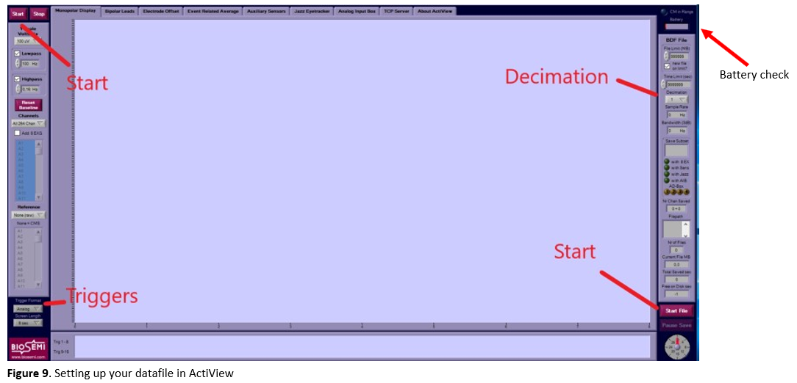
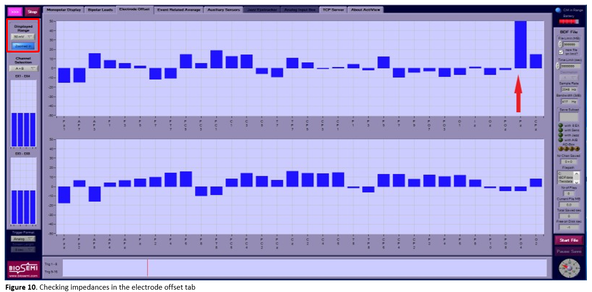
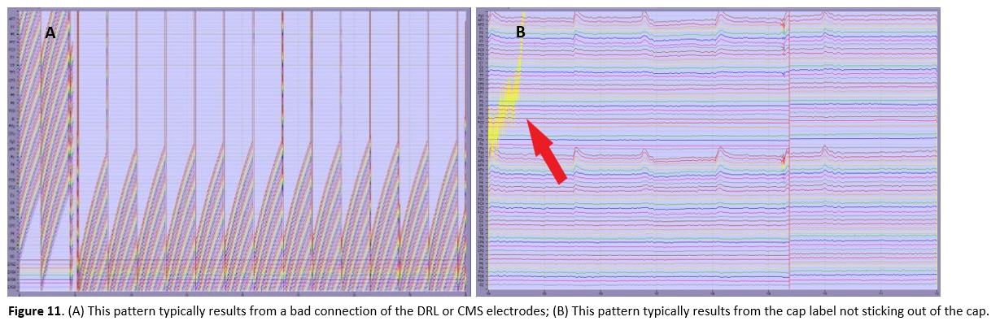

# Acquisition manual

This manual is based on the BioSemi EEG manual from the Cognitive Control in Context (CogTex) research group led by Eva Van den Bussche and was modified by Chiu-Yueh Chen and Klara Schevenels. It is specifically written for the 128-channel BioSemi EEG system located in PSI room 00.52. Eva's lab also provides a [video user tutorial](https://www.youtube.com/watch?v=ZuJ4i9Q7po8&feature=youtu.be) (for their 64-channel BioSemi system), which is highly recommended to watch given the many similarities with our system.

!!! info "Do's and don'ts"
    - **Do not change any hardware or permanent software settings** (e.g., monitor refresh rate) without approval from the EEG lab manager.
    - **Reserve your slots via Calira.** Make sure all your lab sessions are properly scheduled. If you don’t have access yet to Calira, contact [Klara](https://www.kuleuven.be/wieiswie/nl/person/00116473).
    - If you are planning to use the EEG lab for your experiment, ask Klara to add you to the **EEG channel on the NeuroSPACE Slack** through which everything related to the EEG lab is communicated.
    - Don’t use the system before carefully reading the **user documentation**. You can find the ActiveTwo user manual and operating guidelines on [Teams](https://kuleuven.sharepoint.com/:f:/r/sites/T0005824-Hoplab/Shared%20Documents/Hoplab/Research/EEG/1.%20EEG%20BioSemi%20Manuals?csf=1&web=1&e=sA1ycQ).
    - **Avoid contact with metal** while handling or storing the electrodes (this increases noise).
    - **Always keep one battery charging.** Batteries can break if they are fully discharged (“deep discharge”), but there’s no risk of damage from overcharging.
    - **Never force connectors** into the system, always check orientation before plugging them in.
    - **Report low supplies or broken equipment.** Immediately inform the lab manager (currently [Klara Schevenels](https://www.kuleuven.be/wieiswie/nl/person/00116743)) if something appears broken or stock is running low (e.g., towels, Signa gel, shampoo, adhesive tape, interdental brushes, etc.).
    - **Keep the connectors dry.** During cleaning, only the caps and electrodes should get wet. To protect the connectors, cover them with theor protective caps immediately after unplugging the electrode sets and wrap them carefully in a towel or plastic bag.
    - **Remove electrodes gently from the cap**, never pull on or bend the wires. The equipment is costly, so handle electrodes and other items with great care.
    - **Wash the electrodes immediately after use** by rinsing them with warm water (do not soak more than 10 mins). Do not scrub or use detergents on electrodes, only use mild disinfectant if absolutely necessary.
    - **Avoid using hot air for drying caps.** Caps can be washed with mild detergent, but dry them by towel and lay flat. If you need to speed-dry a wet cap, you may use a blow dryer—but only with cold air.
    - **Transfer your data after each session.** For example, make sure to copy your data at the end of the day. The computers are regularly cleaned, and it’s your own responsibility to avoid data loss.
    - **Always return the key of the EEG lab to the locker** when you’re not in the lab. You can find the key in the keybox next to the coffee machine on the ground floor. You can ask [Klara](https://www.kuleuven.be/wieiswie/nl/person/00116473) for the code.

## Before the day: planning participants

Before collecting data you will need to recruit participants and plan their visit to the lab. Here are a few things to keep in mind for that.

### Recruiting participants

To find participants, you can follow the instructions on the [behavioural recruitment page](../behaviour/bh-participants.md). Make sure to follow the latest guidelines on participant credit and reimbursement (see the latest details from the relevant [ethical applications](https://kuleuven.sharepoint.com/:f:/r/sites/T0005824-Hoplab/Shared%20Documents/Hoplab/Research/Ethical%20applications?csf=1&web=1&e=s7CEuL) - *access required*).

Make sure to mention the specifics of going through an EEG experiment in your recruitment text: the duration, receiving gel in the hair, ... (in general, it is best to make sure participants know what they are registering for to avoid drop-outs). You might want to mention that **wearing glasses** is preferred to wearing contact lenses (to minimise blinking) and to ask your participant to **wash their hair** the morning of the test session for optimal contact between the skull and the electrodes.

If you are collecting data over the summer, mind that the EEG room can get warm. Look up the forecast and try to avoid testing on very hot days if possible.

### Planning your time slot

To ensure correct use of the EEG testing room, we use a booking system via **[Calira](https://app.clustermarket.com/login)**. Make sure to book your time slots well in advance. If you don’t yet have access, contact [Klara Schevenels](https://www.kuleuven.be/wieiswie/nl/person/00116743) to get the correct invitation link. When you book a time slot, add in the "note" field whether you are testing a participant (yes/no) and for whose study.

When planning your sessions, make sure to allocate enough time for setting up the EEG cap and electrodes (up to 45-60 minutes, depending on your experience and the participant's hair type). Also, allocate some time at the end of the session for removing the cap and cleaning up (probably around 20-30 minutes).

## On the day: before the participant arrives

These are the first things to do upon arriving in the EEG lab:

1. Switch on the stimulus presentation computer and the EEG acquisition computer in the experimenter room. If you don't know the credentials of the computers, check [this document](https://kuleuven.sharepoint.com/:w:/r/sites/T0005824-Hoplab/Shared%20Documents/Hoplab/Research/EEG/eeg-computer-info.docx?d=wccddd39191864b9891c0f51cfb6fdf6f&csf=1&web=1&e=AUEUtv) (*access required*).
2. In the EEG room, switch on the general power strip, turn on the screen of the task computer and run the script on the desktop to set the correct screen resolution. Then, switch on the A/D-box using the on/off switch (see **Figure 1**).
3. Check on the A/D-box whether its battery is charged. If the battery is low, a red light will turn on (see **Figure 1**). In that case, take out the battery by opening the black clips at the sides and replace it with the spare battery that can be found in the left corner of the desk with the stimulus computer. Make sure that one battery is always charging (see **Figure 2**). At a later stage you can also check the battery status in ActiView (see **Figure 9**).

Then, make sure everything you'll need is within reach. You can find all necessary materials in the EEG closet in the room. It is easiest to prepare all the following items on the round table next to the closet, away from the computers:

1. Fill two syringes with Signa gel. Do not fill them completely to the rim (see **Figure 3**). Make sure to clean gel remainders off the tip of the tube before and after filling the syringes to prevent old gel from blocking them (see **Figure 4**).
2. Order and untie the electrodes. If you use the external electrodes, make sure 1) the electrodes, and 2) the cleaning pads to disinfect the participants' face before applying the electrodes, are within reach.
3. Place the measuring tape and adhesive tape within reach.
4. Make sure the head cap you need is dry. You can speed-dry it with the hair dryer, but use **cold air only** to not damage the cap. For the 128-channel system, we have the following caps (ABC system):
    - 2x small-medium (head circumference of 52-56 cm)
    - 1x medium (head circumference of 54-58 cm)
    - 2x medium-large (head circumference of 56-60 cm)

## Upon participant arrival

It is probably the first time for your participant to participate in an EEG experiment. As it may be a bit scary for them, make sure to explain everything slowly and in great detail. Prepare the participant for data acquisition as follows:

1. Explain the procedure to the participant.
2. Give the participant enough time to read the information letter, ask questions, and sign the informed consent.
3. Ask the participant to remove earrings, hair elastics, smartwatches, etc.
4. In case the participant wears glasses, it is easiest to remove them for the application of the EEG cap and the electrodes. Right before the start of the experiment, the participant can put their glasses back on. If possible, ask the participant to wear glasses rather than contact lenses to decrease the blinking frequency during the experiment.
5. Measure the participant's linear distance from nasion (indentation at the top of the nose between the eyes) to inion (small bump just above the neck) to determine the correct cap size (see **Figure 5**). The sizes can be found on the label in the back of the cap (e.g., if you measure 54 cm, then take the small-medium sized head cap with range 52-56 cm).

    

6. Place the cap on the participant's head: Spread both of your hands in the cap and ask the participant to hold the front part. Make sure both the ears and the label on the back stick out of the cap.
7. Make sure the cap is properly centered by measuring whether A1 (Vertex) is in the center, i.e., halfway between the ears and halfway between the nasion and inion (see **Figure 6**). Adjust if necessary.

    

8. Close the cap with the velcro straps under the chin. To avoid itching from the velcro, you can add a gauze pad underneath. Make sure that the participant is comfortable.
9. Fill all electrode gaps with superconducting gel (see **Figure 7a**) in the following way:
    - Gently fiddle around with the syringe in the gap, as this moves hair aside. Ask the participant for feedback to avoid scratching their scalp too hard.
    - Squeeze a small amount of gel in the gap while moving the syringe upwards.

    !!! warning "Important"
        Too much gel can create “bridges” between individual electrodes. Be especially careful around the CMS/DRL electrodes as these are crucial for proper data collection. It is easier to add extra gel later than to remove an excess of gel. As a reference, you should be able to use one tube of Signa gel for +- 5 participants (but this might vary with individual factors such as hair thickness and density).

    !!! tip "Tip"
        You may notice that you easily lose track of the gaps that you have already filled. It can help to come up with a system (e.g., start from the back, or if you are with two experimenters you can each start from a side and work your way to the middle).

10. Carefully put the electrodes in the appropriate gaps (see **Figure 7b**). In the 128-channel system, the electrodes are divided over 4 sets of 32 electrodes (labeled with the letters A to D). When you are done, tape the electrodes to the participant's shoulder or the chair to avoid putting stress on the cables. At the very end, also apply the set with the DRL and CMS electrodes.

    !!! warning "Important"
        Electrodes easily damage, so always handle them with great care. Do not put too much pressure when you insert the electrodes to avoid pushing gel downwards causing it to spread below the cap.

    !!! tip "Tip"
        Per set, individual electrodes are numbered. Place the electrodes in ascending order to avoid tangling the wires. Start at the base of the skull and work your way up towards the forehead. Make sure all electrode wires are routed toward a single point at the back of the head and toward the A/D box. This reduces cable strain when connecting the electrodes.

    

11. Go into the EEG booth and let the participant sit in the right position for the experiment. Take off the protective caps from the electrode sets, double check their orientation and carefully connect them to the A/D box (see **Figure 8**). Make sure the participant sits comfortably to avoid them moving too much during the experiment. You can adjust the height of the chair and the chin rest if needed.

    

12. In case the participant wears glasses, you can put them back on now.
13. Turn the lights low (the light switch is near the door) and make sure the lightning is consistent across all of your participants. Do not lower the lights too much as a high contrast between the room and monitor increases the blinking frequency. During breaks, you might want to turn the lights up (to increase alertness) and ask the participant if they would like to drink some water (to decrease swallowing).

## Setting-up the datafile

Go to the acquisition computer, and take care of the following steps:

1. Start up ActiView.

    

2. In the right top corner, you can check the battery status of the A/D-box (see **Figure 9**). ActiView will give a warning if the battery status is below 20%.
3. Go to the `about actiview` tab and click `set up configuration file`. You can find preset configuration files for the 128-channel system in the desktop folder `config_files`. Check the associated readme file for more information on the chosen presets. Load the one that matches your experiment needs.
4. Click `start` and then `start file` (see **Figure 9**). Browse to your personal folder where you want to save the data, create a participant folder (e.g., `sub-001`) and choose a name for your data file, preferably in BIDS-format (e.g., `sub-<participant_id>_task-<task_name><mapping>_run-<run_number>_eeg.bdf`). To save each run in a different file, you will have to redo this step for each run.
5. Change the decimation according to your needs (see **Figure 9**), e.g., to ¼ (gives you a 512 Hz sampling rate; these are fractions of 2048 Hz).  
6. Go to the `electrode offset` tab to check the electrode impedances and change the displayed range scale to 50 µV (see **Figure 10**):
    - The impedance of each electrode must be between -20 µV and 20 µV (note that this measure is actually an electrode offset value with the CMS electrode as a reference, so negative values are not actually negative). Adjust the electrodes that are not within these values (e.g., Fz in **Figure 10**) by adding or removing some gel, moving the hair below the electrode with the tip of the syringe and/or by wiggling the electrode a bit.
    - If the electrode impedance stays far outside the [-20 20 µV] range, the electrode might be broken and needs to be replaced. In case this electrode is not crucial for your study, you can write down the code of the electrode and later contact the EEG lab manager for the back-up electrode set.  

    

    !!! Tip
        You can mirror the screen of the acquisition PC with the electrode offsets in the EEG booth, so that you don't have to run back and forth when adjusting the electrodes to get the impedance right. Don't forget to turn off the screen when you are done.

7. Go back to the `monopolar display` tab and check the signal:
    - **Bridges** would appear in the signal as a set of neighbouring electrodes giving exactly the same or a unusual signal, along with very similar impedance values in adjacent electrodes. You would for example notice that fixing the impedance in one channel also affects its neighbour(s). Note that eyeblinks also can create sudden similar changes in multiple (frontal) channels - this is not bridging.
    - A bad connection of the reference electrode results in a bad signal for all electrodes (see **Figure 11a**). Check whether the DRL and CMS electrodes are placed correctly and give a good signal.
    - If the cap label is not sticking out, this results in a typical signal distortion (see **Figure 11b**).
    - If all electrodes are connected correctly, Actiview should look like **Figure 12**.
    - Show the participant what happens when they blink, cough, swallow, etc. Instruct the participant to minimize these movements during the measurement phase.

    

    

## Recording EEG-data

Hooray, you are now ready to start acquiring EEG data! To do so, follow these steps on the acquisition PC:

1. Start recording (= saving data to file) by clicking the `paused` button in ActiView on the bottom right. When recording, it switches to `saving` and turns green (see **Figure 12**). **Do not forget this** (you wouldn't be the first)!
2. Give your participant the last instructions via the intercom system and start the experiment on the stimulus PC. If you get an error along the lines of "could not open port COM [X]", it might help to reconnect the cables connecting the trigger box with either stimulus or acquisition PC and/or restart both PCs.
3. Once the run has started, quickly ensure that triggers from your experiment are being sent and recorded correctly. Do this by changing `trigger format` from `analog` to `digital` (see **Figure 13**) and by checking that the numbers correspond to your task and stimuli.
4. When an experiment run is finished, click on `pause save` below the green `saving` button and then on `stop` on the top left of the screen.
5. Continue to record another run with a different filename by clicking `start`, `start file` and entering your new filename in BIDS (see earlier). Do not forget to restart the recording by clicking the `paused` button again so that it switches to `saving` and turns green. If you want all your data to be saved in one file, you can skip this step. However, in that case the file size can become inconveniently large.
6. The data is saved in the folder you selected earlier. Make sure to copy the data from the acquisition computer to your personal (encrypted) drive at the end of your experiment. Occasionally, the EEG computer drive will be cleaned and your data might be lost if it is not backed-up.
7. When you are done, turn off the A/D-box, the general power strip and the lights in the EEG room.

    

    !!! Tip
        Make sure to write down the "bad channels" (i.e., with impedances outside of the [-20 20 µV] range) on your participant log (you can find an example [here](https://kuleuven.sharepoint.com/:x:/r/sites/T0005824-Hoplab/Shared%20Documents/Hoplab/Research/EEG/log_EEG_participants.xlsx?d=wa29320cdb14c4e989a3c5eed41b4c61a&csf=1&web=1&e=R982GF)) for each run separately (the impedances can change throughout the experiment). You can then take this into account in your analysis (e.g., through interpolation).

## After the experiment

1. Unplug the electrode sets from the A/D-box (4 sets + mini-set with DRL and CMS electrodes).
2. Put the protective caps back on the connectors. Put the connectors in a waterproof plastic bag and use an elastic band to close the bag. **The connectors are very sensitive and should not get wet!**
3. Escort the participant out of the EEG booth to the preparation room and put a towel on the participant's shoulders to prevent gel leaking on their clothes.
4. Remove the electrodes from the cap **one-by-one**. Do not pull on the wires but on the electrode itself to avoid damage to the wires. **Make sure the electrodes never touch metal**. This is especially a risk if the participant's chair contains a lot of metal.  
5. Once all electrodes are removed, immediately place them in the plastic tub filled with lukewarm water (not directly in the metal sink!). Do not soak the electrodes for more than 10 minutes.
6. Remove the head cap from the participant's head and place it in another tub with lukewarm water and some mild detergent.
7. Let the participant wash the gel out off their hair in the sink. Below the sink we have shampoo they can use.
8. Do not forget to note the necessary payment details in case the participated should receive a monetary compensation. Save this personal information in a password-protected file in a secure environment and separately from the research data.
9. When they are dry, add all of your used towels and/or wash cloths to the laundry bag and indicate this on the paper taped to the cupboard (check one box per towel/hand cloth added). When all boxes are checked, the laundry bag is full. Notify [Klara](https://www.kuleuven.be/wieiswie/nl/person/00116473) to have them washed.
10. Check whether any material is close to running out of stock (e.g., SignaGel, shampoo, adhesive tape, interdental brushes, cotton swabs, etc.) and notify [Klara](https://www.kuleuven.be/wieiswie/nl/person/00116473) if this is the case. Please take into account that refilling stock might take several weeks.
11. Take the signed ICF with you (do not leave it in the EEG room) and safely store it in a locked cabinet in your office.

## Cleaning

1. Put the leftover gel in the syringes back in the tube.
2. Rinse the syringes, head cap and electrode sets (not the connectors!) with lukewarm water. Do not scrub or use detergents on electrodes, only use mild disinfectant if absolutely necessary. Caps can be washed with mild detergent.
3. Use a plastic toothpick to remove the gel from all the gaps in the head cap.
4. If necessary, fill the tub with clean lukewarm water and add a bit of the 70% alcohol solution to it. Soak the electrodes, the head cap and the syringes in it for a few seconds to disinfect them, and then rinse everything again with lukewarm water.
5. Let the caps and syringes dry flat on the round table (do not hang the caps to dry). Put the electrode sets back on the rack (make sure they are stable and don't fall on the floor).

!!! info "Data storage"
    After transferring your data, make sure to follow the lab's [Research Data Management guidelines](../rdm/current.md) for organizing and backing up your dataset.
