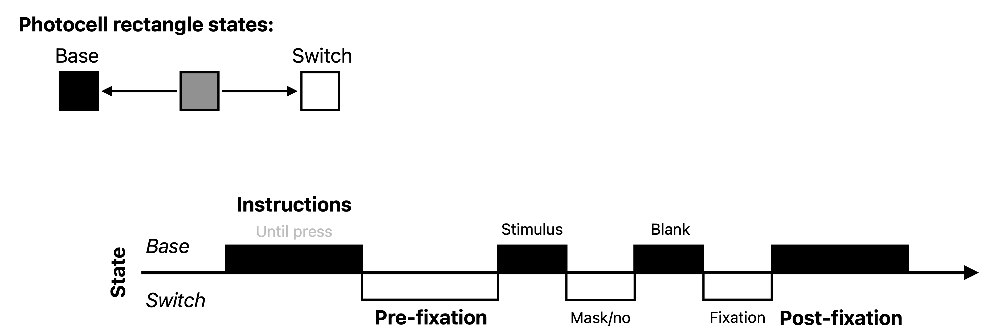

# Preparing an EEG task

This page describes the steps necessary to prepare your EEG experiment. Follow these steps if you have a behavioural paradigm ready that you need to adapt to EEG testing. You might be in a situation where you have a task script ready from a previous experiment. Here are the aspects of the task, described in this page, that you will need to pay special attention to when bringing your task to the EEG:

- **Sending triggers**: in order to analyse your EEG data, it's crucial to know *when* your events happened relative to when your EEG data was recorded. To keep track of this timing, we send triggers from the stimulus computer to the EEG computer.
- **Using the photocell**: to ensure that the timing of our triggers is accurate with regards to what actually shows on the screen, we use a photo sensitive diode (aka a *photocell*), taped to the screen, that can detect changes in screen luminance with high temporal precision. Since this photocell is taped to the bottom left of the screen (to avoid obstructing the participant's view), we add a small square to the bottom left of our screen that changes luminance at the same time as we send a trigger.
- **Timing**: in most tasks you will need to follow some timing rules to ensure your brain signal is clean and interpretable.

Note that these things are all implemented in the (upcoming) EEG task template ([link to GitHub task template repo](https://github.com/HOPLAB-LBP)).

## Sending triggers

In order to be able to map psychophysical events from your task to the EEG data, you will need to send triggers from the task computer to the EEG computer. These triggers will then appear in a separate channels alongside your other EEG channels, allowing you to know precisely when e.g. an image was shown with respect to your brain signal.

Triggers are sent via a serial port connection. To use it, you will need to link to the serial port within your script. In Python, this can be done using the `serial` package. The following code snippet shows how to open a connection to the serial port:

```python
import serial
serialport = serial.Serial("/dev/ttyUSB0",baudrate=115200)
```

Once your serialport object is defined, you can call it to send triggers using the `write` method. The following code snippet shows how to send a trigger:

```python
import struct
trigger = 56 # example trigger value between 0 and 255
serialport.write(struct.pack('>B', trigger))
```

These triggers will be sent in 8-bit format, meaning that you can send **integer values between 0 and 255**. A good practice here is to define beforehand a mapping of event to trigger, where every important event in your task is assigned a trigger value (think of stimulus, but also fixation cross, blank screen, and response key presses). Here is an example mapping, stored in an external `.json` file:

```json
{
    "experiment_start": 1,
    
    "pre_fixation": 2,
    
    "blank": 3,
    "fixation": 4,
    
    "post_fixation": 5,

    "experiment_end": 2,

    "condition_1": 10,
    "condition_2": 11,
    "condition_3": 12,
    "condition_4": 13,
    "condition_5": 14,

    "key_press_left": 20,
    "key_press_right": 21
}
```

## Using the photocell

Triggers sent from the task computer are just like any other input from that computer: they take time to travel to their destination. Just like images are not shown the exact moment they are called to be shown, triggers are not received the exact moment they are sent. This delay between trigger sending and trigger receiving is **variable**, and can be substantial under some conditions. That's why we use a photocell to measure the exact moment when something changes on the screen.

The photocell records with high temporal precision changes in luminance on the bottom left of the screen where it is taped. We use it to record the exact moment that images are being presented, by adding a small square to the bottom left of the screen that changes luminance at the same time as we show images. By making sure the stimuli (or any other visual event) and the square change on the same frame, we can use the photocell signal to know exactly when something changed on the screen. The result of this are recorded in the EEG data in a separate channel, alongside the other EEG channels.

The best way to make use of this is to place a small black or white square at the correct location on the screen, and changing it everytime something changes on the screen. For instance you could have a black square during fixation, and a white square during stimulus presentation. Have a look at other scripts to ensure you are using the correct location, which will vary based on the monitor size and resolution. The following snippet creates a Psychopy `rectangle` object with the correct location and size based on the setup used in October 2025:

```python
from psychopy import visual
colour = 'black' # or 'white'
photocell_rectangle = visual.Rect(
    win=win, width=0.02, height=0.02,
    ori=0, pos=(-0.8,-0.45), anchor='center',
    lineWidth=1, opacity=1, depth=-1.0,
    lineColor=colour, fillColor=colour,
    interpolate=True
)
```

The advantage of the photocell is not only that it allows you to know exactly *when* you stimuli appeared on the screen, but also *how long* they were on the screen for. To record duration as well as onset, you can keep the rectangle on the screen stable for the duration of each event you record. Below is an example of this strategy:

<figure markdown="span">
  
  <figcaption>Photocell colour switch logic.</figcaption>
</figure>

## Inter-trial interval and jitter

When preparing your task for EEG, you will need pay extra attention to the trial timing, in particular to the **inter-trial interval** (ITI) and **jitter**. Having a decent ITI is important to allow the brain response to return to baseline. The jitter duration should also align with the design of your experiment—for example, to accommodate late ERP components such as the P300 or N400. A minimum inter-trial interval (ITI) of around 0.9 s provides sufficient time for these late components to resolve. Additionally, adding some jitter in the inter-trial interval is important to prevent participants from developing strong expectations about the upcoming stimulus. As a rule of thumb, think of having a jitter varying between 0.7 and 1.5s.

## Psychopy-specific

Psychopy has built-in functionality to nicely control for the timing of events. In particular, the `win.callOnFlip()` function allows you to build up a series of command that you would like to execute exactly when the next frame is being presented, which is very handy for sending triggers and logging events. Below is a code snippet showing how to use this function to (1) send a trigger, (2) draw a rectangle, and (3) log an event at the exact moment a stimulus is being presented:

```python
# prepare stimulus
stimulus = visual.ImageStim(...)
# prepare trigger and rectangle
trigger = 56 # example trigger value between 0 and 255
photocell_rectangle = visual.Rect(...)
# draw stimulus and rectangle
stimulus.draw()
photocell_rectangle.draw()
# send trigger and log event at the exact moment the frame is presented
win.callOnFlip(serialport.write, struct.pack('>B', trigger))
win.callOnFlip(log_event, 'stimulus_presented') # assuming you have a 'log_event' function
# flip the window to present the frame
win.flip()
```

<!-- 
__TODO__: [Andrea,Tim] Create the template and link it here.
-->
