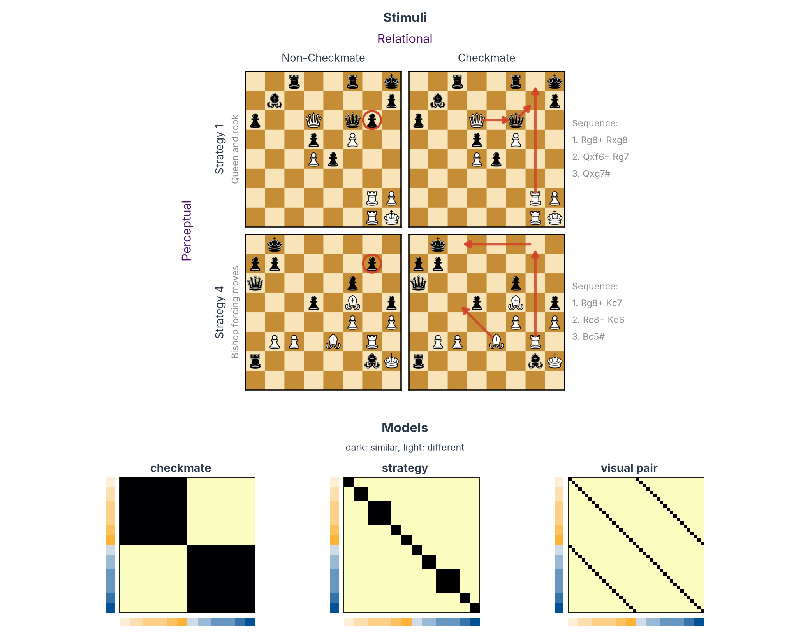
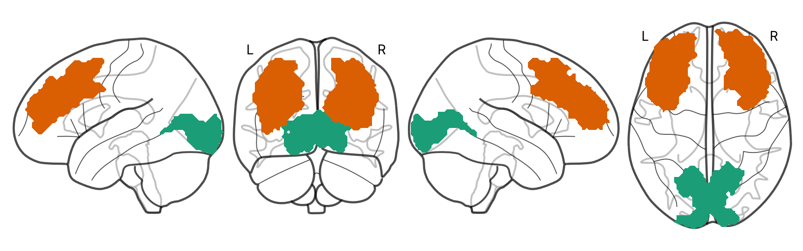
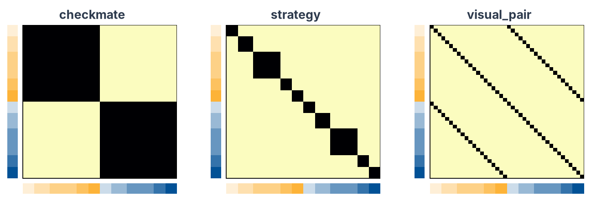
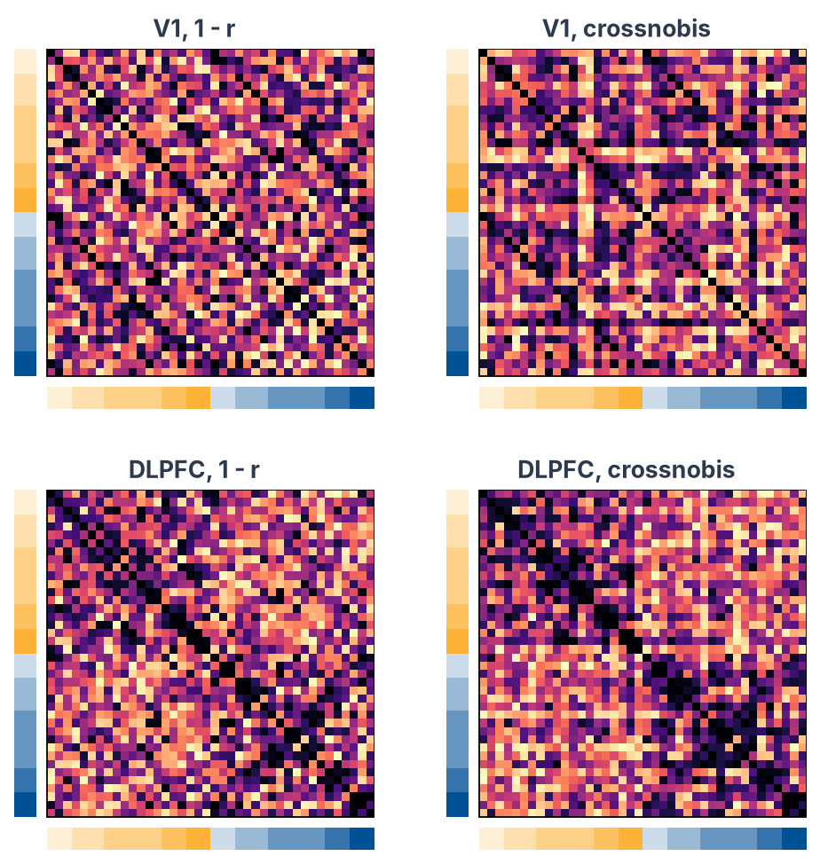
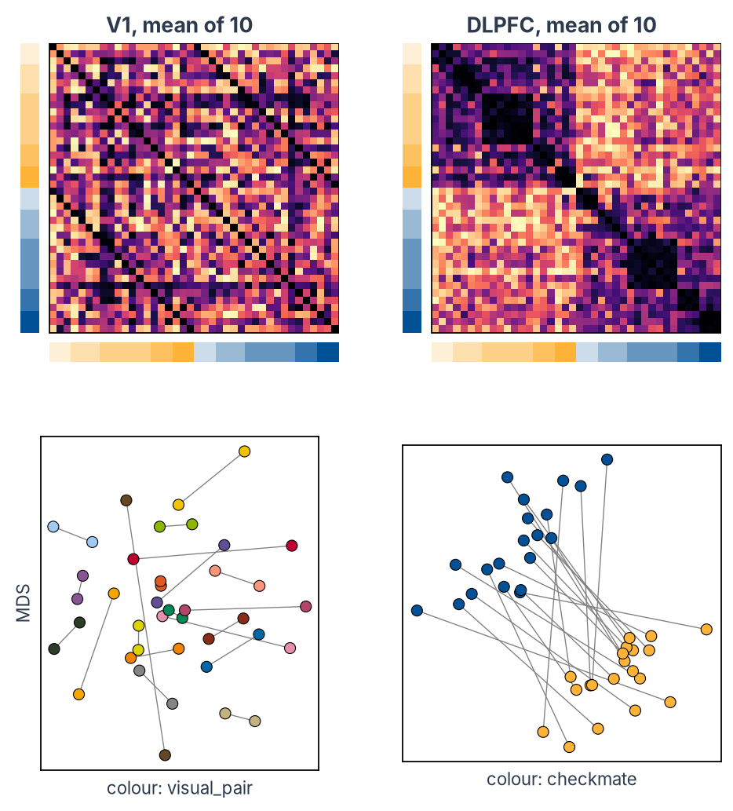
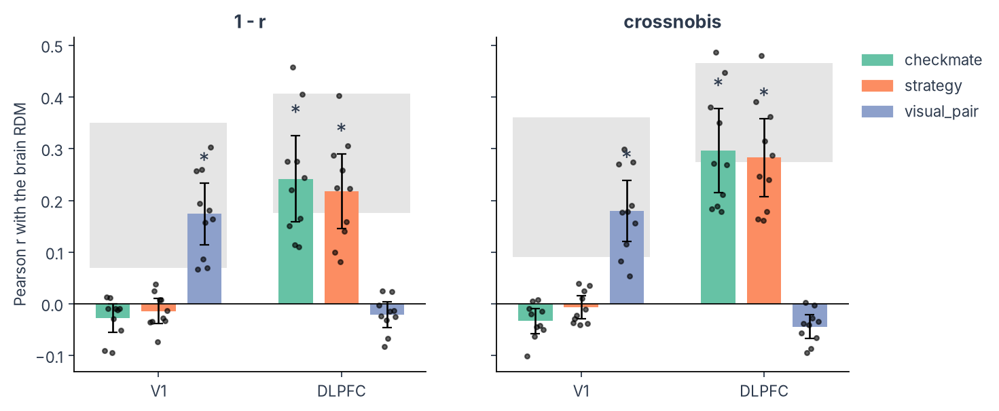
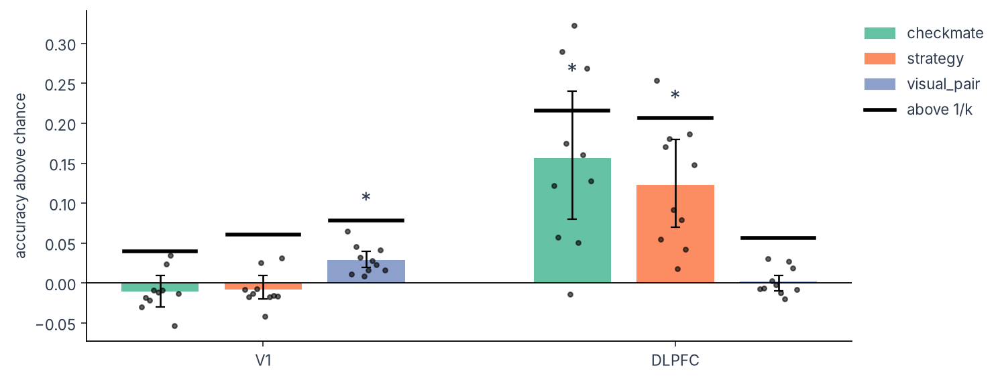

# Multivariate analysis in Python: RSA and decoding from an SPM GLM

!!! abstract "On this page"
    - **You need:** the standard SPM12 first-level folder of each participant (one beta per condition and run), ROI masks in the same space, and a table that describes your conditions.
    - **You get:** RSA with [rsatoolbox](https://rsatoolbox.readthedocs.io/) and decoding with [scikit-learn](https://scikit-learn.org/), per participant and for the group, with the reasons behind each step.
    - **Prefer MATLAB?** The same analyses with CoSMoMVPA are on the [MATLAB page](fmri-mvpa.md).

The code on this page works on any study that has a standard SPM first-level folder per participant. To run it on your data, you change the settings in step 1 and write a condition table; nothing else on the page refers to a particular design.

As an example we use the design of a study in the lab, in which chess players viewed 40 chessboards in the scanner ([chess-expertise-2025](https://github.com/costantinoai/chess-expertise-2025)). The data are simulated, but they are real SPM output: SPM12 fitted the GLM of every participant to simulated runs with the study's timing, and wrote the usual `SPM.mat`, `beta_*.nii`, `mask.nii` and `ResMS.nii`.

---

## The example study and its questions

The stimuli are 40 chessboards, built so that the same boards can be grouped in different ways. The figure shows two examples and the models that follow from the groupings.

<figure markdown="span" style="width: 67%; margin-left: auto; margin-right: auto">
  
  <figcaption style="font-size: .7rem; max-width: none">Chess pieces: chessnut by Alexis Luengas, <a href="https://www.apache.org/licenses/LICENSE-2.0">Apache License 2.0</a>.</figcaption>
</figure>

**Perceptual: visual pairs.** Each checkmate board has a twin in which one or two pieces are moved so that the mate no longer works (red circles). The two boards of a pair look almost the same but differ in checkmate. The 40 boards form 20 such pairs.

**Relational: checkmate and strategy.** In 20 boards White can force mate in four moves or fewer (red arrows, with the sequence on the right); in their 20 twins White cannot. The checkmate boards follow five strategies, from queen-and-rook attacks to one-move mates, and their twins five matching ones, so there are ten strategies in all. Boards with the same strategy share a plan but can have quite different piece positions.

Each grouping gives one model RDM (bottom of the figure): two boards in the same group are predicted to evoke similar patterns, two boards in different groups different patterns. The checkmate model splits the boards into two halves, the strategy model into ten blocks, and the visual-pair model links each board to its twin.

Ten participants saw every board twice per run, for five runs. The question is which of these groupings the activity patterns of a region follow. We look at two regions: primary visual cortex (V1) and dorsolateral prefrontal cortex (DLPFC), both from the [Glasser atlas](fmri-rois.md#hcp-glasser-parcellation-hcp-mmp10).

**RSA** asks whether the geometry of the patterns (which conditions evoke similar patterns and which evoke different ones) matches a model. **Decoding** asks whether a classifier can read a property from the patterns of a run it has not seen. The page runs both on the same data.

---

## What you need before you start

**A first-level GLM made for multivariate analysis**, fitted with SPM12, one folder per participant. This tutorial needs one beta per condition in every run, so that patterns from independent runs can be compared: give each condition its own regressor in each run (in SPM's batch, one `cond` per condition in every session). Fit the GLM on **unsmoothed** data, because smoothing blurs the fine-grained patterns these analyses read. The [scripting page](fmri-glm-script.md) shows how to set up a GLM in SPM.

**ROI masks** in the space of the GLM, as NIfTI files with 1 inside the region. See [Regions of interest](fmri-rois.md).

**A condition table** (`conditions.tsv`): one row per condition, a `condition` column with the name of its regressor in SPM, and one column for every property you want to test. For the example study:

| condition | checkmate | strategy | visual_pair |
|---|---|---|---|
| C1_Images_Frombeautiful | checkmate | 1 | 1 |
| C1_Images_SteinitzNN | checkmate | 1 | 2 |
| ... | ... | ... | ... |
| NC1_Images_Frombeautiful(Nomate) | non_checkmate | 6 | 1 |

The order of the rows is the order of the conditions in every RDM and plot, so put conditions that belong together next to each other.

**A participants table** (`participants.tsv`, as in [BIDS](https://bids-specification.readthedocs.io/en/stable/modality-agnostic-files.html#participants-file)) with a `participant_id` column.

The project folder of this page looks like this:

```text
project/
├── derivatives/spm-glm/
│   ├── sub-01/          SPM.mat, beta_0001.nii, beta_0002.nii, ..., mask.nii, ResMS.nii
│   └── ...
├── rois/
│   ├── V1_mask.nii
│   └── DLPFC_mask.nii
├── conditions.tsv
└── participants.tsv
```

??? info "What the code assumes about the SPM folder"

    The code reads only files that every SPM12 first-level analysis writes, under their default names:

    - `SPM.mat`, in which `SPM.xX.name` holds the name of every column of the design matrix and `SPM.Vbeta` the file of its beta;
    - `beta_XXXX.nii`, one per column, with NaN outside the analysis mask;

    Regressor names have SPM's standard form `Sn(<run>) <condition>*bf(<basis function>)`, and condition names have no spaces (rsatoolbox splits the name at the space). With the canonical HRF there is one basis function, `bf(1)`; with time or dispersion derivatives, `bf(2)` and `bf(3)` are the derivatives, and the code keeps only `bf(1)`. Parametric modulators (`Sn(1) cond xparam^1*bf(1)`), confounds (`Sn(1) trans_x`) and run constants (`Sn(1) constant`) have names that are not in your condition table, so they are ignored.

    If your GLM models each trial separately (least-squares-all or least-squares-separate), average the trial betas of each condition within each run first, or give the trials of one condition the same name.

Install the packages in a [fresh environment](../../coding/index.md):

```bash
pip install rsatoolbox==0.3.2 neuroimagingtools nibabel nilearn scikit-learn pingouin pandas matplotlib
```

`neuroimagingtools` is what rsatoolbox uses to read SPM folders. Install it on its own as above: the `rsatoolbox[imaging]` extra pins an old nibabel that does not work with NumPy 2.

---

## 1. Settings and tables

Everything specific to a study is in this block.

```python
from pathlib import Path

import matplotlib
import matplotlib.pyplot as plt
import nibabel as nib
import numpy as np
import pandas as pd

# ---- Where the data are --------------------------------------------------------------------------------


def glm_folder(participant):  # (1)!
    """The SPM first-level folder of one participant."""
    return Path("derivatives/spm-glm") / participant


# One mask per region of interest, in the space of the GLM
ROIS = {
    "V1": "rois/V1_mask.nii",
    "DLPFC": "rois/DLPFC_mask.nii",
}

# ---- What to test ---------------------------------------------------------------------------------------

# The columns of conditions.tsv to test: one model RDM and one decoding analysis each
MODELS = ["checkmate", "strategy", "visual_pair"]  # (2)!

# ---- How to draw the plots ------------------------------------------------------------------------------

# Bars along the edges of every RDM: colour by one column, shade by another
TICK_COLOUR_BY = "checkmate"  # (3)!
TICK_SHADE_BY = "strategy"

# MDS plots: the column that colours the points, for each region
MDS_COLOUR_BY = {"V1": "visual_pair", "DLPFC": "checkmate"}  # (4)!

# MDS plots: join conditions that share a value of this column (None: no lines)
MDS_LINK_BY = "visual_pair"

# ---- Read the two tables --------------------------------------------------------------------------------

conditions = pd.read_csv("conditions.tsv", sep="\t")  # one row per condition
participants = pd.read_csv("participants.tsv", sep="\t")["participant_id"].tolist()

print(conditions.head(4))
print(f"{len(conditions)} conditions, {len(participants)} participants")
```

1. Where the SPM folder of each participant is. If your GLMs are in, say, `derivatives/fmriprep-spm/sub-01/exp/`, make it `return Path("derivatives/fmriprep-spm") / participant / "exp"`.
2. Each name must be a column of `conditions.tsv`.
3. One colour per value of `TICK_COLOUR_BY` and, within each colour, a lighter or darker shade per value of `TICK_SHADE_BY` (set it to `None` for one shade). Here: orange for checkmate boards, blue for the others, and one shade per strategy.
4. Pick, for each region, the property you expect it to carry, so you can see whether its conditions group together (step 5).

??? example "Output"

    ```text
                                condition  checkmate  strategy  visual_pair
    0             C1_Images_Frombeautiful  checkmate         1            1
    1                C1_Images_SteinitzNN  checkmate         1            2
    2    C1_Images_WinterFriede(Reversed)  checkmate         1            3
    3  C2_Images_KekhayovPetrov(Reversed)  checkmate         2            4
    40 conditions, 10 participants
    ```

---

## 2. Read the GLM with rsatoolbox

rsatoolbox reads SPM first-level folders with `SpmGlm`: it reads `SPM.mat` (the name, run and file of every column of the design matrix) and samples the beta images within a mask. Before loading any data, look at what the GLM contains.

```python
from rsatoolbox.io.spm import SpmGlm

# Open the GLM of the first participant and read SPM.mat
spm = SpmGlm(str(glm_folder(participants[0])))  # (1)!
spm.get_info_from_spm_mat()

# One row per column of the design matrix: its run, its name and its beta image
regressors = pd.DataFrame({
    "run": spm.run_number,
    "regressor": spm.beta_names,
    "file": spm.beta_files,
})
print(f"{spm.nruns} runs, {len(regressors)} columns in the design matrix")

# The first two columns of each run
print(regressors.groupby("run").head(2).to_string())  # (2)!

# How many columns each run has
print(regressors.groupby("run").size().to_string())  # (3)!
```

1. `SpmGlm` needs the `neuroimagingtools` package (see the install line above). `SPM.mat` files above 2 GB are saved in MATLAB's v7.3 format, which `SpmGlm` cannot read.
2. The first two columns of each run.
3. The number of columns in each run: here 40 boards, 8 confounds and the run's constant.

??? example "Output"

    ```text
    5 runs, 245 columns in the design matrix
         run                                             regressor           file
    0      1     NC4_Images_StrekalovskyShaposhlikov(Nomate)*bf(1)  beta_0001.nii
    1      1    NC2_Images_SkujaRozenbergs(Nomate)(Reversed)*bf(1)  beta_0002.nii
    48     2     NC4_Images_StrekalovskyShaposhlikov(Nomate)*bf(1)  beta_0049.nii
    49     2           C3_Images_PodzerovKuntzevic(Reversed)*bf(1)  beta_0050.nii
    96     3                 NC3_Images_Replacement5(Nomate)*bf(1)  beta_0097.nii
    97     3               C5_Images_EasyPosition5(Reversed)*bf(1)  beta_0098.nii
    144    4  NC3_Images_PodzerovKuntzevic(Nomate)(Reversed)*bf(1)  beta_0145.nii
    145    4                NC1_Images_Frombeautiful(Nomate)*bf(1)  beta_0146.nii
    192    5                 NC3_Images_Replacement5(Nomate)*bf(1)  beta_0193.nii
    193    5                         C5_Images_EasyPosition2*bf(1)  beta_0194.nii
    run
    1    49
    2    49
    3    49
    4    49
    5    49
    ```

Three things in this output matter for what follows:

- **The order of the conditions changes from run to run.** SPM numbers the columns in the order the conditions were entered for each run, and many lab scripts enter them in the order they first appear in that run's events file. `beta_0001.nii` is a different board in every run and every participant, so betas are always matched by name.
- **The names carry SPM's basis-function suffix**, `*bf(1)` for the canonical HRF. We remove it to match the names to the condition table.
- **The confounds and the constants are columns too.** They are dropped by keeping only the regressors whose names are in the condition table.

The next block runs these checks for every participant:

```python
def condition_name(regressor):
    """SPM's regressor name without the suffix of the first basis function."""
    return regressor.removesuffix("*bf(1)")


for participant in participants:

    # Read SPM.mat and clean up the regressor names
    spm = SpmGlm(str(glm_folder(participant)))
    spm.get_info_from_spm_mat()
    names = pd.Series([condition_name(name) for name in spm.beta_names])
    runs = pd.Series(spm.run_number)

    # Which regressors are conditions of the table (the others are confounds and constants)
    is_condition = names.isin(conditions["condition"])

    # Check 1: every condition of the table has betas
    missing = set(conditions["condition"]) - set(names)
    assert not missing, f"{participant}: not in SPM.mat: {sorted(missing)[:3]}"  # (1)!

    # Check 2: every condition has a beta in every run
    runs_per_condition = runs[is_condition].groupby(names[is_condition]).nunique()
    assert runs_per_condition.min() == spm.nruns, f"{participant}: some conditions are missing from some runs"  # (2)!

    # Report what will be used and what will be left out
    ignored = sorted(set(names[~is_condition]))  # (3)!
    print(f"{participant}: {spm.nruns} runs, {is_condition.sum()} condition betas, "
          f"{len(ignored)} other regressors ignored ({', '.join(ignored[:3])}, ...)")
```

1. Every condition of the table must have betas. If this fails, the names in `conditions.tsv` differ from the regressor names in SPM; print `names.unique()` to compare them.
2. Crossnobis and decoding compare patterns across runs. rsatoolbox's crossnobis (version 0.3.2) needs every condition in every run, so this tutorial requires that complete design for both analyses. Decoding alone could work with missing conditions, after checking that every class is present in each training and test run. If a condition was not shown in a run, leave that run out for this tutorial: an empty regressor cannot give it a beta.
3. The regressors that are not in the table and that the analysis leaves out. Check that nothing you need is among them.

??? example "Output"

    ```text
    sub-01: 5 runs, 200 condition betas, 9 other regressors ignored (constant, framewise_displacement, global_signal, ...)
    sub-02: 5 runs, 200 condition betas, 9 other regressors ignored (constant, framewise_displacement, global_signal, ...)
    sub-03: 5 runs, 200 condition betas, 9 other regressors ignored (constant, framewise_displacement, global_signal, ...)
    sub-04: 5 runs, 200 condition betas, 9 other regressors ignored (constant, framewise_displacement, global_signal, ...)
    sub-05: 5 runs, 200 condition betas, 9 other regressors ignored (constant, framewise_displacement, global_signal, ...)
    sub-06: 5 runs, 200 condition betas, 9 other regressors ignored (constant, framewise_displacement, global_signal, ...)
    sub-07: 5 runs, 200 condition betas, 9 other regressors ignored (constant, framewise_displacement, global_signal, ...)
    sub-08: 5 runs, 200 condition betas, 9 other regressors ignored (constant, framewise_displacement, global_signal, ...)
    sub-09: 5 runs, 200 condition betas, 9 other regressors ignored (constant, framewise_displacement, global_signal, ...)
    sub-10: 5 runs, 200 condition betas, 9 other regressors ignored (constant, framewise_displacement, global_signal, ...)
    ```

---

## 3. Load the patterns of each ROI

The two regions, from the [Glasser atlas](fmri-rois.md#hcp-glasser-parcellation-hcp-mmp10), drawn with [nilearn](https://nilearn.github.io/):

```python
from nilearn import plotting

# An empty glass brain, seen from the left, front, right and top
display = plotting.plot_glass_brain(None, display_mode="lyrz", figure=plt.figure(figsize=(10, 3)))

# Each ROI mask filled in its own colour
roi_colours = ["#1b9e77", "#d95f02", "#7570b3", "#e7298a"]
for (roi, path), colour in zip(ROIS.items(), roi_colours):
    display.add_contours(path, levels=[0.5], colors=[colour], filled=True, alpha=0.8)


plt.show()
```



For every participant and region, `get_betas` samples all betas within the mask and returns, with them, the residual variance of every voxel (`ResMS`) and the run and name of every beta. We keep the condition betas and store them as an rsatoolbox `Dataset`: one row per beta (condition × run), one column per voxel, and the condition, run and properties of every row as descriptors.

```python
from rsatoolbox.data import Dataset

# The row number of each condition in conditions.tsv
position = {name: i for i, name in enumerate(conditions["condition"])}  # (1)!


def load_participant(participant):
    """One Dataset per ROI: a row per condition beta, a column per voxel."""
    spm = SpmGlm(str(glm_folder(participant)))
    spm.get_info_from_spm_mat()

    data = {}
    for roi, mask in ROIS.items():

        # All betas inside the mask, the noise level of each voxel, and the run and name of each beta
        betas, resms, info = spm.get_betas(mask)
        names = pd.Series([condition_name(name) for name in info["reg_name"]])

        # Keep the betas of the conditions in the table
        keep = names.isin(conditions["condition"]).to_numpy()  # (2)!

        # Keep the voxels that have an estimate in every beta
        patterns = betas[keep]
        voxels = np.isfinite(patterns).all(axis=0)  # (3)!
        patterns = patterns[:, voxels]

        # Describe every row: its condition, its run, and the condition's properties
        rows = conditions.set_index("condition").loc[names[keep]].reset_index()
        descriptors = {
            "condition": rows["condition"].map(position).to_numpy(),
            "run": info["run_number"][keep],
        }
        for column in MODELS:
            descriptors[column] = rows[column].to_numpy()

        # The noise level of each voxel goes with it, for the correlation distance in step 5
        data[roi] = Dataset(patterns, obs_descriptors=descriptors,
                            channel_descriptors={"resms": resms[voxels]})  # (4)!

    return data


# Load every participant: data[participant][roi] is one Dataset
data = {}
for participant in participants:  # (5)!
    data[participant] = load_participant(participant)
```

1. Each condition is stored as its row number in `conditions.tsv`. rsatoolbox sorts conditions by this value, so every RDM follows the order of the table.
2. Drops the confounds and the constants.
3. Voxels outside SPM's analysis mask have no estimate (NaN). SPM drops voxels with a low signal, often at the edge of the brain, so the number of voxels differs a little between participants.
4. `ResMS` is the residual variance of each voxel, its noise level. Step 5 uses it to normalise the voxels for the correlation distance.
5. Reads every beta of every participant, once per region. This takes a few minutes, most of it reading the files.

Check what was loaded: every participant should have each condition once in every run.

```python
rows = []
for participant in participants:
    for roi, dataset in data[participant].items():

        # How many betas each condition has in each run (should be 1 everywhere)
        counts = pd.crosstab(dataset.obs_descriptors["condition"], dataset.obs_descriptors["run"])

        rows.append({
            "participant": participant,
            "roi": roi,
            "betas": dataset.n_obs,
            "voxels": dataset.n_channel,
            "runs": counts.shape[1],
            "conditions": counts.shape[0],
            "betas per condition and run": sorted(np.unique(counts.to_numpy())),
        })


summary = pd.DataFrame(rows)
print(summary.to_string(index=False))
```

??? example "Output"

    ```text
    participant   roi  betas  voxels  runs  conditions betas per condition and run
         sub-01    V1    200    2813     5          40                         [1]
         sub-01 DLPFC    200    7896     5          40                         [1]
         sub-02    V1    200    2654     5          40                         [1]
         sub-02 DLPFC    200    7435     5          40                         [1]
         sub-03    V1    200    2748     5          40                         [1]
         sub-03 DLPFC    200    7753     5          40                         [1]
         sub-04    V1    200    2859     5          40                         [1]
         sub-04 DLPFC    200    8107     5          40                         [1]
         sub-05    V1    200    2658     5          40                         [1]
         sub-05 DLPFC    200    7621     5          40                         [1]
         sub-06    V1    200    2794     5          40                         [1]
         sub-06 DLPFC    200    7885     5          40                         [1]
         sub-07    V1    200    2627     5          40                         [1]
         sub-07 DLPFC    200    7398     5          40                         [1]
         sub-08    V1    200    2735     5          40                         [1]
         sub-08 DLPFC    200    7668     5          40                         [1]
         sub-09    V1    200    2848     5          40                         [1]
         sub-09 DLPFC    200    7899     5          40                         [1]
         sub-10    V1    200    2736     5          40                         [1]
         sub-10 DLPFC    200    7789     5          40                         [1]
    ```

---

## 4. Build the model RDMs

A representational dissimilarity matrix (RDM) holds the dissimilarity of every pair of conditions. A model RDM states a hypothesis. For a property with categories, rsatoolbox's `get_categorical_rdm` builds it: two conditions in the same category are predicted to evoke similar patterns (dissimilarity 0), two conditions in different categories different patterns (1).

```python
from rsatoolbox.model import ModelFixed
from rsatoolbox.rdm import compare, get_categorical_rdm

# One model per column: 0 for two conditions with the same value, 1 otherwise
models = []
for column in MODELS:
    model_rdm = get_categorical_rdm(conditions[column].to_numpy())  # (1)!
    models.append(ModelFixed(column, model_rdm))


# How much the models overlap: the correlation between every pair of model RDMs
overlap = pd.DataFrame(index=MODELS, columns=MODELS, dtype=float)
for a in models:
    for b in models:
        overlap.loc[a.name, b.name] = compare(a.rdm_obj, b.rdm_obj, method="corr")[0, 0]  # (2)!
print(overlap.round(2))
```

1. For a property with numbers on a scale (size, number of pieces, a rating), use the difference between the two values instead: `RDMs(np.abs(values[:, None] - values[None, :])[None])`.
2. The correlation between every pair of model RDMs. Models that correlate make overlapping predictions, and a brain RDM that fits one will partly fit the other.

??? example "Output"

    ```text
                 checkmate  strategy  visual_pair
    checkmate         1.00      0.33        -0.16
    strategy          0.33      1.00        -0.05
    visual_pair      -0.16     -0.05         1.00
    ```

To plot the RDMs we use a small helper, `show_rdm`, that draws an RDM with a coloured bar along the left and bottom edges, set by `TICK_COLOUR_BY` and `TICK_SHADE_BY`. The later plots use it too.

```python
# ---- Colours ---------------------------------------------------------------------------------------------

# Up to 10 values: orange and blue (as in the published figures), then the tab10 colours
PALETTE = ["#fdb338", "#025196", *plt.cm.tab10.colors[2:]]

# 11 to 20 values: Kelly's colours of maximum contrast
KELLY = [
    "#F3C300", "#875692", "#F38400", "#A1CAF1", "#BE0032", "#C2B280", "#848482", "#008856", "#E68FAC", "#0067A5",
    "#F99379", "#604E97", "#F6A600", "#B3446C", "#DCD300", "#882D17", "#8DB600", "#654522", "#E25822", "#2B3D26",
]


def colours_for(column):
    """One colour per condition, the same for conditions with the same value in this column."""
    values, levels = pd.factorize(conditions[column])

    if len(levels) <= 10:
        return np.array([matplotlib.colors.to_rgba(PALETTE[v]) for v in values])

    if len(levels) <= 20:  # (1)!
        return np.array([matplotlib.colors.to_rgba(KELLY[v]) for v in values])

    # More than 20 values: spread along one colour map
    return plt.cm.turbo(np.linspace(0.05, 0.95, len(levels)))[values]


def tick_colours():
    """Bar colours: TICK_COLOUR_BY gives the colour, TICK_SHADE_BY a shade from light to full within it."""
    colours = colours_for(TICK_COLOUR_BY)
    if not TICK_SHADE_BY:
        return colours

    for _, group in conditions.groupby(TICK_COLOUR_BY, sort=False):

        # The values of TICK_SHADE_BY within this colour, in order of first appearance
        shades = list(dict.fromkeys(group[TICK_SHADE_BY]))  # (2)!

        for row, value in zip(group.index, group[TICK_SHADE_BY]):
            alpha = (shades.index(value) + 1) / len(shades)  # from light (1/n) to full colour (1)
            i = conditions.index.get_loc(row)
            colours[i, :3] = 1 - alpha * (1 - colours[i, :3])  # the colour mixed with white

    return colours


COLOURS = tick_colours()
n = len(conditions)

# ---- The plotting helper ---------------------------------------------------------------------------------


def show_rdm(ax, matrix, title):
    """An RDM with a coloured bar for every condition on the left and at the bottom."""

    # The RDM itself: dark for similar conditions, light for different ones
    ax.imshow(matrix, cmap="magma", vmin=0, interpolation="nearest")

    # The coloured bars, one cell per condition, just outside the matrix
    w = max(1, n / 15)  # bar width, in cells
    ax.imshow(COLOURS[:, None], extent=(-0.5 - 1.5 * w, -0.5 - 0.5 * w, n - 0.5, -0.5), interpolation="nearest")
    ax.imshow(COLOURS[None, :], extent=(-0.5, n - 0.5, n - 0.5 + 1.5 * w, n - 0.5 + 0.5 * w), interpolation="nearest")

    # No ticks; a thin frame around the matrix only
    ax.set(xlim=(-0.5 - 1.5 * w, n - 0.5), ylim=(n - 0.5 + 1.5 * w, -0.5), xticks=[], yticks=[], title=title)
    for spine in ax.spines.values():
        spine.set_visible(False)
    ax.add_patch(plt.Rectangle((-0.5, -0.5), n, n, fill=False, lw=0.8))


# ---- Plot the model RDMs ---------------------------------------------------------------------------------

fig, axes = plt.subplots(1, len(MODELS), figsize=(3.4 * len(MODELS), 3.6), squeeze=False)
for ax, model in zip(axes[0], models):
    show_rdm(ax, model.rdm_obj.get_matrices()[0], model.name)
plt.show()
```

1. These are twenty of Kenneth Kelly's colours of maximum contrast, chosen to be easy to tell apart. With more than 20 values, the colours come from one colour map, and neighbouring values look alike.
2. The shades follow the order in which the values first appear in the table, from light to full colour, as in the figures of the published study.



The boards are in the order of `conditions.tsv`: the 20 checkmate boards first, grouped by strategy, then their 20 non-checkmate twins in the same order. The checkmate model has two large blocks, the strategy model ten smaller blocks inside them, and the visual-pair model two diagonal lines that link each board to its twin. The models overlap. Strategy correlates with checkmate (0.33), because each strategy belongs to one side only, and visual pair correlates negatively with checkmate (−0.16), because the two boards of a pair always differ in checkmate.

---

## 5. Build the brain RDMs, two ways

The distance you choose can change the result. We compute it in two ways and compare them.

**Correlation distance (1 − r) on run-averaged patterns**, as in the published study, with univariate noise normalisation added. Divide each voxel by its noise level (the square root of `ResMS`), so that noisy voxels weigh less ([Walther et al., 2016](https://doi.org/10.1016/j.neuroimage.2015.12.012)); average each condition's patterns over the runs, centre each voxel across conditions, and take 1 minus the Pearson correlation of every pair. It is simple and common, but noise never averages away completely, so even two conditions that evoke the same pattern get a distance above 0, and how far above depends on how noisy the averaged patterns are. A participant with noisier data, or with fewer runs, gets larger distances for reasons that have nothing to do with what the region represents.

**Crossnobis distance** ([Walther et al., 2016](https://doi.org/10.1016/j.neuroimage.2015.12.012)). For every pair of runs, take the difference between the two conditions' patterns in one run and multiply it with the same difference in the other run. The noise of one run is independent of the noise of another, so it cancels out on average: two conditions that evoke the same pattern get a distance of 0 on average, and a positive distance for one pair can still come from noise. Before that, the patterns are whitened with the noise covariance between voxels (the "nobis" part, from Mahalanobis), so that noisy voxels and voxels whose noise goes together count less. This makes the distances more reliable. With a noise covariance known in advance, the expected distance between identical patterns is exactly 0. Here the noise covariance is estimated from the same betas, so that is not guaranteed.

```python
from rsatoolbox.data import average_dataset_by
from rsatoolbox.data.noise import prec_from_unbalanced
from rsatoolbox.rdm import calc_rdm


def crossnobis_rdm(dataset):
    """Cross-validated Mahalanobis distances, with the runs as folds."""

    # The noise covariance between voxels, from how each condition varies across runs
    noise = prec_from_unbalanced(dataset, obs_desc="condition", method="shrinkage_diag")  # (1)!

    # Distances between conditions, cross-validated across runs
    rdm = calc_rdm(dataset, method="crossnobis", descriptor="condition", cv_descriptor="run", noise=noise)

    rdm.descriptors = {}  # (2)!
    return rdm


def correlation_rdm(dataset):
    """Univariate noise normalisation, then average the runs, centre each voxel, 1 - Pearson r."""

    # Divide each voxel by its noise level
    normalised = Dataset(dataset.measurements / np.sqrt(dataset.channel_descriptors["resms"]),
                         obs_descriptors=dataset.obs_descriptors)  # (5)!

    # One pattern per condition: the mean over runs
    means, order, _ = average_dataset_by(normalised, "condition")

    # Centre each voxel across conditions
    means = means - means.mean(axis=0)  # (3)!

    averaged = Dataset(means, obs_descriptors={"condition": order})
    return calc_rdm(averaged, method="correlation", descriptor="condition")


# Both RDMs for every participant and region, labelled so we can find them again
rdms = []
for participant in participants:
    for roi in ROIS:
        for distance, compute in [("crossnobis", crossnobis_rdm), ("1 - r", correlation_rdm)]:

            rdm = compute(data[participant][roi])

            # The conditions must be in the order of the table, as in the model RDMs
            assert np.array_equal(rdm.pattern_descriptors["condition"], np.arange(n))  # (4)!

            rdm.rdm_descriptors.update(participant=[participant], roi=[roi], distance=[distance])
            rdms.append(rdm)


print(len(rdms), "RDMs")
```

1. The noise covariance between voxels, estimated from how each condition's patterns vary across runs, with shrinkage because there are more voxels than betas. `prec_from_unbalanced` subtracts each condition's mean and counts the degrees of freedom as the number of betas minus the number of conditions. In rsatoolbox 0.3.2, `prec_from_measurements` counts them differently. SPM's residuals give a better estimate (see the box below), but SPM does not keep them by default, and the betas are always there.
2. `calc_rdm` stores the noise estimate with the RDM. Its size differs between participants (their ROIs have different numbers of voxels), and rsatoolbox cannot combine RDMs whose stored descriptors differ, so we drop it.
3. Centring each voxel removes the pattern shared by all conditions, as `center_data` does in CoSMoMVPA.
4. Checks that the RDM has every condition of the table, in the order of the table, and so in the order of the model RDMs.
5. Crossnobis does not need this step: its noise estimate already weighs every voxel by its noise, and with the `shrinkage_diag` estimator, dividing by the square root of `ResMS` first would leave the distances unchanged.

??? info "Noise from SPM's residuals"

    The most accurate noise estimate uses the residuals of the GLM, the part of the signal the design does not explain. SPM does not keep them, but rsatoolbox can recompute them from the preprocessed runs, as in its [SPM example](https://github.com/rsagroup/rsatoolbox/blob/main/demos/demo_fmri_spm.ipynb):

    <!-- doctest: skip -->
    ```python
    spm = SpmGlm(str(glm_folder(participant)))
    spm.get_info_from_spm_mat()
    residuals, betas, info = spm.get_residuals(ROIS["V1"])
    noise = prec_from_residuals(residuals, dof=spm.eff_df, method="shrinkage_diag")
    ```

    `get_residuals` reads the preprocessed runs listed in `SPM.mat`, so they must still be on disk, in a `func` folder next to the participant's GLM folder. `noise` then replaces `prec_from_unbalanced` in `crossnobis_rdm`, and `prec_from_residuals` is in `rsatoolbox.data.noise`.

Brain RDMs are hard to read on their raw scale: every pair of different conditions has a large distance, and the differences between pairs are small in comparison. We show them as percentiles instead, which is common in RSA papers: each distance is replaced by its rank among all the distances of that RDM, from near 0 (the most similar pair) to 1 (the most different). The analyses use the raw distances.

```python
from rsatoolbox.rdm import rank_transform


def percentiles(rdm):
    """The RDM as a matrix of percentiles of its distances, for plotting."""
    ranked = rank_transform(rdm)  # each distance replaced by its rank
    return ranked.get_matrices()[0] / ranked.dissimilarities.max()


def pick(participant, roi, distance):
    """The RDM of one participant, region and distance."""
    for rdm in rdms:
        labels = rdm.rdm_descriptors
        if (labels["participant"][0], labels["roi"][0], labels["distance"][0]) == (participant, roi, distance):
            return rdm


# The first participant: one row per region, 1 - r on the left and crossnobis on the right
fig, axes = plt.subplots(len(ROIS), 2, figsize=(7.2, 3.7 * len(ROIS)), squeeze=False)
for row, roi in zip(axes, ROIS):
    for ax, distance in zip(row, ["1 - r", "crossnobis"]):
        rdm = pick(participants[0], roi, distance)
        show_rdm(ax, percentiles(rdm), f"{roi}, {distance}")
plt.show()
```



In DLPFC, both RDMs have dark blocks along the diagonal: boards with the same strategy evoke more similar patterns. The blocks are sharper with crossnobis. In V1, crossnobis shows faint diagonal lines where each board meets its twin; with 1 − r they are hard to see. The RDM of a single participant is noisy, so this is about as much structure as you can expect to see in one.

### Look at the RDMs before testing them

Before testing any model, look at the mean RDM of each region and its MDS: it builds an intuition for what the region represents, and for what the tests in the next steps will find. Multidimensional scaling (MDS) places every condition as a point in two dimensions so that the distances between the points follow the RDM as closely as possible: conditions with a small distance end up close together, and a block of small distances becomes a cluster. The [DNN tutorial](../../dnn/dnn-compare.md#look-at-your-rdms) explains how to read the two side by side.

```python
from rsatoolbox.rdm import concat
from sklearn.manifold import MDS

fig, axes = plt.subplots(2, len(ROIS), figsize=(3.6 * len(ROIS), 7.6), squeeze=False)

for col, roi in enumerate(ROIS):
    top, bottom = axes[0, col], axes[1, col]

    # Top: the mean crossnobis RDM over participants, as percentiles
    mean = concat([pick(participant, roi, "crossnobis") for participant in participants]).mean()
    show_rdm(top, percentiles(mean), f"{roi}, mean of {len(participants)}")

    # Bottom: the same matrix placed in two dimensions
    mds = MDS(n_components=2, dissimilarity="precomputed", random_state=0, n_init=4)
    xy = mds.fit_transform(percentiles(mean))  # (1)!

    # Thin grey lines between conditions that share a value of MDS_LINK_BY
    if MDS_LINK_BY:
        for value in conditions[MDS_LINK_BY].unique():  # (2)!
            members = np.flatnonzero(conditions[MDS_LINK_BY].to_numpy() == value)
            bottom.plot(*xy[members].T, color="grey", lw=0.6, zorder=0)

    # One point per condition, coloured by this region's MDS_COLOUR_BY column
    bottom.scatter(*xy.T, color=colours_for(MDS_COLOUR_BY[roi]), s=40, edgecolor="black", lw=0.5)  # (3)!
    bottom.set(xticks=[], yticks=[], aspect="equal", xlabel=f"colour: {MDS_COLOUR_BY[roi]}")


axes[1, 0].set_ylabel("MDS")
plt.show()
```

1. MDS of the percentiles, the same matrix as the RDM above it. On the raw distances of these data, every pair of different conditions is far apart and the differences between pairs are small, so MDS placed all conditions on a ring and hid the structure. Percentiles keep the order of the distances and spread them evenly, so the map shows which conditions are closer than others, but its distances are not to scale.
2. Joins the conditions that share a value of `MDS_LINK_BY`, here the two boards of each visual pair. Short lines mean that the region gives the two boards similar patterns.
3. Each region's points are coloured by the property in `MDS_COLOUR_BY`: in V1 the visual pair (the two boards of a pair share a colour), in DLPFC checkmate or not.



In DLPFC, the mean RDM splits into the checkmate and the non-checkmate halves, with a dark block for each strategy inside them, and the MDS shows the same split as two groups of points. The grey lines between visual twins are long and cross from one group to the other: DLPFC gives the two boards of a pair different patterns, because they differ in checkmate. V1 has no blocks, only dark diagonal lines where each board meets its twin, and in its MDS most twins sit close together, joined by short lines. MDS squeezes 40 conditions into two dimensions, so some distances are bent to fit. Use it to see the structure, and keep the statistics on the RDMs.

??? tip "What the MDS tells you about RSA and decoding"

    The distances in the MDS follow the RDM. Two conditions with a low dissimilarity in the RDM, because the region gives them similar patterns, sit close together. In V1, the two boards of a visual pair end up next to each other. In DLPFC, the checkmate and the non-checkmate boards form two clusters far apart: within each cluster the boards share the property DLPFC encodes, so their patterns are similar and their dissimilarities low.

    The map is drawn from the ranks of the distances, so read it as an illustration. It shows two differences between RSA and decoding.

    - **RSA follows the overall shape of the space.** The Pearson correlation between a model RDM and a brain RDM runs over every pair of conditions at once, so the largest differences between distances weigh most. In DLPFC, these are the blocks of the mean RDM: checkmate against non-checkmate. A property that changes only a few distances, or changes them a little, barely moves the correlation. Decoding looks for any direction in voxel space that separates the classes, including directions along which the patterns vary little, so it can detect information that RSA misses.
    - **A linear classifier draws a straight line between classes**, or a plane in the space of all voxels. The two groups of the DLPFC map give an idea of what it looks for. The map is a two-dimensional picture of ranks, though, so it can neither show nor rule out a separation in voxel space: whether the classes can be told apart is what the decoding step tests.

---

## 6. Compare the brain RDMs with the models

For each region and distance, rsatoolbox's `eval_fixed` correlates every model RDM with the RDM of every participant, and estimates the noise ceiling from the same RDMs. A higher correlation means the model describes the geometry better.

```python
from rsatoolbox.inference import eval_fixed

results = {}
for roi in ROIS:
    for distance in ["crossnobis", "1 - r"]:

        # The RDMs of all participants for this region and distance
        group = concat([pick(participant, roi, distance) for participant in participants])

        # Every model against every participant's RDM, plus the noise ceiling
        results[roi, distance] = eval_fixed(models, group, method="corr")  # (1)!


# One row per participant and model, for every region and distance
rows = []
for (roi, distance), result in results.items():
    for model, fits in zip(models, result.evaluations[0]):  # (2)!
        for participant, r in zip(participants, fits):
            rows.append({"participant": participant, "roi": roi, "distance": distance,
                         "model": model.name, "r": r})
rsa = pd.DataFrame(rows)

# One row per participant, one column per distance, region and model
table = rsa.pivot_table(index="participant", columns=["distance", "roi", "model"], values="r")
print(table.round(2).to_string())
```

1. `method="corr"` is the Pearson correlation between the model RDM and the brain RDM, over all pairs of conditions, as in the published study. Rank correlations (Kendall's tau-a, `method="tau-a"`) are the safer choice when a model only predicts the order of the distances ([Nili et al., 2014](https://doi.org/10.1371/journal.pcbi.1003553)).
2. `result.evaluations` holds one value per model and participant, in the order of `participants`.

??? example "Output"

    ```text
    distance        1 - r                                                     crossnobis
    roi             DLPFC                             V1                           DLPFC                             V1
    model       checkmate strategy visual_pair checkmate strategy visual_pair  checkmate strategy visual_pair checkmate strategy visual_pair
    participant
    sub-01           0.27     0.29       -0.00     -0.09    -0.04        0.26       0.38     0.39       -0.06     -0.10    -0.04        0.27
    sub-02           0.15     0.10       -0.02      0.01    -0.03        0.07       0.18     0.16       -0.04     -0.01    -0.03        0.08
    sub-03           0.22     0.22        0.03     -0.01     0.02        0.19       0.27     0.25        0.00     -0.02    -0.02        0.18
    sub-04           0.46     0.40       -0.08      0.01     0.04        0.26       0.49     0.48       -0.09      0.01     0.04        0.30
    sub-05           0.11     0.08       -0.03     -0.09    -0.07        0.09       0.19     0.16       -0.04     -0.06    -0.04        0.12
    sub-06           0.28     0.26       -0.07     -0.03     0.01        0.16       0.35     0.31       -0.09     -0.05     0.01        0.18
    sub-07           0.11     0.14       -0.01     -0.01     0.01        0.07       0.18     0.18       -0.03      0.01     0.03        0.05
    sub-08           0.17     0.16        0.02     -0.01    -0.03        0.18       0.21     0.24       -0.00     -0.04    -0.01        0.19
    sub-09           0.41     0.31       -0.01     -0.01    -0.03        0.30       0.45     0.36       -0.07     -0.01    -0.04        0.27
    sub-10           0.24     0.22       -0.02     -0.05    -0.01        0.16       0.27     0.29       -0.03     -0.05     0.03        0.16
    ```

---

## 7. Test across participants

The `Result` that `eval_fixed` returns runs the group tests itself, across participants: whether each model fits better than 0 (a one-sided t-test, as in the published study), whether it differs from the lower bound of the noise ceiling, and whether one model fits better than another. `summary()` prints the first two.

```python
for (roi, distance), result in results.items():
    print(f"--- {roi}, {distance}")
    print(result.summary())  # (1)!
```

1. The p-values in the summary are not corrected for multiple comparisons.

??? example "Output"

    ```text
    --- V1, crossnobis
    Results for running fixed evaluation for corr on 3 models:

    Model       |   Eval ± SEM   | p (against 0) | p (against NC) |
    ---------------------------------------------------------------
    checkmate   | -0.033 ± 0.011 |        0.994  |       < 0.001  |
    strategy    | -0.007 ± 0.010 |        0.745  |       < 0.001  |
    visual_pair |  0.180 ± 0.026 |      < 0.001  |         0.008  |

    p-values are based on uncorrected t-tests
    --- V1, 1 - r
    Results for running fixed evaluation for corr on 3 models:

    Model       |   Eval ± SEM   | p (against 0) | p (against NC) |
    ---------------------------------------------------------------
    checkmate   | -0.028 ± 0.012 |        0.976  |       < 0.001  |
    strategy    | -0.014 ± 0.011 |        0.888  |       < 0.001  |
    visual_pair |  0.174 ± 0.026 |      < 0.001  |         0.003  |

    p-values are based on uncorrected t-tests
    --- DLPFC, crossnobis
    Results for running fixed evaluation for corr on 3 models:

    Model       |   Eval ± SEM   | p (against 0) | p (against NC) |
    ---------------------------------------------------------------
    checkmate   |  0.297 ± 0.036 |      < 0.001  |         0.538  |
    strategy    |  0.283 ± 0.034 |      < 0.001  |         0.792  |
    visual_pair | -0.044 ± 0.010 |        0.999  |       < 0.001  |

    p-values are based on uncorrected t-tests
    --- DLPFC, 1 - r
    Results for running fixed evaluation for corr on 3 models:

    Model       |   Eval ± SEM   | p (against 0) | p (against NC) |
    ---------------------------------------------------------------
    checkmate   |  0.242 ± 0.037 |      < 0.001  |         0.108  |
    strategy    |  0.218 ± 0.032 |      < 0.001  |         0.217  |
    visual_pair | -0.021 ± 0.011 |        0.958  |       < 0.001  |

    p-values are based on uncorrected t-tests
    ```

The published study corrected the tests against 0 for the number of regions, with the false discovery rate (FDR). We do the same, separately for each model and distance; choose the set of tests you correct over before you look at the results. `test_zero()` returns those p-values, and [pingouin](https://pingouin-stats.org/) corrects them:

```python
import pingouin as pg


def fdr(p_values):
    """Benjamini-Hochberg FDR correction."""
    return pg.multicomp(p_values.to_numpy(), method="fdr_bh")[1]


rows = []
for (roi, distance), result in results.items():
    for model, p in zip(models, result.test_zero()):  # (1)!
        rows.append({"roi": roi, "distance": distance, "model": model.name, "p": p})
rsa_stats = pd.DataFrame(rows)

# Correct across regions, separately for each model and distance
rsa_stats["p FDR"] = rsa_stats.groupby(["distance", "model"])["p"].transform(fdr)  # (2)!
print(rsa_stats.pivot_table(index=["distance", "model"], columns="roi", values="p FDR").round(4))
```

1. One p-value per model: the one-sided t-test of the participants' fits against 0.
2. One correction per model and distance, across the regions, as in the published study. Correcting across models too is stricter; say in your methods which family you corrected over.

??? example "Output"

    ```text
    roi                      DLPFC      V1
    distance   model
    1 - r      checkmate    0.0001  0.9758
               strategy     0.0001  0.8879
               visual_pair  0.9577  0.0001
    crossnobis checkmate    0.0000  0.9936
               strategy     0.0000  0.7445
               visual_pair  0.9991  0.0001
    ```

Both distances find the same three effects, each with an FDR-corrected p below .001: visual pair in V1 (crossnobis r = 0.180, 1 − r 0.174), and strategy and checkmate in DLPFC (crossnobis 0.283 and 0.297, 1 − r 0.218 and 0.242). No other model fits above 0. The negative values, such as visual pair in DLPFC (crossnobis −0.044), come from the overlap between the models: a region that separates checkmate from non-checkmate boards puts the two boards of every visual pair far apart, the opposite of what the visual-pair model predicts.

The figure shows the results for both distances: the mean fit of each model with its 95% confidence interval across participants (not corrected for multiple comparisons), every participant as a dot, the noise ceiling as a grey band (explained below), and a star where the FDR-corrected test against 0 is significant.

```python
MODEL_COLOURS = plt.cm.Set2.colors  # one colour per model
k = len(models)

fig, axes = plt.subplots(1, 2, figsize=(4.6 * len(ROIS), 4), sharey=True)

for ax, distance in zip(axes, ["1 - r", "crossnobis"]):
    for r, roi in enumerate(ROIS):
        result = results[roi, distance]
        x = r * (k + 1) + np.arange(k)  # one position per model, a gap between regions

        # The noise ceiling: a grey band behind this region's bars
        lower, upper = result.noise_ceiling
        ax.fill_between([x[0] - 0.5, x[-1] + 0.5], lower, upper, color="grey", alpha=0.2, lw=0)

        # The mean fit of each model, with its 95% confidence interval
        means = result.get_means()
        ci_low, ci_high = result.get_errorbars("ci")  # (1)!
        ax.bar(x, means, color=MODEL_COLOURS[:k], width=0.75)
        ax.errorbar(x, means, yerr=[ci_low, ci_high], fmt="none", ecolor="black", lw=1.2, capsize=3)

        # Every participant as a dot
        for xi, fits in zip(x, result.evaluations[0]):
            jitter = np.linspace(-0.18, 0.18, len(fits))
            ax.scatter(xi + jitter, fits, s=9, color="black", alpha=0.6, zorder=3)

        # A star above every model whose fit is above 0 (FDR-corrected, step 7)
        for xi, model, top in zip(x, models, means + ci_high):
            p = rsa_stats.query("roi == @roi and distance == @distance and model == @model.name")["p FDR"].iloc[0]
            if p < 0.05:
                ax.text(xi, top + 0.02, "*", ha="center", va="bottom", fontsize=14)  # (2)!

    # One label per region, under its group of bars
    ax.set_xticks([r * (k + 1) + (k - 1) / 2 for r in range(len(ROIS))], list(ROIS))
    ax.axhline(0, color="black", lw=0.8)
    ax.set_title(distance)
    ax.spines[["top", "right"]].set_visible(False)


axes[0].set_ylabel("Pearson r with the brain RDM")
handles = [plt.Rectangle((0, 0), 1, 1, color=c) for c in MODEL_COLOURS[:k]]
axes[-1].legend(handles, [m.name for m in models], frameon=False, loc="upper left", bbox_to_anchor=(1, 1))
plt.show()
```

1. The distance from each mean to the edges of its 95% confidence interval, from rsatoolbox's `Result`. rsatoolbox also has `rsatoolbox.vis.plot_model_comparison`, which draws a similar plot with its own tests, but in version 0.3.2 it fails when asked for confidence intervals.
2. The stars use the FDR-corrected p-values of step 7.



### How good can a model get? The noise ceiling

A correlation of 0.2 can be a poor fit or the best fit the data allow. The noise ceiling tells which ([Nili et al., 2014](https://doi.org/10.1371/journal.pcbi.1003553)). It estimates how well the true model, whatever it is, would correlate with each participant's RDM, from how much the participants agree with each other. Its upper bound correlates each participant with the mean of all participants' RDMs, that participant included; its lower bound, with the mean of the others. For the correlation comparator, each RDM is standardised before averaging. A fit near the lower bound is about as high as the participants' agreement with each other. In the figure above, the noise ceiling is the grey band behind each region's bars.

```python
for (roi, distance), result in results.items():
    lower, upper = result.noise_ceiling
    print(f"{roi:>6}, {distance:>10}: noise ceiling {lower:.3f} to {upper:.3f}")
```

??? example "Output"

    ```text
        V1, crossnobis: noise ceiling 0.091 to 0.361
        V1,      1 - r: noise ceiling 0.070 to 0.350
     DLPFC, crossnobis: noise ceiling 0.274 to 0.465
     DLPFC,      1 - r: noise ceiling 0.176 to 0.407
    ```

The two distances differ in their noise ceilings. Crossnobis RDMs agree more between participants, so their ceiling is higher: the lower bound is 0.274 in DLPFC, against 0.176 with 1 − r, and 0.091 in V1, against 0.070. In DLPFC, the fits of the strategy and checkmate models do not differ significantly from the lower bound with either distance (p against the noise ceiling 0.792 and 0.538 with crossnobis, 0.217 and 0.108 with 1 − r). The test is two-sided and approximate, since it treats the estimated ceiling as fixed, and a non-significant result does not show that a model is complete. In V1, the visual-pair fit is significantly above the lower bound (p = 0.008 with crossnobis) and below the upper bound of 0.361, which this test does not check. With crossnobis, both the fits and the ceiling are higher. The two distances differ in several ways at once (crossnobis is cross-validated, weighs voxels by their noise covariance and keeps the size of the pattern differences, while 1 − r normalises every pattern), so this comparison cannot say which of these raises the values.

---

## 8. Decode the properties

Decoding trains a classifier on the patterns of some runs and tests it on a run it has not seen. We train one classifier per participant, region and property, leave each run out once, and average the accuracy over the folds, as in the published study.

Leaving a run out keeps the test patterns independent of the training patterns, but the test run shows the same conditions the classifier was trained on. Each condition evokes its own pattern, the same in every run, so a classifier can recognise the conditions themselves and then read any grouping of them, including properties the region does not represent. In our simulated data, a version with no property effects at all decodes every property above 1/k (one over the number of classes) in both regions. To ask whether a property is decodable beyond the identity of the conditions, 1/k is therefore the wrong reference. We measure chance for each participant with a permutation test instead: shuffle which condition has which label, decode again, and repeat. The mean of these shuffled accuracies is that participant's chance level, which measures how well random groupings of the same conditions can be decoded. The shuffles assume that, under the null, any assignment of labels to conditions is equally likely; if the conditions differ in a nuisance property (for example, some boards have more pieces), shuffle only within its levels. The group test, a one-sided t-test across participants, asks whether the accuracies are above this baseline.

```python
from joblib import Parallel, delayed
from sklearn.model_selection import LeaveOneGroupOut, cross_val_score
from sklearn.pipeline import make_pipeline
from sklearn.preprocessing import StandardScaler
from sklearn.svm import SVC


def group_test(table, value, by=("model",)):
    """One-sided t-test against 0 per region, FDR-corrected across regions."""
    rows = []
    for keys, d in table.groupby([*by, "roi"]):

        # Is the mean over participants above 0?
        test = pg.ttest(d[value], 0, alternative="greater").iloc[0]  # (5)!

        row = dict(zip([*by, "roi"], keys))
        row.update(mean=d[value].mean(), T=test["T"], p=test["p_val"], cohen_d=test["cohen_d"])
        rows.append(row)

    out = pd.DataFrame(rows)
    out["p FDR"] = out.groupby(list(by))["p"].transform(fdr)  # correct across regions
    return out


# A linear SVM; the scaler is fitted on the training runs only
classifier = make_pipeline(StandardScaler(), SVC(kernel="linear"))  # (1)!

N_PERMUTATIONS = 100  # (2)!
rng = np.random.default_rng(0)


def accuracy(patterns, labels, runs):
    """Mean accuracy over the folds, leaving one run out at a time."""
    scores = cross_val_score(classifier, patterns, labels, groups=runs, cv=LeaveOneGroupOut())
    return scores.mean()


rows = []
for participant in participants:
    for roi in ROIS:
        dataset = data[participant][roi]
        patterns = dataset.measurements
        runs = dataset.obs_descriptors["run"]
        condition = dataset.obs_descriptors["condition"]  # the row of each beta in conditions.tsv

        for model in MODELS:

            # The label of every condition, and so of every beta
            label_of = conditions[model].to_numpy()
            labels = label_of[condition]

            # The accuracy with the real labels
            observed = accuracy(patterns, labels, runs)

            # The accuracy with shuffled labels: shuffle which condition has which label
            shuffles = [rng.permutation(label_of) for _ in range(N_PERMUTATIONS)]
            null = Parallel(n_jobs=-1)(  # (3)!
                delayed(accuracy)(patterns, shuffled[condition], runs) for shuffled in shuffles
            )

            rows.append({
                "participant": participant,
                "roi": roi,
                "model": model,
                "accuracy": observed,
                "chance": np.mean(null),  # this participant's chance level
                "1/k": 1 / len(np.unique(label_of)),  # the theoretical chance level
                "p": (1 + np.sum(np.array(null) >= observed)) / (1 + N_PERMUTATIONS),
            })


decoding = pd.DataFrame(rows)
decoding["above chance"] = decoding["accuracy"] - decoding["chance"]

# Mean accuracy and chance levels per region and property
print(decoding.groupby(["roi", "model"])[["accuracy", "chance", "1/k"]].mean().round(3))

# Group test: is the accuracy above each participant's own chance level?
decoding_stats = group_test(decoding, "above chance")  # (4)!
print(decoding_stats.round(3).to_string(index=False))
```

1. A linear support vector machine. `SVC(kernel="linear")` uses the same solver (libsvm) as CoSMoMVPA's `cosmo_classify_svm`, and is much faster than `LinearSVC` when there are more voxels than betas. The scaler is part of the pipeline, so its means and standard deviations are learned from the training runs only. Shrinkage LDA is a common alternative that takes the noise covariance between voxels into account.
2. 100 shuffles per participant, region and property keep the example to a few minutes. Use 1,000 or more for a final analysis.
3. Runs the shuffles in parallel on all processor cores. Each shuffle gives every condition a new label and keeps it in every run, because the labels belong to conditions, not to single betas. scikit-learn's `permutation_test_score` cannot shuffle this way: given `groups`, it shuffles the labels within each run, so the same condition would get a different label in every run.
4. A one-sided t-test across participants, as for RSA, on each participant's accuracy minus their own chance level, FDR-corrected across regions.
5. pingouin's t-test. pingouin 0.7 names the columns `T`, `p_val` and `cohen_d`; older versions used `p-val` and `cohen-d`.

??? example "Output"

    ```text
                       accuracy  chance   1/k
    roi   model
    DLPFC checkmate       0.716   0.560  0.50
          strategy        0.307   0.184  0.10
          visual_pair     0.107   0.105  0.05
    V1    checkmate       0.540   0.550  0.50
          strategy        0.161   0.169  0.10
          visual_pair     0.128   0.100  0.05
          model   roi   mean      T     p  cohen_d  p FDR
      checkmate DLPFC  0.156  4.450 0.001    1.407  0.002
      checkmate    V1 -0.011 -1.325 0.891    0.419  0.891
       strategy DLPFC  0.123  5.082 0.000    1.607  0.001
       strategy    V1 -0.008 -1.166 0.863    0.369  0.863
    visual_pair DLPFC  0.002  0.408 0.346    0.129  0.346
    visual_pair    V1  0.029  5.123 0.000    1.620  0.001
    ```

The chance levels from the permutations are above 1/k everywhere: on average 0.560 instead of 0.50 for checkmate in DLPFC, and 0.184 instead of 0.10 for strategy. Against these chance levels, checkmate and strategy are decoded in DLPFC (0.716 and 0.307) and visual pair in V1 (0.128, chance 0.100), all with an FDR-corrected p of .002 or below, and nothing else is. Against 1/k, strategy in V1 (0.161) and visual pair in DLPFC (0.107) would have looked like effects too, although the simulation put no such effect in either region.

The figure shows the same results per participant. Each bar is the mean accuracy above the participant's own chance level, and the black tick on it marks the mean accuracy above 1/k, the level a test against the theoretical chance would use.

```python
fig, ax = plt.subplots(figsize=(4.6 * len(ROIS), 4))

for r, roi in enumerate(ROIS):
    x = r * (k + 1) + np.arange(k)  # one position per property, a gap between regions

    for xi, model, colour in zip(x, MODELS, MODEL_COLOURS):
        d = decoding[(decoding["roi"] == roi) & (decoding["model"] == model)]
        above = d["above chance"]

        # Mean accuracy above chance, with its 95% confidence interval across participants
        ci_low, ci_high = pg.ttest(above, 0)["CI95"].iloc[0]  # (1)!
        ax.bar(xi, above.mean(), color=colour, width=0.75)
        ax.errorbar(xi, above.mean(), yerr=[[above.mean() - ci_low], [ci_high - above.mean()]],
                    fmt="none", ecolor="black", lw=1.2, capsize=3)

        # Every participant as a dot
        ax.scatter(xi + np.linspace(-0.18, 0.18, len(above)), above, s=9, color="black", alpha=0.6, zorder=3)

        # The mean accuracy above 1/k instead: what a test against the theoretical chance would see
        above_k = (d["accuracy"] - d["1/k"]).mean()
        ax.plot([xi - 0.35, xi + 0.35], [above_k] * 2, color="black", lw=2.5)  # (2)!

        # A star where the FDR-corrected test against the participants' chance is significant
        p = decoding_stats.query("roi == @roi and model == @model")["p FDR"].iloc[0]
        if p < 0.05:
            ax.text(xi, max(ci_high, above_k) + 0.01, "*", ha="center", va="bottom", fontsize=14)


ax.set_xticks([r * (k + 1) + (k - 1) / 2 for r in range(len(ROIS))], list(ROIS))
ax.axhline(0, color="black", lw=0.8)
ax.set_ylabel("accuracy above chance")
ax.spines[["top", "right"]].set_visible(False)
handles = [plt.Rectangle((0, 0), 1, 1, color=c) for c in MODEL_COLOURS[:k]]
handles.append(plt.Line2D([], [], color="black", lw=2.5))
ax.legend(handles, MODELS + ["above 1/k"], frameon=False, loc="upper left", bbox_to_anchor=(1, 1))
plt.show()
```

1. A two-sided 95% confidence interval of the mean across participants, from pingouin's t-test, not corrected for multiple comparisons. A star and an interval can therefore disagree near the threshold.
2. Where this tick sits well above 0 but the bar does not, testing against 1/k would have reported an effect these data do not support.



---

## Good practice

??? warning "Above zero is not the best model"

    A model that correlates above 0 with the brain RDMs is not necessarily the model the region uses. Several models can all fit above 0, and a model can be significant while far below the noise ceiling. To claim that one model is better than another, compare them directly: `result.test_pairwise()` does this across participants, and `rsatoolbox.inference.eval_dual_bootstrap` does it across participants and conditions, as on the [DNN page](../../dnn/dnn-compare.md).

??? info "What the tests generalise to"

    A t-test across participants generalises to new participants from the same population, for these conditions. It does not generalise to new stimuli: a different set of chess positions could give a different result. rsatoolbox's `eval_dual_bootstrap` resamples participants and conditions together when you want both. For decoding, a t-test against chance says that the information is present on average in the group; it does not say that most participants have it ([Allefeld et al., 2016](https://doi.org/10.1016/j.neuroimage.2016.07.040)).

??? tip "Running it on your own data"

    1. Fit a first-level GLM per participant with one regressor per condition and run, on unsmoothed data.
    2. Write `conditions.tsv`: the regressor names in a `condition` column, and one column per property you want to test.
    3. Adapt `glm_folder`, `ROIS`, `MODELS` and the plot settings in step 1.
    4. Run the check at the end of step 2 and fix any mismatch it reports.

    The rest runs as written. If your GLM is in each participant's native space, the ROI masks must be in that space too: give `ROIS` a `{participant}` placeholder as well and fill it in where the masks are loaded.

---

## What to report

- The GLM: one regressor per condition and run, HRF, confounds, smoothing (none), high-pass filter.
- The ROIs: atlas and version, how they were brought into the space of the data, and the number of voxels per participant.
- The dissimilarity measure, the noise estimate for crossnobis, and the comparison between RDMs (Pearson, Spearman or tau-a).
- The group tests, the correction for multiple comparisons and over which family.
- The noise ceiling next to the model fits.
- For decoding: classifier, cross-validation scheme, and how the chance level was measured (number of permutations).
- The software versions (rsatoolbox, scikit-learn) and the code.

---

## Where next?

<div class="grid cards" markdown>

- :material-brain: **Compare with a network**

    ---

    Use the same brain RDMs to test the layers of a deep network.

    [Compare with human data](../../dnn/dnn-compare.md)

- :material-matrix: **The MATLAB route**

    ---

    Decoding and RSA with CoSMoMVPA.

    [Multivariate analysis in MATLAB](fmri-mvpa.md)

</div>
