# Multi-variate analysis (MVPA/RSA) with CoSMoMVPA

## Overview

This page shows how to use **CoSMoMVPA for Multivariate Pattern Analysis (MVPA) and Representational Similarity Analysis (RSA)** in fMRI research. It assumes that you understand basic fMRI concepts and want to
learn how to go from raw data to advanced analyses that reveal the [structure of neural representations](https://i.giphy.com/media/v1.Y2lkPTc5MGI3NjExdGV4dWl5cmRhaGdycGN1dWlhMDhwdjhtZWRodHI5eWtuc3U2Y2hwbiZlcD12MV9pbnRlcm5hbF9naWZfYnlfaWQmY3Q9Zw/lXu72d4iKwqek/giphy.gif).

!!! tip "Download full code example"
    The full code example, along with all the needed files to run this script, can be found in [this repository](https://github.com/costantinoai/cosmomvpa_tutorial) (click on `<>Code` --> `Download ZIP`). The only pre-requisite is that you have **MATLAB installed on your system**.

    Some of the code used here (e.g., for plotting or clustering data) is **not shipped with CoSMoMVPA**, and can be found in the `utils` folder of the repository.

---

### Typical Pipeline for Real fMRI Data

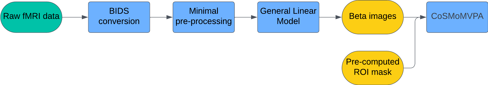

1. **Data Acquisition**: Collect fMRI data as participants perform tasks or view stimuli from different categories.
2. **BIDS Conversion**: Convert raw data into the Brain Imaging Data Structure (BIDS) format. This standardization makes subsequent preprocessing and analysis much easier.
3. **Preprocessing (fMRIPrep)**: Use minimal preprocessing to preserve fine-grained voxel-level patterns. fMRIPrep performs standardized alignment and normalization without over-smoothing or aggressive denoising, both of which can destroy subtle patterns critical for MVPA.
4. **GLM Estimation (SPM)**:
    - **Beta images**: One per condition (category) and run.
    - **SPM.mat**: Contains the experiment design and regression coefficients.
5. **Defining Regions of Interest (ROIs)**:
    - Use anatomical or functional Regions of Interest (ROI) masks to focus on specific brain regions.
    - Linear classifiers struggle with high-dimensional data — particularly when the number of features (voxels) are significantly higher than the number of observations (beta images), which is often the case with fMRI data. Therefore, restricting MVPA analyses to smaller ROIs is generally a good practice.

---

## Purpose of This Tutorial

In this example, we will investigate the representational structure of **simulated synthetic data**. We will illustrate the (few) steps required to perform a multi-variate analysis on post GLM data (i.e., beta images produces by SPM).

The goal is to investigate the **representational geometry** of two ROIs, V1 and IT, to determine what properties of the stimuli are represented in these areas.

### What We Will Do

1. Generate synthetic fMRI-like data simulating responses in IT or V1.
2. Perform **MVPA (decoding)** to see if the ROI can distinguish between multiple categories above chance.
3. Conduct **RSA** to compare the observed representational geometry with theoretical model RDMs, revealing whether perceptual or categorical features dominate the neural patterns.

### Data Structure (Synthetic)

- **Subject(s)**: 1
- **Runs**: 10 runs/subject
- **Categories** (8 total): Human face, Human body, Animal face, Animal body, Natural round object, Natural spiky object, Artificial round object, Artificial spiky object


---

### Hypothesis

- **V1**: Similarities are based on low-level perceptual features (e.g., round vs. spiky).
- **IT**: Similarities are based on higher-level conceptual distinctions (e.g., human vs. animal, animate vs. inanimate, natural vs. artificial).

---

## Code

### 1. Setup

We set up the MATLAB environment, ensuring reproducibility and proper paths.

```matlab
% Clear workspace, close figures, and reset command window
clear all;
close all;
clc;

% Set random seed for reproducibility
seed = 42;
rng(seed);

% Add paths to required functions
addpath("functions/");
outDir = fullfile(pwd, "results");
```

---

### 2. (Optional) Loading Real Data from SPM

If we had real data, after preprocessing and GLM estimation, we could load it like this:

```matlab
% Example (not run here):
spm_path = 'path_to_SPM.mat';
mask_path = 'path_to_ROI_mask.nii';
ds = cosmo_fmri_dataset(spm_path, 'mask', mask_path);
```

For this tutorial, we are skipping this step because we use synthetic data.

---

### 3. Synthetic Data Generation

We generate synthetic data that mimics patterns in IT or V1. You can switch `roiName` between `"V1"` and `"IT"`.

```matlab
% Parameters for synthetic data generation
numCategories = 8;
numRuns = 10;
numSubjects = 1;
numRepetitions = 1;
size = "normal";

% Choose ROI
roiName = "IT";  % For abstract, categorical representations
% roiName = "V1"; % For low-level, perceptual representations

sigma = 0.6; % Data variability

% Generate synthetic dataset
ds = generate_clustered_dataset(numCategories, numSubjects, numRuns, ...
    numRepetitions, sigma, seed, roiName, size);
```

---

### 4. Inspecting the Data

Before proceeding, inspect the generated dataset:

- **Target-to-Label Mapping**: Understand which category corresponds to which integer label.
- **Activation Heatmap**: Visualize category-specific activity patterns.

```matlab
% Extract and display unique labels
labelNames = unique(ds.sa.labels, 'stable');
disp('Target to Label Mapping:');
disp(table(ds.sa.targets, ds.sa.labels));

% Plot activation patterns
plot_activation_heatmap(ds, labelNames, roiName, outDir);
```

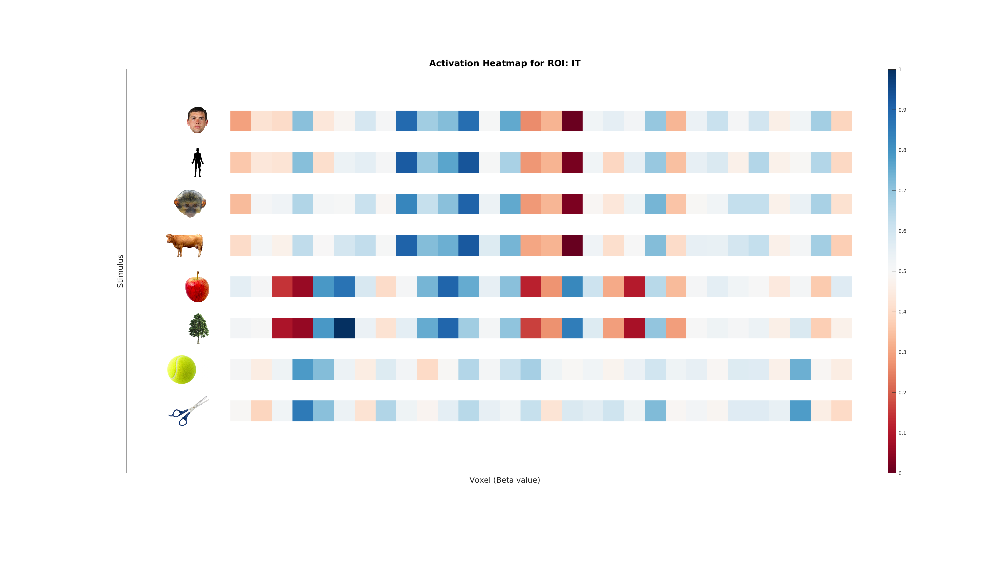

---

### 5. MVPA: Classification Analysis

We use a simple Linear Discriminant Analysis (**LDA**) classifier with cross-validation to decode category information.

The central idea is that **if differences between categories are present, the classifier will be able to pick that signal up**. When we use an MVPA classifier to brain data, we are testing whether the neural patterns (represented as voxel activity) for different categories contain distinct, systematic differences. If the brain region being analyzed encodes information about the categories in its activity patterns, the classifier will achieve accuracy above chance.

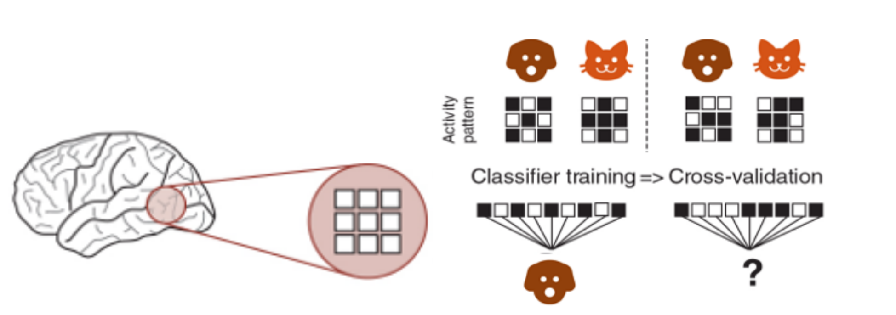

In other words, the classifier looks at the activity from multiple voxels and tries to **find consistent differences between patterns** for different categories (e.g., cats vs. dogs). If those patterns are different enough, the classifier can "learn" to predict the category based on the brain activity by identifying separable representations in a high-dimensional space of neural activity.

This works because the brain encodes information about what we see in these patterns—like a unique "signature" for each category. If the classifier succeeds, it shows that the brain region we're analyzing contains information relevant to distinguishing those categories.

#### Steps

1. **Partitioning**: Divide the data into folds based on runs (e.g., leave-one-run-out).
2. **Training & Testing**: Train on some runs, test on another run.
3. **Evaluate Accuracy**: Compare accuracy to chance (1/8 = 12.5%).

```matlab
% Define the classifier
classifier = @cosmo_classify_lda;

% Set up cross-validation partitions
partitions = cosmo_nfold_partitioner(ds);

% Perform cross-validation decoding
[predictedLabels, accuracy] = cosmo_crossvalidate(ds, classifier, partitions);

% Compute chance level
chanceLevel = 1 / numCategories;

% Display the decoding results
fprintf('Classification accuracy: %.2f%% (chance level: %.2f%%)\n', ...
    accuracy * 100, chanceLevel * 100);

% Plot confusion matrix
plot_confusion_matrix(ds.sa.targets, predictedLabels, numCategories, accuracy, ...
    labelNames, roiName, outDir);
```

A confusion matrix helps identify which categories are easily distinguishable and which are often confounded.

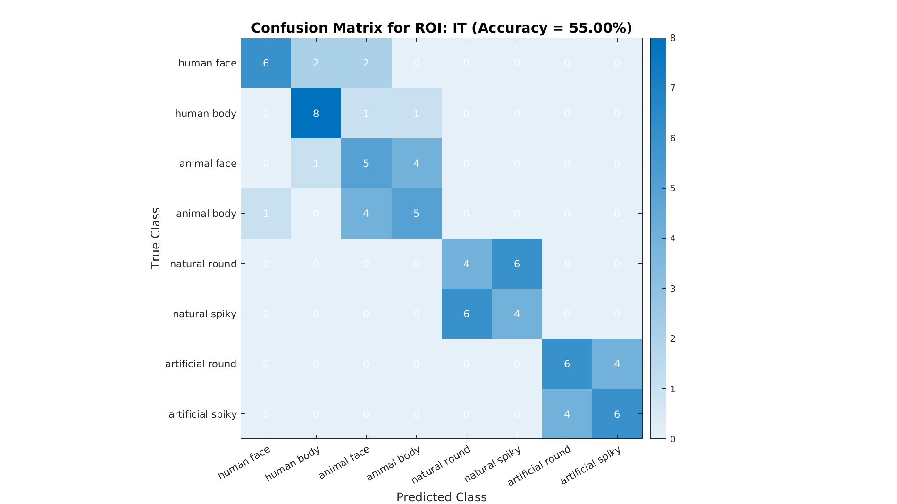

---

### 6. Representational Dissimilarity Matrices (RDMs)

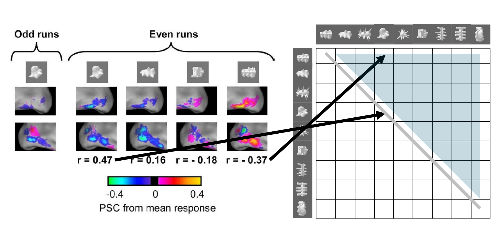

RSA involves comparing the RDMs from brain data to RDM for our theoretical models. We do this by computing RDMs:

1. **Mean Patterns**: Average the data across runs for each category.
2. **Compute Distances**: Calculate pairwise distances (1-Correlation) between categories to form an RDM.
3. **Compare to Models**: Generate theoretical RDMs and see which best fits the data.

```matlab
% Compute mean dataset across runs per category
dsMean = cosmo_fx(ds, @(x) mean(x, 1), 'targets');

% Visualize categories in a 2D space using MDS
plot_mds(ds, roiName, outDir);
```

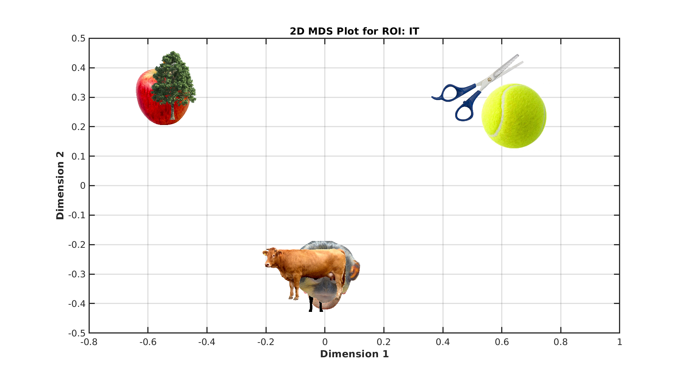

```matlab
% Compute the data RDM
measureDsm = @cosmo_dissimilarity_matrix_measure;
argsDsm.metric = 'correlation';
argsDsm.center_data = true;

dataDsm = measureDsm(dsMean, argsDsm);
dataRdm = squareform(dataDsm.samples);

% Generate model RDMs (theoretical structures)
rdms = generate_model_rdms(numCategories);
```

To visualize the RDMs:

```matlab
plot_rdm_full(dataRdm, labelNames, 'Brain RDM');
plot_rdm_full(rdms(1).dsm, labelNames, rdms(1).description);
plot_rdm_full(rdms(2).dsm, labelNames, rdms(2).description);
plot_rdm_full(rdms(3).dsm, labelNames, rdms(3).description);
```

---

### 7. RSA Regression

We now fit a linear model that predicts the data RDM from these model RDMs.

The regression coefficients indicate how strongly each model explains the observed data's representational geometry.

```matlab
% Set up RSA regression
measure = @cosmo_target_dsm_corr_measure;
measureArgs = struct();
measureArgs.center_data = true;

% Prepare model RDM regressors
regressorRDMs = cellfun(@(x) squareform(x)', {rdms.dsm}, 'UniformOutput', false);
measureArgs.glm_dsm = regressorRDMs;

% Run RSA regression
result = measure(dsMean, measureArgs);

% Extract category labels
labels = dsMean.sa.labels;

% Plot results: observed RDM, model RDMs, and regression coefficients
plot_rdms_and_coefficients(dataRdm, rdms, labels, result.samples, roiName, outDir);
```

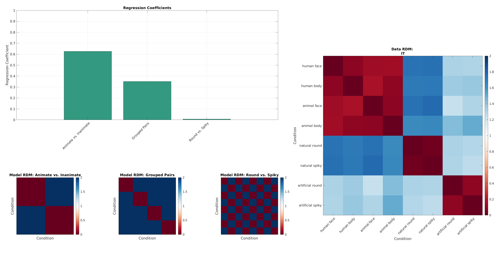

## Full Code Example: Comparison with V1

Now that we have the full picture, let's re-run our full code, but this time we only see the main results for **the other synthetic ROI: V1**.

```matlab linenums="1"
%% Setup
% Clear workspace, close figures, and reset command window
clear all;
close all;
clc;

% Set random seed for reproducibility
seed = 42;
rng(seed);

% Add paths to required functions
addpath("functions/");
outDir = fullfile(pwd, "results");

%% Synthetic data generation
% Parameters for synthetic data generation
numCategories = 8;
numRuns = 10;
numSubjects = 1;
numRepetitions = 1;
size = "normal";

% Choose ROI
roiName = "V1"; % For low-level, perceptual representations

sigma = 0.6; % Data variability

% Generate synthetic dataset
ds = generate_clustered_dataset(numCategories, numSubjects, numRuns, ...
    numRepetitions, sigma, seed, roiName, size);
    
%% Inspecting the data
% Extract and display unique labels
labelNames = unique(ds.sa.labels, 'stable');
disp('Target to Label Mapping:');
disp(table(ds.sa.targets, ds.sa.labels));

% Plot activation patterns
plot_activation_heatmap(ds, labelNames, roiName, outDir);

%% MVPA: Classification Analysis
% Define the classifier
classifier = @cosmo_classify_lda;

% Set up cross-validation partitions
partitions = cosmo_nfold_partitioner(ds);

% Perform cross-validation decoding
[predictedLabels, accuracy] = cosmo_crossvalidate(ds, classifier, partitions);

% Compute chance level
chanceLevel = 1 / numCategories;

% Display the decoding results
fprintf('Classification accuracy: %.2f%% (chance level: %.2f%%)\n', ...
    accuracy * 100, chanceLevel * 100);
    
% Plot confusion matrix
plot_confusion_matrix(ds.sa.targets, predictedLabels, numCategories, accuracy, ...
    labelNames, roiName, outDir);
    
%% Representational Dissimilarity Matrices (RDMs)
% Compute mean dataset across runs per category
dsMean = cosmo_fx(ds, @(x) mean(x, 1), 'targets');

% Visualize categories in a 2D space using MDS
plot_mds(dsMean, roiName, outDir);

% Compute the data RDM
measureDsm = @cosmo_dissimilarity_matrix_measure;
argsDsm.metric = 'correlation';
argsDsm.center_data = true;

dataDsm = measureDsm(dsMean, argsDsm);
dataRdm = squareform(dataDsm.samples);

% Generate model RDMs (theoretical structures)
rdms = generate_model_rdms(numCategories);

%% RSA Regression
% Set up RSA regression
measure = @cosmo_target_dsm_corr_measure;
measureArgs = struct();
measureArgs.center_data = true;

% Prepare model RDM regressors
regressorRDMs = cellfun(@(x) squareform(x)', {rdms.dsm}, 'UniformOutput', false);
measureArgs.glm_dsm = regressorRDMs;

% Run RSA regression
result = measure(dsMean, measureArgs);

% Extract category labels
labels = dsMean.sa.labels;

% Plot results: observed RDM, model RDMs, and regression coefficients
plot_rdms_and_coefficients(dataRdm, rdms, labels, result.samples, roiName, o
```

And the results:

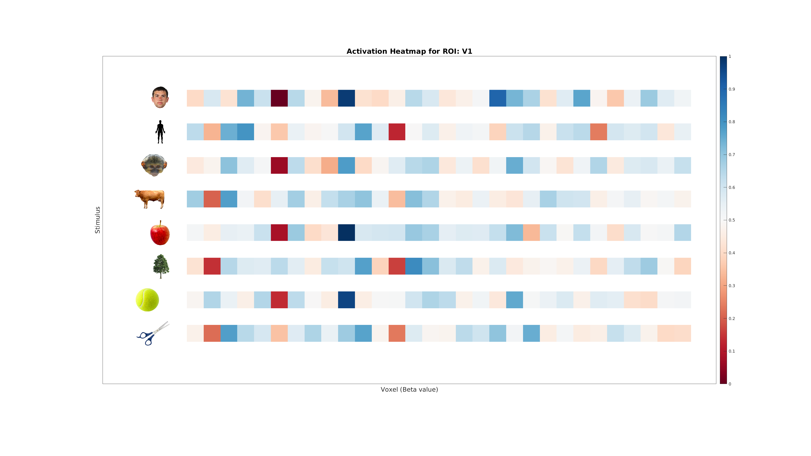
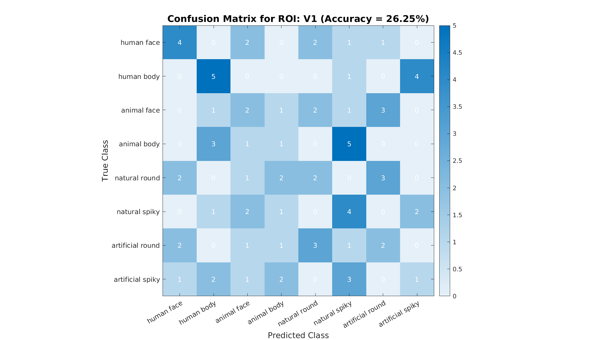
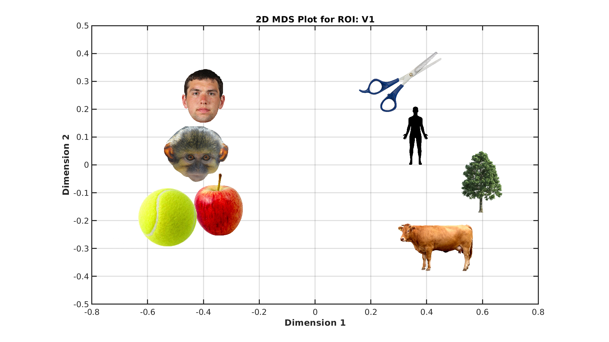
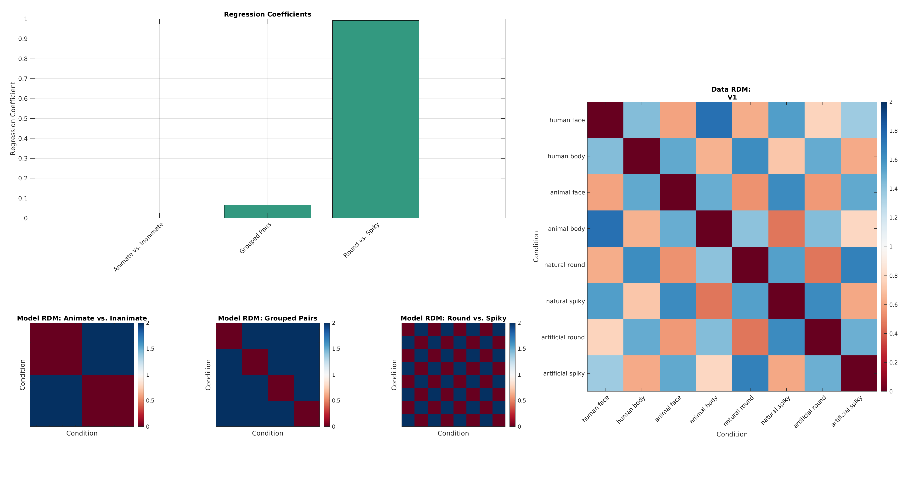

---

## Conclusion

**What we learned**:

- How to **structure and preprocess fMRI data** (BIDS, fMRIPrep, SPM) for MVPA and RSA.
- How to decode category information using **MVPA**.
- How to **apply RSA** to compare observed brain patterns to theoretical representational models.
