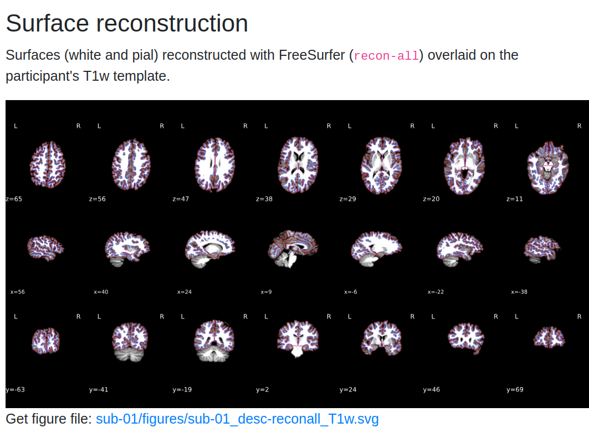
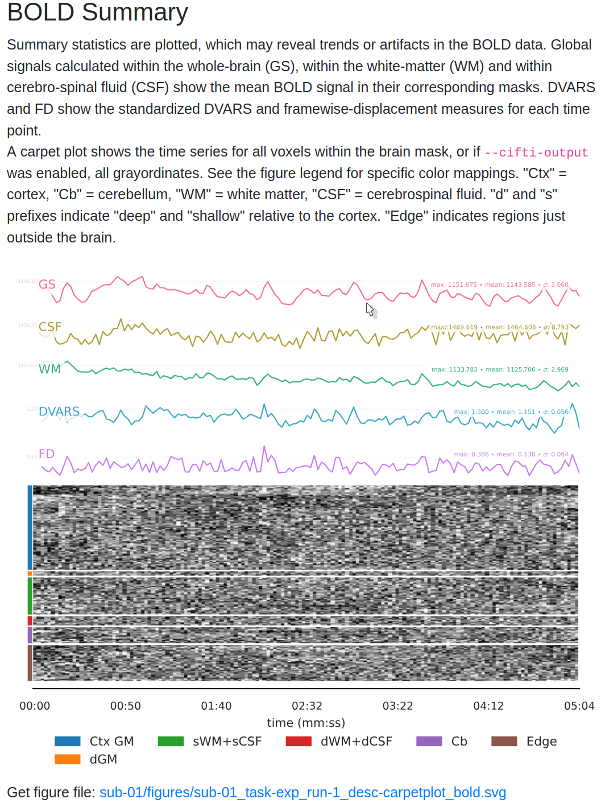
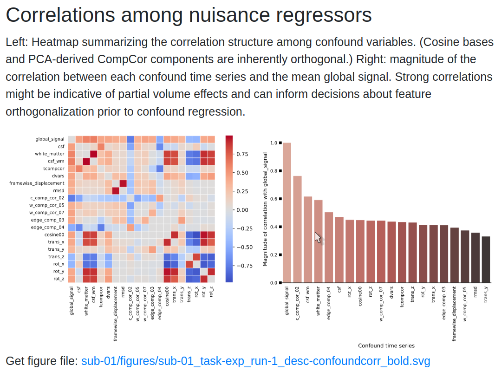

# fMRI Preprocessing and Quality Assessment

You should land on this page after having collected your (f)MRI data and [converted it to BIDS](./fmri-bids-conversion.md).

## Preprocessing & Quality Assessment Overview

In this page, you will learn how to preprocess fMRI data using [fMRIPrep](https://fmriprep.org/en/stable/) and perform quality assessment with [MRIQC](https://mriqc.readthedocs.io/en/stable/). We will cover:

<div class="grid cards" markdown="1">

- :material-cogs: **[Running fMRIPrep](#preprocessing-with-fmriprep)**  
  Step-by-step guide to run fMRIPrep, including the required command structure, key options, and output directory organization.

- :material-chart-bell-curve: **[Performing Quality Control with MRIQC](#quality-assessment-with-mriqc)**  
  Use MRIQC to assess the quality of your MRI data. Identify potential artifacts and ensure data suitability for further analysis.

- :material-file-eye: **[Interpreting fMRIPrep Outputs](#fmriprep-html-report)**  
  Understand the content of the fMRIPrep HTML report, including motion parameters, anatomical alignment, and other key quality checks.

- :material-chart-bar: **[Reviewing MRIQC Reports](#mriqc-html-report)**  
  Learn how to interpret MRIQC's visual reports and quality metrics, such as SNR and temporal SNR, to evaluate the data's integrity.

- :material-alert: **[Troubleshooting Common Issues](#common-issues-with-fmriprep-and-mriqc)**  
  Find solutions to common challenges with fMRIPrep and MRIQC, including memory management and output interpretation.

- :material-playlist-check: **[Next Steps: GLM Analysis](./fmri-glm.md)**  
  Once your data is preprocessed and quality-checked, move on to first-level analysis with the General Linear Model.

</div>

- **[fMRIPrep Documentation](https://fmriprep.org/en/stable/)**  
  Get detailed insights into the preprocessing steps, output formats, and recommended practices.

- **[MRIQC Documentation](https://mriqc.readthedocs.io/en/stable/)**  
  Explore MRIQC's metrics and recommendations for improving MRI data quality.

- **[NeuroStars Community](https://neurostars.org/tags/fmriprep)**  
  A valuable resource for troubleshooting and community discussions related to fMRIPrep and MRIQC.

- **[YouTube: Reviewing fMRIPrep Outputs](https://www.youtube.com/watch?v=fQHEKSzFKDc)**

!!! tip
    Before proceeding, ensure that your fMRI data is converted into **BIDS format**. Refer to the [BIDS Conversion Guide](./fmri-bids-conversion.md) for more details.

---

## Preprocessing with fMRIPrep

### 1. Setting Up fMRIPrep

To use fMRIPrep, ensure that you have:

- **Docker** (or **Singularity** for HPC environments).
- Installed the `fmriprep-docker` wrapper for easier command-line usage:
  
  ```sh
  pip install fmriprep-docker
  ```

- A valid **FreeSurfer license** (`license.txt`) saved in a path accessible by fMRIPrep. This is needed for surface-based preprocessing.

!!! note "System Requirements"
    fMRIPrep is resource-intensive. For optimal performance, allocate:

    - At least **16 GB RAM** and **4 CPUs**.
    - A **high-speed SSD** for the working directory to improve I/O performance.

For detailed instructions, visit the [fMRIPrep Installation Guide](https://fmriprep.org/en/stable/installation.html).

---

### 2. Running fMRIPrep

Once your environment is ready, you can run fMRIPrep using the following command:

```sh
fmriprep-docker /path/to/BIDS /path/to/derivatives/fmriprep participant \
    --work-dir /path/to/temp_fmriprep \
    --fs-license-file /path/to/.license \
    --output-spaces MNI152NLin2009cAsym:res-2 anat fsnative \
    --participant-label <SUBJECT_ID> \
    --n-cpus 8 --mem-mb 16000 --notrack
```

Replace:

- `/path/to/BIDS` with the path to your BIDS directory.
- `/path/to/derivatives/fmriprep` with where you want to store fMRIPrep outputs.
- `<SUBJECT_ID>` with the ID of the subject being processed.

??? question "Why specify output spaces?"
    `--output-spaces` defines the spaces in which your data will be resampled. Common options include:

    - **MNI152NLin2009cAsym**: Standard volumetric template.
    - **anat**: Subject’s native T1w space.
    - **fsnative**: FreeSurfer's subject-specific surface space.

### 3. Output Structure and Files

After running fMRIPrep, the output will be in the `derivatives/fmriprep` folder. This includes:

- **Preprocessed anatomical images** (`T1w`, `T2w`).
- **Preprocessed functional images** (BOLD series).
- **Confounds**: `.tsv` files containing motion parameters and other potential noise regressors.
- **Reports**: `sub-xx.html` files with a summary of the preprocessing.

Refer to the [fMRIPrep Output Documentation](https://fmriprep.org/en/stable/outputs.html) for more information.

---

## Quality Assessment with MRIQC

### 1. Running MRIQC

MRIQC helps identify potential issues in your data by generating quality metrics. Run MRIQC using Docker with the following command:

```sh
docker run -it --rm \
    -v /path/to/BIDS:/data:ro \
    -v /path/to/derivatives/mriqc:/out \
    nipreps/mriqc:latest /data /out participant \
    --participant-label <SUBJECT_ID> --nprocs 8 --mem-gb 16 --verbose-reports
```

This command will analyze individual subjects and save the results in the specified output directory. Replace the paths as appropriate.

!!! tip "Running Group-Level Analysis"
    After processing individual subjects, you can run a group-level analysis to compare metrics across subjects:

    ```sh
    docker run -it --rm \
        -v /path/to/BIDS:/data:ro \
        -v /path/to/derivatives/mriqc:/out \
        nipreps/mriqc:latest /data /out group \
        --nprocs 8 --mem-gb 16 --verbose-reports
    ```

### 2. Understanding MRIQC Outputs

MRIQC generates:

- **Visual reports** (`sub-xx.html`) for each subject.
- **CSV files** with quality metrics.
- **Group-level metrics** for overall dataset quality.

Refer to the [MRIQC Documentation](https://mriqc.readthedocs.io/en/stable/) for a detailed explanation of each metric.

---

## Interpreting fMRIPrep and MRIQC Reports

### fMRIPrep HTML Report

After running fMRIPrep, the outputs will be stored in the `derivatives/fmriprep` directory, with each subject's data organized into subfolders like `sub-01`. These folders contain both the preprocessed functional and anatomical data, alongside JSON files with metadata.

 Each subject’s report (`sub-xx.html`) includes:

- **Registration Plots**: Check the alignment of functional and anatomical images.
- **Field Map Corrections**: Review the effect of susceptibility distortion corrections.
- **Motion Correction**: Look for high motion frames using **Framewise Displacement (FD)** plots.

??? note "What is Framewise Displacement (FD)?"
    FD is a measure of head movement between frames. High FD values indicate potential motion artifacts.

Let’s walk through the key components of the output and how to interpret the HTML summary reports.

#### 1. Output Directory Structure

Within each subject's directory (`sub-01`):

- **`anat/` folder**: Contains anatomical images, including normalized versions (e.g., `MNI152` template) and images in native space.
- **`func/` folder**: Contains functional data for each run, including:
  - **Confound Regressors** (`.tsv`): Time series of noise estimates like white matter and cerebrospinal fluid (CSF).
  - **Preprocessed Functional Images**: Aligned to templates like `MNI152`.
  - **Brain Masks**: Estimated masks for the brain, used in further analyses.

These files will be referenced in the HTML summary report, which provides an overview of the preprocessing steps and quality metrics.

#### 2. Opening the HTML Summary Report

To view the HTML report, navigate to `derivatives/fmriprep/sub-01/` and open `sub-01.html` by double-clicking it or using the terminal:

The report contains the following sections: **Summary**, **Anatomical**, **Functional**, **About**, **Methods**, and **Errors**. Use the tabs at the top of the report to navigate these sections.

#### 3. Understanding the Summary Section

The **Summary** tab includes:

- **Number of Structural and Functional Images**: Lists the number of anatomical and functional images processed.
- **Normalization Template**: Shows the template used for alignment (e.g., `MNI152NLin2009cAsym`).
- **FreeSurfer**: Indicates whether surface-based preprocessing was performed.

Make sure these details match the parameters specified in your fMRIPrep command.

#### 4. Anatomical Quality Checks

The **Anatomical** section provides:

- **Brain Mask Overlay**: Displays the brain mask (red outline), gray matter (magenta), and white matter boundaries (blue) overlaid on the anatomical image in sagittal, axial, and coronal views.


- **Normalization Check**: A GIF compares the subject’s anatomical image with the MNI template. Ensure that:

  - The outlines of the brain and internal structures (e.g., ventricles) align well.
  - Any misalignment could indicate poor normalization, which may need further inspection.
  


!!! tip
    **Hover over the GIF** to see the back-and-forth comparison between the subject's brain and the template. Look closely at the alignment of internal brain structures.

- **Surface Reconstruction** if you ran the `recon-all` routine in fMRIprep



#### 5. Functional Quality Checks

In the **Functional** section, you’ll find:

- **Functional-to-Anatomical Alignment**: A GIF shows how well the preprocessed functional images align with the anatomical image.

!!! tip "Check for alignment"
    Check for alignment between internal structures like ventricles in the functional and anatomical images. Open the image in a new tab (Right Click on the image -> Open in a new tab) and hover to see the dynamic image.



- **CompCor Masks**: Displays masks used for **Anatomical Component Correction (aCompCor)**:
  - **White Matter and CSF (Magenta)**: Masks used to extract noise components.
  - **High-Variance Voxels (Blue)**: Used for **Functional Component Correction (fCompCor)**.

!!! note "Assessing Alignment"
    Good alignment between functional and anatomical images is crucial for accurate analysis. Pay special attention to lighter fluid-filled regions in the functional image, which should correspond with dark CSF areas in the anatomical image.

#### 6. BOLD Summary and Carpet plot

The report includes **time series plots** for various confounds:

- **Global Signal (GS)**: Measures signal fluctuations across the entire brain.
- **CSF Signal (GSCSF)** and **White Matter Signal**: Represent fluctuations in specific tissue types.
- **Motion Metrics (DVARS, Framewise Displacement)**:
  - **DVARS**: Shows changes in BOLD signal intensity from one time point to the next.
  - **Framewise Displacement (FD)**: Tracks the amount of head movement between frames.
  - **Use DVARS and FD** to identify frames with high motion that could affect data quality.

!!! tip
    High motion values often correlate with changes in global signal. Consider including these regressors in your GLM to account for motion-related noise.

The **carpet plot** displays time series of BOLD signals across different brain regions:

- **Cortex** (blue), **Subcortex** (orange), **Gray Matter** (green), and **White Matter/CSF** (red).
- Look for **sudden changes across a column**, which may indicate motion artifacts affecting the entire brain at a particular time point.



#### 7. Correlation Matrix of Confound Regressors

The report also includes a **correlation matrix** showing relationships between confound regressors:

- High correlations between **CSF** and **motion regressors** may indicate that motion affects CSF signals.
- Use this matrix to decide which regressors to include in your GLM for better noise correction.

!!! note "High Correlations"
    High correlation values may suggest redundancy among some regressors. Consider removing or combining them to avoid overfitting when building your GLM.



#### 8. Making Decisions for Further Analysis

After reviewing the report:

- **Identify Good Quality Runs**: Look for well-aligned images and minimal motion artifacts.
- **Decide on Regressors**: Choose confounds like **DVARS**, **FD**, and **CompCor** components to include in your GLM.

!!! question "What confound regressors should I use in my GLM?"
    A common choice is to include at least the 6 Head Motion parameters, and optionally FD and Global Signal ad nuisance regressors in your GLM.  

    See [this awesome NeuroStars conversation](https://neurostars.org/t/confounds-from-fmriprep-which-one-would-you-use-for-glm/326/45) with advice on choosing regressors and relevant resources.

For more details on interpreting fMRIPrep reports, see the [fMRIPrep Outputs Documentation](https://fmriprep.org/en/stable/outputs.html) and discussions on [NeuroStars](https://neurostars.org/tags/fmriprep).

---

### MRIQC HTML Report

The MRIQC report highlights:

- **Summary Image**: A visual overview of key metrics, including **signal-to-noise ratio (SNR)** and **temporal SNR (tSNR)**.
- **Detailed Metrics**: Click through different tabs to examine metrics like **Mean Framewise Displacement**, **EPI-to-T1w registration quality**, and **artifact presence**.

!!! info "Interpreting tSNR"
    Higher **temporal SNR (tSNR)** values indicate better data quality. Typical values range from 30-60 for fMRI. Low tSNR may suggest issues like excessive noise or scanner artifacts. Review the group-level metrics to identify subjects with unusually high motion or low tSNR.

For more information on understanding these metrics, check out the [MRIQC interpretation guide on NeuroStars](https://neurostars.org/t/how-to-interpret-mriqc-metrics/).

---

## Common Issues with fMRIPrep and MRIQC

??? failure "Memory Errors: Out of Memory (OOM) or Crash"
    - **Problem**: fMRIPrep crashes or terminates unexpectedly due to insufficient memory.
    - **Solution**: Reduce the `--mem-mb` parameter to allocate less memory or increase the swap space available on your system. This can help prevent OOM errors.
    - **Tip**: Monitor your memory usage during processing using tools like `htop` (Linux) or **Activity Monitor** (Mac). Aim to use around 80-90% of your available RAM without exceeding it.

??? failure "Docker File Permissions Error"
    - **Problem**: fMRIPrep cannot access input or output directories due to file permissions.
    - **Solution**: Ensure that Docker has read and write permissions to the directories being mounted. Adjust permissions using:
      ```sh
      chmod -R 755 /path/to/BIDS /path/to/derivatives
      ```
    - **Tip**: On Windows, ensure that **Shared Drives** are enabled in Docker Desktop settings.

??? failure "Missing Fields in JSON Files"
    - **Problem**: fMRIPrep fails due to missing `SliceTiming` or `PhaseEncodingDirection` fields in the JSON sidecar files.
    - **Solution**: Verify that all required metadata fields are present using the [BIDS Validator](https://bids-standard.github.io/bids-validator/). For guidance on JSON sidecar fields, see the [BIDS Specification](https://bids-specification.readthedocs.io/en/stable/).
    - **Tip**: If using custom acquisition parameters, manually edit JSON files to include the missing fields.

??? failure "RuntimeError: Fieldmap Issues"
    - **Problem**: fMRIPrep throws a `RuntimeError` related to fieldmaps, such as missing or improperly specified fieldmaps.
    - **Solution**: Ensure that fieldmaps are correctly specified in your BIDS dataset according to the [BIDS Fieldmap documentation](https://bids-specification.readthedocs.io/en/stable/06-derivatives/03-field-maps.html).
    - **Tip**: If your study does not require fieldmap correction, you can skip this step by specifying `--ignore fieldmaps` in your fMRIPrep command.

??? failure "MRIQC: NaN Values in JSON Files"
    - **Problem**: MRIQC fails when encountering `NaN` values in JSON metadata files.
    - **Solution**: Use a script like `sanitize_json.py` to replace `NaN` values with valid placeholders before running MRIQC.
    - **Tip**: Validate your JSON files before running MRIQC to avoid processing interruptions.

??? failure "Docker: Cannot Allocate Memory"
    - **Problem**: fMRIPrep crashes with the error `cannot allocate memory` when using Docker.
    - **Solution**: Restart the Docker service or allocate more memory and CPUs through the Docker Desktop settings under **Resources**.
    - **Tip**: Increase memory allocation gradually (e.g., 2-4 GB increments) until fMRIPrep runs smoothly.

??? failure "Slow Processing: fMRIPrep Takes Too Long"
    - **Problem**: fMRIPrep runs slowly, taking an excessively long time for each subject.
    - **Solution**: Use a **faster SSD** for the `--work-dir` to improve read/write speeds and reduce processing time. Also, ensure `--n-cpus` is set to the majority of available cores, but not all, to avoid system slowdowns.
    - **Tip**: Consider running fMRIPrep on a **high-performance computing (HPC)** cluster if available.

??? failure "Missing or Corrupted Output Files"
    - **Problem**: After running fMRIPrep or MRIQC, certain output files (e.g., `sub-xx.html` reports) are missing or corrupted.
    - **Solution**: Check for errors in the log files generated during the run. Often, disk space issues or interruptions during processing can cause missing files. Re-run the affected subjects with sufficient disk space.
    - **Tip**: Use a dedicated work directory and ensure it has at least **100 GB** of free space to accommodate intermediate files.

??? failure "MRIQC: No Group Report Generated"
    - **Problem**: Group-level analysis in MRIQC does not produce a report.
    - **Solution**: Ensure that MRIQC was run in **group mode** using the correct `group` argument. Check if all individual reports are present in the output directory before running the group-level command.
    - **Tip**: Verify that the `derivatives/mriqc` directory has read and write access for Docker.

---

With these quality checks complete, you’re ready to proceed to the **General Linear Model (GLM) analysis**. See the next guide for instructions on setting up your GLM. [--> Go to GLM](./fmri-glm.md)
