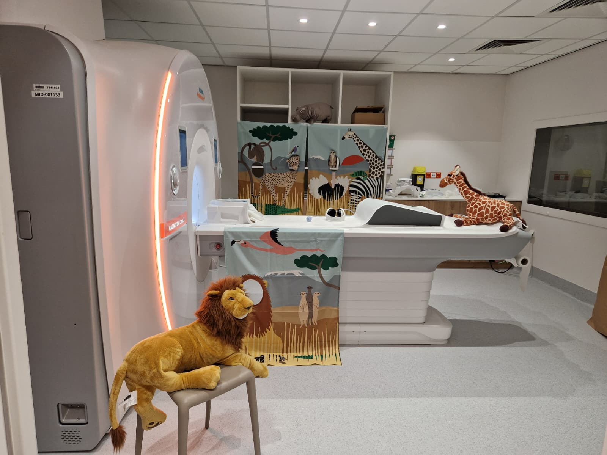

# Scanning children (MR11)

This page follows the protocol of the ROOTS study (time point 1, summer 2026), which scans children at MR11: planning, the rooms and materials, a safari-themed game that prepares the child for the scan, and how the team shares the work on the day. Everything else (safety, console steps, data) works as in the [MR11 scanning procedure](fmri-procedure.md).

<figure markdown="span">
  { width="900" .img-border }
  <figcaption>The MR11 magnet room set up for a children's session: safari cloths and cuddly animals, in the theme of the preparation game.</figcaption>
</figure>

!!! info "The script is in Dutch"
    The preparation game is played in Dutch. Floor Vandecruys has the full script (what to say at each step). Ask her for it before your first session. Below is a summary in English.

---

## Months before

Prepare as for any MR11 study (approvals, safety course, access, sequences and pilots): see [First steps](fmri-get-started.md#before-you-start). Your approvals must cover scanning children. For scans in the evening or at the weekend, follow the rule on who must be present in the [MR11 scanning procedure](fmri-procedure.md#general-information).

## Planning

Plan the sessions in a digital agenda. If you scan many participants in a short period and at fixed times (for example always at the weekend), work with pre-reserved slots in the scanner agenda.

To book the scan, you need the child's first and last name, sex, date of birth, address, general practitioner and national register number (*rijksregisternummer*).

Send the parents directions: the new MRI location is Gele straat, Poort 2, level 0, and the waiting room is *Beeldvorming 2*. Families register as described in [Participant arrival and registration](fmri-procedure.md#participant-arrival-and-registration); at the weekend they come straight to the waiting room.

---

## A few days before

Prepare the rooms, the documents for the parents and the materials for the game.

### Rooms

- [ ] The preparation room for the game (waiting room K)
- [ ] The console room and the magnet room
- [ ] A room where the parent can wait (try to avoid having the parent in the console room)
- [ ] A testing room for behavioural tasks
- [ ] A toilet

### For the parents

- [ ] Information letter and informed consent form
- [ ] MRI safety questionnaire for the child, and a second one for the parent if they will come into the magnet room
- [ ] Study questionnaires (ROOTS: a questionnaire on the home environment). Parents fill it in while the child does the behavioural tasks. Paste the link somewhere you can find it (for example in your mailbox) and open it on the computer in the preparation room, with the UZ Leuven guest account (ask Floor Vandecruys for the login).

### Materials

For the preparation game:

- [ ] A safari hat that looks like the head coil
- [ ] Earplugs and headphones
- [ ] A busy savanna picture with animals, in a blurry and a sharp version
- [ ] A sheet with the movies the child can choose from
- [ ] A mini scanner (tunnel) with a toy giraffe
- [ ] A horn, standing in for the alarm button
- [ ] A poster of Zaza, the safari guide
- [ ] Decorations for the rooms (posters, cuddly animals)
- [ ] Sweets (Fruittella)
- [ ] Sticker cards and stickers
- [ ] Someone whose badge opens waiting room K

For behavioural tasks you also need a sticker card and stickers, the score form, a test computer for the computer tasks and the task materials.

In ROOTS, the lead researcher prepared a folder per child (with the subject number on the front), student researchers prepared the preparation room and the magnet room, and a student job worker prepared the room for the behavioural tasks.

---

## On the day

### Who does what

During the session the work is split as follows:

- One researcher meets the family and plays the preparation game with the child.
- The main researcher runs the MRI console and the microphone.
- Researcher 2 runs the stimulus PC.
- Researcher 3 watches the child: are they still lying comfortably, do they move a lot?
- Researcher 3 or 4 keeps track of the time, so the next child is fetched from the waiting room on time.

### Checks before the first child

Check these every day, before the child arrives:

- [ ] The sound (and the loudness!) of the headphones
- [ ] The signal of the response buttons: open Notepad on the stimulus PC and press each button
- [ ] The stimulus PC (login details in the [contact and passwords document](fmri-equipment.md#stimulus-pc))
- [ ] The screen: it is on and the image is mirrored, as it must be, and the sound works

For each child, start on the stimulus PC the movie the child chose and your MATLAB experiment (in ROOTS, under *research studies* › the study number).

### At the console

Register the child as in [Register the participant at the console](fmri-procedure.md#register-the-participant-at-the-console). Details from the ROOTS protocol:

- Note the child's height and weight (in the child's folder); the console needs them.
- The patient list is on the left monitor. If the child is missing from it, call the MR2 desk (see the tip under [Register the participant at the console](fmri-procedure.md#register-the-participant-at-the-console)).
- The study number is usually among the last chosen options; otherwise find it via *Brain* › *FFPW*.
- After the study number, ROOTS chose *Brain*, then *head-to-supine*.
- During the scan, fill in the checklist per child: note anything unusual, any problems, and the order of the sequences you ran.

If there are problems, call the MR2 desk (internal 45351).

!!! danger "Metal and hearing protection"
    Everyone takes all metal off: the child, you, and the parent if they come into the magnet room. Everyone in the magnet room wears hearing protection.

---

## The preparation game: on safari with Zaza

The game gets the child used to the researcher and familiar with the MRI procedure. It starts with a story about **Zaza the safari guide**, who takes the child on an adventure through the savanna. By doing the tasks well, the child collects stickers on their safari card and becomes a real safari expert. The last sticker comes with the visit to the big safari hut (the scanner); then the child gets a safari diploma.

### Phase 1: first contact

1. The parents follow the arrows to the MRI waiting room (*Beeldvorming 2*). The researcher who does the preparation fetches parent(s) and child there, introduces themselves and speaks to the child first. Tell the child that today they go on a safari adventure, but first they need to practise a few safari tasks, and that mum or dad gets some homework.
2. Take parent and child to the preparation room (waiting room K; you need the badge that opens it).
3. Give the parents their "homework": the information letter and consent form, and the MRI safety questionnaire, which checks whether either of them has metal in the body or something special such as a pacemaker. If a parent wants to come into the magnet room, they fill in the questionnaire for themselves too (without height and weight, which are only needed for the child). The parents best stay in the waiting area to read and sign, while you start with the child.

### Phase 2: preparation

Tell the story of Zaza (show the poster) and show the sticker card. Then play the tasks in order; each one opens to show how. The Dutch script numbers them 1, 2a, 2b, 3, 4, 5 and 6.

??? steps "Put on the safari hat"
    This task gets the child used to something on their head, and breaks the ice. You need the safari hat that looks like the head coil.

    Show the hat: real safari researchers wear one, and later, when we look at the animal pictures, you also get something on your head. The child puts the hat on themselves and earns the first sticker.

??? steps "The blurry animal picture"
    Here the child learns why lying still matters, with the blurry and the sharp savanna picture.

    Link a failed photo to too much movement: if the giraffe walks away while you take its picture, the photo is blurry. Show the blurry picture and ask the child to find the lion, the zebra or the ostrich. Then show the sharp one: now we can see them all. That is why the child must lie very still when we take pictures of them later.

??? steps "Lie very still"
    The child practises lying still for a longer time. You need a sweet.

    A lion can lie very still while it waits; can the child do that too? The child lies on their back with a sweet (a Fruittella) on their forehead. If it stays there while you count to ten, they may eat it (if it falls off, mum or dad may eat it). Then a sticker.

??? steps "Earplugs and headphones: the sounds of the savanna"
    The child gets used to earplugs and headphones, and to talking without moving.

    Present the scanner noise as savanna sounds: the big safari hut makes a lot of noise, so we use earplugs. With the headphones the child can watch a movie while we take pictures; let them choose from the sheet. Then practise talking: in the hut the child cannot see you but can hear you, so they always answer with words and never nod or shake their head. Ask the questions "What is your favourite animal?", "What colour is a giraffe?" and "Do you like animals?". Then a sticker.

??? steps "The safari tunnel"
    This task gets the child used to the small space of the scanner, with the mini scanner and the toy giraffe.

    To find the animals we have to go into the secret safari hut, which has a small entrance. Put the giraffe into the small safari hut together and "take a picture" of it. Then a sticker.

??? steps "The safari alarm (horn)"
    Use the horn in the tunnel to explain the alarm button.

    Every good safari has a bell for emergencies; let the child press it. Normally they will not need it. Between the pictures we can talk through the headphones, but if something is really wrong during a picture, there is this horn. Explain that pressing it means starting all over again, so they only use it if something is really wrong.

??? steps "Find the hidden animal"
    This prepares the child for the response task in the scanner.

    Some animals hide during the safari. When an animal appears on the screen, the child presses a button quickly so we know they found it. Show the safari card: one sticker is still missing. The child gets it, and the safari diploma, after the visit to the big safari hut.

### Phase 3: into the scanner

1. Take the child to the magnet room, which is decorated in the safari theme by now. Walk past the parent in the waiting room and ask whether the child needs the toilet.
2. Give the console team the child's folder (they need height and weight) and tell them which movie the child chose, so it is already playing when the child comes in.
3. In the magnet room, make sure all metal is off (hair clips and shoes too). Show that Zaza is there as well, and offer a photo in front of the safari cloth. A parent can take it; make sure the phone stays outside the magnet room.
4. Let the child sit on the table. Show the earplugs (against the funny noises) and the headphones: through them the child hears their movie better, and hears you, so you can talk to each other.
5. Repeat briefly what the alarm (the horn) and the response buttons are for: first they watch the movie, then they look for the animals and press the button when they see one (green or yellow in ROOTS).
6. Now put on the earplugs and the headphones, and let the child lie on their back. Make sure they lie comfortably.
7. Put on the head coil (the "helmet"): now they can see their movie. Then the table slides into the tunnel, just like the giraffe, and you talk to the child through the headphones.

### In the console room

Adjust the headphone volume if needed, and keep the microphone ready so you can talk to the child. If the child cannot hear the researcher in the magnet room (for example with both earplugs and headphones on), pause the movie.

---

## After the scan

Ask the parents whether they came by car. If so, give them a parking ticket (fully refunded for up to 6 hours of parking).

Give the child a small present. Tell the parents that a diploma with a picture of their child's brain follows by e-mail in the coming weeks, and when the compensation will be paid (in ROOTS, early September, for all children together).

---

## Good practice

??? tip "Scanning children: preparation"
    When scanning children, allow extra preparation time:

    - Bring **biscuits** and **drinks** for the child.
    - Make sure the time slot is long enough so the session is not rushed.
    - Limit scanning sessions to **50 minutes of active tasks** with plenty of breaks.
    - Show the child the console room before entering the scanner room.
    - Go through the MRI Safety Checklist with the parents and **double-check** that the child has no metal on their clothes.
    - Ask the child to use the toilet before scanning.
    - Parents do **not** come into the console room. They wait in the waiting area. If the child is too scared, a screened parent can briefly accompany them into the magnet room (without metal, with earplugs), and leaves once the child is calm.

??? tip "Scanning children: during scanning"
    - Leave a bit of light on during scanning to reduce fear.
    - For structural scans (where functional information isn't needed), you can play a video to keep the child entertained.
    - Take a break after each run and ask the child how they are feeling.
    - If the tasks change between runs, give the child a short reminder of the instructions.
    - Use simple, reassuring language: call the coil a "helmet", explain that the table movement is like being on a ride, and tell them about the lights being off during scanning and that they need to stay very still.

<!--
__TODO__: [Floor] Pre-reserved slots: the protocol mentions them for the MR8 agenda. Do they work the same way in the MR11 planning system? (Not asked yet.)
__TODO__: [Floor] Data export: the protocol says "Data export; nu via UZ Leuven Cloud", while MR11 data normally reach RADXNAT automatically. Which route applies to children's studies, and how does the export work? (Not asked yet.)
__TODO__: [Floor] A child missing from the patient list: the protocol says to call the MR2 desk so the order is reloaded; the procedure page says *New examination*. When is each one right? (Not asked yet.)
__TODO__: [Ron] Evening and weekend scans: Floor's protocol says the second person "does not need to be an AOU, but must have followed the safety course"; the procedure page says two certified MR users (MRRUs) must be present after 6 pm and at the weekend. Which applies? (Not asked yet.)
__TODO__: [Floor] The protocol writes the study comment as "Subject: sub-xx Session: sub-xx_ses-01" (a space after each colon), while the procedure page uses "Subject:sub-01 Session:sub-01_ses-01". Which is right? (Not asked yet.)
__TODO__: [Floor] Patient orientation: the protocol says "head-to-supine". Is this the console option *Head First-Supine*? (Not asked yet.)
__TODO__: [Floor] Put the Dutch script, the Zaza poster and the printable materials (sticker card, savanna pictures, movie sheet, diploma) in the lab's Teams folder, and link them here. (Not asked yet.)
-->
