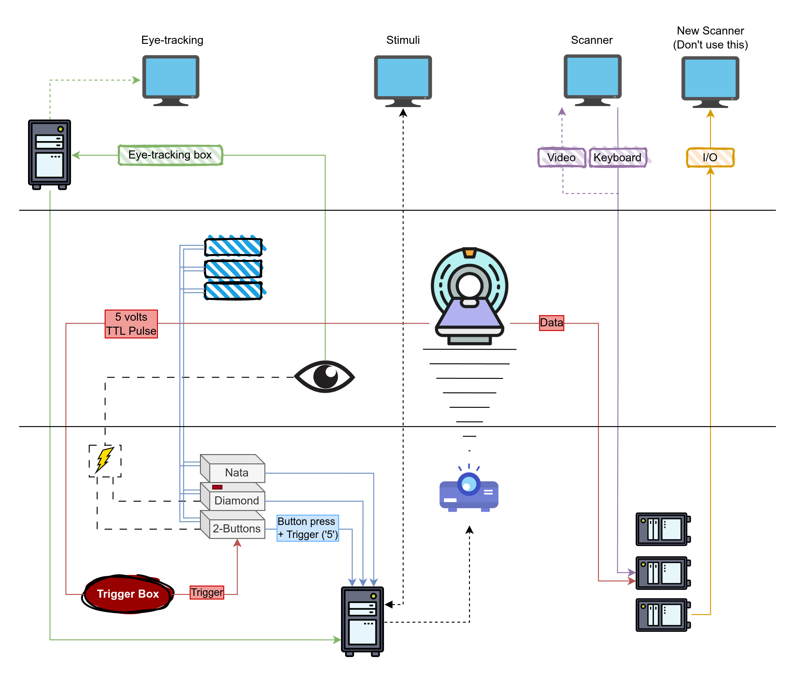

# MR8 Equipment Reference

This page provides a reference guide to the equipment available in the MR8 suite. For the step-by-step scanning procedure, see the [Practical scanning protocol](fmri-procedure.md).

---

## Overview and diagram

The diagram above provides a (non-exhaustive) overview of the MR8 suite's equipment and how instruments are connected. A more thorough description of the equipment is available in the [manual](https://kuleuven.sharepoint.com/:f:/r/sites/T0005824-Hoplab/Shared%20Documents/Hoplab/Research/MRI/Scanner%20info%20%26%20safety/Manual_Philips-MR8?csf=1&web=1&e=1Bh0eI).

Systems are color-coded, and can be read as follows:

- **Red** lines and boxes indicate connections from the scanner:
    - **TTL Pulse** a.k.a. the "trigger", which is used among other things to synchronize the fMRI task with the scan.
    - **Data** connections from the scanner to the PC.
- **Blue** lines and boxes indicate button boxes, and double lines represent optical fiber connections. Specifically:
    - **Nata** box, 5 buttons. Important: if you use this box, make sure your code can differentiate between the `5` button code and the `5` trigger code. This can be done programmatically, and it is addressed in recent versions of our scripts. An alternative workaround would be to relay the trigger through the diamond box, which sends the `T` trigger code instead of the usual `5`. If you need to do this, **make sure you switch back to the original set-up** at the end of your scanning session.
    - **Diamond** box, 4 buttons. This box is marked with a red tape. When the trigger box is connected to this box (which *should not* be the case), this box relays the trigger `T` to the stim PC.
    - **2-buttons** box. When the trigger box is connected to this box (which is the expected and usual set-up), this box relays the trigger `5` from the scanner to the Stim PC.
- **Green** lines and boxes indicate Eye-tracking instruments and connections
    - **Eyelink 1000 long range** system, including the camera and infrared light source
    - **ET box** to convert analog input from the EL-1000 to digital.
    - **ET PC** to run the Eyelink software and control recordings and settings.
    - Power for the ET system is located in the back room.
- **Purple** lines and boxes connect the MRI control PC (old system, which we use)
- **Gold** lines and boxes connect the MRI control PC (new system, which we DO NOT use)
- **Dotted** lines mostly relay audio/video
- **Dashed** lines are power lines.

---

## Stimulus PC

The stimulus computer's desktop is located in the **control room**. It is the second-last computer from the right, between the eye-tracking computer (last) and MRI control computer.

- **Login**: Use the provided username and password. Login details can be found [here](https://kuleuven.sharepoint.com/:w:/r/sites/T0005824-Hoplab/_layouts/15/Doc.aspx?sourcedoc=%7B5F0ACBA0-431D-45EE-BB84-4DAF31531222%7D&file=Contact%20information%2C%20usernames%20and%20passwords.docx&action=default&mobileredirect=true).

    !!! tip "Password Not Accepted?"
        If the password is not accepted, check for a **qwerty-azerty** keyboard mismatch. Press `alt+shift` and ensure **EN** is selected on the login screen.

- **Experiment files**: Store your experiment folders under `C:\Research\Psychology\` (create your own folder within this directory).

- **Installed software**: **Matlab 2011b, 2015a**, and **Psychtoolbox 3.0.123** are installed.

    !!! tip
        If Matlab freezes or shows a JAVA error, restarting Matlab should fix the issue.

- **Screen information**: To flip the screen, adjust the **projector settings**, not the computer.

---

## Trigger and button boxes

The scanner sends a trigger "5" to the stimulus computer. Different setups are used for static and dynamic stimuli:

=== "Static Stimuli"

    A single wire connects two button boxes, each with 2 buttons:

      - **Box 1**:
        - Blue button = Trigger 1
        - Yellow button = Trigger 2
      - **Box 2**:
        - Green button = Trigger 3
        - Red button = Trigger 4

=== "Dynamic Stimuli (e.g., movies)"

    A response box with 4 buttons:

      - Blue button = Trigger "b"
      - Yellow button = Trigger "y"
      - Green button = Trigger "g"
      - Red button = Trigger "r"

!!! warning "Check Trigger Outputs"
    Before starting the experiment, verify that the buttons provide the expected outputs on the stimulus PC screen. If no triggers are working:

    - Restart Matlab and/or the stimulus computer.
    - Check if any cables have been left disconnected. The **response box** is on top of the stimulus desktop PC in the **control room**. Ensure both cables are properly connected.

??? failure "Button Box Not Responding"
    1. Restart **Matlab**.
    2. Reset the button boxes in the **technical room** by unplugging and reconnecting the power cables.
    3. If the problem persists, restart the **stimulus computer**.

??? failure "Trigger Not Working"
    1. Restart **Matlab** and check for responses from the button box.
    2. Ensure the trigger passes through the **static stimuli box** (check if the boxes are responsive).
    3. Verify that all cables are connected properly. The **response box** is on the table next to the desktop PC in the technical room.

    ??? danger "Restarting the Scanner"
        Do not do this without the approval of Ron or Stefan. If the trigger still doesn't work, you may need to restart the scanner:

        1. Ensure the volunteer is out of the scanner first.
        2. Go to the **technical room** and locate the box with the **red stop** and **green start** buttons.
        3. Press the **red button** to stop the scanner. Wait 10 seconds, then press the **green button** to restart it.
        4. Log back into the scanner computer using **MRService** credentials.
        5. Wait until all components are ready and restart the software.
           Confirm any errors, such as helium pressure alerts, by pressing **OK**.

---

## Scanner table and coils

1. **Cover Cushions**:
     Always cover the cushions with paper towels before use.

2. **Keep Equipment Off the Floor**:
     Do not place cushions or equipment on the floor. If any are found on the floor, place them on the shelves.

3. **Patient Table Setup**:
    - The **32-channel coil** should be placed ~10 cm from the edge of the table.
    - Coil connections:
        - **Left lower plug** and **right upper plug**.
    - **Headphones**:
      Plug into the upper left connector at the top of the table.
    - **Panic Button**:
      Plug into the lower left connector at the bottom of the table.

!!! info "Running Low on Supplies?"
    If you run out of supplies (e.g., paper towels), you can find new ones in the closet right in front of you when entering **MR suite E408**. Paper rolls are stored on top.

---

## Projection system

### Screen

- **Correct Position**:
    Ensure the back of the screen is aligned with the black marks on the scanner table.

- **Handling**:
    Never touch the projection side of the screen. Use the plastic stand at the bottom if you need to move it.

### Projector filter

Ensure that **filter 3NB** (1.34% light transmission) is placed in front of the projector tunnel for consistency across scan sessions.

MR8 offers four filter options, each with different light transmission levels:

   | **Filter**             | **Light Transmission** |
   |------------------------|------------------------|
   | 3NB                    | 1.34%                  |
   | A+B                    | 4.27%                  |
   | A+C                    | 4.86%                  |
   | Unnamed (grey tape)    | 69.3%                  |

You can combine filters to adjust the luminance.

!!! tip "Handle Filters with Care"
    Filters are fragile. Always hold them by the frame to avoid damage. Filters are stored in the top left drawer of the cabinet in the scanner room.

### Projector usage

1. **Powering On**:
   The projector brand is **NEC**. Use the remote (button on the top right) to turn it on.

2. **Adjusting the Lens**:
   If the lens is out of position, use the buttons next to the lens on the projector to adjust — **do not touch the lens directly**.

??? failure "Projector showing blue window or incorrect display"
    - Check that the projector cable is properly connected to the stimulus computer.
    - Ensure the source is set to DisplayPort.
         Press the DisplayPort button on the remote to reset the projector to standard settings.

!!! tip "Viewing Projector Menu"
    To view the projector menu, you'll need to be inside the scanner room with the remote. Remove the filter, then use the remote inside the scanner to see the menu options on the projection screen.

---

## Audio system

### Yellow headphones

- The yellow headphones are stored on the left side of the storage space (against the wall).
- The headphones will present sound at full level only when placed inside the scanner bore.
- To use them, disconnect the **white headphones** from the head coil and replace them with the yellow headphones.

### Control room microphone

The microphone is always on, but goes into standby mode after a few seconds.

| **Button**       | **Function**                                                                 |
|------------------|-------------------------------------------------------------------------------|
| **+ / - Buttons** | Increase/decrease the volume.                                                 |
| **Menu Button**   | Access various options. Hold it and press the + button to navigate the menu.  |
| **Grey Button**   | Speak to the participant.                                                     |

Activate the **fMRI settings** by holding the **Menu button** and pressing **+** to navigate to the fMRI option.

### Amplifier and converter

- Check that the **red and white plugs** (audio cables to the headphones) are connected to the converter.
- Ensure the **power cable** is plugged in next to the red and white plugs.

??? failure "Participant Can't Hear You"
    - Reboot the amplifier by unplugging the **power cable** underneath the desk.
    - Reboot the converter by unplugging its power cable.

??? failure "Volume Imbalance (left/right)"
    - Adjust the balance via the **Menu button**. Hold it and use **+/-** to adjust levels separately.

---

## Eyetracker hardware

The MR8 suite includes an **Eyelink 1000 long range** eye-tracking system. For the procedural steps on setting up eye-tracking during a scan, see the [Eyetracker setup](fmri-procedure.md#eyetracker-setup) section of the scanning protocol.

- **Power**: Connect the eyetracker plug to the **power supply** (marked with a white tag: "eyetracking"). Power is located in the back room.
- **Screen alignment**: Ensure the screen is aligned with the **EYE** line.
- **Floor marks**: Check if the eyetracker setup is aligned with the floor marks.
- **Eyelink software**: Boot the **Eyelink** software on the Eyetracker PC (default option in the Windows Boot Manager). If Eyelink doesn't start, press `t` followed by **Enter** to launch it manually.

---

<!--
__TODO__: [Simen] Verify the projected screen dimensions and viewing distance at MR8. Andrea measured the projection as 32 cm x 18.5 cm (full screen). Compare against the values in MR8_screeninfo.docx (https://kuleuven.sharepoint.com/:w:/r/sites/T0005824-Hoplab/_layouts/15/Doc.aspx?sourcedoc=%7B68475DCF-8E6F-4182-B4E6-82E343B22356%7D) and update the wiki with the correct values. This is critical for accurate visual angle calculations.
__TODO__: Document the response codes sent by each button box: (1) Nata box (5 buttons) — list the key codes, (2) Diamond box (4 buttons) — list the key codes and the "T" trigger code, (3) 2-button box — list the key codes and the "5" trigger relay. This info is essential for task programming.
__TODO__: The MATLAB and Psychtoolbox (PTB) versions referenced on this page are outdated. Update to reflect the current versions installed on the stimulus PC at MR8. Document the current MATLAB version, PTB version, and any version-specific configuration changes.
__TODO__: Update all photographs and screenshots on this page. Several images appear outdated and may not reflect the current MR8 setup. Re-take photos of: the control room, the scanner room layout, the button boxes, and the stimulus PC setup.
-->
