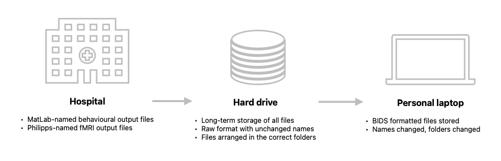

# General Notes

In this page we will have all the general info and FAQ about fMRI protocols.

some interesting links: https://www.youtube.com/watch?v=J0npRWV2zTY  

[Andrea Jahn on fmriprep](https://www.youtube.com/@AndrewJahn)

**NOTE:** [TIM] Should this page be renamed? It seems like 'fMRI data' or 'Data' would be more appropriate

**NOTE:** [TIM] What about having a general diagram at the top that gives a general idea of what data should be where? When users land on this page, if we follow the logic from the pages before, they will just have acquired data and probably don't know what to do with it. I'm thinking of something like this image below. Without this kind of overview, one might not be sure where to store the raw data mentioned below, for instance.We could create such a plot with [mermaid](https://mermaid.js.org/).



**NOTE:** [TIM] I would add a mention of what to store the data on, ie get a hard drive and bring it to the hospital to take the output data.

## How to store raw data

In order to avoid error while converting into BIDS format, the raw data (i.e., the data collected from the scanner, behavioural measure, eye-tracking) should be stored in a folder with the following structure:

```
sourcedata
└── sub-41
	├── bh
	│   ├── 20240503104938_log_41-1-2_exp.tsv
	│   ├── 20240503105558_41_1_exp.mat
	│   ├── 20240503105640_log_41-2-1_exp.tsv
	│   ├── 20240503110226_41_2_exp.mat
	│   ├── 20240503110241_log_41-3-2_exp.tsv
	│   ├── 20240503110825_41_3_exp.mat
	│   ├── 20240503110851_log_41-4-1_exp.tsv
	│   ├── 20240503111433_41_4_exp.mat
	│   ├── 20240503111450_log_41-5-2_exp.tsv
	│   └── 20240503112032_41_5_exp.mat
	└── nifti
	    ├── sub-41_WIP_CS_3DTFE_8_1.nii
	    ├── sub-41_WIP_Functional_run1_3_1.nii
	    ├── sub-41_WIP_Functional_run2_4_1.nii
	    ├── sub-41_WIP_Functional_run3_5_1.nii
	    ├── sub-41_WIP_Functional_run4_6_1.nii
	    └── sub-41_WIP_Functional_run5_7_1.nii
```

## How to get images from the scanner

For optimal BIDS conversion of fMRI data, it is recommended to initially collect DICOM files (not NIfTI or PAR/REC) at the scanner. Although this adds an extra conversion step and takes longer, it ensures proper conversion into BIDS format. Here is the recommended process:

1. **Initial DICOM Collection**:
    - Collect DICOM files for each modality (e.g., T1 and BOLD) for one subject.
    - Convert these DICOM files to NIfTI format using `dcm2nii`, which will generate JSON sidecar files (refer to [this section](analysis/fmri-andrea-workflow.md#behavioral-data-to-bids) for more info on the conversion process).

2. **Template Creation**:
    - Rename the JSON files for T1 and BOLD image to `sub-xx_T1w.json` and `sub-xx_task-exp_run-x_bold.json`
    - Move the JSON files into `misc/`.

3. **Subsequent Data Collection**:
    - After creating the template JSON files, collect future data in NIfTI format to save time. The `script01_nifti-to-BIDS.m` script will use the JSON templates to populate the BIDS folders, provided that the fMRI sequence remained unchaged (in that case you need to generate new templates from the DICOM files).

## Missing fields in JSON files

Despite these steps, some BIDS fields in the sidecar JSON files may remain empty due to limitations of the Philips scanner, not the conversion tools. The most relevant fields that are left empty due to these limitations are `SliceTiming` and [`PhaseEncodingDirection`](https://github.com/xiangruili/dicm2nii/issues/49).

- **SliceTiming**:
    - This field is used by fMRIPrep during slice timing correction.
    - It can be populated using the `/utils/get_philips_MB_slicetiming.py` script, assuming you have access to a DICOM file and know the multiband factor (default is 2, as used in our lab).
    - **NOTE:** The script assumes an interleaved, foot-to-head acquisition, and will not work for other types of acquisitions.

- **PhaseEncodingDirection**:
    - This BIDS tag allows tools to undistort images.
    - While the Philips DICOM header distinguishes the phase encoding axis (e.g., anterior-posterior vs. left-right), it does not encode the polarity (A->P vs. P->A).
    - You will need to check at the scanner or consult with Ron whether the polarity is AP or PA, and correct the `?` in the JSON file to `+` or `-`.
 
- **TODO:** add info about NaNs in the JSON file (raw and fmriprep) and how to change them. NaNs will raise errors during the mriqc workflow. See [this](https://groups.google.com/g/mriqc-users/c/0v170KRJoKk), [this](https://github.com/nipreps/mriqc/issues/1089) and [this](https://neurostars.org/t/node-error-on-mriqc-wf-dwimriqc-computeiqms-datasink/29188). 

For more details on Philips DICOM conversion, refer to the following resources:

- [Philips DICOM Missing Information - dcm2niix](https://github.com/rordenlab/dcm2niix/tree/master/Philips#missing-information)
- [PARREC Conversion - dcm2niix](https://github.com/rordenlab/dcm2niix/tree/master/PARREC)

## Where to find additional info on the fMRI sequence

Additional information on the sequence can be found at the scanner. Here's how:

1. **Start the Examination**
    - Navigate to **Patients** -> **New Examination** -> **RIS**.
    - Select your subject and fill out the form:
        - **Weight:** Enter the subject's weight.
        - **Implants:** Specify if the subject has any implants.
        - **Pregnant:** Indicate if the subject is pregnant.

2. **Load the Scanning Sequence**
    - Drag and drop your scanning sequence from the bottom panel to the left panel.

3. **Select a Run**
    - Click on either a functional or anatomical run from the list of available runs.

4. **Expand the Tabs**
    - Locate the `>>` symbol in the bottom panel, below the sagittal, coronal, and horizontal views.
    - Click on this symbol to expand additional tabs.

5. **Access Geometry Settings**
    - Click on the **Geometry** tab to access important scan parameters:
        - **MB factor:** The Multi-band factor, which indicates how many slices are recorded simultaneously. This is used for slice timing correction.
        - **Slices:** The total number of horizontal slices.
        - **Fold-over direction:** Necessary information to correct the phase encoding direction in the BIDS field.
        - **Slice scan order:** Indicates the direction of slice acquisition, typically Foot to Head (FH), used for slice timing correction.

6. **Check Additional Fields**
    - Visit the **Coils** tab to obtain more details about the head coils used during the scan.
    - In the **Contrast** tab, check the following fields:
        - **TE (Echo Time):** Typically a single echo of 30 ms by default.
        - **TR (Repetition Time):** Generally set to 2000 ms by default.
	
## BIDS standards

To organize our fMRI dataset, we follow the [BIDS](https://bids-specification.readthedocs.io/en/stable/introduction.html) Specification.

If you are not familiar with the BIDS Specification, the [BIDS Starter Kit](https://bids-standard.github.io/bids-starter-kit/index.html) provides all the information needed to get started, along with [example BIDS datasets](https://bids-standard.github.io/bids-starter-kit/dataset_examples.html), [Talks and Slides](https://bids-standard.github.io/bids-starter-kit/talks.html), and most importantly [Tutorials](https://bids-standard.github.io/bids-starter-kit/tutorials/tutorials.html).

It is crucial that you get familiar with BIDS folders/files naming convention and structure. Most, if not all, the tools we are going to use in the next steps are [BIDS Apps](https://bids-apps.neuroimaging.io/apps/), and they rely on data organized following the BIDS Specification. Following this structure will make it easier to use these tools, share your code and data, and communicate with other scientists.

The BIDS Specification provides guidelines on how to organize all your data formats, including [(f/d)MRI](https://bids-specification.readthedocs.io/en/stable/modality-specific-files/magnetic-resonance-imaging-data.html), [EEG](https://bids-specification.readthedocs.io/en/stable/modality-specific-files/electroencephalography.html), [eye-tracking](https://bids-specification.readthedocs.io/en/stable/modality-specific-files/physiological-and-other-continuous-recordings.html), [Task events](https://bids-specification.readthedocs.io/en/stable/modality-specific-files/task-events.html) associated with Neuro-Imaging recordings or [not](https://bids-specification.readthedocs.io/en/stable/modality-specific-files/behavioral-experiments.html), and [Derivatives](https://bids-specification.readthedocs.io/en/stable/derivatives/imaging.html) (e.g., pre-processed files, Regions Of Interest mask files, GLM files, etc.).

At any moment, you can check your dataset for BIDS compliance. To do so, you can use the [BIDS dataset validator](https://bids-standard.github.io/bids-validator/). 

