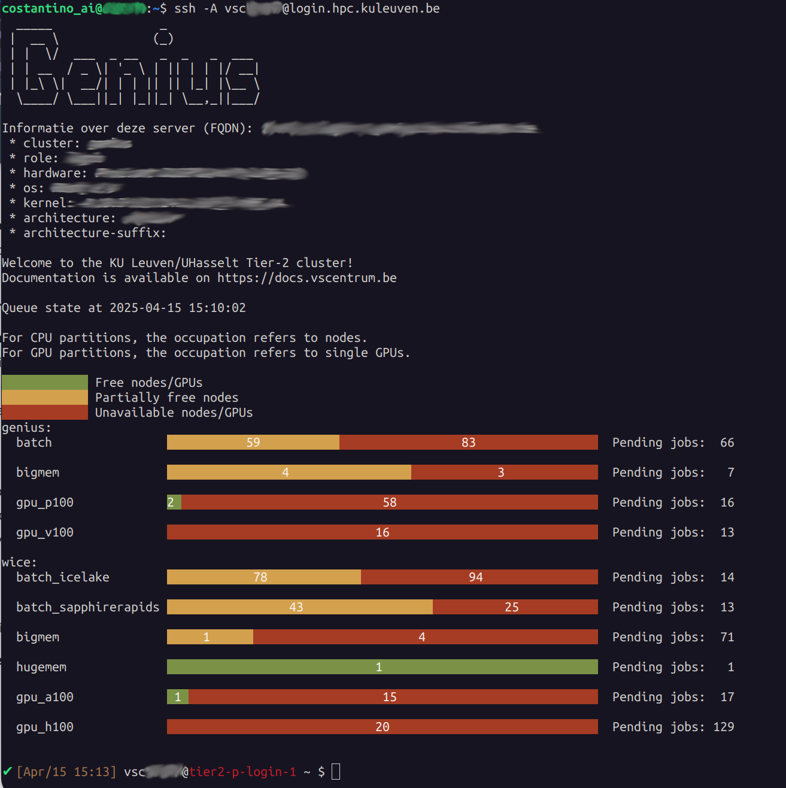
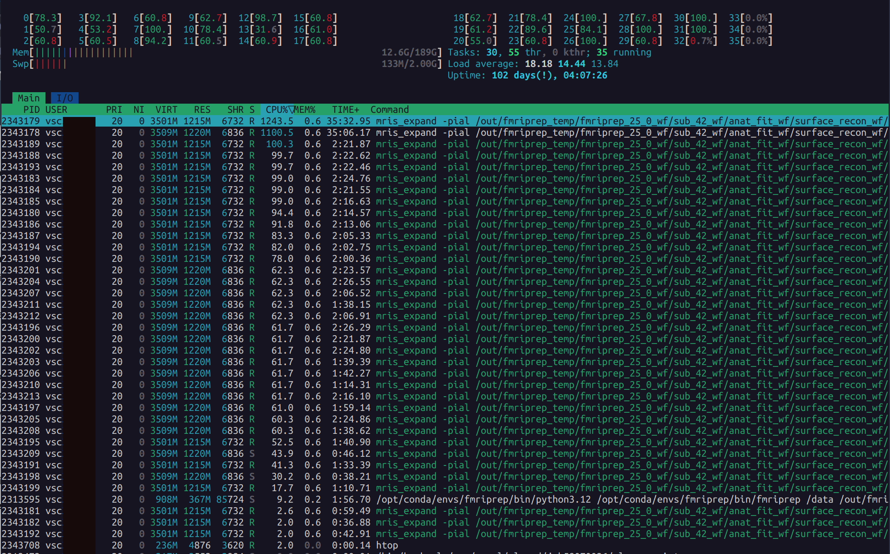

# KU Leuven HPC: Getting Started

This guide describes how to connect to the KU Leuven/VSC HPC cluster, manage your data, and run `fMRIPrep`.

---

!!! warning "Login Node"  
    When you connect via SSH, you land on a *login node*. Do *not* run compute-intensive tasks here, because login nodes are shared among tens of users. Submit jobs to the *compute* (*CPU* or *GPU*) nodes via Slurm.

!!! tip "Change directory after login"
    After a login, you land on your home directory `$VSC_HOME` which has only 3GB quota (by design).
    This small volume is easy to fill up by mistake; hence, it is recommended to always change the working directory after login
    to your `$VSC_DATA` (75 GB) or to your `$VSC_SCRATCH` (500 GB) upon login, e.g.:

    ```bash
    cd $VSC_DATA
    ```

    This ensures you work in a directory with persistent storage (your files are not deleted) and sufficient disk space.
    Beware that any files in your scratch folder which is not accessed for 30 days will be automatically deleted, and scratch
    folder (as the name proposes) has no backup.

---

VSC offers a [full documentation](https://docs.vscentrum.be/) of all the services, but in case of question of problems, you 
may contact the [local support team at KU Leuven](https://docs.vscentrum.be/contact_vsc.html).

## 1. Prerequisites

1. You have a valid VSC account (e.g., `vsc12345`). Request one [here](https://vlaams-supercomputing-centrum-vscdocumentation.readthedocs-hosted.com/en/latest/index.html).
2. For Windows users, install MobaXterm (SSH client) and FileZilla or WinSCP for file transfer;
   for Mac/Linux users, it is sufficient to use the terminal (has built-in SSH) and FileZilla for file transfer.
3. You have logged into the [HPC firewall](https://firewall.vscentrum.be/auth/login) before attempting SSH.
4. You have requested introductory credits (2 million credits for 6 months) via [this form](https://admin.kuleuven.be/icts/onderzoek/hpc/request-introduction-credits).
---

## 2. Connecting to the Cluster

Once your account is active, you may follow [these steps](https://docs.vscentrum.be/accounts/mfa_login.html) to login depending on your choice of OS.
After a successful login, you will see something like:



Look at the last line:

```bash
✔ [Apr/15 15:13] vsc12345@tier2-p-login-1 ~ $ 
```

which suggests we are connected to the login node `tier2-p-login-1` as `vsc12345` (your VSC username). From now on, what we type in the terminal will be executed on the login node. Note that the login nodes are only meant to move your data around, submit and monitor your jobs, and write/edit your scripts. For all other purposes (actual computation, pre-/post-processing and software installation), you have to start an 
[interactive or batch job using Slurm](https://docs.vscentrum.be/compute/jobs/running_jobs.html).

To exit the ssh session and go back to your local terminal, type `exit`.

---

## 3. Data Management on the HPC

**Folder Structure:**

- `VSC_HOME`: Small quota, do *not* use it at all.
- `VSC_DATA`: Persistent but slow, larger capacity. Store big data, installed packages (e.g., Miniforge/Miniconda), and your project files.
  All files and folders in your data directory are snapshoted, so you can recover them if you delete them by mistake.
  For that purpose, look inside the `.snapshot` directory inside any folder in your data directory for available snapshot timestamps.
- `VSC_SCRATCH`: Temporary storage but fast I/O. Files here will be deleted if not accessed after 30 days. Do not store your project data here!
- `VSC_SCRATCH_NODE`: Temporary storage available on the compute node which can be only used when your job is running on a compute node.

A typical approach is to keep a dedicated subdirectory in `VSC_DATA` for each project. For example:

```bash
VSC_DATA                    # Persistent storage
├── data                    # Project data
│   ├── BIDS                # BIDS dataset
│   │   ├── derivatives     # Derivatives
│   │   └── sub-01          # Subject data
│   │       ├── anat  
│   │       └── func  
│   ├── license.txt         # FreeSurfer license file  
│   └── sourcedata          # Raw data
│       └── DICOM           
│           └── sub-01      
└── fmriprep-25.0.0.sif     # Singularity container
```

---

## 4. Transferring Data to the HPC

Once connected to the cluster, you’ll need to transfer your BIDS dataset, FreeSurfer license, and other relevant files to your `VSC_DATA` directory on the HPC system.

=== "Windows (WinSCP)"

    1. [**Login**](https://firewall.vscentrum.be/auth/login) through the firewall.

    2. **Open WinSCP:**
        - Host Name: `login.hpc.kuleuven.be`
        - User Name: `vsc12345`
        - Load your private key if needed.

    3. **Transfer Files:**
        - Navigate to `/data/leuven/123/vsc12345/data/` on the remote side.
        - Drag and drop or copy/paste files from your local machine.
        - To avoid overwriting existing files, make sure to only add new content, or configure WinSCP to skip duplicates.

=== "Linux / macOS"

    1. [**Login**](https://firewall.vscentrum.be/auth/login) through the firewall.

    2a. Basic `scp` (secure copy):
    ```bash
    scp -r /local/path/BIDS \
    vsc12345@login.hpc.kuleuven.be:/data/leuven/123/vsc12345/data/BIDS
    ```

    - `-r` copies directories recursively.


    2b. Merging folders with `rsync` (recommended):

    Use `rsync` to avoid overwriting existing files:

    ```bash
    rsync -av --ignore-existing /local/path/BIDS \
    vsc12345@login.hpc.kuleuven.be:/data/leuven/123/vsc12345/data/
    ```

    - `-a` preserves file attributes.
    - `-v` enables verbose output.
    - `--ignore-existing` skips files already present on the remote server.

Make sure you replace `/local/path/BIDS` with your local BIDS folder, and `vsc12345` and `123` with your actual VSC username and the first 3 digits of your ID.

---

## 5. Building an `fMRIPrep` Singularity Container

1. **Move to `VSC_DATA`:**

   ```
   cd $VSC_DATA
   ```

2. **Build the Container:**

   ```
   singularity build fmriprep-25.0.0.sif docker://nipreps/fmriprep:25.0.0
   ```

This fetches the Docker image and converts it to a Singularity `.sif` image.

!!! warning
    Ensure you have enough quota and that you are not attempting this in `VSC_HOME`!

---

## 6. Submitting and Running an `fMRIPrep` Job with Slurm

### 6.1. Creating a Slurm Jobscript

To submit our job to the compute node, we will need to create a Slurm script. this script will define the job resources, dependencies, and all the steps needed to complete the workflow. Then, submit the jobscript to the cluster using the `sbatch` command. Your batch job will run remotely on a compute node, and `fmriprep` will be executed from within a container.

To create such file, type in your ssh session:

```bash
cd $VSC_DATA
nano run_fmriprep_job.slurm
```

This will open a text editor. Use the following template as a guideline, but change relevant fields (such as job name, account name etc) accordingly:

```
#!/bin/bash -l
#SBATCH --account=intro_vsc12345
#SBATCH --cluster=genius
#SBATCH --partition=batch
#SBATCH --ntasks=1
#SBATCH --cpus-per-task=16
#SBATCH --mem=20G
#SBATCH --time=08:00:00
#SBATCH --job-name=fmriprep_sub-42
#SBATCH --output=slurm-%j.out
#SBATCH --error=slurm-%j.err
#SBATCH --mail-type=END,FAIL
#SBATCH --mail-user=your.email@kuleuven.be

# Move to the data directory
cd $VSC_DATA/data

# Run fMRIPrep with Singularity
singularity run --cleanenv \
  -B $VSC_DATA/data/BIDS:/data:ro \
  -B $VSC_DATA/data/BIDS/derivatives:/out \
  -B $VSC_SCRATCH/fmriprep_tmp:/scratch \
  -B $VSC_DATA/data/license.txt:/opt/freesurfer/license.txt \
  $VSC_DATA/fmriprep-25.0.0.sif \
  /data /out/fmriprep participant \
  --participant-label 42 \
  --skip-bids-validation \
  --output-spaces MNI152NLin2009cAsym:res-2 fsaverage \
  --work-dir /scratch \
  --bold2anat-dof 9 \
  --nthreads 16 --omp-nthreads 16 \
  --mem-mb 20000 \
  --clean-workdir
```
Then press `CTRL+X` to exit and `Y` to save. Check whether your file was saved correctly:

```bash
ls $VSC_DATA
```

which should return:

```
fmriprep-25.0.0.sif  data  license.txt  run_fmriprep_job.slurm
```

### 6.2 Submitting the Job

1. Navigate to the same directory as your script (or specify the full path):

    ```bash
    cd $VSC_DATA
    ```

2. Submit:

    ```bash
    sbatch run_fmriprep_job.slurm
    ```

    A message appears:

    ```bash
    Submitted batch job 58070026
    ```

   *where `58070026` is your job ID* (but it will be different in your case).

4. Check the status of your job:

    ```bash
    squeue -j 58070026
    ```

    Which returns:

    ```bash
    JOBID PARTITION     NAME     USER ST       TIME  NODES NODELIST(REASON)
    58070026 batch     fmriprep vsc12345  R       0:00      1 (Priority)
    ```

Congrats! Your job is now being executed on the cluster.

!!! tip "Runtime"
    Your runtime depends critically on various factors, such as the choice of hardware, the number of threads used, the amount of memory used, and your I/O pattern. You may choose one of the `batch_*` partitions from either of Genius or wICE clusters to find the most performant hardware for your workflow. Detailed information about avaialble hardware can be found on [Ku Leuven Tier-2 specifications](https://docs.vscentrum.be/leuven/tier2_hardware.html).

    From a first test on the call above (which includes the FreeSurfer workflow) on a subjects with one anatomical image and two functional scans:
    
    - **32 cores** and **50GB of RAM** end up in a runtime of `03:41:05` 
    - **16 cores** and **20GB of RAM** end up in a runtime of `03:59:27` on the same subjects

### 6.3 SLURM Basics you will need

- `sbatch`: Submits a jobscript to the cluster.
- `srun`: Start an interactive session on a compute node.
- `squeue -M genius,wice`: Shows your jobs on both clusters.
- `scancel -M <cluster> <jobID>`: Cancels a job with the `<jobID>` running on `<cluster>`.
- `sstat`: Real-time CPU/memory info on running jobs.
- `sacct`: Shows CPU time, wall time, memory usage, and exit codes for *finished* jobs.

---

## 7. Monitoring Your Job

### 7.1 Job Queue

Check the status of your running or pending jobs:

```bash
squeue -M genius,wice -u $USER
```

which returns:

```bash
$ squeue -M genius,wice -u $USER
CLUSTER: genius
             JOBID PARTITION     NAME     USER ST       TIME  NODES NODELIST(REASON)
          58070026     batch fmriprep vsc12345  R    2:25:57      1 r27i27n19

CLUSTER: wice
             JOBID PARTITION     NAME     USER ST       TIME  NODES NODELIST(REASON)
```

- `R` means running, `PD` means pending.  
- `NODELIST` shows the node(s) assigned. If it shows `(Priority)`, you`re still waiting.

### 7.2 Checking Logs

When you submit a Slurm job, two log files are automatically generated in the directory where you ran `sbatch`:

- `slurm-<jobid>.out`: captures **standard output (stdout)** — the regular printed output from your script.
- `slurm-<jobid>.err`: captures **standard error (stderr)** — any warnings or errors encountered during the job.

#### Check Available Files

To see the files in your current directory:

```bash
ls
```

You should see something like:

```
fmriprep-25.0.0.sif  data  run_fmriprep_job.slurm  slurm-58070026.out  slurm-58070026.err
```

#### Open and Read the Logs

To open the full output log (static view):

```bash
nano slurm-58070026.out
```

To close `nano`, press `Ctrl+X` → then `N` if prompted to save changes.

To view just the last few lines of the file:

```bash
tail -n 30 slurm-58070026.out
```

This prints the last 30 lines of the file — useful to check progress without opening the full log.

To **continuously monitor** the last lines in real time (refreshes every 1 second):

```bash
watch -n 1 tail -n 30 slurm-58070026.out
```

This will auto-refresh every second and is very helpful to track live progress.

To exit the `watch` session Press `Ctrl+Z`.

## 8 Canceling a Job

If you want to stop a running or pending job you need to provide the cluster name (defaults to Genius), and the unique `<jobID>`, e.g.:

```bash
scancel 58070026
```

Or:

```bash
scancel --user=$USER
```

---

## 9. After the Job Completes

Once your job finishes, you will receive an email from the SLURM scheduler. This email tells you whether the job **completed**, **failed**, or was **cancelled**.

### 9.1 Example Email Messages

- ✅ **Successful run:**
  ```
  Slurm Job_id=58070026 Name=fmriprep_sub-42 Ended, Run time 03:41:05, COMPLETED, ExitCode 0
  ```

- ❌ **Cancelled manually or by the system:**
  ```
  Slurm Job_id=58069757 Name=fmriprep_sub-42 Ended, Run time 00:00:00, CANCELLED, ExitCode 0
  ```

- ⚠️ **Job failed with error:**
  ```
  Slurm Job_id=58069624 Name=fmriprep_sub-42 Failed, Run time 00:00:20, FAILED, ExitCode 255
  ```

!!! tip
    If you submit too many jobs, it is best not to enable email notifications.

---

### 9.2 Inspecting Failed Jobs

If your job failed, the first thing to do is inspect the `.out` and `.err` files written by SLURM. These contain the full log and error output from `fMRIPrep`.

1. Go to the correct folder (usually `$VSC_DATA`):

    ```bash
    cd $VSC_DATA
    ```

2. Open the output file:

    ```bash
    nano slurm-58070026.out
    ```

    - Use the arrow keys to scroll.
    - The error is usually toward the **end** of the file.
    - Press `Ctrl+X` to exit `nano`.

3. Also open the error file:

    ```bash
    nano slurm-58070026.err
    ```

    - This might contain Python tracebacks or messages from Singularity.

Make sure to check **both files**, as the error could appear in either.

---

### 9.3 Verifying Successful Runs

If the job completed successfully, it`s time to check the output files.

In our SLURM script, the `--output` directory is bound to:

```
-B $VSC_DATA/data/BIDS/derivatives:/out
```

So the results will be saved under:

```
$VSC_DATA/data/BIDS/derivatives/fmriprep
```

To inspect the results:

```bash
cd $VSC_DATA/data/BIDS/derivatives/fmriprep
ls
```

You should see something like this:

```
dataset_description.json  logs  sourcedata  sub-42  sub-42.html
```

Use the `tree` command to get a visual overview of the folder structure:

```bash
tree -L 2 .
```

Expected output:

```
fmriprep/
├── dataset_description.json
├── logs/
│   ├── CITATION.bib
│   ├── CITATION.html
│   ├── CITATION.md
│   └── CITATION.tex
├── sourcedata/
│   └── freesurfer/
│       ├── fsaverage/
│       └── sub-42/         # FreeSurfer recon-all output
├── sub-42/
│   ├── anat/
│   │   ├── sub-42_desc-preproc_T1w.nii.gz
│   │   ├── sub-42_dseg.nii.gz
│   │   ├── sub-42_space-MNI152NLin2009cAsym_res-2_desc-preproc_T1w.nii.gz
│   │   └── ...
│   ├── func/
│   │   ├── sub-42_task-*_desc-preproc_bold.nii.gz
│   │   ├── sub-42_task-*_desc-confounds_timeseries.tsv
│   │   ├── sub-42_task-*_space-MNI152NLin2009cAsym_res-2_desc-brain_mask.nii.gz
│   │   └── ...
│   ├── figures/
│   │   ├── sub-42_desc-summary_T1w.html
│   │   ├── sub-42_task-*_desc-summary_bold.html
│   │   └── ...
│   └── log/
│       └── <timestamped-folder>/
│           └── fmriprep.toml
├── sub-42.html              # Subject-level report

```

This confirms that `fMRIPrep` completed for subject 42 and produced its derivatives, QC figures, and logs.

---

### 9.4 Downloading the Results (Derivatives) to Your Local Machine

After fMRIPrep completes successfully, you might want to retrieve the `derivatives/fmriprep` folder from the HPC back to your local computer for further analysis. The steps differ slightly depending on your operating system.

=== "Windows (WinSCP)"

      1. **Log in via the Firewall**  
        Go to [https://firewall.vscentrum.be/auth/login](https://firewall.vscentrum.be/auth/login) and enter your VSC credentials.

      2. **Open WinSCP:**

         - Host Name: `login.hpc.kuleuven.be`
         - User Name: `vsc12345`
         - (Optional) Load your private key if needed.

      3. **Navigate & Download:**

         - In WinSCP, navigate on the remote side to:
          ```
          /data/leuven/123/vsc12345/data/BIDS/derivatives/fmriprep
          ```
          (Replace `vsc12345` with your actual VSC username.)
         - On your local machine side, open (or create) a destination folder where you want to save the files.
         - **Drag and drop** the `fmriprep` folder (or individual files) from the remote window to your local folder.
         - Alternatively, right-click and select **Download** or **Download To...**.

      This will copy the `fmriprep` output directory (and its subfolders) to your local Windows computer.

=== "macOS / Linux"

      1. **Confirm Firewall Access**  
         Visit [https://firewall.vscentrum.be/auth/login](https://firewall.vscentrum.be/auth/login) if your connection is blocked by the HPC firewall.

      2. **Use `scp` or `rsync`:**

         - **Basic `scp` example**:
           ```bash
           scp -r vsc12345@login.hpc.kuleuven.be:/data/leuven/123/vsc12345/data/BIDS/derivatives/fmriprep /local/path/
           ```
           - The `-r` flag copies directories recursively.
           - Replace `vsc12345` and `123` with your own account details.
           - `/local/path/` is the folder on your Mac/Linux machine where you want the data.

         - **`rsync` (recommended for large data)**:
           ```bash
           rsync -av --progress \
             vsc12345@login.hpc.kuleuven.be:/data/leuven/123/vsc12345/data/BIDS/derivatives/fmriprep \
             /local/path/
           ```
           - `-a` preserves file attributes.
           - `-v` is verbose output.
           - `--progress` shows real-time progress info (optional).

         - Or, if you only want to **quickly download reports** and related files (for quick results check):
           ```
           rsync -av --progress \
           --include='*/' \
           --include='*.html' \
           --include='*.svg' \
           --include='*.png' \
           --exclude='*' \
           vsc12345@login.hpc.kuleuven.be:/data/leuven/123/vsc12345/data/BIDS/derivatives/fmriprep/ \
           /local/path/fmriprep_reports/
           ```

      This will download the entire `fmriprep` output folder to your Mac or Linux machine for further analysis.

---

## 10. Advanced: Monitoring Resource Usage

Sometimes you want to inspect your job in real-time to check whether it is using the resources (CPU, memory) you requested.

### 10.1 Identify the Compute Node

First, determine which compute node your job is running on by checking the job queue:

```bash
squeue -M genius,wice -u $USER
```

Example output:

```
CLUSTER: genius
             JOBID PARTITION     NAME     USER ST       TIME  NODES NODELIST(REASON)
          58070026     batch fmriprep vsc12345  R      40:46      1 r27i27n19
```

Look at the **NODELIST** column — in this case, your job is running on node ``r27i27n19``.

If NODELIST shows `(Priority)` with state `PD` (for pending), it means your job is still waiting in the queue and hasn`t started yet.

### 10.2: SSH into the Compute Node

To access the compute node where your job is running:

```bash
ssh r27i27n19
```

You should see a message like:

```
Joining job 58070026
```

Also, the prompt will change from the login node (e.g., ``tier2-p-login-2``) to the compute node (e.g., ``r27i27n19``), indicating you are now inside the job environment on the actual node.

---

### 10.3: Run `htop` to Monitor Resource Usage

Once inside the compute node, run:

```bash
htop -u $USER
```

This opens a live system monitor like this one:



Which shows:

- All processes currently running under your username
- CPU usage per core
- Memory usage
- Process names and resource consumption

You should see multiple processes associated with `fmriprep`. Ideally, if you requested 32 cores, you should see all 32 cores utilized — especially during parallelizable tasks. However, some parts of `fmriprep` can only run serially. During these phases, only 1–2 cores may be active, which is normal.

To exit `htop`, press **F10** or **q**

---

## 11. References and Links

- [VSC Documentation](https://vlaams-supercomputing-centrum-vscdocumentation.readthedocs-hosted.com/en/latest/index.html)
- [KU Leuven HPC Info](https://icts.kuleuven.be/sc/onderzoeksgegevens/hpc)
- [Firewall Access](https://firewall.vscentrum.be/auth/login)
- [SSH Access via MobaXterm](https://docs.vscentrum.be/compute/terminal/mobaxterm_access.html)
- [Singularity Docs](https://docs.sylabs.io/)  
- [fMRIPrep Docs](https://fmriprep.org/en/stable/)  

**Happy Computing!**
