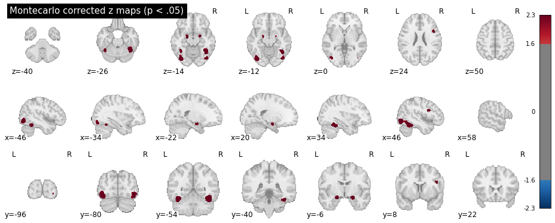

# NiMARE Meta-Analysis

This guide demonstrates how to **download and process the Neurosynth database using NiMARE**, a Python-based framework designed for neuroimaging meta-analyses.

This step-by-step tutorial covers downloading the Neurosynth data, converting it into a NiMARE-compatible dataset, enriching it with article abstracts, filtering studies based on specific criteria, and performing custom meta-analyses.

Before starting, ensure NiMARE and required **dependencies** are installed in your environment:

```bash
pip install numpy pandas pprint scipy nimare biopython nibabel nilearn
```

!!! tip
    Before starting a new project, make sure you set up your environment correctly. Each project should have its own dedicated environment. Please, follow the instructions provided in [this](analysis/fmri-setup-env.md#python-and-conda) and [this](../coding/index.md#setting-up-a-conda-environment) section.

---

## 1. Importing Necessary Packages

Begin by **importing all necessary libraries** required throughout the script. These libraries are essential for downloading data, processing datasets, running analyses, and visualizing results.

```python
# --- Step 1: Import All Necessary Packages ---

import os
import shutil
import numpy as np
from scipy.stats import norm
from nimare.dataset import Dataset
from nimare.extract import download_abstracts, fetch_neurosynth
from nimare.io import convert_neurosynth_to_dataset
from nimare.meta.cbma.ale import ALE  # ALE algorithm for meta-analysis
from nimare.correct import FWECorrector  # Family-wise error correction
from pprint import pprint
from nilearn.plotting import plot_stat_map
from nilearn import datasets  # Neuroimaging datasets
from nilearn.reporting import get_clusters_table
import nibabel as nib
```

---

---

## 2. Downloading the Neurosynth Database

In this section, we’ll create an output directory where the downloaded Neurosynth data will be stored. The NiMARE function `fetch_neurosynth` is used to download the data.

!!! note
    Ensure that you replace the path in `out_dir` with one that matches your own directory structure.

```python
# --- Step 2: Downloading the Neurosynth Database ---

# Set the output directory for storing downloaded Neurosynth data
# Make sure to change this to a directory path on your own machine
out_dir = os.path.abspath("./nimare_data")
os.makedirs(out_dir, exist_ok=True)  # Create the directory if it doesn't already exist

# Download Neurosynth data using NiMARE’s `fetch_neurosynth` function
# Set version to the latest available (version "7" as of October 2024)
files = fetch_neurosynth(
    data_dir=out_dir,  # Specify directory to save data
    version="7",  # Neurosynth data version to download
    overwrite=False,  # Set to True to re-download data if it already exists
    source="abstract",  # Use article abstracts as the source
    vocab="terms",  # Use "terms" as the vocabulary type
)
files = files[0]

# Print details of the downloaded files to understand the data structure
pprint(files)
```

The `pprint` command should output something like this:

```bash
pprint(files)  # Display information about the downloaded files

{'coordinates': './nimare_data/neurosynth/data-neurosynth_version-7_coordinates.tsv.gz',
 'features': [{'features': './nimare_data/neurosynth/data-neurosynth_version-7_vocab-terms_source-abstract_type-tfidf_features.npz',
               'vocabulary': './nimare_data/neurosynth/data-neurosynth_version-7_vocab-terms_vocabulary.txt'}],
 'metadata': './nimare_data/neurosynth/data-neurosynth_version-7_metadata.tsv.gz'}
  
```

---

## 3. Converting Downloaded Neurosynth Data into a NiMARE-Compatible Dataset

Once Neurosynth data is downloaded, we convert it to NiMARE’s dataset format for easier manipulation and analysis. We’ll then add abstracts to this dataset using study PMIDs.

1. **Define the path for saving the dataset**.
2. **Convert the data** using `convert_neurosynth_to_dataset`.
3. **Add article abstracts** with `download_abstracts`.

```python
# --- Step 3: Converting Neurosynth Data to a NiMARE-Compatible Dataset ---

# Define the path for the NiMARE-compatible dataset file
dataset_path = os.path.join(out_dir, "neurosynth_dataset.pkl.gz")

# Convert and save Neurosynth data to NiMARE dataset format if it doesn’t already exist
if not os.path.exists(dataset_path):
    neurosynth_dset = convert_neurosynth_to_dataset(
        coordinates_file=files["coordinates"],  # Path to Neurosynth coordinates
        metadata_file=files["metadata"],  # Path to metadata file
        annotations_files=files["features"],  # Path to feature files
        target="mni152_2mm",
    )
    neurosynth_dset.save(dataset_path)  # Save the converted dataset
    print(f"Dataset saved to: {dataset_path}")
else:
    neurosynth_dset = Dataset.load(
        dataset_path
    )  # Load existing dataset if already created
    print(f"Dataset loaded from: {dataset_path}")

# Define path for saving the dataset with abstracts
abstracts_path = os.path.join(out_dir, "neurosynth_dataset_with_abstracts.pkl.gz")

# Download and add abstracts to the dataset if it doesn’t already include them
if not os.path.exists(abstracts_path):
    # Note: Replace "example@example.edu" with your email address for access to PubMed
    neurosynth_dset = download_abstracts(neurosynth_dset, "example@example.edu")
    neurosynth_dset.save(abstracts_path)  # Save dataset with abstracts
    print(f"Dataset with abstracts saved to: {abstracts_path}")
else:
    neurosynth_dset = Dataset.load(
        abstracts_path
    )  # Load dataset with abstracts if already created
    print(f"Dataset with abstracts loaded from: {abstracts_path}")

# Verify dataset by printing a sample of the abstracts and counting entries
pprint(neurosynth_dset.texts.head())  # Display the first few entries of abstracts
print(f"Number of abstracts: {len(neurosynth_dset.texts)}")
```

---

## 4. Creating a Subset of Data

The NiMARE dataset allows data manipulation to create subsets that meet specific requirements. This enables running **custom meta-analyses on targeted data**. You can, for instance, retrieve studies based on specific MNI coordinates, labels (included as features in the Neurosynth database), or search abstracts using specific keywords.

The following code example demonstrates how to **search for abstracts containing specific keywords**.

```python
# --- Step 4: Creating a Subset of Data ---

# Define a function to search abstracts for specific keywords, which helps create a filtered subset
def search_abstracts(dataset, keywords):
    """
    Search for abstracts containing specified keywords.

    Parameters:
    - dataset (NiMARE Dataset): Dataset with abstracts.
    - keywords (list of str): Keywords to search for in abstracts.

    Returns:
    - list of str: Study IDs of abstracts containing specified keywords.
    """
    keyword_ids = []  # Initialize list for storing IDs of matching studies
    abstracts = dataset.get_texts(text_type="abstract")  # Retrieve abstracts
    study_ids = dataset.ids.tolist()  # Retrieve study IDs for each abstract

    for idx, abstract in enumerate(abstracts):
        try:
            # Check if abstract is a string and contains any keyword
            if isinstance(abstract, str) and any(
                keyword.lower() in abstract.lower() for keyword in keywords
            ):
                study_id = study_ids[idx]  # Get corresponding study ID
                keyword_ids.append(study_id)  # Add matching study ID to list
        except Exception as e:
            # Print error details if an exception occurs
            print(f"Error processing abstract ID {idx}: {str(e)}")
            print(f"Abstract content (partial): {str(abstract)[:100]}...")
            print("Skipping this abstract.")

    return keyword_ids

# Define keywords to search for in the abstracts
keywords = ["face recognition"]

# Execute the search function and print matching study IDs
matching_ids = search_abstracts(neurosynth_dset, keywords)
print(f"Number of abstracts containing {keywords}: {len(matching_ids)}")
print(f"IDs of matching abstracts: {matching_ids}")

# Filter dataset to include only studies with keywords in abstracts
dset_filtered_by_abstract = neurosynth_dset.slice(
    matching_ids
)  # Keep only selected studies
pprint(dset_filtered_by_abstract.metadata)  # Verify metadata of the filtered dataset
```

---

## 5. Running Meta-Analysis

With the filtered studies, we can now perform meta-analyses using algorithms available in NiMARE.

1. **Available algorithms**:

    - **ALE**: Identifies regions where studies converge on activation with a probabilistic approach.
    - **MKDA**: Focuses on the consistency of findings across studies, considering dispersed activations.

2. **Correction methods**:

    - **FDR**: Controls for expected false positives across rejected hypotheses.
    - **FWER (Bonferroni)**: Controls for a single false positive but is highly conservative.
    - **FWER (Monte Carlo)**: Suitable for spatially dependent data and ideal for whole-brain analyses.

The following code exmple shows how to run an ALE meta-analysis with Monte Carlo correction

```python
# --- Step 5: Running Meta-Analysis ---

# Create dir to store cache (useful for low memory)
cache_dir = os.path.join(out_dir, "cache")

if os.path.exists(cache_dir):
    shutil.rmtree(cache_dir) # Delete the old cache folder if it exists

os.makedirs(cache_dir, exist_ok=True)

# Set up the ALE meta-analysis algorithm for activation likelihood estimation
ale = ALE(
    kernel__sample_size=10,
    memory=cache_dir,
    n_cores=-1,
    memory_level=100,
)  # Set sample size to control for experiment variability
ale_results = ale.fit(dset_filtered_by_abstract)  # Run ALE on the filtered dataset

# Apply Monte Carlo correction to the ALE results to control for family-wise error
corr = FWECorrector(
    method="montecarlo", n_iters=100, n_cores=-1, voxel_thresh=0.05, vfwe_only=True
)  # Set up Monte Carlo correction, 10k iterations for publication level
cres = corr.transform(ale_results)  # Apply correction

# Save corrected maps, such as z-scores and p-values, to the output directory
cres.save_maps("./nimare_data")  # Save results in the specified directory
```

---

## 6. Extracting Peak Activation Coordinates

The results of the meta-analysis can now be used for further analysis and reporting, such as **plotting** and extracting the **ROIs names** at the clusters peak activations.

This can be done for the uncorrected z maps, or for the Montecarlo corrected ones.

To plot the maps:

```python
# --- Step 6: Plot Peak Activation Coordinates in MNI ---

# Get z-statistics map
z_img = cres.get_map("z")
stat_threshold = norm.isf(0.001)

plot_stat_map(
    z_img,
    display_mode="mosaic",
    draw_cross=False,
    cmap="RdBu_r",
    symmetric_cbar=True,
    threshold=stat_threshold,
    title="Uncorrected z maps (p<.001)",
)

# Get FWE-corrected z-statistics map
z_corr_img = cres.get_map("z_level-voxel_corr-FWE_method-montecarlo")
stat_threshold = norm.isf(0.05)

# Display the thresholded z-statistics map in MNI space
plot_stat_map(
    z_corr_img,
    display_mode="mosaic",
    draw_cross=False,
    cmap="RdBu_r",
    symmetric_cbar=True,
    threshold=stat_threshold,
    title="Montecarlo corrected z maps (p < .05)",
)

# Generate cluster table and image based on the corrected z-statistics map
cluster_table = get_clusters_table(
    z_corr_img, stat_threshold=stat_threshold, cluster_threshold=20
)
```

Which should produce the following plots for the uncorrected z scores and Montecarlo corrected scores:




!!! warning
    The Monte Carlo algorithm may produce slightly different results, nd will be more precise with more iterations (10.000 iterations are reccommended for publication-level analyses).

And for the region names:

```python
# --- Step 7: Extracting Peak Activation Region Names ---
# Load the Harvard-Oxford atlas

# All the Harvard-Oxford atlases can be visualized here:
# https://neurovault.org/collections/262/
# The nomenclature for these atlases follow this structure:
# HarvardOxford <area> maxprob thr<threshold> <resolution>mm, where:
# <area> can be "cort" for cortex, "sub" for sub-cortical
# <threshold> is the probability threshold: 0 (bigger ROIs), 25, 50 (smaller ROIs)
# <resolution> the resolution of the atlas. Can be 1 or 2 mm (same as your images).
atlas = datasets.fetch_atlas_harvard_oxford("cort-maxprob-thr0-2mm")

# Function to map MNI coordinates to the corresponding ROI name
def get_region_name(x, y, z, atlas):

    # Get data from the atlas
    atlas_img = atlas.maps  # Load the atlas map
    atlas_data = atlas_img.get_fdata()  # Get the atlas data
    affine = atlas_img.affine  # The affine matrix for the atlas
    atlas_labels = atlas.labels  # The list of atlas labels (region names)

    # Convert MNI coordinates to voxel indices
    voxel_indices = np.round(
        nib.affines.apply_affine(np.linalg.inv(affine), [x, y, z])
    ).astype(int)

    # Get the label index at the voxel location
    label_index = atlas_data[tuple(voxel_indices)]

    # Map label index to region name, with a check for out-of-bound or unknown regions
    return (
        atlas_labels[int(label_index)]
        if label_index > 0 and int(label_index) < len(atlas_labels)
        else "Unknown"
    )

# Retrieve the ROI name for each MNI coordinate
cluster_table["Region"] = cluster_table.apply(
    lambda row: get_region_name(row["X"], row["Y"], row["Z"], atlas),
    axis=1,
)

# Display the updated table with voxel values
print(cluster_table)

cluster_table.to_csv(
    os.path.join(out_dir, "peak_activation_coordinates.csv"), index=False
)  # Save CSV without row index
print("Peak information saved to peak_activation_coordinates.csv")
```

Which should output:

```bash
  Cluster ID     X  ...  Cluster Size (mm3)                                    Region
0          1 -36.0  ...                6840                  Occipital Fusiform Gyrus
1         1a -38.0  ...                            Temporal Occipital Fusiform Cortex
2          2 -18.0  ...                1016                                   Unknown
3          3  20.0  ...                 784                                   Unknown
4          4  42.0  ...                8264                  Occipital Fusiform Gyrus
5          5  44.0  ...                 544  Inferior Frontal Gyrus, pars opercularis
```

!!! note
    In the table above, the "Unknown" labels are automatically assigned to un-labeled voxels -- i.e., voxels not belonging to any ROI in the atlas (sub-cortical, outside the brain, etc.). In this specific example, the "Unknown" ROIs are the two anterior small blobs, visible in the second plot at `z = -14`. These voxels are not part of any ROI in the Harvard-Oxford atlas, but seem to fall close to the inferior frontal gyrus.

## Full code example

Here you can find the full code example:

```python linenums="1"
#!/usr/bin/env python3
# -*- coding: utf-8 -*-
"""
NiMARE Meta-Analysis

This guide demonstrates how to download and process the Neurosynth database using NiMARE,
a Python-based framework designed for neuroimaging meta-analyses.

This step-by-step script covers:
1. Downloading the Neurosynth data
2. Converting it into a NiMARE-compatible dataset
3. Adding article abstracts
4. Filtering studies based on specific abstract keywords.
5. Extracting and plotting significant voxels clusters.

Before starting, ensure NiMARE and required dependencies are installed in your environment. Open your terminal and install the required packages with:

pip install nimare biopython pprint scipy nibabel numpy pandas nilearn

Created on Tue Oct 29 13:45:16 2024

@authors: Emma Goris, Andrea Costantino
"""

# --- Step 1: Import All Necessary Packages ---

import os
import shutil
import numpy as np
from scipy.stats import norm
from nimare.dataset import Dataset
from nimare.extract import download_abstracts, fetch_neurosynth
from nimare.io import convert_neurosynth_to_dataset
from nimare.meta.cbma.ale import ALE  # ALE algorithm for meta-analysis
from nimare.correct import FWECorrector  # Family-wise error correction
from pprint import pprint
from nilearn.plotting import plot_stat_map
from nilearn import datasets  # Neuroimaging datasets
from nilearn.reporting import get_clusters_table
import nibabel as nib

# --- Step 2: Downloading the Neurosynth Database ---

# Set the output directory for storing downloaded Neurosynth data
# Make sure to change this to a directory path on your own machine
out_dir = os.path.abspath("./nimare_data")
os.makedirs(out_dir, exist_ok=True)  # Create the directory if it doesn't already exist

# Download Neurosynth data using NiMARE’s `fetch_neurosynth` function
# Set version to the latest available (version "7" as of October 2024)
files = fetch_neurosynth(
    data_dir=out_dir,  # Specify directory to save data
    version="7",  # Neurosynth data version to download
    overwrite=False,  # Set to True to re-download data if it already exists
    source="abstract",  # Use article abstracts as the source
    vocab="terms",  # Use "terms" as the vocabulary type
)
files = files[0]

# Print details of the downloaded files to understand the data structure
pprint(files)

# Expected output:
# {'coordinates': './nimare_data/neurosynth/data-neurosynth_version-7_coordinates.tsv.gz',
#  'features': [{'features': './nimare_data/neurosynth/data-neurosynth_version-7_vocab-terms_source-abstract_type-tfidf_features.npz',
#                'vocabulary': './nimare_data/neurosynth/data-neurosynth_version-7_vocab-terms_vocabulary.txt'}],
#  'metadata': './nimare_data/neurosynth/data-neurosynth_version-7_metadata.tsv.gz'}

# --- Step 3: Converting Neurosynth Data to a NiMARE-Compatible Dataset ---

# Define the path for the NiMARE-compatible dataset file
dataset_path = os.path.join(out_dir, "neurosynth_dataset.pkl.gz")

# Convert and save Neurosynth data to NiMARE dataset format if it doesn’t already exist
if not os.path.exists(dataset_path):
    neurosynth_dset = convert_neurosynth_to_dataset(
        coordinates_file=files["coordinates"],  # Path to Neurosynth coordinates
        metadata_file=files["metadata"],  # Path to metadata file
        annotations_files=files["features"],  # Path to feature files
        target="mni152_2mm",
    )
    neurosynth_dset.save(dataset_path)  # Save the converted dataset
    print(f"Dataset saved to: {dataset_path}")
else:
    neurosynth_dset = Dataset.load(
        dataset_path
    )  # Load existing dataset if already created
    print(f"Dataset loaded from: {dataset_path}")

# Define path for saving the dataset with abstracts
abstracts_path = os.path.join(out_dir, "neurosynth_dataset_with_abstracts.pkl.gz")

# Download and add abstracts to the dataset if it doesn’t already include them
if not os.path.exists(abstracts_path):
    # Note: Replace "example@example.edu" with your email address for access to PubMed
    neurosynth_dset = download_abstracts(neurosynth_dset, "example@example.edu")
    neurosynth_dset.save(abstracts_path)  # Save dataset with abstracts
    print(f"Dataset with abstracts saved to: {abstracts_path}")
else:
    neurosynth_dset = Dataset.load(
        abstracts_path
    )  # Load dataset with abstracts if already created
    print(f"Dataset with abstracts loaded from: {abstracts_path}")

# Verify dataset by printing a sample of the abstracts and counting entries
pprint(neurosynth_dset.texts.head())  # Display the first few entries of abstracts
print(f"Number of abstracts: {len(neurosynth_dset.texts)}")

# --- Step 4: Creating a Subset of Data ---

# Define a function to search abstracts for specific keywords, which helps create a filtered subset
def search_abstracts(dataset, keywords):
    """
    Search for abstracts containing specified keywords.

    Parameters:
    - dataset (NiMARE Dataset): Dataset with abstracts.
    - keywords (list of str): Keywords to search for in abstracts.

    Returns:
    - list of str: Study IDs of abstracts containing specified keywords.
    """
    keyword_ids = []  # Initialize list for storing IDs of matching studies
    abstracts = dataset.get_texts(text_type="abstract")  # Retrieve abstracts
    study_ids = dataset.ids.tolist()  # Retrieve study IDs for each abstract

    for idx, abstract in enumerate(abstracts):
        try:
            # Check if abstract is a string and contains any keyword
            if isinstance(abstract, str) and any(
                keyword.lower() in abstract.lower() for keyword in keywords
            ):
                study_id = study_ids[idx]  # Get corresponding study ID
                keyword_ids.append(study_id)  # Add matching study ID to list
        except Exception as e:
            # Print error details if an exception occurs
            print(f"Error processing abstract ID {idx}: {str(e)}")
            print(f"Abstract content (partial): {str(abstract)[:100]}...")
            print("Skipping this abstract.")

    return keyword_ids

# Define keywords to search for in the abstracts
keywords = ["face recognition"]

# Execute the search function and print matching study IDs
matching_ids = search_abstracts(neurosynth_dset, keywords)
print(f"Number of abstracts containing {keywords}: {len(matching_ids)}")
print(f"IDs of matching abstracts: {matching_ids}")

# Filter dataset to include only studies with keywords in abstracts
dset_filtered_by_abstract = neurosynth_dset.slice(
    matching_ids
)  # Keep only selected studies
pprint(dset_filtered_by_abstract.metadata)  # Verify metadata of the filtered dataset

# --- Step 5: Running Meta-Analysis ---

# Create dir to store cache (useful for low memory)
cache_dir = os.path.join(out_dir, "cache")

if os.path.exists(cache_dir):
    shutil.rmtree(cache_dir) # Delete the old cache folder if it exists

os.makedirs(cache_dir, exist_ok=True)

# Set up the ALE meta-analysis algorithm for activation likelihood estimation
ale = ALE(
    kernel__sample_size=10,
    memory=cache_dir,
    n_cores=-1,
    memory_level=100,
)  # Set sample size to control for experiment variability
ale_results = ale.fit(dset_filtered_by_abstract)  # Run ALE on the filtered dataset

# Apply Monte Carlo correction to the ALE results to control for family-wise error
corr = FWECorrector(
    method="montecarlo", n_iters=100, n_cores=-1, voxel_thresh=0.05, vfwe_only=True
)  # Set up Monte Carlo correction, 10k iterations for publication level
cres = corr.transform(ale_results)  # Apply correction

# Save corrected maps, such as z-scores and p-values, to the output directory
cres.save_maps("./nimare_data")  # Save results in the specified directory

# --- Step 6: Plot Peak Activation Coordinates in MNI ---

# Get z-statistics map
z_img = cres.get_map("z")
stat_threshold = norm.isf(0.001)

plot_stat_map(
    z_img,
    display_mode="mosaic",
    draw_cross=False,
    cmap="RdBu_r",
    symmetric_cbar=True,
    threshold=stat_threshold,
    title="Uncorrected z maps (p<.001)",
)

# Get FWE-corrected z-statistics map
z_corr_img = cres.get_map("z_level-voxel_corr-FWE_method-montecarlo")
stat_threshold = norm.isf(0.05)

# Display the thresholded z-statistics map in MNI space
plot_stat_map(
    z_corr_img,
    display_mode="mosaic",
    draw_cross=False,
    cmap="RdBu_r",
    symmetric_cbar=True,
    threshold=stat_threshold,
    title="Montecarlo corrected z maps (p < .05)",
)

# Generate cluster table and image based on the corrected z-statistics map
cluster_table = get_clusters_table(
    z_corr_img, stat_threshold=stat_threshold, cluster_threshold=20
)

# --- Step 7: Extracting Peak Activation Region Names ---
# Load the Harvard-Oxford atlas

# All the Harvard-Oxford atlases can be visualized here:
# https://neurovault.org/collections/262/
# The nomenclature for these atlases follow this structure:
# HarvardOxford <area> maxprob thr<threshold> <resolution>mm, where:
# <area> can be "cort" for cortex, "sub" for sub-cortical
# <threshold> is the probability threshold: 0 (bigger ROIs), 25, 50 (smaller ROIs)
# <resolution> the resolution of the atlas. Can be 1 or 2 mm (same as your images).
atlas = datasets.fetch_atlas_harvard_oxford("cort-maxprob-thr0-2mm")

# Function to map MNI coordinates to the corresponding ROI name
def get_region_name(x, y, z, atlas):

    # Get data from the atlas
    atlas_img = atlas.maps  # Load the atlas map
    atlas_data = atlas_img.get_fdata()  # Get the atlas data
    affine = atlas_img.affine  # The affine matrix for the atlas
    atlas_labels = atlas.labels  # The list of atlas labels (region names)

    # Convert MNI coordinates to voxel indices
    voxel_indices = np.round(
        nib.affines.apply_affine(np.linalg.inv(affine), [x, y, z])
    ).astype(int)

    # Get the label index at the voxel location
    label_index = atlas_data[tuple(voxel_indices)]

    # Map label index to region name, with a check for out-of-bound or unknown regions
    return (
        atlas_labels[int(label_index)]
        if label_index > 0 and int(label_index) < len(atlas_labels)
        else "Unknown"
    )

# Retrieve the ROI name for each MNI coordinate
cluster_table["Region"] = cluster_table.apply(
    lambda row: get_region_name(row["X"], row["Y"], row["Z"], atlas),
    axis=1,
)

# Display the updated table with voxel values
print(cluster_table)

cluster_table.to_csv(
    os.path.join(out_dir, "peak_activation_coordinates.csv"), index=False
)  # Save CSV without row index
print("Peak information saved to peak_activation_coordinates.csv")
```
