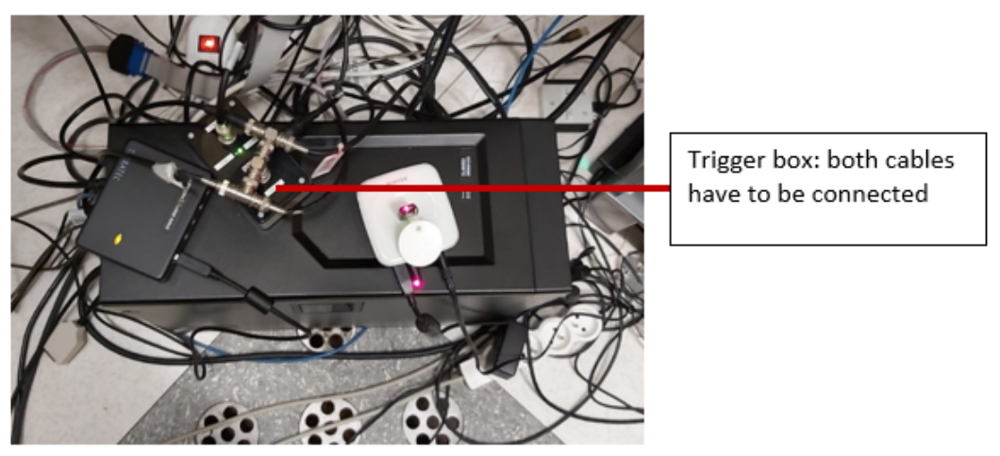

# Practical scanning protocol

This page outlines the procedures followed by our lab at MR8.

For a quick overview of all the steps on the day of a scanning section, please consult the [MRI checklist](https://kuleuven.sharepoint.com/:w:/r/sites/T0005824-Hoplab/Shared%20Documents/Hoplab/Research/MRI/Info%20for%20newbies/What%20to%20do%20at%20the%20scanner/ChecklistMR8.docx?d=w195af25d58334931bee6a959e882c312&csf=1&web=1&e=Uj1dHz)

## General Information

The MR8 suite houses a **Philips Ingenia** scanner with a 32-channel head coil, located in MR suite E408 ([map](https://kuleuven.sharepoint.com/:w:/r/sites/T0005824-Hoplab/Shared%20Documents/Hoplab/Research/MRI/Info%20for%20newbies/Planning%20a%20scan%20session/Directions2MR8.docx?d=we6f6a1c73e5a42e3a01e98a8f0169e10&csf=1&web=1&e=GKJ4lb)). Detailed scanner specifications can be found in the [manual](https://kuleuven.sharepoint.com/:f:/r/sites/T0005824-Hoplab/Shared%20Documents/Hoplab/Research/MRI/Scanner%20info%20%26%20safety/Manual_Philips-MR8?csf=1&web=1&e=1Bh0eI).

!!! info "Important Notes"
    - There is no cell phone service inside the MR suite. Use the control room phone for external calls (dial `0` before the number).
    - **After 6 pm and on weekends**, two certified MR users (MRRUs) are required to run a session. More details are available in the [Safety Rules & Procedures](https://www.dropbox.com/sh/6hdu5z594ojaxh2/AAATYJes74w8KvI0OEOd1MmYa?e=5&preview=Safety+Rules++Procedures+Research+MRI+UZL-KUL+v3.2.pdf).
    - You can find relevant phone numbers to call for urgent questions as well as usernames and passwords of the PCs in the scan console room in [this file](https://kuleuven.sharepoint.com/:w:/r/sites/T0005824-Hoplab/Shared%20Documents/Hoplab/Research/MRI/Info%20for%20newbies/Contact%20information,%20usernames%20and%20passwords.docx?d=w5f0acba0431d45eebb844daf31531222&csf=1&web=1&e=0dXkhV) in the Hoplab Teams folder.

### MR8 Equipment

| **Area/Equipment**                 | **Description**                                                                                                                                                    |
|------------------------------------|--------------------------------------------------------------------------------------------------------------------------------------------------------------------|
| **Lockers**                        | Store white lab coats and personal belongings.                                                                                                                     |
| **Scan Console Screen**            | Includes USB slots for data export.                                                                                                                                |
| **Stimulus PC & Screen**           | Main stimulus computer setup.                                                                                                                                      |
| **Eyetracker Setup**               | Screen and PC for eye-tracking experiments.                                                                                                                        |
| **Volunteer Monitoring Screen**    | Displays a camera feed focused on the volunteer’s legs to monitor movements.                                                                                        |
| **Light Switches**                 | Control the lights in the scanner room. Press 0 or 1 to switch off/on, and use the surrounding circle to gradually adjust brightness.                               |
| **Storage**                        | Contains earplugs, washcloths, padding for headphones (top right drawer), filters (top left drawer), etc.                                                           |
| **Projection Screen**              | Always ensure the projection screen is aligned with the black marks in the scanner. **Do not touch the screen directly**.                                           |
| **Filter**                         | Use the default filter (3NB).                                                                                                                                      |
| **Eyetracker**                     | Complete setup for eye-tracking experiments.                                                                                                                       |
| **Projector**                      | Controlled from the technical room using a remote.                                                                                                                 |
| **Stimulus Desktop PC**            | The main system for running visual stimuli.                                                                                                                        |
| **Power Supply**                   | Power for the eyetracker.                                                                                                                                          |
| **Light Switches for Technical Room** | Located near the equipment area for controlling lighting.                                                                                                         |
| **Scanner Room Key**               | Used to lock and unlock the scanner room.                                                                                                                          |
| **Headphones - Auditory System**   | Headphones for delivering auditory stimuli.                                                                                                                        |

---

## Required Forms

Before going to the hospital, ensure that you have the following forms ready:

- **Consent Form**: Must be signed by both the participant and yourself before the session. Keep it safe post-session.

- **MR Safety Checklist**: This form should be filled out by the participant prior to the session. You can send it in advance to avoid delays on the day of the scan. When the radiology desk is open, this form should be handed to the desk personnel, which will stamp it and confirm your scanning session. [Link](https://www.dropbox.com/sh/6hdu5z594ojaxh2/AABZQbnhdwjvfqvxcW6YztQda?e=1&preview=MR+patient+Questionnaire+-+ENGELS.pdf)

- **Check-In/Check-Out Form**: Fill this form when entering and leaving the MR suite. The timings you indicate on there will be used to record our usage of the scanner and the amount of hours to pay for. Leave this form on the dedicated tray, next to that of the screening questionnaires. [Link](https://www.dropbox.com/sh/6hdu5z594ojaxh2/AABZQbnhdwjvfqvxcW6YztQda?e=2&preview=Checkinout_v3.0.pdf)

---

## Participant Arrival and Registration

### Participant Registration

Upon arriving at the hospital, participants must register at the **main entrance**. The registration procedure varies depending on whether they hold a Belgian ID:

- **Belgian eID-card**: Use the self-service kiosks or the Mynexuzhealth app for fast registration.
- **No Belgian eID-card**: Participants must visit the registration desks (open from 7:00 AM to 6:30 PM).
- **Children under 12**: Register using a **Kids-ID** or **ISI+ card** (for those with Belgian Social Security but without a Belgian ID).

Participants must wait at the **main entrance at least 30 minutes before** their scheduled scanning session. A researcher will meet them and guide them through the check-in process.

=== "Weekdays (before 5:30 PM)"
    The researcher will guide the participant through the process, ensuring that:

    - The **MR Safety Checklist** and **Consent Form** are completed at the hospital entrance. Family members or anyone accompanying the participant into the Inner Controlled Area must also complete the **MR Safety Checklist**.
    - The **MR Safety Checklist** is submitted at the **"Wachtzaal Radiologie"** registration desk.
    - The secretary scans the participant's screening questionnaire into their medical file.
    - The researcher brings the stamped questionnaire to the MRI scanner.

    !!! warning "Important"
        The **MR Safety Checklist** must be submitted **at the Radiology desk**. Failure to do so will prevent the participant from being listed in the **Radiology Information System (RIS)**, which could cause delays.

=== "After 5:30 PM or Weekends/Holidays"
    - The **MR Safety Checklist** and **Consent Form** are completed at the hospital entrance.
    - The researcher and participant will proceed directly to the MR8 suite together.

!!! danger "Controlled Areas Access"
    Access to the Controlled Areas (MRI suite) is restricted and requires a KU Leuven card. Participants are not permitted to enter these areas until the **MR Safety Checklist** and **Consent Form** are signed.

---

### At the Scanner Control Room

Upon arriving in the scanner control room, follow these steps to ensure smooth preparation and transition to the scanning session:

1. **Task Explanation**:
    - Clearly explain the task and any relevant stimuli to the participant. If applicable, show them examples of the stimuli or allow them to practice a few trials to help them understand the task before scanning begins.

2. **Form Submission**:
    - Confirm that the **Consent Form** and **MR Safety Checklist** have been signed. These forms must be signed before entering any Controlled Area.
    - Ensure that the check-in section of the **Check-in/out form** is completed.
    - Place the signed forms in the designated trays in the scanner control room.

3. **Pre-scan Preparation**:
    - Remind the participant to use the bathroom if needed. The bathroom is located behind the orange door, across from the control room.
    - Check that neither you nor the participant have any metal or magnetic items on your body (e.g., watches, hair clips, bank cards, festival bracelets, belts, phones). If the participant prefers not to remove a festival bracelet, you can cover the metal portion with tape.

4. **Personal Belongings**:
    - Store the participant's personal belongings in the lockers (refer to locker no. 1 on the [map of the MR8 suite](https://kuleuven.sharepoint.com/:w:/r/sites/T0005824-Hoplab/_layouts/15/Doc.aspx?sourcedoc=%7BE6F6A1C7-3E5A-42E3-A01E-98A8F0169E10%7D&file=Directions2MR8.docx&action=default&mobileredirect=true)).

5. **Final Check**:
    - Double-check that all necessary forms have been completed and submitted.
    - Confirm that the participant and all accompanying individuals are prepared to enter the scanning suite with no metal or magnetic items.

6. **Optional Comfort**:
    - If the participant is expected to be in the scanner for an extended period, offer them water or a snack beforehand to ensure they are comfortable.

---

## Preparation of the Scanner Area

!!! warning
    After leaving the scanner room, always **lock the door**.  If the door isn’t locked properly, the scan console will display an error when you try to start scanning.

### Stimulus PC

The stimulus computer's desktop is located in the **control room**. It is the second-last computer from the right, between the eye-tracking computer (last) and MRI control computer.

1. **Logging In**:
    - Use the provided username and password. Login details can be found [here](https://kuleuven.sharepoint.com/:w:/r/sites/T0005824-Hoplab/_layouts/15/Doc.aspx?sourcedoc=%7B5F0ACBA0-431D-45EE-BB84-4DAF31531222%7D&file=Contact%20information%2C%20usernames%20and%20passwords.docx&action=default&mobileredirect=true).

    !!! tip "Password Not Accepted?"
        If the password is not accepted, check for a **qwerty-azerty** keyboard mismatch. Press `alt+shift` and ensure **EN** is selected on the login screen.

2. **Storing Experiment Files**:
    - Store your experiment folders under:  
     `C:\Research\Psychology\`  
     (Create your own folder within this directory.)

3. **Installed Software**:
    - **Matlab 2011b, 2015a**, and **Psychtoolbox 3.0.123** are installed.
    !!! tip
        If Matlab freezes or shows a JAVA error, restarting Matlab should fix the issue.

4. **Screen Resolution**:
    - The resolution is set to **1920 x 1080 (landscape)**.
    - To flip the screen, adjust the **projector settings**, not the computer.
    - **Screen Width**: 28.35 visual degrees

---

### Trigger Boxes

The scanner sends a trigger "5" to the stimulus computer. Different setups are used for static and dynamic stimuli:

=== "Static Stimuli"
    A single wire connects two button boxes, each with 2 buttons:

      - **Box 1**: 
        - Blue button = Trigger 1
        - Yellow button = Trigger 2
      - **Box 2**: 
        - Green button = Trigger 3
        - Red button = Trigger 4

=== "Dynamic Stimuli (e.g., movies)"
    A response box with 4 buttons:

      - Blue button = Trigger "b"
      - Yellow button = Trigger "y"
      - Green button = Trigger "g"
      - Red button = Trigger "r"

!!! warning "Check Trigger Outputs"
    Before starting the experiment, verify that the buttons provide the expected outputs on the stimulus PC screen. If no triggers are working:

    - Restart Matlab and/or the stimulus computer.
    - Check if any cables have been left disconnected. The **response box** is on top of the stimulus desktop PC in the **control room**. Ensure both cables are properly connected.

#### Common Issues

??? failure "Button Box Not Responding"
    1. Restart **Matlab**.
    2. Reset the button boxes in the **technical room** by unplugging and reconnecting the power cables.
    3. If the problem persists, restart the **stimulus computer**.

??? failure "Trigger Not Working"
    1. Restart **Matlab** and check for responses from the button box.
    2. Ensure the trigger passes through the **static stimuli box** (check if the boxes are responsive).
    3. Verify that all cables are connected properly. The **response box** is on the table next to the desktop PC in the technical room.

    ??? danger "Restarting the Scanner"
        Do not do this without the approval of Ron or Stefan. If the trigger still doesn’t work, you may need to restart the scanner:
        
        1. Ensure the volunteer is out of the scanner first.
        2. Go to the **technical room** and locate the box with the **red stop** and **green start** buttons.
        3. Press the **red button** to stop the scanner. Wait 10 seconds, then press the **green button** to restart it.
        4. Log back into the scanner computer using **MRService** credentials.
        5. Wait until all components are ready and restart the software.  
           Confirm any errors, such as helium pressure alerts, by pressing **OK**.
           
---

### Scanner Table Setup

1. **Cover Cushions**:  
     Always cover the cushions with paper towels before use.

2. **Keep Equipment Off the Floor**:  
     Do not place cushions or equipment on the floor. If any are found on the floor, place them on the shelves.

3. **Patient Table Setup**:
    - The **32-channel coil** should be placed ~10 cm from the edge of the table.
    - Coil connections:  
        - **Left lower plug** and **right upper plug**.
    - **Headphones**:  
      Plug into the upper left connector at the top of the table.
    - **Panic Button**:  
      Plug into the lower left connector at the bottom of the table.

!!! info "Running Low on Supplies?"
    If you run out of supplies (e.g., paper towels), you can find new ones in the closet right in front of you when entering **MR suite E408**. Paper rolls are stored on top.

---

### Projection Screen

- **Correct Position**:  
    Ensure the back of the screen is aligned with the black marks on the scanner table.
  
- **Handling**:  
    Never touch the projection side of the screen. Use the plastic stand at the bottom if you need to move it.

---

### Projector Filter

Ensure that **filter 3NB** (1.34% light transmission) is placed in front of the projector tunnel for consistency across scan sessions.

MR8 offers four filter options, each with different light transmission levels:

   | **Filter**             | **Light Transmission** |
   |------------------------|------------------------|
   | 3NB                    | 1.34%                  |
   | A+B                    | 4.27%                  |
   | A+C                    | 4.86%                  |
   | Unnamed (grey tape)    | 69.3%                  |

You can combine filters to adjust the luminance.

!!! tip "Handle Filters with Care"
    Filters are fragile. Always hold them by the frame to avoid damage. Filters are stored in the top left drawer of the cabinet in the scanner room.

---

### Projector Usage

1. **Powering On**:  
   The projector brand is **NEC**. Use the remote (button on the top right) to turn it on.

2. **Adjusting the Lens**:  
   If the lens is out of position, use the buttons next to the lens on the projector to adjust — **do not touch the lens directly**.

#### Common Issues  

If the screen is showing a blue window or incorrect display:

- Check that the projector cable is properly connected to the stimulus computer.
- Ensure the source is set to DisplayPort.  
     Press the DisplayPort button on the remote to reset the projector to standard settings.

!!! tip "Viewing Projector Menu"
    To view the projector menu, you'll need to be inside the scanner room with the remote. Remove the filter, then use the remote inside the scanner to see the menu options on the projection screen.

---

## Getting the Volunteer Ready for the Scanner

### Earplugs and Headphones

Volunteers **must** wear earplugs and white earphones. New white earpad covers can be found:

- On top of the cabinet to the right
- Inside the cabinet in the hallway (enter, go straight, then turn right)

!!! danger "Mandatory Hearing Protection"
    Volunteers who refuse to wear the provided hearing protection **cannot** be scanned.

---

### Coil Setup

1. **Positioning the Volunteer**:
    - Ask the volunteer to lie down on the patient table with their head fitted inside the coil.
    - Ensure they don’t hit their head when positioning.
    - Place a **knee cushion** under the volunteer's legs for comfort.

2. **Head Stability**:
    - Secure the volunteer's head using **washcloths** placed between the sides of the head and the coil.
    - Make sure the volunteer is comfortable, ensuring the washcloths do not apply too much pressure.

3. **Panic Button**:
    - Attach the **panic button** to the volunteer's clothing (within easy reach).
    - **Do not place it in their hand**.  
    - Explain its operation and test the alarm before starting the session.

4. **Response Button Box**:
    - Hand the **response button box** to the volunteer and **repeat instructions** on which buttons to use.

5. **Positioning the Coil**:
    - Place the **top of the coil** onto the bottom part, ensuring the volunteer's **nose/head is not touching** the coil.
    - Align the volunteer’s **eyebrows with the calibration line** on the coil. This ensures the head is positioned at the center of the magnet.
    - Secure the coil by clipping it with the **gray handle**.

---

### Mirror and Screen Alignment

!!! tip "Preferred Mirror"
    Use the **single square-shaped mirror** (preferred for better resolution over the double mirror).

1. **Attach the Mirror**:
    - Slide the mirror on top of the head coil.
    - There are two ways to align it easily:
      - Click the mirror on and slide it forward to block the calibration light. Then, adjust and insert the volunteer.
      - Align the mirror, click it on, adjust the position, and insert the volunteer.

2. **Volunteer Adjustment**:
    - The volunteer can **adjust the mirror** themselves if needed by sliding it backward or forward to get a clear view of the screen.

---

### Table calibration

The **control panels** on the left and right of the scanner have identical functions. Use the same switch to move the table **up/down** and **backward/forward**.

1. **Table Height**:
    - If the table is down, raise it by pressing the **up button** until it stops at the maximum height.
  
2. **Moving the Table Inside**:
    - Use the **up button** to move the table inside the scanner.

3. **Eye Protection**:
    - Ask the volunteer to **close their eyes** and gently cover their eyes with your hand.

4. **Calibration Laser**:
    - Press the button with the **light bulb icon** to activate the red calibration laser.
    - Line up the laser with the **volunteer’s eyebrows**.  
    !!! tip
        If the laser turns off, press the button again to reactivate it.

5. **Confirm Coil Position**:
    - Press the button below the light bulb button to confirm the coil's position (a green light will indicate confirmation).
    - The table will move automatically into the scanner when the button is held for a few seconds.
    !!! note
        Place the mirror on top of the coil before sliding the volunteer into the scanner.

#### Common Issues

??? failure "Table Calibration Failed"
    - If the table moves too far inside the scanner, calibration may have failed. Slide the table out of the scanner, recalibrate, and try again.
    - If the scanner light remains on, use the control buttons to switch it off.
    - For **fMRI studies**, maintain consistent lighting throughout the session by using the outer circle on the control panel to switch the light on or off.

??? failure "Green Calibration Light Already On"
    - If the green calibration light is already on before positioning the table correctly, move the table out of the scanner to reset the calibration. The light will turn off, allowing you to restart the calibration process.

---

### Inserting the Volunteer into the Scanner

1. **Move the Table**:
    - Use the **backward/forward switch** to move the table into the scanner. The table will stop automatically when it reaches the correct position according to the calibration.

2. **Cable Management**:
    - Hold the cables while moving the volunteer to prevent them from stretching.

3. **Comfort Check**:
    - Ensure the volunteer is comfortable in the scanner, without crossed arms or legs (to avoid forming current loops).
    - Make sure **no metal or wires** are touching the volunteer’s skin or the bore of the scanner.
    - No wires should be looped within the scanner bore.

#### Common Issues

??? failure "Mirror Doesn’t Fit in the Bore"
    - Check if the **washcloths** are stuck between the edges of the coil, as this could lift the coil's top.
    - Ensure the bottom part of the coil is properly slotted into the grooves on the table.

??? failure "Table Doesn’t Move"
    - The table might be disconnected. Press the button located at the **bottom right**, next to the red button (Button 2), to reconnect the table.

??? failure "Table Moves Too Far Inside Scanner"
    If the table moves too far inside the scanner, it indicates a calibration failure:

    1. **Slide the table out** of the scanner.
    2. **Recalibrate** the patient’s position using the calibration laser.
    
---

### Screen Visibility

Before leaving the room, check the following:

- **Ask the volunteer** if the screen is fully visible and centered.
- **Check the screen yourself** to ensure it is aligned with the black marks on the scanner table.

---

## Eyetracker Setup

### Positioning the Participant

1. Use the **square mirror** with front reflection.
2. Position the participant’s head as high as possible in the coil (to reduce shadows on the face).
3. Support the participant’s neck with **washcloths** to tilt the head back for better eye visibility.

---

### Eyetracker Startup

1. **Scanner area**:
    - Connect the eyetracker plug to the **power supply** (marked with a white tag: “eyetracking”).
    - Ensure the screen is aligned with the **EYE** line.
    - Check if the eyetracker setup is aligned with the floor marks.

2. **Control room - Eyetracker PC**:
    - Boot the **Eyelink** software (default option in the Windows Boot Manager).
    - If Eyelink doesn’t start, press `t` followed by **Enter** to launch it manually.

3. **Control room - Stimulus PC**:
    - Open the **track2popup** to view the eye on the screen and adjust the sharpness.

---

### Eyelink Camera Setup

1. Press `ENTER` to begin **Camera Setup**.
2. Adjust the camera position by holding a finger in front of it to check where it’s pointing.
3. Ensure both the **pupil** and **corneal reflex (CT)** are well-detected.
4. Adjust the **pupil threshold** using the up/down arrows for the clearest possible image.

---

### Calibration & Validation

1. **Calibration**:
    - Before starting **Smartbrain**, ensure the participant is in the optimal head position for calibration.
    - Press `C` to start calibration, and guide the participant to focus on the dots.
    - When the word "stable" appears, press `SPACEBAR` 9 times for each point.

2. **Validation**:
    - Press `V` to start validation, guiding the participant to focus on the dots.
    - If successful, press **ACCEPT**. If validation fails, recalibrate if needed.

3. **Recording**:
    - Open a new file before each functional run and press **RECORD** at the start of the run.
    - Stop recording by pressing **CLOSE FILE** at the end of the run.

!!! tip "Controlling EyeLink"
    It is advisable to control the calibration, validation, recordings and data collection from the script you use for your fMRI task.

#### Common Issues

??? failure "CalPopUp2 Issues"
    If **CalPopUp2** does not start properly (errors or failure to create a new file), restarting the **stimulus PC** should solve the issue.

??? failure "Tracking Issues"
    If the eye is not being tracked during camera setup:
    - Ask the participant to adjust the mirror for better light.
    - Add **washcloths** under their neck to tilt the head back for a clearer view.

---

## Prepare and Start Scanning

### Communication with the Volunteer

- **Ask if they are OK** before starting.
- **Test the response buttons**: Ask the volunteer to press each relevant button one by one, and check the responses on the screen.

---

### Prepare the Scanner

1. **New Examination**:
    - Select **"Patient – New Examination"**.
    - Choose **RIS** to load the volunteer's details. Their data (name, ID, birthdate, sex, and exam) will be automatically filled in.

2. **Volunteer Information**:
    - Enter the volunteer’s weight (from the **MR Safety Checklist**).
    - For women: Answer **no** for pregnancy.
    - For both men and women: Answer **no** for implants.
    - Anatomical images are sent automatically to PACS with the correct identification.

3. **Proceed**:
    - Click **Proceed** to start setting up the exam.

!!! info "Lighting Change"
    Starting a new exam will automatically switch on the outer light circle of the scanner. You may want to switch it off manually.

!!! important "Lighting for fMRI Studies"
    Keep the same light settings throughout the entire fMRI study.  
    - The **center button** turns the light on or off.
    - **Swipe around the center button** to dim the lights.

---

### Select Your Exam Card

1. **Loading the Exam Card**:
    - To set up an exam card, contact **Ron Peeters**.
    - Exam cards are stored under `/hospital/Research/` with names in the format: **S-number and Researcher’s Name**.
    - Press the **+** next to the exam card name or drag it to the left of the window.
    - To copy sequences, right-click on the sequence and choose **copy**. Right-click again to **paste** (or use shortcuts: `Ctrl+C` and `Ctrl+V`).

2. **Standard Exam Setup**:
    - Load the following sequences:
      - **Smartbrain**
      - **Check_fMRI**
      - Then your own sequences, such as:
        - **fMRI protocol N=4** (use this to check slice position and timing)
        - **fMRI protocol N=X** (number of dynamic scans in the actual study)

#### Common Issues

??? failure "Participant Can’t Be Found in CP"
    1. Start a **new examination** by going to **Patients > New Examination**.
    2. Update the patient list by clicking **RIS Configuration**, then **Proceed**.
    3. Close the **New Examination** window and reopen it via **Patients > New Examination > RIS**.

    If no one is available to help, manually fill in the participant's details and send an email to **Ron** with the following information:
    
    | **Field**         | **Value**                       |
    |-------------------|---------------------------------|
    | **Patient Name**  | Participant's name              |
    | **Registration ID** | Same as patient name           |
    | **Birthday**      | 01-01-(year of birth)           |
    | **Sex**           | Participant's sex               |
    | **Exam Name**     | Same as patient name            |
    | **Weight**        | Weight from MR Safety Checklist |
    
---

### Start Scanning

1. **Smartbrain**:
    - Double-click **Smartbrain** → **Proceed** → **Start scan**.

2. **Check fMRI**:
    - After Smartbrain finishes, start **Check fMRI**.
    - The scan frame should contain the whole brain.
    - Accept → **Proceed**.

3. **fMRI Protocol**:
    - Double-click your fMRI sequence.
    - Ensure the **scan frame** covers the area of interest (whole brain or region of interest).
    - Accept the frame and proceed to start the experiment on the **Stimulus PC**.

!!! warning "Don’t Forget"
    - Always press **Proceed** before starting the scan. Any changes made in the tabs won’t take effect unless **Proceed** is clicked.
    - Ensure consistent **TR**, slices, and settings within and between participants.
    - Start the experiment on the **Stimulus PC** before proceeding on the scanner, to avoid missing the trigger.

#### Common Issues

??? failure "Door Not Closed Properly"
    Ensure both the **door to the technical room** and the **scanner door** are securely closed.  
    Improperly closed doors will trigger error messages and prevent scanning from starting.

??? failure "Patient position on the table is unknown"
    If you encounter the error message "Patient position on the table is unknown":

    - Return to the scanner room and **recalibrate** the patient’s position using the laser alignment system.
    - Ensure that the calibration laser is correctly aligned and restart the scan.
    
??? failure "Scanner Light Still On"
    If the scanner light remains on, adjust it using the control buttons.

    For **fMRI studies**, ensure the lighting remains consistent throughout the session. Use the **outer circle** on the control panel to turn the light off or dim it as needed.    
    
??? failure "Pixelated Image After Reference Scan"
    If the reference scan shows a pixelated image with only the skull contours visible, the top of the coil may not be properly mounted.

    - Slide the volunteer out of the scanner.
    - Ensure that the coil is securely closed before attempting to recalibrate.

??? failure "Ventilation Too Low"
    If the ventilation error appears during **Smartbrain**, the system requires a minimum ventilation setting of 3.

    - You can either proceed without adjusting the setting or adjust ventilation via **Examination > Adjust Ventilation** in the scan console.
    
---

### Anatomical Scan

If you need to collect only an **anatomical scan**, you still must run the **standard scans** first (refer to the section above).

You have two options for scheduling the anatomical scan:

- **At the end** of the session
- **Interleaved** with fMRI sequences (to give participants a break)

During the anatomical run, participants can:

- **Close their eyes**
- **Watch a movie** (You can present a YouTube video via the stimulus computer).

---

### Checking for Movement

After an fMRI run finishes:

1. **Drag the sequence name** to one of the boxes on the right of the scan console screen.
2. An image of the run will appear.
3. **Scroll through the slices** and play the time series of images (use the play button at the top of the window).
4. Review the time series to check for any participant movement.

---

## Exporting Data

You can export data using either **Nifti/PAR-REC** or **DICOM** formats. Choose the method that suits your needs.

!!! tip "Faster Export Method"
    For faster and more reliable data transfer, insert your USB key or hard drive into the **computer in the technical room**, rather than the scan console.

### Nifti or PAR-REC Export

1. Go to **Patients > Administration** in the scan program.
2. Locate your participant’s name in the **patient administration** window.
3. Double-click the name and select the runs to export.
4. Click **Disk Files**.
5. Navigate to the **Non-Dicom Export** tab.
6. Choose an export file name and format.
7. (Optional) Check the **Sort** box, but ensure consistency (either always check it or never).
8. Press **Proceed** to start the export.
9. Verify the exported files in the **export folder** on the FTP drive. Double-check the file sizes to ensure all volumes were exported correctly.

To monitor export progress, navigate to:

- **Patients > Administration > Manage Job Queue**

!!! warning "Avoid Exporting Incomplete Runs"
    Never export data from a run that is still in progress. The export list will not refresh automatically. Press the **Refresh** button, or reopen the window after part of the data has been exported

---

### DICOM Export

1. Go to **Patients > Administration** in the scan program.
2. In the **patient administration** window, locate the participant’s name.
3. Double-click the name and select the runs to export.
4. Click **Disk Files**.
5. Select a directory to save the data.
6. Choose between **Nifti**, **Enhanced (4D DICOM)** or **Classic (2D DICOM)** format (each slice saved as a separate file).
7. Press **Proceed** to start the export.

!!! info "Anonymization Option"
    For privacy reasons, it is recommended to anonymize the dataset by giving the exported data a code name (possibly the subject number in BIDS format, e.g., `sub-01`).

!!! tip "Handling Export Delays"
    It may take some time before the export starts. If you see a warning about exporting a large number of images, simply press **Proceed** to confirm.

To track export progress, navigate to:

- **Patients > Administration > Manage Job Queue**

#### Common Issues

??? failure "Not Enough Free Disk Space"
    If files do not export properly (e.g., incorrect sizes), it may indicate that the export drive has insufficient space.

    1. **Check the available disk space** by right-clicking the **Export drive** and selecting **Properties**.
    2. If the drive is full, delete old data such as **PAR-REC, Nifti, or DICOM** files. These files can be re-exported later, so no data will be permanently lost.

??? failure "Local Patient Database Near Full Capacity"
    If the local patient database is nearly full (90-100% capacity), scanning may not proceed.

    1. Navigate to **Patients > Administration** in the scan program.
    2. Check the percentage of disk space used (displayed in the top-right corner).

    !!! tip "Freeing Space"
        - Delete previous participant data only after confirming that it has been exported and transferred without corruption.
        - Alternatively, ask for help from an MR technician to delete unnecessary data.

??? failure "Missing Export Window"
    If the export window doesn’t appear, press the **Windows** key to reveal the taskbar and locate the hidden export window.

??? failure "Export Progress Stalled"
    If DICOM exports seem to have stalled, navigate to **Manage Job Queue** and check that the dropdown menu is set to **Enabled**.

??? failure "Safe Ejection of External Drives"
    If you are unable to safely eject your external drive:

    1. Log off the scanner computer to shut down the scanning software.
    2. Log back in using **MRService** credentials.
    3. Restart the scanning software and acknowledge any **helium pressure** alarms.
    4. Once done, you can safely eject the external drive.

??? failure "External Drive Not Detected"
    If the external drive is not detected in the **Devices and Drives** window:

    1. Log off and log back in using the **MRService** credentials.
    2. Check again in the **Devices and Drives** window to see if the external drive appears.

## After Scanning

### Scanner Area

When finishing a session, ensure the scanner area is returned to its original state. Follow these steps:

1. **Move the volunteer out of the scanner**:
    - Use the **up/down** and **backward/forward** buttons to lower the table, allowing the volunteer to comfortably get off the table.

2. **Organize the equipment**:
    - **Button box**: Place the button box back in the cabinet to the right of the scanner.
    - **Panic button**: Leave it at the end of the patient table.
    - **Mirror**: Return the square mirror to the shelf and replace it with the curved mirror (do not touch the mirror itself).
    - **Top of the coil**: Leave it inside the scanner (keep the bottom part plugged in and on the table).
    - **Washcloths**: Dispose of the used washcloths in the transparent white bag near the door.
    - **Headphones**: Hang the white headphones back on the hook at the front of the scanner.
    - **Earplugs**: Dispose of them in the blue bag near the door.
    - **Paper towels**: Throw away any used paper towels in the blue bag.

3. **Cleaning**:
    - Use the disinfectant provided in the MRI magnet room to **wipe down the MRI system table**.
    - **Cushions and equipment**: Ensure no equipment is left on the floor. If you find anything on the floor, place it on a shelf.

4. **Turn off the projector**:
    - Go to the technical room and use the remote control to switch off the projector.

5. **If clinical scans follow your session**:
    - Remove the projection screen from the scanner bore and place it safely inside the scanner room (e.g., against the wall).
    - Change the **filter** back to the default setting (**3NB**).

---

### Control Room

#### Stimulus PC

- Collect your data from the **stimulus PC**.
- Turn off the screen (but do not shut down the computer).

#### Scan Console

1. **Verify data export**:
    - Ensure all data has been exported.
    - Check the **file sizes** to confirm all files were exported correctly (files should have similar sizes; if some are smaller, they may still be exporting).

2. **Clear the screen**:
    - Select **Patient > Close "participant name"** to clear the participant's data from the screen.
    - Turn off the screen (do not shut down the computer).

---

### Check-out Procedures

Before leaving the department, complete the **check-out part** of the check-in/out form:

1. Fill out the **check-out** section of the form.
2. Leave the form with the other documents, along with the MRI safety questionnaire.
3. Report any minor technical incidents on the form and email the MRI Safety Officer:  
   **Dr. Ronald Peeters**.
4. **Incidental abnormalities**: Do not inform the participant. Contact **Prof. Dr. Stefan Sunaert** immediately.

---

### If You Are the Last Person Scanning Experiments That Day

#### Scanner Area

- Use **alcohol wipes** to clean the patient table.
- Put the projection screen on the side, against the wall.
- Remove the coil from the table and store it in the cabinet.
- Lock the scanner area (the key is in the control room).

#### Control Room

- **Do not shut down the console** or **stimulus PC**!

---

## Scanning of Children

1. **Preparation**:
    - Bring **biscuits** and **drinks** for the child.
    - Make sure the time slot is long enough so the session is not rushed.
    - Limit scanning sessions to **50 minutes of active tasks** with plenty of breaks.

2. **During the session**:
    - Show the child the control room.
    - Go through the MR screening form with the parents and **double-check** that the child has no metal on their clothes.
    - Ask the child to use the toilet before scanning.

3. **Parental presence**:
    - Parents must stay in the control room during scanning. Once the scanning has started, they should wait in the waiting area outside the scanner.
    - If the child is too scared, they can be accompanied by a parent into the scanner room (ensure the parent removes all metal and wears earplugs and headphones).
    - Once the child is calm, the parent can leave the scanner room.

4. **Communicating with the child**:
    - Explain that you will talk to them via the intercom.
    - Let them know they can speak when prompted and need to stay quiet otherwise.
    - Use simple, reassuring language:
        - Call the coil a “helmet.”
        - Explain that the table movement is like being on a ride.
        - Tell them about the lights being off during scanning and that they need to stay very still.

5. **Head positioning**:
    - Fixate the child’s head with **washcloths** on the sides, but avoid too much pressure.
    - Optionally, use tape across the child’s forehead to further secure the head.

6. **Calibration**:
    - Explain that the child must **keep their eyes closed** during calibration.
    - Cover their eyes with your hand for extra comfort.
    - Ensure the laser is positioned between the child’s eyebrows.

7. **Lighting for children**:
    - Leave a bit of light on during scanning to reduce fear. If needed, use the dimmer switch in the control room.

8. **During scanning**:
    - For structural scans (where functional information isn’t needed), you can play a **YouTube video** or **DVD** to keep the child entertained.

9. **Breaks**:
    - Take a break after each run and ask the child how they are feeling.
    - If the tasks change between runs, give the child a short reminder of the instructions.

10. **Post-scan**:
    - After scanning, let the child sit up slowly to avoid dizziness.

---

## Auditory Stimuli

### Scanner Room - Yellow Headphones

- The yellow headphones are stored on the left side of the storage space (against the wall).
- The headphones will present sound at full level only when placed inside the scanner bore.
- Disconnect the **white headphones** from the head coil and replace them with the yellow headphones.

---

### Control Room - Microphone

The microphone is always on, but goes into standby mode after a few seconds.

| **Button**       | **Function**                                                                 |
|------------------|-------------------------------------------------------------------------------|
| **+ / - Buttons** | Increase/decrease the volume.                                                 |
| **Menu Button**   | Access various options. Hold it and press the + button to navigate the menu.  |
| **Grey Button**   | Speak to the participant.                                                     |

Activate the **fMRI settings** by holding the **Menu button** and pressing **+** to navigate to the fMRI option.

---

### Control Room - Amplifier and Converter

- Check that the **red and white plugs** (audio cables to the headphones) are connected to the converter.
- Ensure the **power cable** is plugged in next to the red and white plugs.

#### Common Issues

??? failure "Participant Can't Hear You"
    - Reboot the amplifier by unplugging the **power cable** underneath the desk.
    - Reboot the converter by unplugging its power cable.

??? failure "Volume Imbalance (left/right)"
    - Adjust the balance via the **Menu button**. Hold it and use **+/-** to adjust levels separately.

---

## In Case of Emergency

### Seeing an Abnormality on Brain Images

!!! warning "Do not disclose concerns to the volunteer"
    Avoid causing unnecessary distress to the volunteer. False alarms can arise from misinterpretations.

If you detect a potential abnormality:

1. **Report the concern immediately** to **Dr. Stefan Sunaert**. If unavailable, contact the radiologist on call.
2. **Supply a copy** of the image showing the suspected abnormality.
3. Make a note of the finding in the **Check-out part** of the Check-In/Out form.

---

### Emergency Procedures

In case of an emergency involving the MRI system or facility:

#### Equipment Malfunction

- If the use of facility equipment results in an accident, **immediately notify certified MR personnel** (MR technicians or radiologist) and the **MRI Safety Officer**.

#### System Failure

- If part of the system fails and poses a danger to the volunteer:
  
  1. **Remove the volunteer** from the scanner.
  2. Seek help from **certified MR personnel**.

#### Emergency Magnet Shutdown (Quenching)

??? danger "Magnet Quenching"
    Emergency shutdown of the magnet (quenching) **must only be performed by authorized personnel** in the following life-threatening situations:

    - If the magnetic field poses an immediate danger to a person.
    - If emergency services need access to the **Inner Controlled Area** with ferromagnetic equipment.

---

### In Case of Fire

!!! danger
    Do not bring ferromagnetic fire extinguishers into the Inner Controlled Area (risk of projectile hazard). Use fire extinguishers marked with a **YELLOW ribbon**, which are non-ferromagnetic (aluminum).

1. **Call emergency number 2580**. Clearly indicate the location: **"MRI Suite MR8"**.
2. **Do not take unnecessary risks**. Only perform one extinguishing attempt.
3. **Close doors** to the endangered area once all persons are evacuated.
4. **Evacuate** the area, using emergency exits if necessary.
5. **Follow instructions** from the fire crew without taking further risks.

---

### In Case of Reanimation

1. **Seek immediate assistance** from the **ASU**.
2. **Call emergency number 1000**. Clearly state the location: **"MRI Suite MR8"**.
