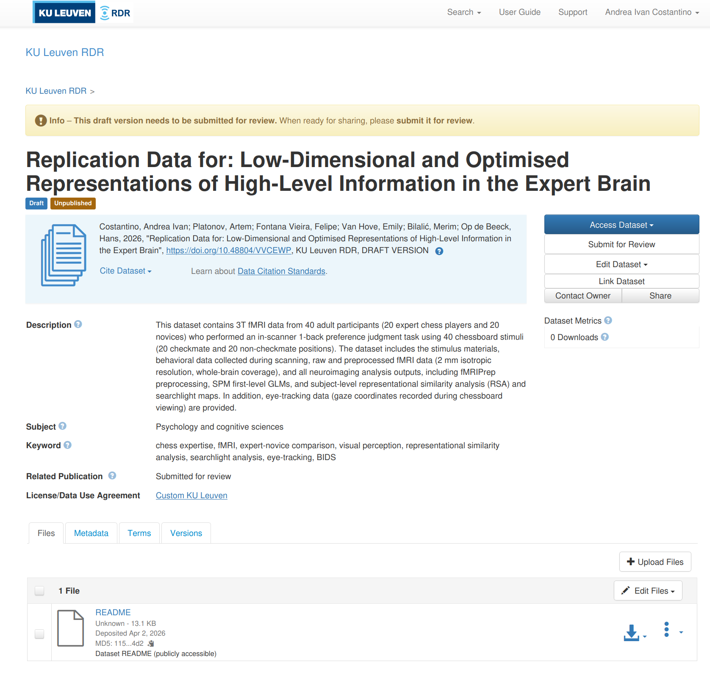
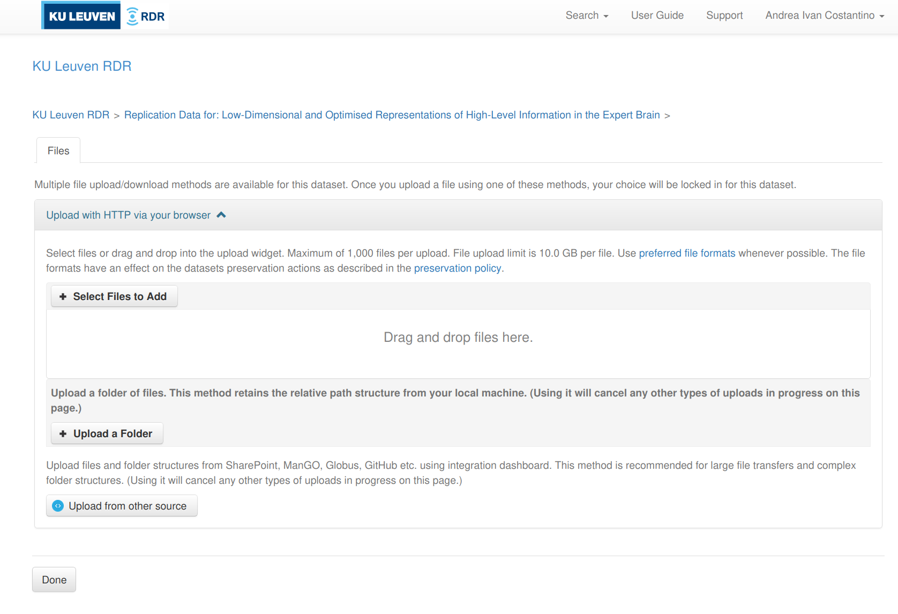

# RDR for data sharing

[KU Leuven Research Data Repository (RDR)](https://rdr.kuleuven.be/) is the university's platform for publishing and sharing research datasets alongside a publication. This page walks you through the full upload process.

!!! info "When to use RDR"
    RDR is for **finished datasets** tied to a publication. For active research data, use [ManGO](mango_active.md). For long-term archiving, use [FriGO](frigo_archive.md).

## Before you start

- [ ] Your dataset is complete, well-organised, and validated
- [ ] For fMRI data: [BIDS-compliant](../fmri/analysis/fmri-bids-conversion.md) and [anonymized](../fmri/analysis/fmri-anonymization.md)
- [ ] Your S-case/ethics application mentions data sharing (required for restricted access). Contact [Klara](https://www.kuleuven.be/wieiswie/nl/person/00116743) to check what your S-case allows and whether an amendment is needed.
- [ ] You have a code repository on GitHub with analysis scripts and documentation

## Where does what go?

For neuroimaging projects, data and code live in two places:

| What | Where | Why |
|------|-------|-----|
| Raw data, preprocessed data, all derivatives | **BIDS dataset on RDR** | Reproducibility; data preservation |
| Analysis code, scripts, documentation | **GitHub repository** | Version control; open access |

Everything in the BIDS dataset — raw scans, preprocessed outputs, subject-level derivatives, and group-level results — goes on RDR. The code repo contains the scripts that produced those outputs, plus READMEs explaining how to run them.

## Step 1: Validate your dataset

### For fMRI (BIDS) datasets

Run the [BIDS validator](https://bids-standard.github.io/bids-validator/):

```bash
pip install bids-validator-deno
bids-validator-deno /path/to/your/BIDS
```

Fix all **errors** before proceeding. Warnings are recommended but not blocking.

??? info "Common BIDS errors and how to fix them"

    | Error | Fix |
    |-------|-----|
    | `JSON_INVALID` | Remove trailing commas; validate with a JSON linter |
    | `SIDECAR_KEY_REQUIRED` / `TaskName` missing | Create a root-level `task-<label>_bold.json` with `{"TaskName": "yourtask"}` |
    | `PARTICIPANT_ID_MISMATCH` | Ensure every `sub-XX/` directory has a matching row in `participants.tsv` |

For fMRI datasets, also follow the [anonymization guide](../fmri/analysis/fmri-anonymization.md) (defacing, metadata scrubbing, participant data review).

### For other dataset types

Ensure your data has a clear folder structure, consistent naming, and sufficient metadata (README + data dictionaries) for others to understand it.

## Step 2: Write a README

A README is **mandatory** for RDR. Upload it as a **separate file** (not inside a ZIP) so it is directly visible on the dataset landing page — even for restricted datasets, the README should be publicly accessible.

For BIDS datasets, the `README` file at the dataset root serves double duty. It should cover:

- What the dataset contains and why it was collected
- Participants (number, groups, key demographics)
- Acquisition parameters (scanner, software, sequences)
- Folder structure and file naming conventions
- What derivatives are included and how they were produced
- Link to the analysis code repository
- Contact information
- License

## Step 3: Prepare ZIP files

!!! warning "ZIPs are required"
    RDR runs on Dataverse, which loads very slowly with more than ~1,000 individual files. The RDR team requires organising data into **ZIP files, each under 20 GB**. RDR includes a built-in ZIP previewer that lets users browse contents and download individual files from within archives.

Use [7-Zip](https://www.7-zip.org/) to compress and automatically split into volumes:

```bash
# Example: compress a folder and split at 20 GB
7z a -v20g my_bundle.zip my_folder/
```

On **Windows**: right-click the folder → **7-Zip > Add to archive** → set format to **zip** → enter `20G` under **Split to volumes**.

To extract (recipient side):

```bash
7z x my_bundle.zip.001    # 7-Zip auto-detects the other parts
```

### How to split your dataset

If your dataset is small enough (<20 GB total), a single ZIP is fine. For larger datasets, split into **logical bundles** so users can download only what they need. A good default for fMRI datasets:

| Bundle | Contents | Typical size |
|--------|----------|-------------|
| **Core** | `participants.tsv`, sidecars, `stimuli/`, atlases | Small (~20 MB) |
| **Raw** | `sub-*/anat/`, `sub-*/func/*_bold.nii.gz` | Large (tens of GB) |
| **Preprocessed** | `derivatives/fmriprep/` | Large |
| **First-level** | `derivatives/spm/` or equivalent GLM outputs | Medium–large |
| **Derivatives** | All other derivative pipelines + group-level results | Usually small (~100–300 MB) |

The idea is that **most users only need the core + derivatives bundle** to reproduce group-level analyses, tables, and figures (~300 MB). Only users who want to re-run preprocessing or subject-level analyses need the heavier bundles.

Further splitting makes sense when a specific pipeline stage is large and only needed for a subset of analyses. For example, if most analyses read from SPM first-level betas, shipping SPM separately from fMRIPrep lets users skip the ~180 GB fMRIPrep bundle entirely.

!!! tip "Example"
    The [chess expertise fMRI dataset](https://doi.org/10.48804/VVCEWP) uses 5 bundles: core (20 MB), raw (39 GB), fMRIPrep (187 GB), SPM (30 GB), and all other derivatives + group results (184 MB). The README and documentation HTML files are uploaded separately as unrestricted files, visible on the landing page without access request.

## Step 4: Choose a license

RDR requires selecting a license in the **Terms** tab.

For **restricted datasets** (most Hoplab neuroimaging data):

- Select a standard license (e.g., **CC-BY 4.0**) — this applies to the **unrestricted files** (README, documentation)
- For the restricted data itself, access is governed by a **Data Transfer Agreement (DTA)** that is drafted when someone requests access. The DTA serves as the effective license for the restricted files.

For **open datasets** (no access restrictions): **CC-BY 4.0** (attribution required) or **CC0** (no restrictions).

See the [RDR license guidance](https://www.kuleuven.be/rdm/en/rdr/manual#License) for details.

## Step 5: Create a draft dataset

1. Go to [rdr.kuleuven.be](https://rdr.kuleuven.be/) and log in with your KU Leuven account
2. Navigate to the Hoplab Dataverse collection (contact [Klara](https://www.kuleuven.be/wieiswie/nl/person/00116743) if you don't have access)
3. Click **Add Data > New Dataset**
4. Fill in the required metadata (see below)
5. Click **Save Dataset** — this creates the draft

### Required metadata

**At draft creation:**

| Field | What to enter |
|-------|---------------|
| **Title** | Name of your dataset |
| **Author(s)** | Name and affiliation of each contributor (match your paper) |
| **Contact** | Name and email of who handles access requests |
| **Description** | What the dataset contains, how it was collected |
| **Subject** | Broad discipline (e.g., "Medicine, Health and Life Sciences") |

**Before publishing** (fields appear after the first save):

| Field | What to enter |
|-------|---------------|
| **License** | CC-BY 4.0 (for unrestricted files); DTA covers restricted data |
| **Access rights** | `restricted` (for neuroimaging data with GDPR constraints) |
| **Technical format** | File extensions in the dataset (e.g., `nii.gz, json, tsv, png`) |
| **Legitimate opt-out** | Reason for restricting access: `ethical` (for human subjects data) |

Additional fields (keywords, related publication DOI, funding) are optional but improve discoverability.

## Step 6: Upload files

!!! tip "Upload from the KU Leuven network"
    Uploading from campus or via VPN significantly improves transfer speed and reliability for large files.

There are three ways to upload files. The **web UI** is the simplest; the **API** is better for large datasets with many files; the **Integration Dashboard** is useful when data already lives on a KU Leuven platform.

### Option A: Web UI

The web UI is the most straightforward option, especially for smaller datasets or when you only have a handful of ZIP files. It does **not** unpack ZIPs — they are stored as-is.

1. Open your draft dataset on [rdr.kuleuven.be](https://rdr.kuleuven.be/)
2. Click **Upload Files** (top right, next to "Edit Files")

    

3. You get three sub-options (see screenshot below):
    - **Select Files to Add** — pick individual files via a file browser
    - **Upload a Folder** — select a local folder; RDR preserves the relative path structure
    - **Upload from other source** — connect to SharePoint, ManGO, Globus, or GitHub via the Integration Dashboard (see Option C below)

    

4. After uploading, set the **access level** for each file:
    - README and documentation files → **Public** (so users can read them without requesting access)
    - Data bundles → **Restricted** (access via Data Transfer Agreement)
    - To change: click the file's lock icon or go to **Edit Files** and change the restriction setting

!!! warning "Web UI file size limit"
    The web UI has a per-file upload limit (currently **10 GB** on RDR). For larger files, use the API (Option B) or the Integration Dashboard (Option C).

### Option B: API upload with dvuploader

For datasets with many files or files larger than 10 GB, the Dataverse API is the way to go. RDR uses **S3 direct upload** — the upload tool sends files directly to the storage backend, bypassing Dataverse's processing. This is important because if files go through the Dataverse backend instead, **ZIP files get automatically unpacked**.

The RDR team maintains a fork of `dvuploader` that works correctly with their S3 setup:

```bash
pip install git+https://github.com/libis/python-dvuploader.git
```

!!! warning "Python version"
    The LIBIS fork requires Python ≤ 3.13. Python 3.14 is not yet supported.

#### Basic usage

```python
from dvuploader import DVUploader, File

files = [
    # Restricted data bundle
    File(filepath="chess-bids_B_raw.z01", restrict=True),
    # Unrestricted documentation
    File(filepath="README", restrict=False),
]

uploader = DVUploader(files=files)
uploader.upload(
    dataverse_url="https://rdr.kuleuven.be",
    api_token="YOUR_API_TOKEN",
    persistent_id="doi:10.48804/VVCEWP",  # your dataset DOI
    n_parallel_uploads=2,
)
```

Get your API token from [rdr.kuleuven.be](https://rdr.kuleuven.be/) → click your name (top right) → **API Token** → **Create Token**. The token is valid for one year.

#### File options

The `File` class supports several useful parameters:

```python
File(
    filepath="my_bundle.zip",       # path to the file
    restrict=True,                  # True = restricted, False = public
    description="Raw fMRI data",   # shows up in the file listing on RDR
    directory_label="data/raw",     # virtual folder path on RDR
    categories=["Data"],            # file category tags
)
```

#### Batch upload example

```python
from pathlib import Path
from dvuploader import DVUploader, File

UPLOAD_DIR = Path("rdr-upload")
API_TOKEN = "your-token-here"
PID = "doi:10.48804/VVCEWP"

# Collect all ZIP volumes
bundle_files = sorted(
    list(UPLOAD_DIR.glob("*.zip"))
    + list(UPLOAD_DIR.glob("*.z[0-9][0-9]"))
)

files = [File(filepath=str(f), restrict=True) for f in bundle_files]

# Add unrestricted docs
files.append(File(filepath=str(UPLOAD_DIR / "README"), restrict=False))

uploader = DVUploader(files=files)
uploader.upload(
    dataverse_url="https://rdr.kuleuven.be",
    api_token=API_TOKEN,
    persistent_id=PID,
    n_parallel_uploads=2,
)
```

!!! danger "Do NOT use `curl` or the upstream `dvuploader` for ZIP files"
    Uploading ZIP files with `curl -F` to the `/api/datasets/:persistentId/add` endpoint sends the file through the Dataverse backend, which **automatically unpacks ZIP files**. The LIBIS fork of dvuploader avoids this by uploading directly to S3. The upstream (non-LIBIS) version of dvuploader also does not work correctly with RDR's S3 setup.

    For non-ZIP files (e.g., README, HTML, TSV), `curl` works fine:

    ```bash
    curl -H "X-Dataverse-key:$API_TOKEN" -X POST \
      -F "file=@README" \
      -F 'jsonData={"restrict":false, "description":"Dataset documentation"}' \
      "https://rdr.kuleuven.be/api/datasets/:persistentId/add?persistentId=$PID"
    ```

#### Other useful API calls

```bash
# List files in your draft
curl -H "X-Dataverse-key:$API_TOKEN" \
  "https://rdr.kuleuven.be/api/datasets/:persistentId/versions/:draft/files?persistentId=$PID"

# Delete a file from the draft (by file ID)
curl -H "X-Dataverse-key:$API_TOKEN" -X DELETE \
  "https://rdr.kuleuven.be/api/files/12345"

# Change a file's restriction (true = restricted, false = public)
curl -H "X-Dataverse-key:$API_TOKEN" -X PUT -d false \
  "https://rdr.kuleuven.be/api/files/12345/restrict"
```

See the [Dataverse Native API docs](https://guides.dataverse.org/en/6.7/api/native-api.html) and the [KU Leuven API documentation](https://www.kuleuven.be/rdm/en/rdr/api-documentation) for the full reference.

### Option C: Integration Dashboard

If your data is already on a KU Leuven platform (OneDrive, SharePoint, ManGO, or GitHub), the [Integration Dashboard](https://www.kuleuven.be/rdm/en/rdr/integration-dashboard) can pull files directly into your RDR draft — no local download or upload needed. Access it from the **Upload from other source** button in the web UI (see screenshot above).

## Step 7: Verify and publish

1. Check that all files appear in the draft and sizes match your local copies
2. Verify the README and documentation files are set to **unrestricted**
3. Fill in any remaining metadata fields
4. For restricted access: confirm the contact person is correct
5. Click **Publish Dataset** > **Major version** (v1.0)
6. Copy the DOI and add it to your paper and code repository

## Step 8: Get DOIs for your data and code

After publishing, you need two DOIs: one for the **data** (RDR) and one for the **code** (Zenodo). Both go in your paper's Data Availability statement.

### Data DOI (automatic)

When you publish your RDR dataset, it automatically gets a DOI (e.g., `doi:10.48804/XXXXXX`). This is visible on the dataset landing page. Use this DOI in your paper and code repository.

### Code DOI (Zenodo + GitHub)

[Zenodo](https://zenodo.org/) mints DOIs for GitHub releases. Set this up **once** per repository, then every tagged release automatically gets a DOI.

**One-time setup:**

1. Go to [zenodo.org](https://zenodo.org/) and log in with your GitHub account
2. Go to [zenodo.org/account/settings/github](https://zenodo.org/account/settings/github/)
3. Find your repository and flip the toggle to **ON**
4. Zenodo installs a webhook on your repo — from now on, every GitHub release triggers a new Zenodo DOI

**For each release:**

1. Tag a snapshot of your code when the paper is submitted or accepted:

    ```bash
    git tag -a v1.0.0 -m "v1.0.0 — publication release"
    git push origin v1.0.0
    ```

2. Create a GitHub release from the tag:

    ```bash
    gh release create v1.0.0 --title "v1.0.0 — Publication Release" \
        --notes "Analysis code for [paper title]. Data: doi:10.48804/XXXXXX"
    ```

    Or do it via the GitHub web UI: go to your repo → **Releases** → **Draft a new release** → select the tag → fill in title and notes → **Publish release**.

3. Zenodo automatically picks up the release and mints a DOI (takes a few minutes). Check at `zenodo.org/account/settings/github/` or search for your repo on Zenodo.

**Zenodo gives you two DOIs:**

- A **version DOI** (e.g., `10.5281/zenodo.12345678`) — points to this specific release
- A **concept DOI** (e.g., `10.5281/zenodo.12345677`) — always resolves to the latest release

Use the **concept DOI** in your paper (so it stays current if you release bug fixes). Use the **version DOI** when you need to cite a specific snapshot.

### Cross-linking

Once you have both DOIs:

- In your **paper**: cite both the data DOI and the code concept DOI
- In your **code repo README**: add the RDR data DOI and the Zenodo badge
- In your **RDR metadata**: add the code repo URL and paper DOI (when available) in the "Related Publication" field
- In your **RDR README**: link to the code repo and cite both DOIs

## Important notes

!!! warning "Large datasets (> 50 GB)"
    Contact the [RDR team](mailto:rdm@kuleuven.be) **before** uploading. Large datasets are handled case-by-case. Free hosting is offered for 10 years on a best-effort basis.

## Example

The chess expertise fMRI dataset is a complete example of a Hoplab RDR upload:

- **RDR dataset**: [doi.org/10.48804/VVCEWP](https://doi.org/10.48804/VVCEWP) — the README and interactive documentation (analysis flowcharts, BIDS file tree) are publicly visible; data bundles require access request
- **Code repository**: [github.com/costantinoai/chess-expertise-2025](https://github.com/costantinoai/chess-expertise-2025) — includes a Quick Start section, per-analysis READMEs, and a `run_all_analyses.sh` pipeline

For questions or issues at any stage, contact the RDR team via [rdm@kuleuven.be](mailto:rdm@kuleuven.be) or check the [RDR support guidelines](https://www.kuleuven.be/rdm/en/rdr/support-guidelines).
