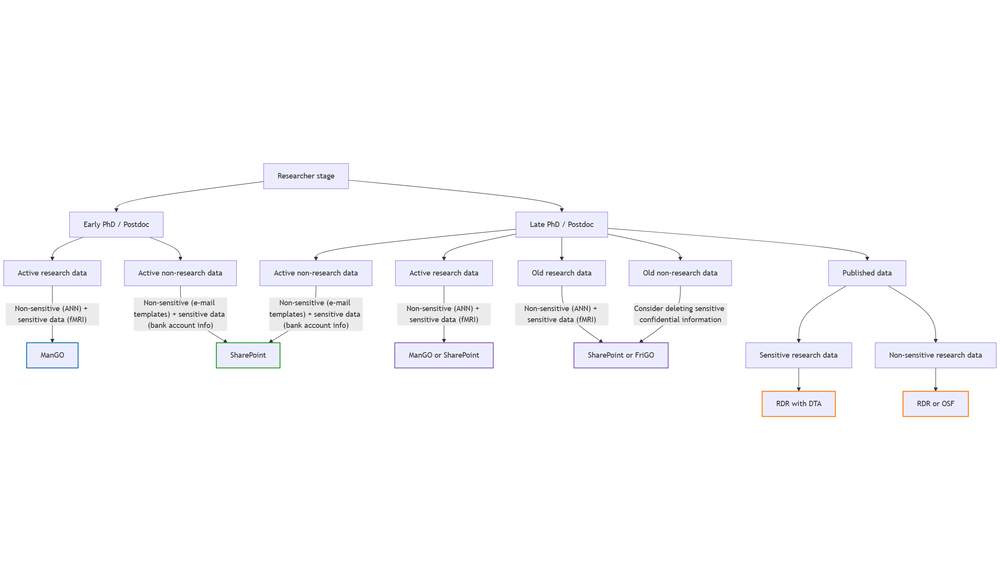

# Research Data Management (RDM) at Hoplab

Welcome to this brand-new section that describes how Hoplab handles research data during the full project lifecycle: from onboarding and data collection to storage, sharing, and archiving.

Our procedures aim to ensure:

- consistent, reproducible and well-organised datasets across projects
- compliance with [KU Leuven RDM policy](https://www.kuleuven.be/rdm/en/policy), [FAIR principles](https://www.kuleuven.be/rdm/en/guidance/fair), relevant ethical guidelines, and [GDPR](https://admin.kuleuven.be/privacy/en/studpers/gdpr-code-of-conduct)
- secure handling of confidential participant data
- efficient collaboration and long-term preservation

## Start here

- **New to the lab?** → See the [*onboarding checklist*](onboarding.md)
- **Leaving the lab?** → See the [*offboarding checklist*](offboarding.md)
- **Starting a new project?** → Follow the appropriate [*workflow*](SOPs.md)

## Tools we use to store and share data

- **SharePoint** → [How to](sharepoint_daily.md) set it up for daily use
- **ManGO** → [How to](mango_active.md) store active research data
- **FriGO** → [How to](frigo_archive.md) archive data on the long-term after projects end
- **RDR** → [How to](RDR_sharing.md) publish and share datasets

This decision tree shows the intended storage location of project data at Hoplab across the lifecycle:

## ⚠️ Work in progress

These guidelines reflect the current working procedures and may be updated as workflows are tested and improved. Please check out this section regularly if you are starting a new project.

If anything is unclear or missing, please contact the RDM responsibles ([Klara](https://www.kuleuven.be/wieiswie/nl/person/00116743) or [Andrea](https://www.kuleuven.be/wieiswie/nl/person/00152046)) so the documentation can be refined.
