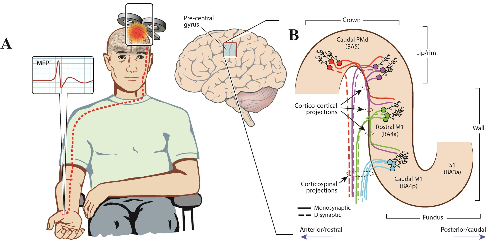

# First steps

What to arrange before your first TMS session. The lab runs single- and paired-pulse TMS with Brainsight neuronavigation in room PSI 00.57.

## How TMS works

The stimulator discharges a strong current through a coil held against the head. The changing magnetic field induces an electric field in the cortex under the coil, and this field makes neurons fire. A figure-of-eight coil, like ours, concentrates the field under its centre: the stimulated area is in the order of a square centimetre, depending on the intensity ([Rossi et al., 2021](https://doi.org/10.1016/j.clinph.2020.10.003), p. 276). Bigger coils and higher intensities reach deeper but are less focal.

<figure markdown="span" style="width: 100%">
  { width="100%" .img-border }
  <figcaption style="font-size: .7rem; max-width: none">TMS over the motor cortex evokes an MEP in a hand muscle (left); the pathways from the precentral gyrus that carry it (right). From <a href="https://doi.org/10.1016/j.clinph.2023.03.010">Vucic et al. (2023)</a>, Fig. 1A and 1B. © 2023 International Federation of Clinical Neurophysiology, published by Elsevier B.V. <a href="https://creativecommons.org/licenses/by-nc-nd/4.0/">CC BY-NC-ND 4.0</a>.</figcaption>
</figure>

A single pulse over the motor cortex makes a small hand muscle on the other side of the body twitch about 20 ms later. Recorded with EMG, that twitch is the motor evoked potential (MEP), and the lowest intensity that can evoke one is the motor threshold. In paired-pulse TMS, a first pulse changes the response to a second one given shortly after it. Comparing the two shows inhibition and facilitation inside the cortex ([Edwards et al., 2024](#what-to-read-first), chapters 3 and 5).

The effects of single pulses are short-lived. Repetitive TMS (rTMS) gives trains of pulses with longer-lasting effects; the lab does not use it.

## Before your first session

???+ steps "Get ethical approval"
    TMS studies go to the [Ethics Committee Research UZ/KU Leuven (EC onderzoek)](../ethics/MEC.md), not to SMEC. The lab already has a TMS ethics protocol on the Hoplab SharePoint: [TMS ethics protocol](https://kuleuven.sharepoint.com/:w:/r/sites/T0005824-Hoplab/_layouts/15/doc2.aspx?action=edit&sourcedoc=%7B2a1c8520-082c-4924-a68c-c293daea1cf1%7D&wdExp=TEAMS-TREATMENT&web=1) (*access required*).

    The protocol covers single- and dual-pulse TMS within the international safety guidelines (Rossi et al., 2009 and 2021). Among other things, it requires that a participant who has a seizure during a session goes to the hospital for a check-up. Check with Matilda and Hans whether your study fits under this protocol or needs its own application.

???+ steps "Get trained"
    Plan your training with Matilda before you run a session on your own. The international guidelines describe what TMS training in research should contain ([Rossi et al., 2021](https://doi.org/10.1016/j.clinph.2020.10.003), section 8.1):

    - theory: how TMS works, safety and ethics;
    - hands-on practice: operating the stimulator, holding the coil on a target with and without neuronavigation, finding the motor hotspot and measuring the resting and active motor threshold;
    - observation and supervised practice, then a test. The guidelines give an example: watch 5 sessions, run 5 under supervision, then run a test session.

???+ steps "Get access to the room in Calira"
    The TMS room is booked through Calira, the faculty's booking tool for research rooms and equipment.

    1. Ask Klara for the Calira invitation link of the B&C Human group, and create your account with it. Log in through your organisation (KU Leuven login).
    2. Request access to **PSI 00.57 TMS Room**, listed under *B&C Human - Experimental rooms*. You receive an e-mail from Calira once access is granted.

    See [Reserve equipment or a room for testing](../../get-started/admin-procedures.md#reserve-equipment-or-a-room-for-testing) for more on Calira.

???+ steps "Book your sessions"
    Book **PSI 00.57 TMS Room** in Calira for every session, including pilots and practice. Leave time before the session to set up neuronavigation, and time after it to clean up and shut down (see [Session procedure](tms-procedure.md)).

## What to read first

These are the two main overview references I recommend for starting out with TMS. They cover a range of topics and methods from a beginner level.

1. [Edwards et al., 2024: A Practical Manual for Transcranial Magnetic Stimulation](https://link.springer.com/content/pdf/10.1007/978-3-031-62304-2.pdf). Gold standard with most up-to-date info. Not open access; look for it through KU Leuven Libraries.

    ??? info "Chapters"

        1. Basic Mechanisms
        2. Safety
        3. Setup and Basic Procedures
        4. Basic Neurophysiology Measures
        5. Advanced Neurophysiology Measures
        6. Neuromodulation

2. [Rotenberg et al., 2014: Transcranial Magnetic Stimulation](https://link.springer.com/book/10.1007/978-1-4939-0879-0). A really good reference. It is however over 10 years old now so some things may be a bit outdated (especially re; fMRI & EEG) but it gives good foundational knowledge for a lot of the methods. I'd first recommend Edwards et al., (above) and then this reference for some extra context.

    ??? info "Chapters"

        1. Transcranial Magnetic Stimulation Fundamentals
            1. The Transcranial Magnetic Stimulation (TMS) Device and Foundational Techniques
            2. Transcranial Magnetic Stimulation (TMS) Safety Considerations and Recommendations
            3. Neuronavigation for Transcranial Magnetic Stimulation
            4. Reaching Deep Brain Structures: The H-Coils
        2. Transcranial Magnetic Stimulation Methods
            1. Single-Pulse TMS Protocols and Outcome Measures
            2. Paired-Pulse TMS Protocols
            3. Repetitive TMS (rTMS) Protocols
        3. Experimental Design
            1. Offline and Online "Virtual Lesion" Protocols
            2. State-Dependent TMS Protocols
        4. Multimodal Considerations
            1. Combination of TMS with fMRI
            2. EEG During TMS: Current Modus Operandi
        5. Clinical Considerations
            1. TMS Clinical Applications: Therapeutics
            2. TMS Clinical Applications: Diagnostics
            3. A Review of Current Clinical Practice in the Treatment of Major Depression

3. The lab's [Safety and emergencies](tms-safety.md) page, in full.
4. Sections 4 (side effects) and 8 (training) of [Rossi et al. (2021)](https://doi.org/10.1016/j.clinph.2020.10.003), the international safety guidelines (open access).

## Plan your study

???+ deflist "What to measure and report"
    [Chipchase et al., (2012): A checklist for assessing the methodological quality of studies using transcranial magnetic stimulation to study the motor system: An international consensus study](https://www.sciencedirect.com/science/article/pii/S1388245712003355)

    Goes over what needs to be reported (and thus measured or considered at the time of testing) for TMS studies. Helpful when designing a study and when writing up the paper.

???+ deflist "Why we use neuronavigation"
    [Caulfield et al., 2022: Neuronavigation maximizes accuracy and precision in TMS positioning: Evidence from 11,230 distance, angle, and electric field modeling measurements](https://doi.org/10.1016/j.brs.2022.08.013)

    Covers neuronavigation as a method.

## Who to contact

- **Matilda Gordon** ([matilda.gordon@kuleuven.be](mailto:matilda.gordon@kuleuven.be)) is the lab's TMS contact. Ask her about anything you are unsure of during screening (especially medications), before you change any cable or part of the set-up, and straight away after any adverse event.
- **Hans Op de Beeck** is informed together with Matilda after an adverse event, such as a participant fainting. They take care of the follow-up, including a call to the participant later that day.
- **Klara Schevenels** ([klara.schevenels@kuleuven.be](mailto:klara.schevenels@kuleuven.be)) sends the Calira invitation link you need to book the room.

<!--
__TODO__: [Matilda] Where is the screening form, and what must a new study add to the ethics protocol (amendment, new protocol)? (Not asked yet.)
__TODO__: [Matilda] Who may run TMS independently, and what training and sign-off does the lab require? (Not asked yet.)
__TODO__: [Matilda] Is the TMS room shared with other labs? (Not asked yet.)
__TODO__: [Hans] Confirm that the lab uses only single- and paired-pulse TMS and no rTMS, as this page and Lab and equipment say. (Not asked yet.)
__TODO__: [Hans] Add the S-number of the lab's TMS ethics protocol and which kinds of study it covers, so new studies know whether they fit under it. (Not asked yet.)
__TODO__: [Klara] Who approves Calira access requests for PSI 00.57 TMS Room, and how long does approval usually take? (Not asked yet.)
__TODO__: [Matilda] "These are the two main overview references I recommend" is in the first person; keep, or name you ("Matilda recommends")? In Key Resources it sits after the safety papers; here it is read as introducing Edwards 2024 and Rotenberg 2014. Correct? (Not asked yet.)
__TODO__: [Matilda] The Edwards et al. (2024) link in Key Resources points to the full-book PDF, which is paywalled; this page links the book's landing page instead. Is there a lab copy? (Not asked yet.)
-->
